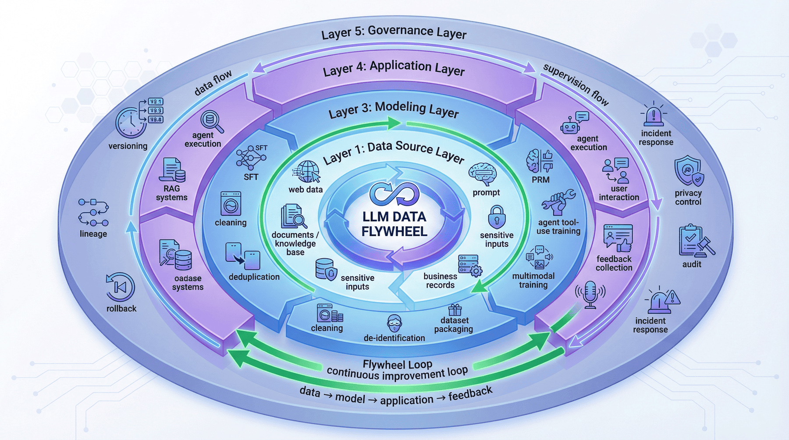
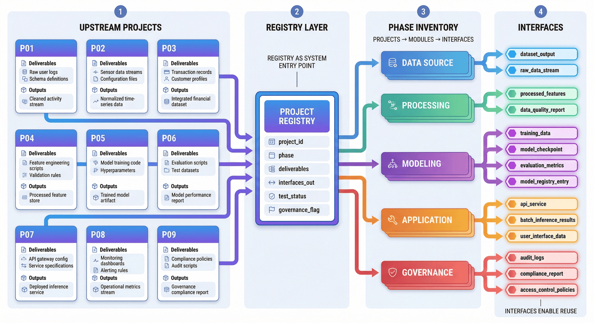
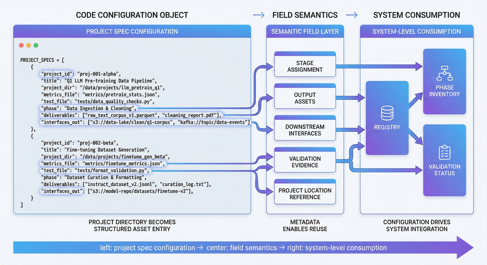
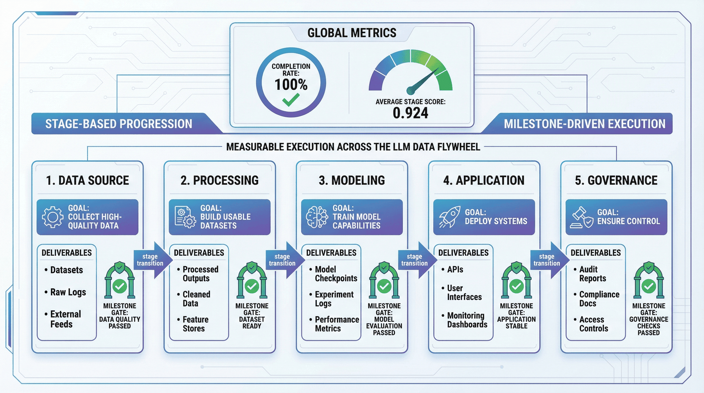
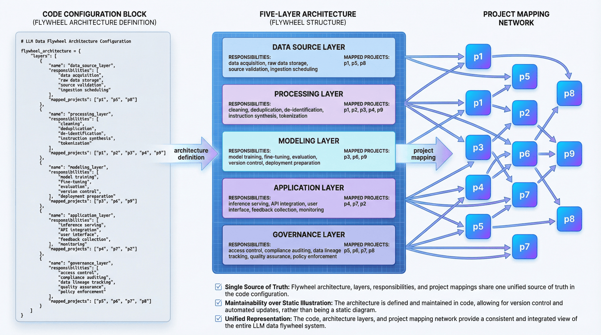
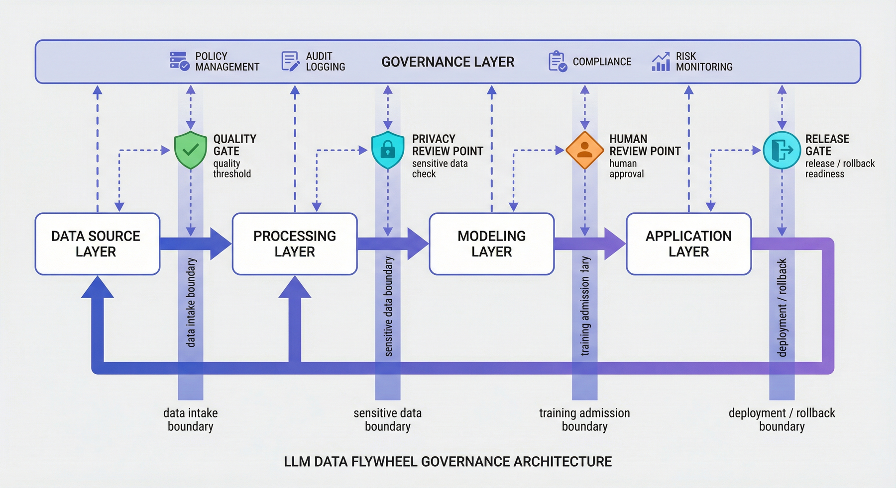
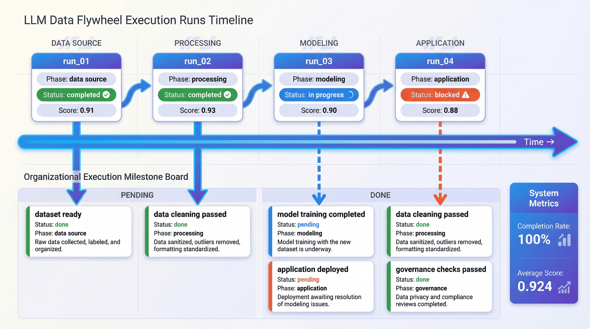
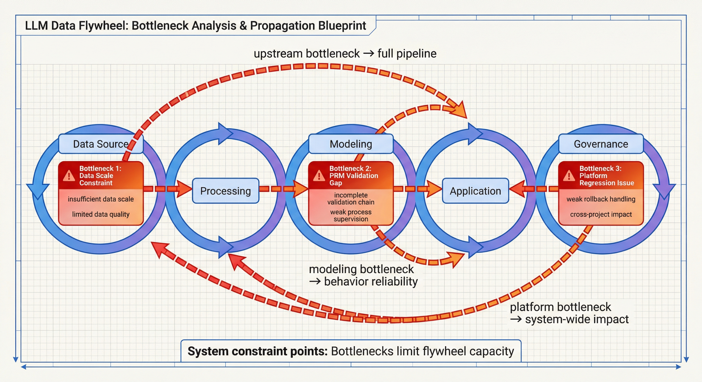
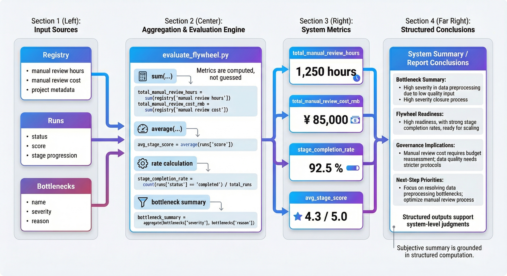
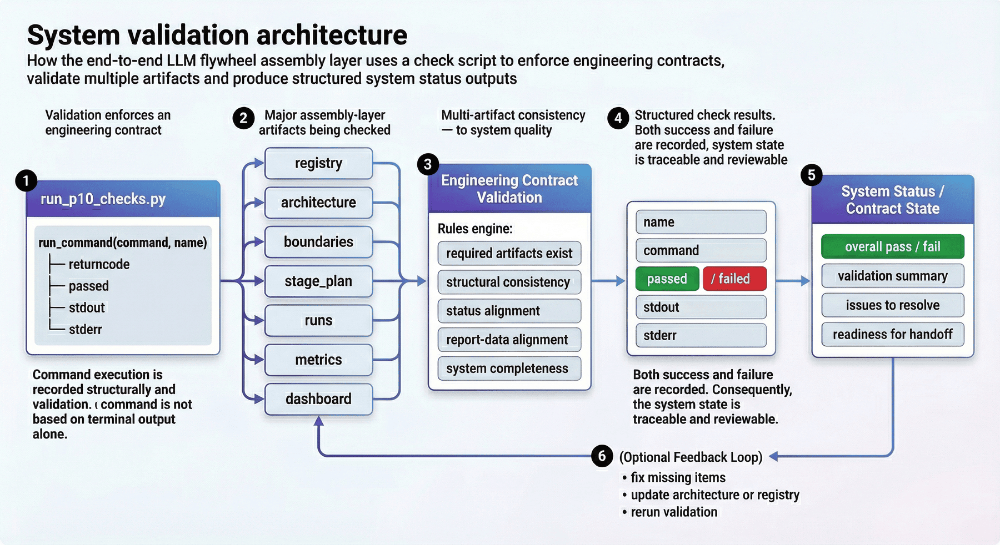

# Project 10: End-to-end LLM data flywheel

## Overview of this chapter

P10 focuses on organizing data, supervision, training, application, platform governance and feedback backflow into a continuously operating end-to-end LLM data flywheel. The focus of this chapter is not on adding single point capabilities, but on integrating the assets, interfaces, stages and control points of the previous nine projects into a unified system.

This chapter can be understood according to four main lines:

* Asset summary and stage planning: Incorporate the products of the previous nine projects into a unified registry and stage system.
* Training, application and feedback interface: clarify the connection method for data to enter training, model to enter application, and application feedback to flow back upstream.
* Control points and governance boundaries: Write version control, rollback, human review, privacy isolation and exception response into the system structure.
* Inspection, acceptance and organizational reuse: Verify whether the flywheel can operate stably through code, products and inspection scripts.

If read in engineering order, this chapter corresponds to a complete link:

**Asset Summary -> Phase Planning -> Training Encapsulation -> Application Execution -> Feedback Backflow -> Version Management -> Privacy and Rollback Control -> System Check**

The core goal corresponding to this structure is to precipitate discrete projects into a set of LLM engineering flywheels that can be reviewed, inspected, and scalable.

---

## 1. Project background: The necessity of an end-to-end LLM data flywheel

General large-model engineering practice has accumulated many mature methods in terms of single-point capabilities. For example, the team knows how to clean pre-training corpus, how to construct SFT samples, and how to do preference pairs, PRM, RAG, Agent, platformization and privacy governance. But once you enter a real organizational environment, the problem is often not the single point component itself, but that these components are not organized into a continuously operating system link.

There are three types of fractures that are most common.

The first category is **asset break**. The data, templates and evaluation results produced by the previous project cannot be directly consumed by the latter project. So every project is like "reinventing the wheel."

The second category is **Interface Broken**. Obviously the upstream already has corpus, annotation results or evaluation records, but the downstream does not know what files to read, what fields to trust, and what version information to inherit. The result is that the process can be run once, but it is difficult to rerun stably.

The third category is **Governance Fracture**. Many teams are willing to talk about models, effects, and products, but are unwilling to write version control, rollback mechanisms, privacy boundaries, organizational division of labor, and incident response into the system design. This will cause the system to fail to operate stably once it is scaled up.

Therefore, the goal of P10 is to build an **end-to-end LLM data flywheel assembly layer** that summarizes the products, stages, interfaces, control points and governance mechanisms of the previous nine projects into a unified system structure.

This structure is oriented toward organizational-level engineering scenarios that continue to iterate. With the expansion of corpus, access to new tasks, model replacement, application online and feedback flow, what can really be reused is not a single script, but this systematic method of "asset summary - stage planning - system boundary - governance control - verification closed loop".

---

## 2. Project goals and boundaries

### 2.1 Project Goals

This project focuses on the following four goals.

**Goal 1: Organize the previous nine projects into a unified system overview. **
That is, the project products scattered in different directories, different reports and different task forms are unified into a traceable registry and stage system.

**Goal 2: Establish a flywheel structure from data to application to governance. **
This project no longer only looks at "how the data is doing" or "how the model is trained", but clearly distinguishes the five layers of data source, processing, modeling, application, and governance, making the backbone structure of the end-to-end system clearly visible.

**Goal 3: Make interfaces, control points, and bottlenecks explicit. **
The value of the flywheel is not to draw a flow chart, but to point out where there are control points, where there are system boundaries, where the current bottlenecks are, and where organizational collaboration is needed.

**Goal 4: Form a final assembly product that can be inspected, reproducible, and deliverable. **
The final output includes not only architecture diagrams, stage plans and dashboards, but also inspection scripts, test results and report files to ensure that code, products and statistical results are consistent with each other.

### 2.2 Project Boundaries

In order to keep the project reproducible, this project explicitly sets several boundaries.

#### 1) Integration scope boundary

The current flywheel focuses on the offline integration of existing project products P01-P09, rather than re-executing all upstream training processes. This means that it is more suitable as the system assembly drawing and engineering review layer, rather than the online real-time production system itself.

#### 2) Timeliness boundary

This project emphasizes offline process, structural design and delivery consistency, rather than real-time event-driven online closed loop. Therefore, what is presented here is a "flywheel framework and methodology" rather than a final industrial-grade online orchestration platform.

#### 3) Evaluate boundaries

P10 pays more attention to the degree of cross-project integration, stage completion rate, control points, bottlenecks and governance structure, rather than the ultimate score of a single model on a certain benchmark.

#### 4) Organizational boundaries

This project has explicitly incorporated organizational division of labor, shared platform benefits and governance boundaries, but it is still a teaching-type minimal closed loop and should not be exaggerated into a complete enterprise-level platform solution.

### 2.3 The role of boundary description

Boundary description is used to clarify the scope of the system that has been opened up currently, the offline assumptions that it still relies on, the conclusions that can be supported at this stage, and the main direction of subsequent expansion:

* Clarify which links have been opened;
* Clarify which offline assumptions remain;
* Clarify what conclusions the current results can support;
* Identify which parts need future expansion.

For final assembly level projects, this definition directly determines whether the chapter can be used as a stable method asset, rather than staying at the conceptual description level.

---

## 3. Project positioning: P10’s role at the final assembly level in the capability system

If the entire LLM engineering capability chain is viewed as a system, then P10 is located at the final assembly layer and closing layer. Its role is not to supplement a certain local capability, but to organize pre-training, SFT, multi-modality, preference, RAG, PRM, Agent, platform and privacy governance into a unified system.

This chapter focuses on the following system-level issues:

* How to accumulate single-point projects into system capabilities;
* How asset reuse replaces project stacking;
* How stage planning, interface constraints and governance controls work together to form an operational framework;
* How the final assembly level maintains consistency through codes, inspections and reports;
* How to consolidate cross-project results into a repeatable and scalable unified method framework.

---

## 4. Overall architecture: from upstream project assets to organization-level flywheel assembly



From an engineering perspective, this project can be broken down into five layers, rather than just looking at a linear process of "data input - model output".

### 4.1 The first layer: data source layer

This layer solves the problem of "where do the raw materials of the system come from?" It includes not only web page or document data, but also sensitive data input, knowledge document access and original business materials. This layer does not correspond to a single data set, but the entrance to the entire flywheel.

### 4.2 Second layer: processing layer

This layer solves the problem of "how raw materials can be turned into intermediate assets that are trainable, consumable, and manageable." Capabilities such as cleaning, deduplication, desensitization, command synthesis, and course packaging are all located here. It determines whether the data has been engineered before the flywheel enters the model layer.

### 4.3 The third layer: modeling layer

This layer addresses "how supervision signals are organized into model capabilities." SFT, PRM, Agent tool-use training, and multi-modal training all belong to this layer. It is not about training a model alone, but about organizing which forms of supervision actually go into model parameters and behavioral templates.

### 4.4 The fourth layer: application layer

This layer solves "how model capabilities enter real task execution." RAG services, Agent execution and feedback recycling are all located here. Without the application layer, the flywheel can only stay in the closed loop of training and cannot form business feedback.

### 4.5 The fifth layer: governance layer

This layer solves the problem of "how to control the system in the long term." Version management, lineage tracing, rollback mechanisms, privacy controls, auditing, and incident response are all located here. Many teams write governance as an appendix, but in Flywheel, governance itself is one of the main structures.

### 4.6 Engineering role of five-layer structure

Because it turns the "flywheel" from an abstract concept into a discussable engineering object. The team no longer just says “we have data, we have models, and we have applications”, but is able to clarify:

*Which floor undertakes which type of projects;
* Which interfaces are passed across layers;
* Which boundaries must be controlled individually;
* Which problems cannot be solved within a single layer.

---

## 5. Summary of upstream projects: registry as the system entrance

The reusability of Flywheel is first built on the registry. The registry is responsible for clarifying the upstream project list, stage ownership, output assets and downstream interfaces, and transforming scattered projects into trackable and composable system assets.

P10 has currently integrated the first nine projects into the summary system, forming a project registry and phase inventory. Current structure includes:

* Has been included in upstream projects `9`;
* `5` planned stages;
* `17` interfaces have been summarized.

These statistics do not reflect the quantity itself, but that the system already has cross-project asset registration, stage division and interface exposure capabilities, providing a unified entrance for subsequent reuse, stage planning and governance control.

### 5.1 registry should not stop at the project name

If there is only the project name in the registry, it is still just a directory index, not a system interface layer. A truly valuable registry should at least answer:

* Which stage the project belongs to;
* Which deliverables are produced;
* Which interfaces_out are exposed to downstream;
* Whether these results pass the test;
* Whether additional human review and governance controls are required.

### 5.2 registry as the starting point of the system

Flywheels don’t form automatically. It needs to first define scattered assets as inheritable, traceable, and reusable system objects. The role of registry is to:

* It turns discrete projects into composable modules;
* It provides input into stage planning;
* It provides a basis for subsequent architecture mapping and bottleneck identification;
* It provides a unified language for organizational level review.



---

## 6. Code Expansion 1: Summarize upstream project assets

`src/collect_upstream_projects.py` is responsible for summarizing upstream project assets and organizing project information into unified specifications. The following code snippet shows the core structure of the registry.

```python
PROJECT_SPECS = [
    {
        "project_id": "p1",
        "title": "Mini-C4 Pretraining Corpus",
        "project_dir": "project_1_mini_c4",
        "metrics_file": "data/reports/p1_metrics.json",
        "test_file": "data/reports/p1_test_results.json",
        "phase": "acquisition",
        "deliverables": ["raw_corpus", "cleaned_corpus", "train_val_split"],
        "interfaces_out": ["foundation_corpus", "training_manifest"],
    },
    {
        "project_id": "p2",
        "title": "Legal SFT Factory",
        "project_dir": "project_2_sft_data",
        "metrics_file": "data/reports/p2_metrics.json",
        "test_file": "data/reports/p2_test_results.json",
        "phase": "alignment",
        "deliverables": ["domain_sft_dataset", "preference_pairs", "risk_refusals"],
        "interfaces_out": ["sft_corpus", "preference_data"],
    },
]
```

This structure reflects several basic requirements for upstream asset aggregation:

* Upstream projects must be modeled explicitly;
* Project meta-information must include stages and interfaces;
* "Project exists" does not equal "project can be consumed downstream";
* The first step of the flywheel is to turn the project directory into a structured asset directory.

### 6.1 Structured summary method of registry

This structured expression summarizes the project into a replicable approach. Subsequent other general assembly level projects can also use the same method to incorporate existing projects into the unified registry one by one without having to rely on manual sorting.



---

## 7. Phase planning: five-phase promotion structure

The closed loop of the system is usually simplified into a linear process: raw data → cleaning → training → online → feedback. Such an expression can explain the sequence, but it cannot explain which stage each link belongs to, who is responsible for it, and what milestones are passed to enter the next stage.

One of the values ​​of P10 is that the flywheel is broken down into a clearer stage system. The current results show that the entire flywheel contains a total of `5` stages, and the current stage completion rate reaches `100.00%`, with an average stage score of `0.924`. These results show that the flywheel is not just a conceptual design, but has formed a set of measurable stages.

### 7.1 The difference between staged and pipelined

Because the pipeline emphasizes sequence, while phasing emphasizes:

* What is the current goal;
* What is the stage output;
* What is the threshold for entering the next stage;
* Which resources and teams have primary responsibility for this period.

### 7.2 The role of stage planning in the final assembly level

Phase planning expands the flywheel from a simple connected relationship to an organizational structure that can be promoted, reviewed, and governed. What is really important here is to clarify the transferable advancement method instead of staying at the level of static schematic diagrams.



---

## 8. Code expansion 2: Constructing flywheel architecture and stage planning

`src/build_flywheel.py` is responsible for mapping the first nine items into the flywheel structure. The following code snippet shows a structured representation of the five-tier architecture.

```python
def build_architecture(registry: list[dict]) -> dict:
    return {
        "layers": [
            {
                "name": "data_source_layer",
                "responsibilities": ["web/data ingestion", "sensitive data intake", "document intake"],
                "mapped_projects": ["p1", "p5", "p9"],
            },
            {
                "name": "processing_layer",
                "responsibilities": ["cleaning", "dedup", "de-identification", "instruction synthesis", "curriculum packaging"],
                "mapped_projects": ["p1", "p2", "p3", "p4", "p9"],
            },
            {
                "name": "modeling_layer",
                "responsibilities": ["SFT", "PRM", "agent tool-use training", "multimodal training"],
                "mapped_projects": ["p2", "p3", "p4", "p6", "p7"],
            },
        ]
    }
```

This structure illustrates that Flywheel relies on explicit mapping to maintain consistency. Once projects and hierarchies are written into the data structure, reporting, inspections, dashboards and governance analytics can all be organized around the same set of mappings.

### 8.1 Architecture requires structured expression

Because the architecture is only written in the diagram, it is difficult to verify and maintain. As new projects are added, phases change, or governance boundaries are adjusted, all diagrams and descriptions will quickly become outdated without a structured representation of the underlying structure.

### 8.2 Understanding the flywheel structure from a code perspective

From a code perspective, flywheel is not an abstract noun, but a group of:

* Level definition;
* Description of responsibilities;
* Project mapping;
* stage product;
* Operation records;
* Milestones and control points.

This way of expression truly makes the flywheel engineering maintainable.



---

## 9. System boundaries and control points

The controllability of a system across projects, phases, and teams depends on whether boundaries and control points are explicitly modeled. Once the flywheel enters a real organizational environment, it is often those boundaries that cannot be directly penetrated that determine the stability of the system.

P10 The current results show that the flywheel architecture contains `5` layers, `4` control points, and `4` governance boundaries. This shows that the project not only describes the data flow path, but also incorporates the locations that need to be intercepted, reviewed, recorded, and governed into the system design.

### 9.1 What is a control point

Control points can be thought of as "valves" in the flywheel. At these locations, the system cannot move forward solely by automatic flow, but must trigger additional judgments, such as:

* Whether it passes the quality threshold;
* Whether sensitive information is involved;
* Whether manual review is required;
* Whether to allow access to downstream training or online.

### 9.2 Governance boundaries need to be modeled explicitly

Because many accidents do not occur during model inference, but before data enters the system, during cross-stage handover, during online rollback, or during log audit. The more complete the flywheel is, the more boundary governance is needed, not the less governance can be ignored.

### 9.3 Engineering role of control points

The existence of control points shows that the flywheel does not pursue indiscriminate acceleration, but configures different flow speeds, review requirements, and traceability for different links.



---

## 10. Operational records and milestones

If a system project only has a final report, it lacks the time dimension. Real projects usually advance in stages, are completed by nodes, and gradually converge through milestones. Therefore, P10 also retains flywheel runs and milestone boards in addition to the overall report.

### 10.1 The role of running records

Running records give the system a time dimension. Not only can you see the final status, but you can also track:

* What stages does the flywheel go through;
* What is the status and score of each stage;
* Which milestones have been achieved;
* Where there have been obstructions or risks.

### 10.2 Milestones as organizational layer interface

For engineers, stage plans may be sufficient; but for managers, reviewers, and cross-team collaborators, milestones are often easier to communicate. It converts complex technical processes into more executable organizational rhythms.



---

## 11. Indicator Interpretation: The meaning of system-level signals

Key results currently given by P10 include:

* Has been included in upstream projects `9`;
* `5` planned stages;
* `17` interfaces have been summarized;
* Upstream check passed `103/103`;
* Flywheel architecture `5` layer;
* Control points `4`;
* Governance boundary `4` items;
* Stage completion rate `100.00%`;
* Average stage score `0.924`;
* The current main bottleneck is the `3` item.

These figures mainly reflect conclusions at three system levels.

First, the first nine projects have now reached the status of being included in the final assembly level. The upstream check result of `103/103` shows that all upstream projects are currently in an integration-ready state.

Second, the flywheel structure is no longer just “there are many projects”, but has formed a hierarchical structure, stage design and governance boundaries, which makes it start to be discussable at the system level.

Third, P10 has begun to identify system bottlenecks. The value of the final assembly layer is not to prove that the system is perfect, but to provide clear priorities for the next round of optimization.

### 11.1 The difference between system indicators and single model indicators

Single model indicators usually answer "How effective is the model"; while system indicators answer:

* Whether projects can be integrated;
* Whether the stage is closed loop;
* Whether governance is complete;
* Which places will limit the next round of expansion.

The uniqueness of P10 is that it does not measure local optimality, but whether an engineering chain has closed-loop capabilities.

---

## 12. Bottleneck analysis: key constraints after flywheel connection

Just because the system links are connected does not mean that the system is mature. P10 clearly lists the current main bottlenecks to explain the completion degree of the flywheel, constraints and the focus of investment in the next stage.

The three main bottlenecks identified in the current project include:

* Basic corpus size constraints;
* PRM verification gap;
* Platform regression processing issues.

### 12.1 Basic corpus size constraints

Flywheels don’t automatically get stronger just by back-end supervision or application feedback. The scale and quality of the upstream basic corpus still determine whether the foundation of the entire system is stable enough. If the base layer is too thin, many downstream capability expansions will be limited.

### 12.2 PRM verification gap

Because reasoning and process supervision are important parts of the gradual maturity of many LLM systems. If the verification chain itself is not stable enough, then even if the downstream model performs well, it may lack strong enough explainable and auditable support.

### 12.3 Impact of Platform Return on Flywheel

Once a flywheel is formed, it means multiple projects share platforms and processes. At this time, any platform return is no longer just a local problem, but will affect multiple downstream links. Therefore, platform governance is not a supporting item in the flywheel, but a core stabilizer.

### 12.4 The necessity of incorporating bottlenecks into the main body

Bottleneck analysis is used to illustrate three things:

* The degree of completion that the system has currently reached;
* Key issues that remain unresolved;
* The most worthwhile direction for the next round of optimization.



---

## 13. Costs and Shared Benefits

System-level reuse not only brings shared benefits, but also introduces additional integration costs. P10 The current estimation results show that the cross-project manual review time is about `8.06` hours, and the corresponding cost is about `850.33` yuan. This shows that Flywheel has begun to make shared costs explicit, rather than integrating them into zero costs by default.

### 13.1 Integration costs at the final assembly level

The flywheel is not an automatic reuse mechanism. To organize upstream projects into an integrable state, it usually requires:

* Unified interface;
* Summarize meta information;
* Alignment check results;
* Generate a new layer of reports and dashboard;
* Conduct human review and review again when necessary.

### 13.2 Where are the benefits of the sharing platform reflected?

From the perspective of source code logic, P10 not only calculates the cost of manual review, but also explicitly gives examples of shared platform benefits and reuse, such as multi-project reuse of corpus and manifest, reuse of reasoning feedback and tool templates, centralized governance benefits of P8/P9, etc. This way of writing changes "What can a flywheel bring" from an abstract slogan into a concrete benefit item.

---

## 14. Code expansion three: Generating system-level indicators in the evaluation script

`src/evaluate_flywheel.py` is responsible for gathering the results scattered among multiple products into system-level indicators and overall reports. The code snippet below demonstrates this calculation.

```python
total_manual_review_hours = round(sum(item["estimated_manual_review_hours"] for item in registry), 2)
total_manual_review_cost_rmb = round(sum(item["estimated_manual_review_cost_rmb"] for item in registry), 2)
stage_completion_rate = round(sum(item["status"] == "completed" for item in runs) / max(1, len(runs)), 4)
avg_stage_score = round(sum(item["score"] for item in runs) / max(1, len(runs)), 4)

bottlenecks = [
    {"name": "foundation_corpus_scale", "severity": "medium", "reason": "P1 final retention is only 17.37%, limiting base corpus growth."},
    {"name": "prm_validation_gap", "severity": "medium", "reason": "P6 validation pass rate is 0.6759, leaving room for stronger trace verification."},
    {"name": "platform_regression_handling", "severity": "low", "reason": "P8 still observed one regressed run and one failed run, so release gates should stay strict."},
]
```

This calculation logic implements system-level judgments into structured indicators and structured conclusions. The main conclusions in the report are supported by registries, runs, and other intermediates, rather than from subjective induction.

### 14.1 Calculation basis of system-level indicators

The key point here is that both dimensions hold true at the same time:

* The text needs to explain the engineering significance of system-level indicators;
* These conclusions need to be supported by a structured calculation process.

Therefore, this code serves as a link from indicator generation to result interpretation.



---

## 15. Verification closed loop: consistency checking mechanism

Whether the final assembly level project is mature or not depends not only on whether a report has been output, but also whether a consistency verification mechanism has been established. Otherwise, there will be a situation where the instructions and illustrations are complete, but the underlying product is inconsistent.

The current inspection results of P10 are:

* General inspection items: `13`
* Passed check item: `13`
* Overall status: `PASS`.

Meanwhile, verification coverage includes:

* Command-level check items `2`;
* Data/product level check items `11`;
* Command level override `py_compile, evaluate_flywheel`;
* Data-level coverage of key projects such as `required_files_exist`, `all_upstream_projects_registered`, `phase_inventory_consistent`, `architecture_layers_and_control_points_present`, `stage_plan_covers_end_to_end`, `flywheel_runs_complete`.

### 15.1 Check script for system projects

Because system projects are most prone to the problem of "all parts are correct, but the whole is not correct". For example:

* A JSON file exists, but the fields are inconsistent with the report;
* The plan for a certain phase is well written, but the milestone is not updated synchronously;
* The code works, but the overall report still references the old data;
* The governance boundary has been supplemented by the project but not covered by the inspection items.

### 15.2 Engineering meaning of PASS

PASS Description P10 currently has a minimal closed loop in which code, products, statistics, and reports are aligned with each other. For the final assembly level project, this means that the chapter does not stop at document organization, but establishes a consistent link of reorganization, verification and re-expression.

---

## 16. Code expansion four: write the inspection mechanism into a project contract

The `src/run_p10_checks.py` script of P10 writes the acceptance rules of the final assembly layer into an executable engineering contract. The following code snippet shows the basic structure of the inspection script.

```python
def run_command(command: list[str], name: str) -> dict:
    result = subprocess.run(command, capture_output=True, text=True)
    return {
        "name": name,
        "command": command,
        "returncode": result.returncode,
        "passed": result.returncode == 0,
        "stdout": result.stdout.strip(),
        "stderr": result.stderr.strip(),
    }
```

This structure reflects several basic requirements of the inspection mechanism:

* Command execution results should be recorded in a structured manner;
* The check results cannot just look at the terminal output;
* Both pass and failure can be entered into follow-up reports;
* System status must be traceable and reviewable.

Looking further down, the main function will also read many types of products such as registry, architecture, boundaries, stage_plan, runs, metrics and dashboard. This shows that the inspection is not for a single file, but for the consistency of the final assembly layer.

### 16.1 The location of the engineering contract in the final assembly level

This section illustrates that P10 does not stop at summarizing upstream projects, but also incorporates the final assembly layer itself into engineering quality management. For the entire chapter, this part assumes the role of connecting system integration and quality contracts.



---

## 17. Main deliverables: System delivery list

For system assembly projects, the deliverable list is an important basis for judging whether the system has completed structured implementation. P10 has currently formed a relatively complete delivery list, including:

* `data/processed/upstream_project_registry.json`
* `data/processed/phase_inventory.json`
* `data/processed/flywheel_architecture.json`
* `data/processed/system_boundaries.json`
* `data/processed/stage_plan.json`
* `data/processed/flywheel_runs.jsonl`
* `data/processed/bottleneck_analysis.json`
* `data/processed/cost_model.json`
* `data/processed/org_operating_model.json`
* `data/console/milestone_board.json`
* `data/console/executive_dashboard.json`
* `data/reports/p10_metrics.json`
* `data/reports/p10_report.md`
* `data/reports/p10_test_results.json`
* `data/reports/p10_test_report.md`.

### 17.1 The role of the deliverable list

This set of deliverables shows that the final assembly layer has been settled into a set of specific assets that can be reviewed and serve different roles:

* Engineers view processed data;
* The project manager looks at milestones and dashboards;
* Review reports and metrics;
* For QA or platform roles, see test_results and test_report.

### 17.2 Differences from ordinary project lists

Common project lists tend to just list "code, reports, diagrams." The list of P10 is closer to the system interface directory, indicating that information at different levels has been split, organized and exposed to the outside world.

---

## 18. Organization and collaboration: Responsibility interface of the general assembly level

Many previous chapters prefer a single capability module, but P10 naturally requires cross-project, cross-stage, and cross-role collaboration. The stability of the general assembly layer not only depends on code implementation, but also depends on whether the responsibility interface is clear.

### 18.1 Key responsibilities involved in the general assembly level

Judging from the structure of P10, it includes at least the following types of roles:

* Upstream project leader: ensure that the products, indicators and test status of their respective projects are available for production at the final assembly level;
* Data/training engineering role: Understand various input and output interfaces to ensure that processed assets can be reused;
* Platform role: Responsible for dashboard, version, rollback and operation management;
* Privacy/Governance role: Ensure sensitive data, auditing and boundary controls are explicitly included in the flywheel;
* Review or project management role: Conduct cross-team reviews based on milestones and phase plans.

### 18.2 The necessity of collaborative structure

When many teams build a system flywheel for the first time, the problem lies not in implementation capabilities, but in the collaboration structure itself:

* No one is responsible for the final assembly level;
* No one centrally maintains the registry;
* No one defines cross-stage interfaces;
* No one writes governance requirements as engineering objects;
* All information is scattered in verbal communication.

The flywheel is therefore first an organizational engineering structure and secondly a set of scripts.

---

## 19. Management view: executive dashboard

If the processed catalog and check scripts serve the engineering side, then the executive dashboard is more geared toward the organization side. Its role is to condense complex cross-project status into a quickly understandable control panel.

### 19.1 What problem does dashboard solve in Flywheel?

It solves the following problems:

* Whether the current flywheel is healthy as a whole;
* Which stages have been completed;
* Which bottlenecks deserve the most priority;
* Whether there is a risk of cross-project regression;
* Whether shared platforms and governance layers are functioning.

### 19.2 System role of dashboard

Because once the flywheel enters an organizational perspective, it cannot be run by just engineers reading JSON files. There are always more roles that need to understand system status at a glance. The value of the dashboard lies in providing a unified visual entrance for the final assembly layer.

---

## 20. Limitations and Risks

P10 has now formed a relatively complete system structure, but it still has very clear limitations.

First, it is highly dependent on the reporting accuracy and product completeness of the previous nine projects. If the upstream project itself has incorrect statistics, distorted fields, or incomplete testing, then no matter how complete P10 is, it can only perform structured integration on incorrect inputs.

Secondly, the currently identified bottlenecks are still mainly focused on the basic corpus size, PRM verification quality and platform regression control. This shows that although the flywheel has been formed, it has not yet fully entered the "high-frequency self-enhancement" state.

In the end, this is still an **offline system design diagram**. It is far from a real online flywheel, and there are still engineering gaps such as monitoring, experimental feedback, online policy switching, user behavior collection and automatic budget control.

### 20.1 The role of limitation description

The significance of the limitation description is to help define the degree of completion of the current system and the direction of subsequent expansion:

* What has been run through;
* What is still in the transition state;
* Which links are most likely to be completed in the next phase.

---

## 21. Expanding to the online flywheel: focus of the next phase

P10 has given several clear directions for subsequent expansion, including:

* Incorporate more online feedback, A/B experimentation and cost budgeting into the flywheel;
* Continue to strengthen cross-team stage review, governance rhythm and interface contracts;
* Advance the executive dashboard from static reporting to a continuously updated control panel.

### 21.1 Online Feedback

Because only when the application layer feedback truly flows back to the data and training layer, the flywheel will enter the "dynamic closed loop" from the "static closed loop". This step will significantly increase the actual value of the system, but it will also increase the complexity of governance.

### 21.2 Reservations for A/B Experimentation and Budgetary Control

Because many teams wait until the system is already large before starting to supplement these two areas, the cost is often higher. Writing them in advance as expansion directions helps to reserve these locations early in the design.

---

## 22. The concluding role of this chapter in the whole book

P10 is located at the back of the book, and its function is to wrap up the previous projects at the system level.

The previous items are handled separately:

* The production method of a certain type of data;
* The construction method of a certain type of supervision;
* The path to undertake a certain type of application;
* The implementation of a certain type of platform and governance mechanism.

P10, on the other hand, deals with the system-level organizational relationships between these capabilities:

* How to organize various capabilities into a reusable system chain;
* How organizational capabilities form a stable structure based on single-point capabilities;
* How to transform the parallel relationship between chapters into an overall system of dependence and mutual explanation.

Therefore, the role of P10 is not to add new local capabilities, but to organize the previous projects from a parallel collection into a structurally complete method system.

---

## 23. List of main deliverables and code index

### 23.1 Main documents and reports

* `p10_report.md`
* `p10_metrics.json`
* `p10_test_report.md`
* `p10_test_results.json`

### 23.2 Mainly process intermediate products

* `upstream_project_registry.json`
* `phase_inventory.json`
* `flywheel_architecture.json`
* `system_boundaries.json`
* `stage_plan.json`
* `flywheel_runs.jsonl`
* `bottleneck_analysis.json`
* `cost_model.json`
* `org_operating_model.json`

### 23.3 Main console products

* `milestone_board.json`
* `executive_dashboard.json`

### 23.4 Main source code index

* `src/collect_upstream_projects.py`
* `src/build_flywheel.py`
* `src/evaluate_flywheel.py`
* `src/run_p10_checks.py`
* `src/pipeline_utils.py`

### 23.5 Purpose of Deliverables and Code Index

The goal here is to make it clear to readers:

* Which documents should be viewed;
* Which codes correspond to which chapter logic;
* Which products can be used for review;
* Which structures can be reused in your own projects.

---

## 24. Conclusion: Continuity is more important than speed

The term “data flywheel” often conjures up images of growth, automation, and constant acceleration. But from an engineering perspective, the core value of flywheels lies in **sustainability**.

It embodies the following system capabilities:

* Project results can be retained and reused in subsequent projects;
* Data, models, applications and governance are no longer separated from each other;
* The system can retain structure, boundaries and memory across multiple iterations;
* The organization can shift from project stacking to capability system building.

The value of P10 is not just to summarize the previous nine projects, but to reorganize them into an explainable, inspectable, and scalable end-to-end system chain. This is also the most important engineering significance of this chapter.

---

## Special Topic: Feedback Return Design in Flywheels

The key reason why a flywheel is called a "flywheel" is not that it covers many layers, but that it can form a backflow. If only data enters the model, the model enters the application, and the application produces results, but the results are not reorganized into the next round of data and governance input, then the system is still essentially a one-time linear pipeline.

### 1. Feedback is not just user likes or negative reviews

When many teams talk about feedback feedback, their first reaction is to collect user satisfaction. But for LLM systems, the truly valuable feedback goes beyond this type of feedback. More complete feedback usually includes at least:

* Failed question and answer, refusal to answer, hallucination and false retrieval recall at the application layer;
* Tool call failure, memory drift and recovery trajectory during Agent execution;
* Missing evidence pages, misreading of figures, and cross-page integration errors in multimodal RAG;
* Preference pairs, scoring records and correction opinions in manual evaluation;
* Blocking events, desensitization gaps and audit alerts in privacy governance;
* Regression experiment, rollback, incident review and exception approval records at the platform layer.

Together, these feedbacks form a set of “evidence of system behavior.” If only the last layer of user satisfaction was retained, the team could see the symptoms but not know which layer the symptoms came from.

### 2. Feedback events need to be unified schema

For Flywheel to form a truly reusable reflow capability, feedback must first be unified into structured events, instead of just staying in chat records, table notes, or scattered issues. A usable feedback event usually contains at least:

* Feedback source, indicating whether it comes from application, review, platform, governance or manual verification;
* Associate the project and phase to indicate whether it is closer to P02, P05, P07, P08 or P09 type of problem;
* Failure type or improvement type, distinguish whether it is a data gap, a retrieval gap, a model gap or a process gap;
* Scope of impact, indicating whether the problem affects a single sample, a certain type of task, a certain project, or the entire system chain;
* Recommended actions indicating which type of rework or optimization queue the feedback should ultimately go into.

Only when these fields are explicitly retained can the feedback actually be consumed by downstream processes. Otherwise, no matter how much feedback you have, it can only exist as experience and cannot enter the flywheel.

### 3. The key to reflow is not "automatic", but "shuntable"

A common misunderstanding in flywheel design is the premature pursuit of "fully automatic feedback return". But in the actual stage of most teams, it is more important to be "shuntable" first, that is, to be able to reliably send feedback to the correct upstream project, rather than letting all problems return to the final assembly level.

For example:

* If the question mainly comes from insufficient risk rejection of legal Q&A, it should be prioritized into the P02 category SFT with preference data enhancement;
* If the problem comes from chart misreading or table of contents page misrecall, it should go back to category P05 Multimodal RAG Evaluation and Retrieval Optimization;
* If the problem comes from confusing tool call traces, it is more likely to belong to the Agent Tool-use training transformation of P07;
* If the problem comes from regression experiments and out-of-control versions, it should be taken over by the platform governance object of P08;
* If the problem comes from privacy boundary triggering and data interception, it should be priority absorbed by the privacy process upgrade of P09.

From a system perspective, offloading capabilities are more important than automation itself. Because as long as the diversion is done correctly, even if manual intervention is still required later, the flywheel has formed the correct direction; conversely, if the automation is strong but the diversion is always wrong, the system will only send the problem to the wrong location faster.

### 4. How to enter the next round of version with feedback

After the feedback event is formed, a closed loop is needed to enter the version cycle. More mature methods usually include the following four steps:

* Do clustering first to gather scattered events into several high-frequency issues and topics;
* Prioritize again and distinguish between problems that must be blocked immediately and problems that can be scheduled and optimized;
* Then map it to specific projects and stages to generate the next round of version to-do;
* Finally, review "which feedback has been absorbed, which is still queued, and which has been confirmed and not processed" during the next final assembly review.

The value of this design is to make feedback no longer just emotional or occasional input, but to steadily enter the rhythm of version advancement. What the flywheel really needs is not "more and more feedback" but "more and more places for feedback to go."

---

## Special Topic: Budget, Priorities and Return on Investment

Another very real problem with a final assembly level project like P10 is that it will expose a lot of things worth doing at the same time. Since the nine upstream projects can provide expansion directions, the team must answer: With limited resources, what should be invested first and why?

### 1. Priority judgment should not only look at a single point of effect

In the flywheel system, a small seemingly local change may bring great system benefits; conversely, a seemingly "strong" single-point project may not have high overall benefits if it cannot be reused by other layers. Therefore, priority judgment must consider at least four dimensions simultaneously:

* Scope of impact, whether a certain change affects a single module or can improve multiple downstream links;
* Reusability, whether the change forms a one-time result or a long-term reusable system asset;
* Risk exposure, whether the current problem has frequently occurred on the core link;
* Implementation cost, whether the team has sufficient implementation and maintenance capabilities at the current stage.

By looking at these four dimensions together, many decisions will become clearer. For example, patching the unified feedback schema may seem less "obtrusive" than training a new model, but its sustainable value to the entire flywheel may be greater.

### 2. System projects are more suitable to look at “leverage ratio”

For the final assembly layer, the thing that deserves the most priority is usually not the one with the highest single return, but the one with the highest leverage. The so-called leverage ratio can be simply understood as: whether an investment can simultaneously reduce the repetitive costs, communication costs and return costs of multiple projects.

Judging from the current flywheel structure, directions that tend to have high leverage include:

* Unify registry and interface contracts to reduce upstream project access costs;
* Strengthen evaluation access control and quality baseline to reduce the probability of incorrect versions entering the system;
* Complete the feedback backflow and diversion mechanism to reduce the accumulation of problems at the final assembly level;
* Improve the dashboard and milestone mechanism to reduce the uncertainty of organizational collaboration;
* Strengthen platform governance and rollback mechanism to reduce recovery costs after flywheel amplification.

These actions may not be the most "dazzling", but they often determine whether the flywheel can truly spin stably.

### 3. Budget allocation should cover both growth and defense items

One of the most common deviations at the final assembly level is to invest all the budget in growth items, such as more data, larger models, and more functions, while underestimating the importance of defensive items. In fact, the further you go in the flywheel, the greater the value of defensive items, because they determine whether the system can still remain controllable during expansion.

A more balanced budget perspective often involves covering both:

* Growth items, such as new data sources, new task forms, and new application links;
* Efficiency improvement items, such as interface unification, automatic inspection, batch evaluation and pipeline optimization;
* Defense items, such as privacy governance, auditing, rollback, incident review and quality access control;
* Organizational items such as dashboards, milestones, cross-team agreements, and version review mechanisms.

If the budget only invests in growth projects for a long time, the flywheel will appear to be getting faster and faster, but internal friction and hidden risks will also become higher and higher; if the budget only invests in defensive projects for a long time, the system may fall into conservatism and find it difficult to generate external value. Therefore, what the final assembly layer really needs is balance, not fullness on one side.

### 4. The return on investment depends on whether "system memory" is accumulated

The returns of a single project can usually be seen relatively directly, such as more samples, higher accuracy, and lower latency. But a more critical and easily overlooked reward for flywheel projects is whether system memory is accumulating.

The so-called system memory refers to whether more and more of these things are accumulated and can be directly reused in the next round:

* Which types of assets enter the registry;
* Which types of failures will be automatically identified;
* Which control points have been written into the governance boundary;
* Which problems can be quickly exposed through dashboards and inspection scripts;
* Which team collaboration patterns have become a fixed rhythm.

As long as these memories continue to accrue, Flywheel’s ROI shouldn’t be judged solely on short-term effects. Because it builds the ability to "avoid many detours in every round in the future."

---

## Special Topic: Annual Promotion Route of General Assembly Level

P10 currently displays an offline, teaching-type, but relatively complete flywheel assembly layer. If it is further advanced into more mature organizational practice, a more pragmatic annual advancement route can usually be carried out according to the rhythm of "unification first, then access control, and then online".

### 1. The first stage: unifying assets and contracts

The starting point of the year is usually not to expand more functions, but to unify the most basic interfaces at the final assembly level. Highlights of this stage include:

* Unify the registry fields of upstream projects;
* Minimum interface to unify metrics, test results and reports;
* Unify the naming, version and source records of processed assets;
* Unify cross-project phase division and delivery lists.

After this stage is completed, the biggest benefit of Flywheel is not "smarter" but "clearer". All projects start to be consumed by the final assembly layer in a similar way, so that subsequent automatic inspections, milestone boards and feedback feedback will have a common basis.

### 2. The second stage: Completing quality access control and governance control

When assets and contracts are basically unified, the next step should be to prioritize access control and governance rather than immediately turning to complex online processes. Because there is no access control flywheel, it will only amplify more unstable content faster.

This stage can focus on promoting:

* Definition of quality baselines at key stages;
* Check scripts and approval rules before publishing;
* rollback conditions and incident review triggering mechanism;
* Pre-positioning of privacy and compliance control points.

The goal of this step is to upgrade the flywheel from "connected" to "controllable after connected".

### 3. The third stage: introducing online feedback and experiment mechanism

After the first two stages are relatively stable, Flywheel is suitable for introducing more online elements. For example:

* Application layer user feedback recycling;
* A/B experiment results are precipitated;
* Runtime budget and resource consumption monitoring;
* Automatic clustering and reflow of high-frequency issues;
* Continuously updated dashboard for the final assembly level.

The difficulty of onlineization is not to collect data, but to allow this data to be returned to the upstream project in an engineering way. For this reason, online is more suitable as the third stage rather than the first stage.

### 4. The fourth stage: forming stable cross-team operations

When the system has unified interfaces, quality access control and online feedback, Flywheel can further enter the cross-team stable operation stage. The key at this stage is not technical complexity but organizational sustainability, including:

* Fixed stage review and milestone mechanism;
* Clear final assembly layer owner and upstream docking person;
* Different dashboards for business, governance and engineering roles;
* Clear budget review, priority review and review rhythm;
* Continuously maintained documentation, reports and knowledge base.

If this step is taken, Flywheel will no longer be just a case in a book, but will gradually take the form of entering real organizational practice. It may not become an enterprise-level platform in one step, but it already has the basic conditions to evolve from a collection of projects into system capabilities.

---

## Special topic: Risk ledger and quarterly review of flywheel assembly

P10 As the final assembly layer, there is another engineering action that is particularly worth adding, which is the risk ledger. Because the most common illusion at the final assembly level is that "all projects are advancing, so the system is also advancing." But the real situation is that while local projects are progressing, system-level risks may also be accumulating at the same time. Without a risk ledger, it would be difficult for the final assembly level to continuously make correct priority judgments.

### 1. What needs to be recorded most at the final assembly level is cross-project risks.

Unlike single projects, P10 should focus on recording risks that spread across projects. For example:

* The statistical caliber of upstream projects is inconsistent, resulting in distortion of the final assembly layer dashboard;
* A certain type of evaluation set is too weak, causing multiple projects to be overly optimistic about the results;
* Insufficient platform regression control means that risky versions may still enter subsequent stages;
* Privacy boundaries are not inherited synchronously, resulting in governance breakpoints between the application layer and the data layer;
* The feedback backflow lacks a unified schema, resulting in problems being discovered but unable to be returned to the upstream stably.

The common feature of these risks is that any one project looks like a "local problem" when viewed alone, but once it is put into the flywheel, it will become systemic friction. Therefore, the risk ledger at the general assembly level cannot just extract upstream issues, but must specifically record "how these issues will propagate across layers."

### 2. Quarterly reviews should focus on system issues rather than project reports

When the final assembly level conducts quarterly reviews, it is most likely to slip into another type of inertia, which is to have each project report its own progress, and then mechanically splice these reports into a systematic summary. Of course you can see the project status by doing this, but you may not necessarily be able to see the system status.

A more effective quarterly review approach should usually prioritize answering these questions:

* What is the most obvious system bottleneck for Flywheel this quarter;
* Which upstream improvements are actually transferred to downstream benefits;
* Which risks appear repeatedly, indicating that they are no longer single-point accidents;
* Which governance actions effectively reduce recovery costs;
* What is the most prioritized leveraged item for investment in the next quarter?

Once the review starts around these issues, P10 will no longer be just a "final assembly display layer", but will become a real entry point for system decision-making.

### 3. The value of risk ledger lies in forming organizational memory

The reason why many systems "repeat old mistakes" every once in a while is not because the team does not work hard, but because the organizational memory has not been accumulated. The most important value of the risk ledger is not to list the questions more beautifully, but to continuously answer three things:

* Has this problem occurred before?
* How it was handled at the time;
* Why it appears again this time, it shows which layer of the mechanism has not been truly repaired.

As long as this information can continue to be accumulated during quarterly reviews, Flywheel will gradually acquire a very important ability: not only knowing what the system is now, but also why the system is as it is now. For the final assembly layer, this traceable organizational memory is often more valuable in the long term than a local improvement.

---

## Special topic: Mapping relationship between flywheel and business value

There is also a very real challenge in the final assembly level project, that is, its value is often not as intuitive as that of a single point project. A new data set and a new model indicator improvement are usually easy to explain; if things like flywheels, governance, interface contracts, and assembly boards are not actively mapped to business value, they can easily be misunderstood as work that "only the platform team cares about."

### 1. The first level of business value of flywheel is to reduce duplication of construction

When the registry, stage planning, and interface contracts are gradually stabilized, the first thing the business feels is usually not that the model is suddenly stronger, but that repeated construction is significantly reduced. In the past, each project had to reorganize input and output, reinterpret version sources, and re-establish evaluation standards; with the final assembly layer, these actions can be inherited more and more. This benefit from reducing duplication of construction is often the first part of the flywheel to be realized and the most easily underestimated part of its value.

### 2. The second level of business value of flywheel is to shorten the problem location time

The business side does not necessarily care about how many fields the total registry has, but it will be very concerned about one thing: once the system behaves abnormally, how long does it take for the team to figure out where the problem lies. After the flywheel connects projects, stages, control points, inspections and risk ledgers, one of the most direct benefits is to shorten the positioning path. For organizations, this means less hassle, shorter recovery times and clearer priorities.

### 3. The third layer of business value of flywheel is to make expansion more predictable

When a team is ready to access new data sources, new tasks, new applications or new governance requirements, without the assembly layer, expansion is often like starting a new project; with a flywheel, expansion is more like putting new capabilities into the existing structure. What the business really needs is not just that the system gets bigger and bigger, but that the system remains predictable as it gets bigger. The long-term value of P10 lies precisely in helping organizations transform "expansion" from temporary sprints into a planable capability-building process.

---

## Special Topic: Responsibility Boundaries of General Assembly Layer Owner

For the flywheel to truly operate, it also needs a role that is often overlooked in many teams, which is the final assembly layer owner. Without this role, P10 can easily degenerate into a summary project that "everyone takes a look at, but no one is really responsible for." With this role, the general assembly layer will become a continuous system entrance.

### 1. The owner is not responsible for replacing all projects, but for maintaining the main chain of the system.

The most critical responsibility of the general assembly layer owner is not to do detailed work on behalf of the upstream project leader, but to maintain several system main chains:

* Whether the registry and interface contracts are continuously unified;
* Whether the phase plan and milestones are still valid;
* Check whether scripts, risk ledgers and dashboards continue to reflect the real system status;
* Whether cross-project issues are correctly triaged, followed up and reviewed.

As long as these main chains are maintained continuously, the flywheel can maintain structural integrity for a long time; if not, the system will soon become fragmented again.

### 2. The owner is also responsible for bringing the “system language” into the organization

The owner of the general assembly layer also has an implicit but very important responsibility, which is to bring system language into organizational collaboration. That is, get different teams to start discussing issues using the same language of stages, interfaces, control points, risks, and milestones. For Flywheel, this common language is a highly valuable infrastructure in itself, as it directly reduces the cost of ambiguity and interpretation in cross-project communication.
