# Project 1: Building a distributed Mini-C4 data pipeline based on Ray

## Chapter overview

P01 focuses on the engineering process of building the Mini-C4 training data set from the Common Crawl shard. The focus of this chapter is not on a single capture of results, but on organizing web page archiving, text extraction, deduplication and filtering, training packaging and result verification into a reproducible data production line.

This chapter can be understood according to four main lines:

- Data collection and text extraction: Extract text from web archives that can be used for training.
- Cleaning, deduplication and quality control: dealing with template noise, near-duplicate content, mixed languages ​​and low-quality pages.
- Training encapsulation and data segmentation: Organize the processing results into standardized JSONL and training lists.
- Evaluate validation and cost bounds: Evaluate pipeline status by inspecting scripts, statistical metrics, and resource consumption.

If read in engineering order, this chapter corresponds to a complete link:

**Web page archiving -> Text extraction -> Basic cleaning -> Near duplicate deduplication -> Language splitting -> Quality filtering -> Training packaging -> Evaluation and verification**

The core goal corresponding to this structure is to reproduce an interpretable and reusable web page pre-training data pipeline under the conditions of a single CPU and Ray.

---

## 1. Project background: Mini-C4’s engineering positioning

In large model pre-training, web corpus has always been one of the most important data sources. The web page is large enough, has wide enough coverage, and is updated frequently, so it is naturally suitable for building a general pre-training corpus.
But web data also has three very typical problems:

1. **Extremely low signal-to-noise ratio**: HTML pages contain a large number of non-text content such as navigation bars, advertising spaces, scripts, footers, copyright statements, cookie tips, comment areas, directory pages, etc.
2. **Extremely high degree of repetition**: Reprints, mirror sites, aggregation pages, template pages, and partial copying of pages are very common.
3. **Distribution is difficult to control**: Different websites, different languages, and different text qualities are mixed together, which can easily pull the training corpus toward a noise distribution.

Therefore, the core of pre-training data engineering is not to "get more text", but to establish an interpretable, reproducible, and verifiable data production pipeline to gradually converge the original web pages into text samples that can be handed over to the training system.

That’s what the Mini-C4 is all about. It is not a replacement for the complete industrial-grade C4, but a **minimum reproducible, runnable, and clearly explained miniature version**.
Through it, we can completely walk through the key issues in large-scale web page pre-training data processing under the conditions of a single shard and a single CPU, thus laying a method foundation for subsequent larger-scale data projects.

---

## 2. Project goals and boundaries

### 2.1 Project goals

The goal of this project is not to simply download Common Crawl data, but to completely run through the following link within a controlled boundary:

> **Web page archiving -> Text extraction -> Basic cleaning -> Near duplicate deduplication -> Language splitting -> Quality filtering -> Training packaging -> Evaluation and verification**

The final output includes:

- `train.jsonl`
- `val.jsonl`
- `smoke_test.jsonl`
- `training_manifest.json`
- Assessment reports and inspection reports

This project focuses on **turning web pages into training data**, rather than staying at the step of "turning web pages into text".

### 2.2 Project Boundaries

In order to keep the project minimally reproducible and controllable, this project explicitly sets the following boundaries:

- **Data scale boundary**: Only process one shard of Common Crawl, and do not pursue full industrial scale.
- **Hardware Boundary**: By default, it runs in a single-machine CPU environment and does not rely on GPU.
- **Parallel Boundary**: In the deduplication stage, Ray is used to perform single-machine multi-core parallelization.
- **Language Boundary**: Currently it mainly covers English and Chinese, the English quality filtering is more complete, and the Chinese quality gate is relatively weak.
- **Target Positioning Boundary**: This is a case oriented towards engineering practice, not a research project pursuing SOTA indicators.

### 2.3 The role of boundary setting

This boundary setting has two benefits.

First, it ensures that the project is still reproducible under limited resources.
If multiple machines, massive sharding, and complex scheduling are the goals from the beginning, the project will quickly be dominated by infrastructure issues, which will instead obscure the key logic of the data engineering itself.

Second, it allows the team to more clearly observe the effects of each filtering step.
When the data is smaller, it's easier to do intermediate inspections, manual sampling, and threshold adjustments to truly understand why data is retained or deleted.

---

## 3. Overall project structure

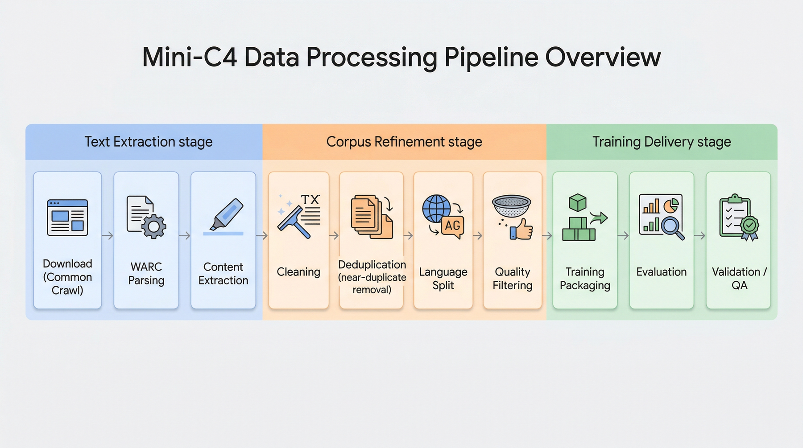


### 3.1 Process Overview

The overall project process can be summarized into 10 steps:

1. `src/1_download_data.py`: Download Common Crawl data
2. `src/2_process_warc.py`: Parse WARC and extract the text
3. `src/3_clean_data.py`: Heuristic cleaning
4. `src/4_deduplicate.py`: MinHash removes duplicates
5. `src/5_split_lang.py`: Split by language
6. `src/6_quality_filter.py`: Quality filtering
7. `src/7_prepare_training_data.py`: Training data encapsulation
8. `src/8_evaluate_dataset.py`: Dataset evaluation
9. `src/9_training_smoke_test.py`: Training smoke test
10. `src/10_run_p1_checks.py`: Project inspection and consistency verification

### 3.2 Three-stage understanding method

If the above process is further classified, it can be divided into three major stages:

#### The first stage: from the web world to the text world

This stage mainly solves the problem of "whether there is text". The core tasks are:

- Download WARC
- Read web page response
- Filter non-HTML content
- Extract body text from HTML

The focus of this step is to convert the complex content in the web archive into text as stably as possible.

#### The second stage: from the text world to the corpus world

This stage solves the problem of "whether the text can be used as corpus", mainly including:

- Basic cleaning
- Remove duplicates
- language split
- Quality filtering

That is, actively control noise, repetition and distribution to make the text closer to the shape of the training corpus.

#### The third stage: from corpus world to training interface

This stage solves the problem of "whether the corpus can be stably fed into the training system", including:

- Deterministic train/val splitting
- manifest build
- smoke test build
- Assessment and inspection

Only when this step is achieved can data engineering truly close the loop.

---

## 4. Data Acquisition: Engineering Selection for Common Crawl

Common Crawl is one of the most commonly used public sources for building web-based pre-training datasets. It stores web scraping results in WARC (Web ARCHive) format, preserving HTTP responses, header information, and original web content.

There are three main reasons for choosing Common Crawl:

1. **Large Scale**: Can cover a large number of real web page scenarios.
2. **Format Standardization**: WARC is a mature web archiving format suitable for streaming processing.
3. **Close to real industrial problems**: Problems such as web page noise, templates, duplication, mixed languages, etc. will all appear.

But because of this, Common Crawl cannot be directly used for training.
Without strict extraction and filtering, the model will learn a lot of HTML fragments, copyright pages, directory pages, and template junk text.

Therefore, choosing Common Crawl actually selects a set of problems that are closer to the real industrial production environment.

---

## 5. WARC analysis and text extraction

### 5.1 Text extraction as the first key threshold

Web pages are not naturally equal to natural language text. An HTML page usually contains a mix of:

- Navigation bar
- bread crumbs
- Recommended position
- JavaScript
- CSS
- Footer link
- advertise
- Copyright statement
- Comment area
- table layout fragments

If you read the HTML directly and simply peel off the tags, the model will often see a bunch of structural fragments instead of a coherent semantic text.

Therefore, the goal of the text extraction stage is not to "get as many characters as possible", but to extract the main content area as accurately as possible.

### 5.2 Core component selection

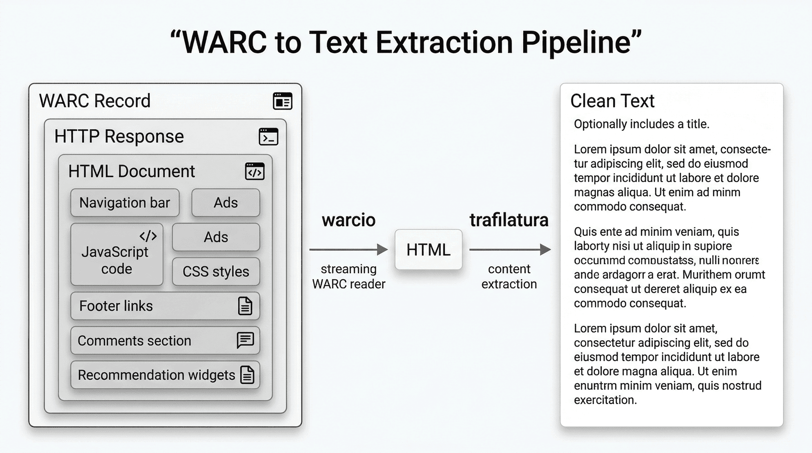


| Components | Selection | Reasons for selection |
|---|---|---|
| WARC reading | `warcio` | Standard WARC reading library, supports streaming processing to avoid memory pressure caused by loading large files at one time |
| Text extraction | `trafilatura` | The extraction of the main content area is more stable. Compared with the simple HTML parsing method, it has a better cleaning effect on the navigation bar, footer, and template area |

### 5.3 Engineering Value of Streaming Processing

WARC files are often large and contain a large number of unwanted responses.
If the entire file is read into the memory at one time, it will waste resources and is not conducive to the stable operation of long processes.

Therefore, this project uses **streaming traversal** to read WARC records one by one, and only continues to process HTML responses that meet the conditions.
This design not only reduces peak memory consumption, but also is more in line with engineering habits when expanding to multiple shards.

### 5.4 Core implementation

```python
from warcio.archiveiterator import ArchiveIterator
import trafilatura

def extract_text_from_warc(warc_path, output_path):
    with open(warc_path, "rb") as stream:
        for record in ArchiveIterator(stream):
            if record.rec_type != "response":
                continue

            content_type = record.http_headers.get_header("Content-Type")
            if not content_type or "text/html" not in content_type:
                continue

            text = trafilatura.extract(
                record.content_stream().read(),
                include_comments=False,
                include_tables=False,
                no_fallback=False
            )
```

Several parameters here are intentional:

- `include_comments=False`: Avoid including noisy areas like the comment area into the main text.
- `include_tables=False`: Reduce structural noise caused by table layout.
- `no_fallback=False`: Allows remedial extraction of extracted components when necessary to improve recall.

### 5.5 Meaning of results at this stage

In the single shard test, **3028** candidate texts were finally successfully extracted.
This number tells two things:

First, not all web page responses can be converted into usable text.
Second, text extraction is already an obvious data compression, because a large number of original responses will be blocked in "non-HTML", "empty content", "extraction failure" and other links.

From an engineering perspective, the answer at this stage is:

> In real web page data, how many candidate texts that “look like text” can we get stably?

---

## 6. Heuristic cleaning: first round of noise screening

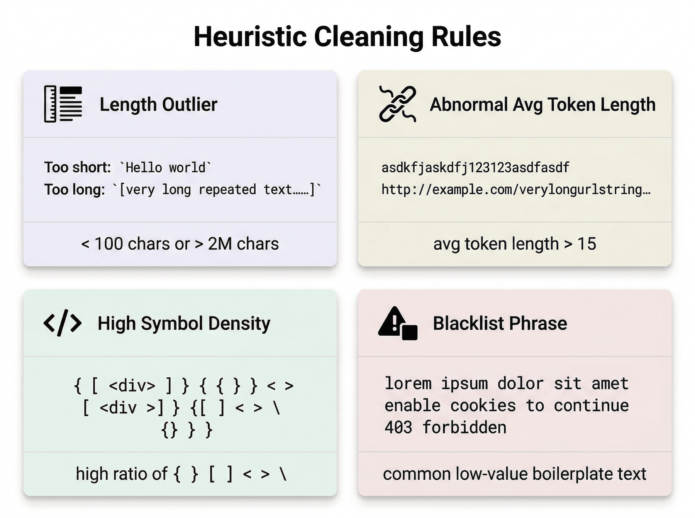


### 6.1 The necessity of heuristic cleaning

Even if the text extraction is successful, the resulting text is far from high-quality corpus.
A page may have extracted "text", but this text may still be:

- very short text
- Contents page
- tag cloud
- SEO spliced ​​text
- code snippet
- System error page
- Privacy and Cookie Tips

If such samples are directly sent to the training set, it will not only pollute the model, but also waste subsequent computing resources.

Therefore, a layer of cheap, fast, interpretable heuristic cleaning is usually designed in the pipeline to intercept the most obvious low-quality text.

### 6.2 Main cleaning rules adopted in this project

#### 1) Length rules

- Text that is too short is discarded, e.g. less than 100 characters
- Text that is too long is discarded, for example, more than 2M characters

The reason is very straightforward:
Text that is too short often lacks sufficient semantic information, while text that is too long may be the product of abnormal splicing, page splicing, or structural damage.

#### 2) Average word length rule

If the average word length is significantly high, say more than 15 characters, then the text is most likely not in natural language but:

- Code compression results
- URL string
- Promiscuous identifier
- style fragments

#### 3) Symbol density rules

Count the proportions of the following symbols:

```text
{ } [ ] < > \
```

When these symbols are overrepresented, the text often resembles a structural fragment rather than a natural language paragraph.

#### 4) Blacklist phrase rules

For example interception:

- `lorem ipsum`
- `enable cookies`
- `403 forbidden`

These texts are either placeholders or system prompt pages and have no actual value for training.

### 6.3 Characteristics of heuristic cleaning

This layer of rules is not to pursue "ultimate accuracy", but to eliminate the most obvious problems at low cost.
Its advantages include:

- fast
- low cost
- Easy to explain
- Easy to adjust parameters
- Suitable as a funnel front-end

In other words, this stage is not responsible for solving all quality problems, but giving priority to removing those samples that "almost certainly should not be kept."

### 6.4 Interpretation of results at this stage

After heuristic cleaning, the number of samples dropped from **3028** to **2425**.
This shows that about one-fifth of the candidate texts can be judged to be of low quality under the most basic text rules.

The significance of this stage is:

> Without relying on expensive model scoring, the coarsest noise is suppressed first to save resources for subsequent finer processing.

---

## 7. Duplication removal: near-duplication processing in web corpus

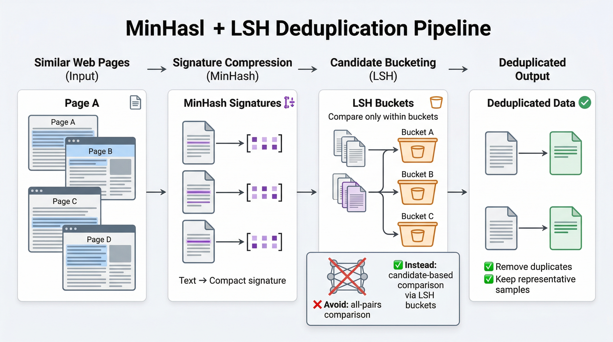


### 7.1 How serious is the duplication problem?

There is a large amount of duplication in Internet text, including but not limited to:

- Reprint article
- Aggregation page
- Mirror site
- template page
- Partial overlap of pages
- Different layout versions of the same content

If duplication is not removed, several problems will arise in the training corpus:

1. Some content is overly repeated, resulting in an imbalanced distribution.
2. The model may have a strong memory for a specific template or site.
3. Data leakage may occur during subsequent evaluations.
4. Storage and training resources are consumed unnecessarily by duplicate content.

Therefore, deduplication is not the icing on the cake, but a necessary step in web pre-training data engineering.

### 7.2 Reasons to avoid pairwise comparisons

Assuming there are \(N\) pieces of text, if the pairwise similarity is directly compared, the complexity will be close to \(O(N^2)\).
At real data scale, this approach quickly becomes unacceptable.

Therefore, this project adopts the idea of ​​**MinHash + LSH** to convert the problem of "finding similar texts" into "finding similar signatures", thus reducing the processing complexity to a more implementable range.

### 7.3 Engineering intuition of MinHash and LSH

- **MinHash**: Maps a piece of text into a shorter signature. The signature approximately reflects the set similarity of the text.
- **LSH (Local Sensitive Hash)**: Makes similar text more likely to fall into the same candidate bucket and reduce the number of global comparisons.

The result of this is that we do not need to compare each text with all texts, but only make decisions among the candidate sets that are more likely to be similar.

### 7.4 Engineering considerations for using Ray

Even with MinHash, generating the signature itself is still a computationally intensive operation.
Especially when the number of text items increases, single-threaded processing will significantly slow down the entire pipeline.

Ray's role here is very clear:
It is not for show-off "distribution", but to allow a single multi-core CPU to run batch processing tasks in parallel.

The corresponding implementation is as follows:

```python
import ray
from datasketch import MinHash

@ray.remote
def process_batch(lines, batch_id):
    results = []
    for line in lines:
        item = json.loads(line)
        m = MinHash(num_perm=128)
        for w in item["text"].split():
            m.update(w.encode("utf8"))
        results.append((item["url"], m, item["text"]))
    return results

futures = [process_batch.remote(batch, i) for i, batch in enumerate(batches)]
processed_batches = ray.get(futures)
```

### 7.5 The easiest pitfall here

One of the biggest common misunderstandings about Ray parallel processing is:
**Do not dispatch a single piece of text as an independent task. **

This will bring a lot of small object serialization and inter-process communication overhead, which will ultimately worsen performance.
The correct way is:

- First package the text into batch
- Then press batch to dispatch to workers

For example, batching every 1,000 items is a safer engineering choice.

### 7.6 Interpretation of results at this stage

After deduplication, the number of samples dropped from **2425** to **2305**.
This shows that although the duplication problem exists, in this minimum experimental scale, the shrinkage caused by deduplication is not as severe as mass filtering.

But this does not mean that deduplication is not important.
On the contrary, the importance of deduplication is that it can significantly improve the health of the training distribution, not just reduce the number of items.

---

## 8. Language splitting: the necessity of processing by language

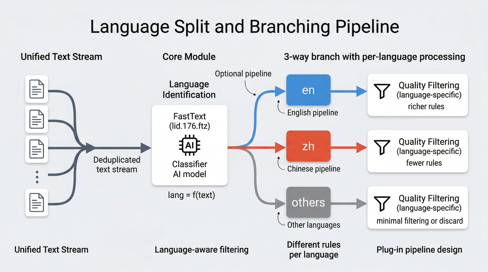

### 8.1 Different languages ​​cannot share the same set of quality gates

The quality judgment of web page text is highly dependent on the language itself.
For example, some confusion thresholds, word length statistics or grammatical naturalness rules in English do not apply to Chinese.
Conversely, the common problems on Chinese web pages are not exactly the same as those on English web pages.

Therefore, after deduplication, the project further split the text by language in order to make quality control more precise, rather than putting all languages ​​into the same filter.

### 8.2 The approach of this project

The project uses FastText's language recognition model `lid.176.ftz` to predict the language of the text and split the text into:

- `en`
- `zh`
- `others`

After doing this, subsequent quality filtering can use different strategies depending on the language.

### 8.3 Language splitting as a necessary middle layer

The value of language splitting is mainly reflected in three aspects:

1. **Avoid misjudgment**: The statistical characteristics of texts in different languages ​​vary greatly.
2. **Ease of Analysis**: Retention rates and blocking reasons can be observed separately for each language.
3. **Easy to Expand**: If more languages ​​are added in the future, you only need to add language branches to this layer without having to reinvent the wheel.

From the perspective of engineering organization, language splitting upgrades the pipeline from "unified processing" to "pluggable processing".

---

## 9. Quality filtering: from “looks like text” to “suitable for training”

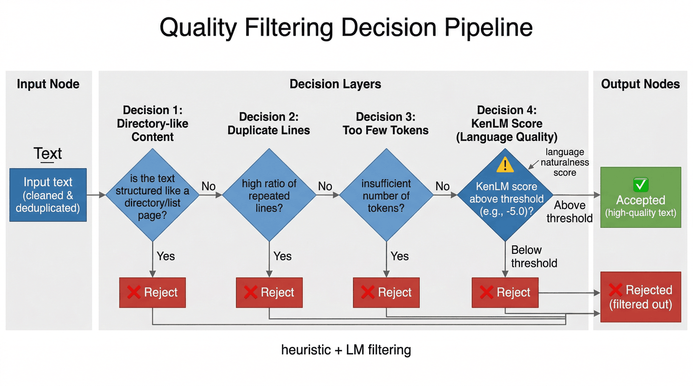

### 9.1 Why quality filtering is the most critical door

Heuristic cleaning and deduplication solve many explicit problems, but still cannot guarantee that the text is really suitable for training.
Because many pages may appear to comply with text rules, but may actually still be:

- Contents page
- Low information density pages
- Repeated Sentence Stacked Pages
- language broken page
- Machine translation fragments
- Web page noise with poor grammatical naturalness

At this time, a layer of filtering closer to "language quality" is needed.

### 9.2 English Quality Gate: KenLM Perplexity

This project introduces the KenLM language model on the English side for quality filtering.
The core idea is:

- Use language models to score text
- Measuring the naturalness of text using the score normalized by the number of words per unit
- Filter out obviously unnatural text by thresholding

This can be understood empirically:

- `> -5.0`: Usually closer to high-quality text
- `< -6.0`: tends to be closer to broken sentences, gibberish, or low-quality output

This does not mean that lower perplexity is better, but that language models can serve as a signal that is closer to "natural language quality" than pure rules.

### 9.3 Main reasons for interception observed in this project

During the quality filtering stage, common reasons for blocking include:

- `directory_like`: Directory web page, low information density
- `duplicate_lines`: Too many duplicate rows in the page
- `too_few_tokens`: Too few valid tokens

Together with KenLM, these rules form a joint filtering strategy of “heuristics + language naturalness”.

### 9.4 What does the difference in retention rates between Chinese and English indicate?

The final result shows:

- English candidate set **846**, **502** reserved
- Chinese candidate set **201**, **24** reserved

This difference is very representative.
It does not simply explain "poor Chinese data", but exposes two more realistic problems:

1. The current quality filtering capabilities for Chinese are significantly weaker than those for English.
2. The structure and noise patterns of Chinese web pages may be different from those of English web pages, and English rules cannot be directly applied.

This also means that in industrial-level multilingual data engineering, the language quality model must be designed with more fine-grained localization.

---

## 10. Three rounds of experimental review: the iterative formation process of the assembly line

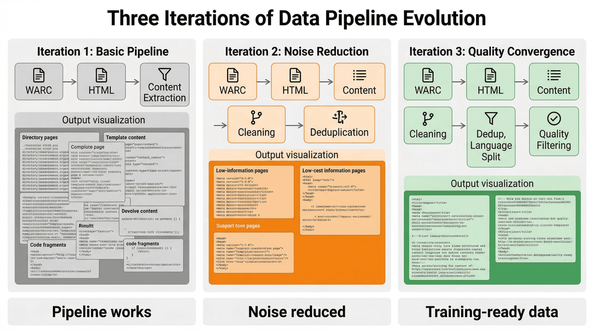

If you only understand the project as a series of script calls, it is not easy to see clearly the trade-offs behind these designs.
A way of writing that is closer to the real engineering process is to reduce it to several rounds of gradually tightening experiments.

### 10.1 Experiment 1: Extract text only

The goals of the first round of experiments were very simple:
First verify whether the link "WARC -> HTML -> Body Text" can run stably.

What this stage solves is:

- Can WARC be traversed correctly?
- Is it possible to filter out obviously irrelevant responses?
- Can you extract the main text of the web page?

This round usually produces a batch of candidate texts quickly, but the problem is also very obvious:
There is high noise, too many directory pages, too much template content, and serious mixing of code fragments and footer text.

Therefore, the answer in the first round is "Is there any text?" rather than "Can these texts be trained?"

### 10.2 Experiment 2: Adding heuristic cleaning and deduplication

Starting from the second round, the project was upgraded from "extracting text" to "preliminarily turning it into corpus".

This round has been supplemented with:

- length filter
- Symbol Density Filtering
- Blacklist phrase filtering
- MinHash removes duplicates

The result is that the crudest garbage samples and near-duplicate pages are significantly suppressed.
However, during random inspection, we can still see many pages that look like text but are not actually very dense in information.

Therefore, the second round changes the data from "visible" to "more corpus-like", but not to the extent that it can be directly trained.

### 10.3 Experiment 3: Add language splitting and quality filtering

The third round of introduction:

- FastText language splitting
- English KenLM quality score
- More stringent filtering logic for directory pages, duplicate rows, short tokens, etc.

The direct effects of this round are:
The number of samples further decreases significantly, but the training availability increases significantly.

The final number of samples shrank from **3028** to **526**, which seems like a huge loss, but this exactly reflects the project's active tightening of quality.
It shows that what the project pursues is not "retaining as much as possible" but "retaining as much as possible is worthy of training."

### 10.4 Engineering significance of three rounds of experiments

These three rounds of experiments actually correspond to a very typical way of promoting data engineering:

1. **Run the link first**
2. **Resuppress dominant noise**
3. **Finally do language perception and quality convergence**

---

## 11. Training data encapsulation: from cleaning results to training interface

### 11.1 Data cleaning does not mean that training is available

Even if the text that is finally retained is relatively clean, it still cannot be directly said to be "ready for training".
Because training systems usually also require the following capabilities:

- Stable train/val splitting
- metadata index
- token estimate
- Small sample smoke test
- File level organization

If this step is not done well, subsequent training and evaluation can easily lead to inconsistencies or leakage issues.

### 11.2 The Importance of Deterministic Segmentation

The project is not randomly divided, but die-cut based on deterministic identifiers such as `text_sha1`.
The benefits of doing this are:

- When running repeatedly, the train/val set is stable and unchanged.
- Facilitates troubleshooting differences in training results
- Convenient for data set version management
- Conducive to project reproducibility

What needs to be emphasized here is:
**Reproducibility is part of data engineering quality, not an add-on. **

### 11.3 Function of Smoke Test

The project additionally builds `smoke_test.jsonl`.
It is not part of the formal training set, but a very small, fast-loading sample collection used to:

- Run through training script
- Check whether the tokenizer and data interface are normal
- Catch formatting errors, encoding issues or missing fields early

In actual projects, this smoke test set can often save a lot of debugging time.

### 11.4 Engineering Value of Manifest

`training_manifest.json` records important meta-information of the data set, such as:

- sample size
- Segmentation situation
- Estimate the number of tokens
- file path
- overlap check results

Its significance is to make the data set no longer just a few scattered JSONL files, but a "formal product" that can be read, evaluated and inspected by the system.

---

## 12. Data Evaluation: Pipeline Value Judgment

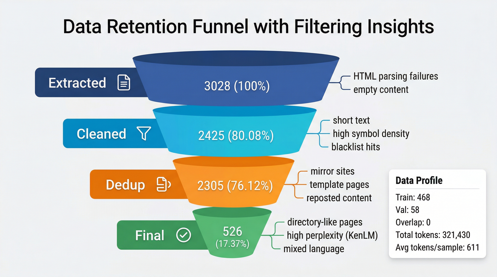

### 12.1 Data retention funnel

The final retention funnel obtained from this project is as follows:

| Stage | Number of records | Retention rate (based on extracted) | Typical reasons for interception |
|---|---:|---:|---|
| Extracted | 3028 | 100.0% | HTML parsing failed, empty content |
| Cleaned | 2425 | 80.08% | Short text, excessive code symbols, blacklist |
| Dedup | 2305 | 76.12% | Mirror site, template page, reprint |
| Final | 526 | 17.37% | Contents page, high confusion, mixed language |

### 12.2 What do these numbers really say?

If you just look at the final results, 526 samples doesn’t seem like a lot.
But for data engineering, what is more important is not "how much is left", but **what was deleted at each layer, why it was deleted, and to what extent**.

These numbers at least indicate:

1. The original web page is very noisy.
2. Heuristic cleaning quickly removes the coarsest noise.
3. Deduplication improves training distribution.
4. Quality filtering is the critical stage that really determines the final data usability.

From the perspective of engineering interpretability, this is more illustrative than simply reporting "the final number of entries".

### 12.3 Data profiling

The final result also includes:

- Final number of samples: **526**
- Training set: **468**
- Validation set: **58**
- Train/Val overlap: **0**
- Total estimated token: **321430**
- Average token per sample: **611.08**

This shows that the final data set is not just a batch of texts, but a standardized corpus product with training interface attributes and basic statistical portraits.

---

## 13. Cost analysis: resource accounting and bottlenecks

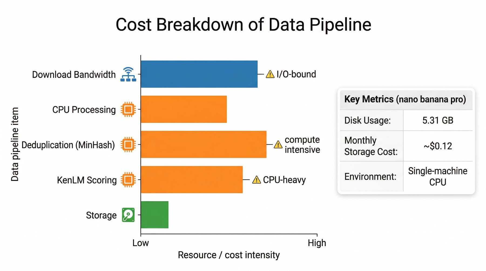

In many beginner projects, everyone pays more attention to "whether it can be passed" and less concerned about "what is the cost".
But in a real production environment, cost awareness and engineering awareness are bound together.

### 13.1 Storage costs

Project statistics show:

- Total disk usage is approximately **5.31 GB**
- Monthly storage cost estimate is approximately **$0.12 USD**

For single-shard experiments, this cost is not high.
But it reminds us: when the process scales to more shards and more intermediate products, the storage cost will increase exponentially.

### 13.2 Computational bottleneck

The main computational bottlenecks of this project include:

- Download bandwidth
- CPU text processing
- KenLM loading and scoring
- Signature calculation during deduplication stage

In other words, even without the introduction of GPU, data engineering is still not a "light job".
If the process is not designed properly, CPU and I/O can quickly become real bottlenecks.


## 14. Verification closed loop: project consistency check

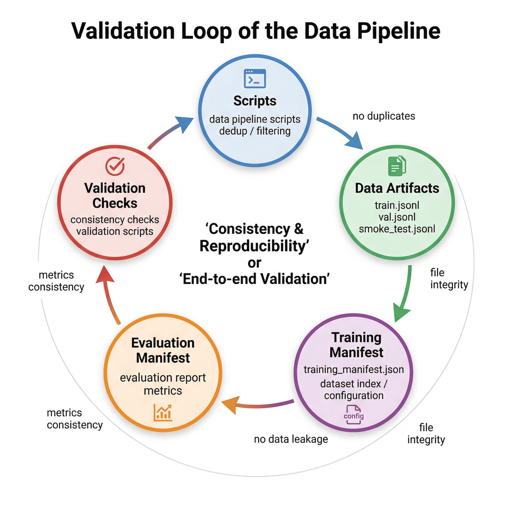

### 14.1 The role of project inspection

If a data engineering project only has output files and no checking mechanism, it is actually difficult to say whether it is really correct.
Because errors can come from many places:

- The script runs but the product is missing
- There is a leak in train/val segmentation
- report is inconsistent with metrics
- smoke test does not belong to the training set
- There are still duplicate samples in the final data

Therefore, the project specially designed a check script to verify consistency.

### 14.2 Inspection results

The project inspection results are:

- Total inspection items: **14**
- Passed: **14**
- Overall status: **PASS**

### 14.3 Check coverage

#### Command level checks

- `py_compile`
- `dedup_unit_check`
- `training_smoke_test`
- `dataset_evaluation`

#### Data/product level inspection

- Required files exist
- The final number of files is consistent with the language split result
- The training manifest is consistent with the number of training files
- train/val no overlap
- smoke test belongs to train
- final dataset no exact duplicates
- The report is consistent with the indicator file

### 14.4 Verify the engineering significance of closed loop

This level of inspection is very critical.
It means that the project does not "look the same to the naked eye", but establishes a closed loop between code, product, evaluation and reporting.


## 15. Main limitations and risks

Any minimum reproducible project is never final.
The Mini-C4's value lies in illustrating the method, but it also has very clear limitations.

### 15.1 Low retention rate

The final retention rate was only **17.37%**.
This shows that the original noise of the web page is indeed very heavy, and it also shows that the current quality gate is relatively strict.

This is not a bad thing, but it does mean that if the goal shifts to "maximizing scale", the rules and models must be further optimized to avoid deleting too much potentially valid data all together.

### 15.2 The retention rate of Chinese is low

In the end, only **24** items were retained in Chinese, which exposed the problem of insufficient Chinese quality scoring capabilities.
It cannot be completely solved simply by adjusting the threshold, but may require:

- More adapted to the data quality rules of Chinese web pages
- A language model or scoring model more suitable for Chinese
- More fine-grained analysis of Chinese web page samples

### 15.3 Deduplication has limited scalability

Currently, memory indexing is still the main method for deduplication.
When the number of shards increases, you will first encounter:

- memory pressure
- Run time rises
- Global index management is difficult

Therefore, the current solution is more suitable for minimal experiments and small and medium-scale data processing, rather than directly moving to very large-scale production environments.

---

## 16. Follow-up expansion direction

### 16.1 Deduplication backend upgrade

Upgrade the current in-memory LSH index to external storage, for example:

- Redis
- Cassandra
- Other distributed KV/indexing systems

This can support the deduplication requirements of more shards.

### 16.2 Chinese quality model upgrade

Introduce a more stable quality modeling method for Chinese web page data, such as:

- A more suitable Chinese language model
- Chinese web page quality feature engineering
- Lightweight quality classifier

### 16.3 Prefix domain name filtering

Performing domain-level whitelist/blacklist filtering before HTML parsing can significantly reduce subsequent invalid calculations.
This is a key step from "text side cleaning" to "crawling entry control".

### 16.4 Observability enhancement

For each stage add:

- Time-consuming log
- Throughput statistics
- Sample inspection panel
- Threshold hit statistics

In this way, when adjusting parameters, developers not only know "the result has changed", but also "why it has changed".

---

## 17. Summary of engineering practice: the value of Mini-C4 method

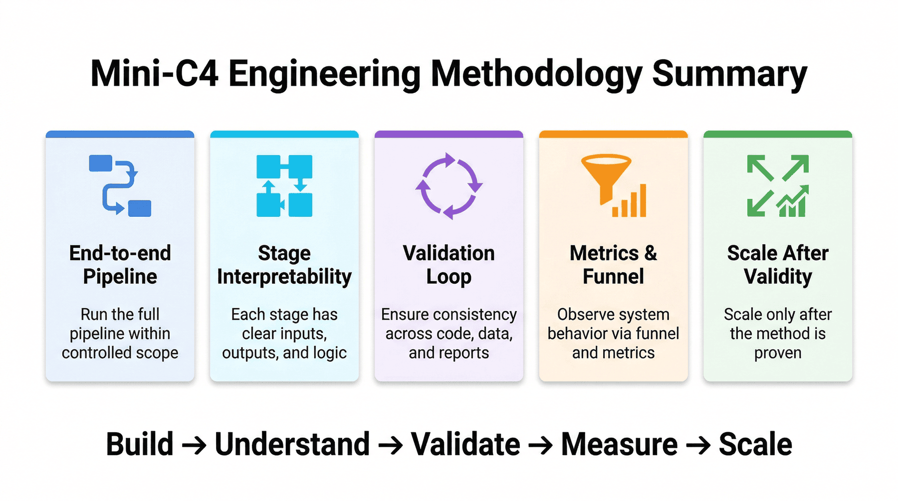

What this project really wants to convey is not the usage of a certain library, but a more general data engineering methodology:

1. **First run through the entire link within the controllable boundary**
2. **Make each step into an explainable stage**
3. **Priority is given to establishing a closed loop of result verification**
4. **Observe system behavior through funnels and intermediate metrics**
5. **Make sure your approach holds up before you scale it up**

The value of Mini-C4 is not that it only processes one shard, but that it condenses the core issues in web pre-training data engineering into a reproducible pipeline.

This assembly line also has several elements required for a complete engineering closed loop:

- Have clear goals
- There is a complete process
- There are real indicators
- There is a middle ground to choose from
- There are limitations and extensions
- There is an engineering closed loop

---

## 18. List of major deliverables

### 18.1 Intermediate data products

- `data/processed/extracted_data.jsonl`
- `data/processed/clean_data.jsonl`
- `data/processed/deduplicated_data.jsonl`
- `data/processed/data_en.jsonl`
- `data/processed/data_zh.jsonl`
- `data/processed/final_data_en.jsonl`
- `data/processed/final_data_zh.jsonl`
- `data/processed/final_data.jsonl`

### 18.2 Training data products

- `data/training/serialized_dataset.jsonl`
- `data/training/train.jsonl`
- `data/training/val.jsonl`
- `data/training/smoke_test.jsonl`
- `data/training/training_manifest.json`

### 18.3 Reporting and inspection products

- `data/reports/p1_metrics.json`
- `data/reports/p1_report.md`
- `data/reports/p1_test_results.json`
- `data/reports/p1_test_report.md`
---

## 19. Conclusion

For large model training, the data is often more difficult to "clean" than the model.
Because the model architecture can be reused and the training framework can be migrated, high-quality corpus production always relies on a solid set of data engineering capabilities.

The case of Mini-C4 proves one thing:
Even under very limited boundaries, we can still explain the key issues in pre-training data engineering clearly and completely, and precipitate them into a methodology that can be reused.

This is also the core of the reusability of this type of engineering pipeline.

---

## Special Topic: Acceptance Baseline of Mini-C4 Pipeline

A project like the Mini-C4 could easily be misinterpreted as “a miniaturized version of Common Crawl.” But from an engineering perspective, what is really worth reusing is that the pre-training data processing is written into an acceptable stage chain. The so-called acceptance does not mean that it ends with the final output of `final_data.jsonl`, but that each layer must have a baseline that can determine whether "should continue going down."

### 1. Capturing and parsing baselines

In the first crawling and parsing stage, the most critical thing is not how many more pages are captured, but whether the captured pages can be stably parsed. Here are at least some things to pay attention to:

* Whether WARC samples can be expanded correctly;
* Whether to retain the main content after HTML parsing instead of advertising and navigation noise;
* Whether the parsing fields are complete, such as whether the URL, language, body length and meta-information are complete;
* Whether parsing failed samples are logged instead of being quietly discarded.

The value of this step is to expose the "raw material layer problem" as early as possible. Because if the raw material layer has been severely distorted, subsequent cleaning, deduplication and scoring are likely to just continue to perform more expensive calculations on noise.

### 2. Cleaning and Deduplication Baseline

The cleaning and deduplication stage is the easiest time for teams to fall into the trap of "the indicators look strong, but they don't know what has been cleaned." A more prudent approach is to retain both quantitative indicators and sample inspections.

The more critical baselines at this level include:

* Is the text length distribution still reasonable after cleaning?
* Whether the template pages, navigation pages, and script residual pages have dropped significantly;
* Whether sufficient topic diversity is still retained after deduplication;
* Whether duplication between different shards is effectively handled;
* Are high-value long texts not harmed too much by rules?

For pre-training corpus, the difficulty in removing duplicates is never just “whether there are repetitions”, but “what is left after the duplicates are removed”. If all you end up with are short pages with similar structures, then even if the retention rate looks good, the training value may not be high.

### 3. Language segmentation and quality scoring baseline

Mini-C4 currently processes English and Chinese separately. This step is very critical because different languages ​​vary greatly in web page structure, noise types and quality signals. After language segmentation, quality scoring should no longer just look at the unified threshold, but should be combined with language features.

At this level, the more important baselines include:

* Whether the language recognition is stable to avoid misclassification of mixed Chinese and English pages;
* whether retention rates for each language are consistent with sample quality intuition;
* After the quality threshold is changed, will the topic and length distribution of the retained corpus fluctuate drastically?
* In the final retained corpus, are there still obvious clusters of low-value sites?

These baselines together determine one thing: whether the remaining corpus is "cleaner" or just "less". The two are not the same thing in engineering.

---

## Special Topic: From Teaching Prototypes to Large-Scale Pre-Training Factory

The current form of P01 is more suitable as a teaching minimum closed loop, but it has clearly demonstrated several key paths to large-scale factories in the future. The most important thing to emphasize here is that scaling up cannot just be understood as "running the script on more machines", but also needs to simultaneously expand the control surface, observability and error handling capabilities.

### 1. First expand the control surface, then expand the data volume

Many teams want to expand the amount of data right from the start, but if the control surface is too weak, the larger the scale, the harder it will be to locate the problem. A more reasonable order is usually:

* First complete the stage-level logs and statistics;
* Then complete the sample sampling and rule hit distribution;
* Then expand the shard number and parallelism;
* Finally, we pursue higher throughput and greater coverage.

Because only if the control surface is strong enough, the team can still know where the problem is, why it goes wrong, and which section should be repaired first when the scale increases.

### 2. Pre-training corpus factory needs “entry management”

P01 We have already talked about prefixed domain name filtering, which is actually very important. Because a lot of the cost of pre-training data is not spent on high-value content, but on downloading, parsing, cleaning and deduplication of massive low-value pages. If we want to move towards a more realistic factory form in the future, entrance management will become increasingly important, including:

* Domain name whitelist and blacklist;
* Site quality portrait;
* Update frequency and crawl priority;
* Differentiation strategies for sites in different languages ​​and regions.

As long as the inlet management is done well enough, the subsequent cleaning pressure and calculation costs will be significantly reduced.

### 3. The final competition of the pre-training project is sustainable production capacity.

In the long run, the real competition for pre-training corpus projects is not how beautifully the data is washed at a certain time, but whether the next version of the corpus can be produced continuously, stably, and reproducibly. To do this, you need at least:

* There is a clear version;
* There are stage baselines;
* Abnormal samples are retained;
* There are explanations for the causes of quality changes;
* There is a stable interface that can be consumed on the training side.

This is where the Mini-C4 is most valuable as a project prototype. It does not pretend to be a complete industrial system, but it has laid out the most critical skeleton of the industrial system first. No matter how much the team expands, how many languages ​​are adopted, or how many new rules are added in the future, as long as this skeleton remains, the method will have room to continue to grow.

---

## Special Topic: Preliminary Thoughts on Corpus Ratio and Training Mixing Strategy

Although this chapter of Mini-C4 focuses on data cleaning and quality control, from the complete perspective of the pre-training project, corpus ratio is also an issue worth thinking about in advance. Because "cleaning" only solves the problem of whether it can be used, and "how to mix" determines what kind of distribution impact these corpus will have after entering training.

### 1. The information required for mixing should be retained during the data preparation stage.

If the team intends to later mix the data stratified by language, source, length, or quality, then the relevant fields should be retained during the data preparation phase rather than second-guessing them before training. The most common information that can be retained includes:

* language tag;
* Source domain name or source type;
* Text length interval;
* mass fraction or mass bucket;
* The state before and after deduplication.

These fields may seem like “to be discussed later” in the current minimal project, but once you enter the training proportions phase, they immediately become the most valuable control handles.

### 2. Training hybrid strategy is essentially a continuation of quality control

Many people regard cleaning as data engineering and mixing as training engineering, but in pre-training projects, the two are actually a continuous chain. Because if high-quality long text is retained after cleaning, but is excessively diluted during training mixing, it will be difficult for the previous cleaning benefits to be truly transferred to the model. On the other hand, if a certain type of low-quality but high-frequency web pages are retained in large numbers and account for an excessively high proportion in training, the model will still be significantly disturbed.

From this perspective, the structured fields and intermediate products currently retained by Mini-C4 not only serve the cleaning process, but also reserve interfaces for subsequent more sophisticated training hybrid strategies.

