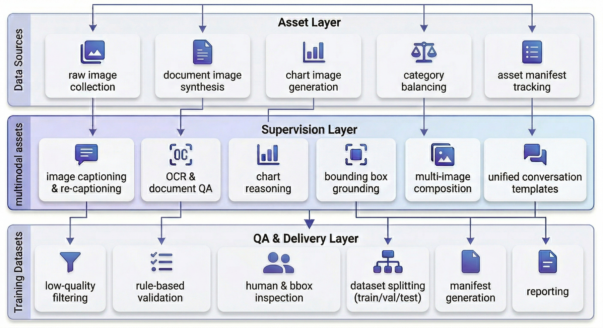
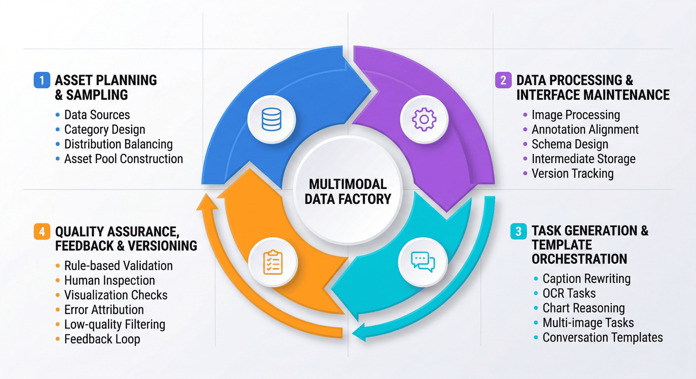
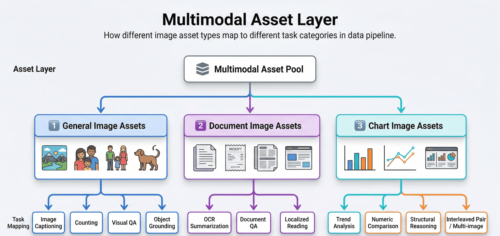
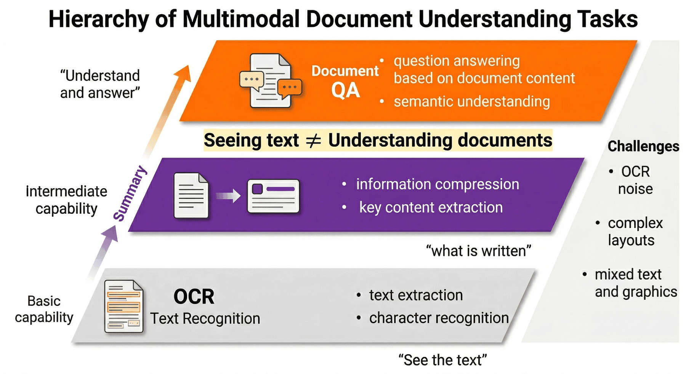
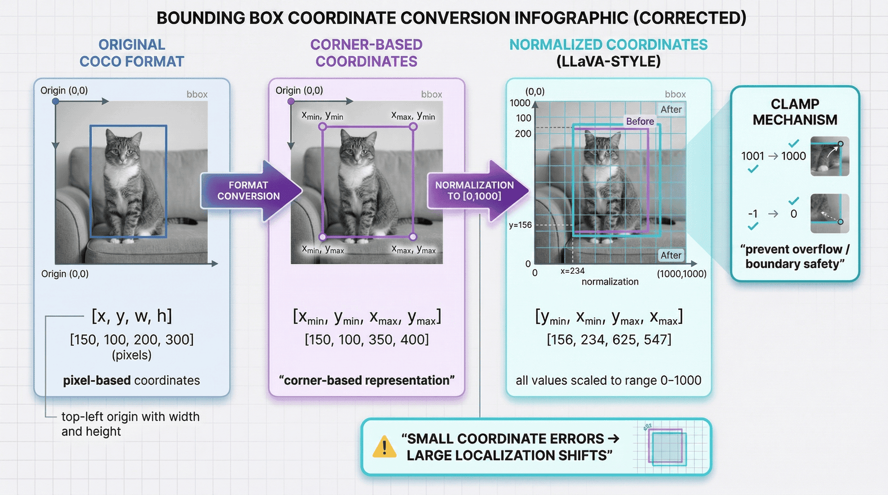
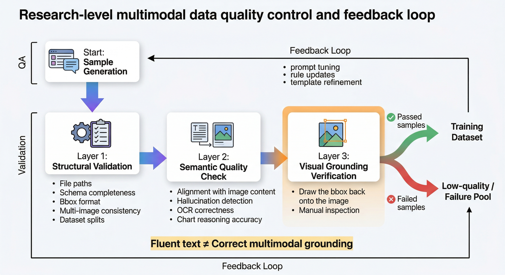
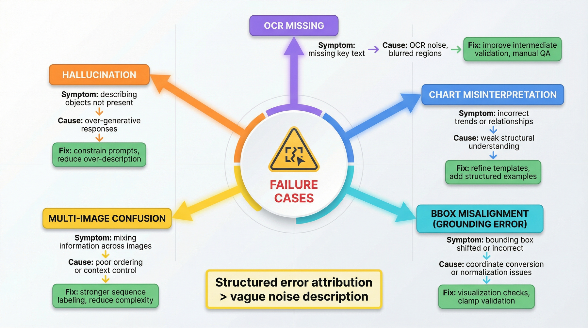
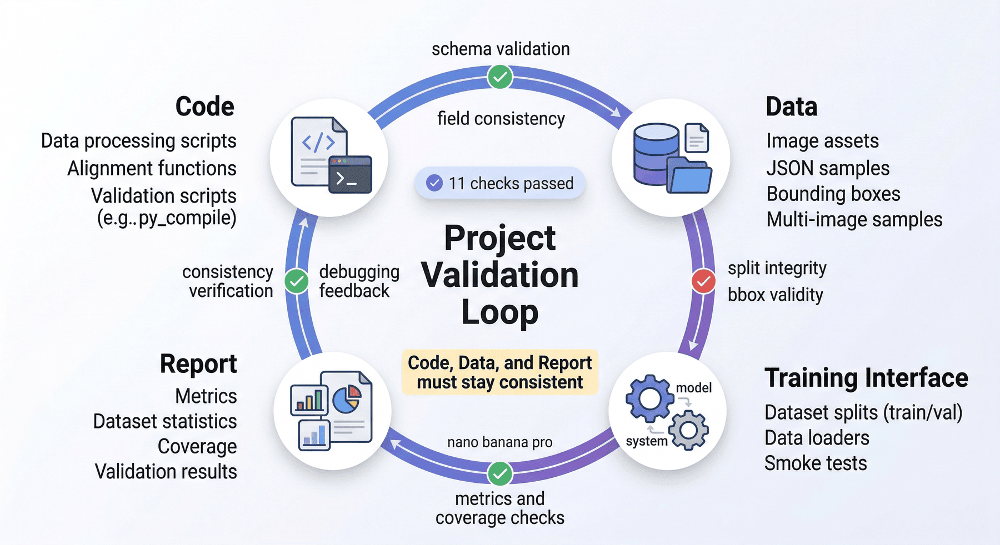

# Project 3: LLaVA multi-modal instruction data factory

## Overview of this chapter

P03 focuses on processing images, area annotations, OCR information, and multi-image relationships into multi-modal supervised data assets that are trainable, quality-inspectable, and encapsulated. The focus of this chapter is not on single image question and answer, but on the engineering transformation process of multi-modal assets into training samples.

This chapter can be understood according to four main lines:

* Multi-modal asset organization: manage original images, derived documents, diagram structures and task labels.
* Command composition and area alignment: handle OCR, bounding box, object-level grounding and multi-image relationships.
* Quality audit and failed sample review: Supervise quality through visual sampling and error sample attribution control.
* Training encapsulation and result verification: forming a unified training interface, segmentation results and inspection reports.

If read in engineering order, this chapter corresponds to a complete link:

**Original image assets -> Derived document/chart assets -> Instruction synthesis -> Region alignment -> Multi-image interleaving -> Quality inspection and sampling -> Training packaging -> Reporting and verification**

The core goal of this structure is to build a multi-modal data pipeline that can support LLaVA-type model training.

---

## 1. Project background: The necessity of multi-modal instruction data factory

General language models already have strong capabilities in plain text question and answer, but when entering visual scenes, data problems will be immediately exposed.

The most common distortions can again be divided into three categories.

The first category is **Visual Fact Distortion**. The model clearly saw two dogs, but it generated three; the picture showed a dining table, but it said it was a desk; the frame selected the object in the upper left corner, but the answer described the entire picture. Once this type of error enters the training set, it will cause the model to regard "illusion" as knowledge.

The second category is **task distortion**. Many teams only do captions or general VQA, so the model only provides a rough description of the entire image, but does not handle object-level grounding, document area reading, chart numerical comparison, or multi-graph linkage reasoning. The problem is not that the sample is too small, but that the task spectrum is incomplete.

The third category is **interface distortion**. Multimodal data has more fields and stronger dependencies: image path, image type, task label, OCR text, bbox, conversation template, training segmentation, and visual sampling results must all be consumed by downstream training and evaluation. Whenever the schema gets out of hand, the data factory degenerates into a bunch of ad hoc scripts.

Therefore, the goal of P03 is not to simply "generate some LLaVA format JSON", but to build an **LLaVA multi-modal instruction data factory** to organize image asset management, task construction, object-level alignment, quality review and training delivery into a reusable engineering production line.

This production line serves not a one-off demonstration, but a methodology:

> When the team needs to expand from COCO images to real documents, tickets, charts, web page screenshots, multi-page PDFs and even video keyframes in the future, what can really be migrated is not a certain prompt, but this set of data engineering methods "from multi-modal assets to training supervision".

---

## 2. Project goals and boundaries

### 2.1 Project Goals

This project focuses on the following four goals.

**Goal 1: Establish a conversion link from multi-modal assets to supervised samples. **
That is, the original image, annotation box and derived visual assets are converted into structured samples that can be directly used for visual instruction fine-tuning.

**Goal 2: Establish a task system for LLaVA style training. **
This project does not unify all samples into "pictures + Q&A", but splits them into different task types such as description, counting, OCR summary, document Q&A, chart reading, regional positioning and multi-image comparison.

**Goal 3: Establish an auditable, rollable, and versionable QA mechanism. **
If multi-modal samples are only generated without sampling, errors will enter the training set with high concealment. Therefore, the project also builds quality rules, manual sampling inspections, visual counter-inspections, and low-quality sample marking.

**Goal 4: Form data assets that can be directly consumed by the training side. **
The final output includes not only intermediate processing files, but also training sets, validation sets, smoke test, manifest, evaluation reports and project inspection results, ensuring that the project can be converted from "experimental scripts" to "formal deliverables".

### 2.2 Project Boundaries

In order to ensure that the project has sufficient reproducibility, this project explicitly sets several boundaries.

#### 1) Data source boundary

The current data is mainly based on local COCO subsets and their annotations, and is further derived from document-like and chart-like images. It is suitable for method demonstration, process explanation and small factory verification, but it does not claim to cover the full picture of real business in the open world.

#### 2) Task boundaries

This project currently focuses on covering the following types of tasks:

* Image description (image description)
* Counting and visual QA (counting/visual QA)
* OCR summary and document QA (OCR summary/document QA)
* Chart reading/chart comparison
*Region grounding
* Multi-image comparison

These tasks are sufficient to cover the main path of "whole graph understanding - local positioning - image and text union - cross-graph reasoning", but have not been fully extended to more complex tasks such as multi-page long documents, table structured extraction, web page level navigation, time-series video question and answer and so on.

#### 3) Supervision method boundaries

This project focuses on **templated generation + rule supplementation + heuristic review + manual sampling**, rather than relying on large-scale manual writing one by one. It is more like a prototype of a small data factory than a large-scale commercial annotation production line.

#### 4) Online capability boundary

The current sample size is small and the quality pass rate is high, largely from a controlled data environment. It is suitable for showing how the multi-modal data factory is designed, and should not be exaggerated to support the production of complex open scenarios.

### 2.3 The role of boundary description

In practical engineering cases, there are usually only two common ways of writing:

* One is to write the project so that "everything can be done";
* The other is to write the project as "what can be done stably and under what conditions".

The latter is obviously more credible and easier to reuse. This is especially true for multimodal projects, because once the visual task is taken out of bounds, it is easy to misrepresent the results of controlled experiments as general abilities.

---

## 3. Project positioning: P03’s capability chain position

If the whole book is regarded as a large model data engineering capability chain, then P03 is at the core of the "Multimodal Supervised Data Engineering" section.

Methodologies such as text data cleaning, SFT data design, preference data and training encapsulation have been discussed in previous chapters. The value of this chapter lies in extending these methods to a more complex object: **images and their derived supervision signals**.

In other words, this chapter is not a retelling of the principles of the LLaVA paper, but rather a demonstration of:

* Why image-based supervision data cannot copy the ideas of text factories;
* Why multi-modal task design must be split by image type and supervision granularity;
* Why the quality control of visual samples is inseparable from visual review;
* Why object-level coordinate alignment and multi-graph relationship construction are key points in engineering;
* How to consider training interfaces, check scripts and version evolution at the early stage of the project.

In this sense, the most important thing about this chapter is not "the model can see the picture", but answering a larger question:

> How should multi-modal supervision data be designed as a set of continuous production capabilities instead of a one-time sample assembly script?

---

## 4. Overall architecture: data pipeline from multi-modal assets to training assets



From an engineering perspective, this project can be broken down into three floors.

### 4.1 The first layer: asset processing layer

This layer solves the problem of "whether there are clean, controllable, and well-structured multi-modal input assets." Mainly include:

* Original image collection
* Image category balancing
* Derived document image construction
* Derived chart image construction
* Asset manifest record

The goal of this step is not to directly generate training samples, but to convert scattered visual materials into a trackable and hierarchically sampled asset pool.

### 4.2 The second layer: Supervisory construction layer

This layer solves "how to convert different types of visual assets into different types of supervised samples." Mainly include:

* Image description and re-description
* OCR summary and document Q&A
* Chart reading and comparison
* bbox alignment and grounding
* Multi-image interleaved sample generation
* Unification of conversation templates

This step is the core of the entire project, because it determines whether the model learns "rough captioning capabilities" or "task-layered multi-modal understanding capabilities."

### 4.3 The third layer: quality inspection and delivery layer

What this layer solves is "whether these samples can really enter training." Mainly include:

* Rule review
*Manual inspection
* bbox visual verification
* Low quality sample flag
* train/val/smoke segmentation
* manifest generation
* Reports and project inspections

At this point, the project has truly transformed from "generating sample experiments" to "reusable data factory".

---

## 5. Project pre-production: key aspects of multi-modal data factory

In a minimal experiment, asset preparation, sample generation, quality inspection and training packaging can often be completed by the same person; but when the project is about to enter the team reuse or subsequent expansion stage, a more stable approach is not to emphasize "who will do it", but to first clearly write down **which aspects of responsibility must be covered**.

In a multimodal data factory, at least four types of responsibility areas need to be explicitly defined.

### 5.1 Asset planning and sampling strategy

This layer is responsible for defining where the images come from, what categories they are divided into, what range they cover, and which samples should enter the first round of asset pools. Its focus is not on a single sample, but on whether the overall distribution is balanced and whether it has covered the three levels of general images, document images and chart images.

### 5.2 Data processing and interface maintenance

This layer is responsible for image processing, annotation alignment, schema design, intermediate product placement, training segmentation and inspection scripts. Its core goal is to ensure that the data interface is stable, fields are consistent, and versions are traceable, rather than stopping the process in a set of temporary scripts.

### 5.3 Task generation and template arrangement

This layer is responsible for caption rewriting, OCR sample construction, chart task orchestration, multi-image comparison templates, API calls and post-processing. It connects "visual asset input" and "supervised sample output" to determine whether the project will ultimately form a single caption data set or a multi-modal supervised set with a task spectrum.

### 5.4 Quality inspection, rollback and version control

This layer is responsible for error type attribution, sampling rules, visual review, rejection conditions, low-quality sample precipitation and rework closed loop. In multi-modal scenarios, this part is especially critical, because many problems can only be truly discovered by going back to the pictures, box annotations, and multi-picture order itself.

### 5.5 The role of key responsibility areas

Because when many teams do multimodal SFT for the first time, the real problem is often not that "the model will not be generated", but that the key control points have not been explicitly designed, resulting in:

* Asset source lacks boundaries;
* Lack of planning for task coverage;
* Coordinates and image versions lack verification;
* Failure samples lack precipitation;
* Version evolution lacks stable interfaces.

Therefore, writing these responsibilities clearly is essentially explaining: **Multimodal SFT is more like an engineering assembly line with visual quality inspection capabilities, rather than a number of temporary sample assembly steps. **



---

## 6. Asset layer design: construction of multi-modal asset pool

In general text SFT, many teams start directly from existing text library slices; but multi-modal projects are not suitable for "generating questions and answers based on pictures" right from the start. The reason is that images are not naturally structured units of knowledge.

Therefore, this project first builds a relatively stable multi-modal asset pool and splits it into three categories:

* General image assets (general image)
* Document image asset (document image)
* Chart image asset (chart image)

The value of this design is not just to collect different samples, but to provide clear "input semantic boundaries" for subsequent task distribution.

### 6.1 Why should we split the three types of assets?

Because different images naturally support different tasks.

* General-purpose images are more suitable for description, counting, target recognition and local positioning;
* Document images are more suitable for OCR summarization, document Q&A and partial reading;
* Chart images are more suitable for trend summary, numerical comparison and structural interpretation.

If it is not disassembled first, a large number of unsuitable samples will be mixed into the same prompt pool: for example, OCR summary is required for ordinary cat and dog pictures, and natural scene comparison is required for ticket screenshots. This confusion will directly reduce the effective sample proportion.

### 6.2 Engineering significance of asset balancing

The project eventually formed **87 assets**, including **29 assets** for each of the three types of assets, which shows that the asset layer is not collected casually, but deliberately designed with a balance. The benefits of doing this are:

* Subsequent task distribution is easier to control;
* It is easier to determine which types of tasks are under-performed when analyzing the results;
* Small-scale projects can also avoid a single image type dominating the training set.

### 6.3 Why derived document images and diagram images are important

Many teams make the mistake of thinking “multimodality = natural images.” But in real business, document screenshots, reports, bills, dashboards, charts and web page screenshots are often more important. Their difficulty is not in object recognition, but in image-text mixing and local structure understanding.

Therefore, this project does not stop at COCO natural images, but further derives document-based and diagram-based assets, using a small-scale project to spread out the multi-modal task spectrum.



**Table 1: Asset type and task mapping table**

| Asset types | Typical sources | Adaptation tasks | Main risks |
| --- | --- | --- | --- |
| `general_image` | COCO natural images, general scene pictures | Image description, counting, visual question answering, local positioning | Illusion description, object omission, category confusion |
| `document_image` | Document screenshots, bills, system pages, scanned copies | OCR summary, document Q&A, partial reading | Missing text, misjudgment of layout, misalignment of local areas |
| `chart_image` | Bar charts, line charts, report screenshots, dashboards | Chart reading, trend summary, numerical comparison | Trend reverse reading, category relationship misjudgment, missing values |
| `interleaved_pair` | Multi-picture pairing, cross-page samples, comparison screenshots | Multi-picture comparison, summary of common points, summary of differences | Sequence confusion, cross-picture crosstalk, pairing imbalance |

---

## 7. Data schema: structured way of multi-modal seeds

After completing the asset collection, the project will not directly send the images to generate the model, but first unify the assets, annotations and task fields into the schema.

### 7.1 The importance of schema in multi-modal scenarios

In text data, in many cases, two columns, `instruction` and `output`, can run a basic experiment; but multi-modal scenarios are different, and at least additional processing is required:

* Picture file path
* Image type
*Original width and height
* callout box
* OCR text
* Derived task type
* Conversation template
*Sample source and version

If the schema is not unified, the logic will have to be rewritten for each new type of task, and the project will soon become multiple sets of temporary formats coexisting.

### 7.2 What should a more stable minimum schema contain?

The seeds and training samples of this project should at least contain the following fields:

* `id`: sample unique identifier
* `image`: Image path or image list
* `asset_type`: `general_image`/`document_image`/`chart_image`/`interleaved_pair`
* `task_type`: task type label
* `source_id`: Source asset identifier
* `bbox`: coordinates of regional positioning task
* `ocr_text`: OCR or readable text summary
* `conversations`: LLaVA conversation format body
* `split`：train/val/smoke
* `meta`: Meta information such as version, generation method, review status, etc.

### 7.3 The engineering value of schema

The meaning of schema is not just a field list, but to align the three links:

* The generation process knows what to write;
* QA knows what to check;
* Know what to read during the training session.

This makes the project no longer "end with just one JSON", but an interface layer that can evolve over the long term.

---

## 8. Image sampling and re-description: the necessity of supervised rewriting

Many off-the-shelf image data sets have captions, but multi-modal SFT cannot be simply and directly trained for three reasons.

First, original captions are often short and descriptive, and cannot cover tasks such as question and answer, counting, explanation, and comparison.  
Second, the style of the original caption is not uniform and does not necessarily conform to the LLaVA conversational data format.  
Third, the original caption mostly only describes the entire image and cannot cover object-level or mixed image and text capabilities.

Therefore, this project first "re-describes" the image and then converts it into task-based supervision.

### 8.1 What problem does re-description solve here?

Re-description is not just about changing a caption to be longer, but also about organizing the explicit information in the image that may be used for training, for example:

* What is the subject of the scene;
* What significant objects exist;
* Whether there is readable text;
* Whether it is suitable for counting;
* Whether it is suitable for comparison or positioning.

Re-description is the transition layer from "image material" to "task seed".

### 8.2 The role of templated generation

Totally open generation is certainly more flexible, but it's also easier to get out of control in a small factory. Especially for multimodal scenes, the model is easy:

* Write things that do not exist in the picture;
* Overstate uncertain information;
* Answers to inconsistent generation styles for similar pictures.

Therefore, this project places more emphasis on templated prompts and controlled generation, so that the samples are uniform first, and then gradually increase complexity in subsequent stages.

### 8.3 The idea of ​​task-based rewriting

The same picture can be rewritten to derive multiple training samples, for example:

* Description type: Please summarize the main scene of this picture;
* Counting type: There are approximately several significant subjects in the picture;
* Recognition category: What is the most obvious object on the left;
* Inference class: Is this more like an indoor or outdoor scene, and why;
* OCR category: Please read and summarize the text in the picture;
* Comparison type: What are the main similarities and differences between the two pictures.

This is also the fundamental difference between multi-modal data factory and "single caption data set": the former constructs task distribution, while the latter only has material descriptions.

---

## 9. Document image and OCR task: document understanding link

Document images are one of the most underestimated assets in multimodal scenarios. Many models appear to be able to read words, but once they enter document Q&A or long summaries, obvious shortcomings are exposed.

### 9.1 Positioning of OCR tasks in this project

This project splits the document image task into two layers:

* **OCR summary**: Read the text in the picture and make a compressed summary;
* **document QA**: Answer clear questions based on the text in the picture.

The two are not equivalent. The former is more like "what you read", while the latter is more like "what you understand and what you can answer".

### 9.2 Why can’t the OCR results be inserted into the training set as is?

Because OCR itself will also have noise, especially in complex layouts, local blur, small fonts or mixed graphics and text. If the OCR output is treated as the true value, it is easy to package visual recognition errors into supervision signals.

Therefore, a more reasonable approach for this project is:

1. First extract the text in the picture as middle layer information;
2. Use templates to control summaries and Q&A tasks;
3. Finally, obvious errors are blocked through manual sampling and low-quality marking.

### 9.3 Why document images are a key step to real business

Because in real-world multi-modal tasks, many inputs are not natural photos, but screenshots, scans, reports, work orders, bills, and institutional documents. It is difficult to support these scenes by only training on natural images.

Therefore, the significance of the document image task in this project is not only to expand the sample, but to advance the factory from "looking at pictures to speak" to "joint understanding of pictures and text".



---

## 10. Chart image task: chart reading task layer

The biggest difference between chart images and natural pictures is that it is not "what is seen", but "what is expressed structurally".

### 10.1 Why should we create a separate class for chart tasks?

The difficulty with chart reading is that it involves simultaneously:

* Title and legend recognition
* Axis label understanding
* Summary of numerical relationships
* Trend judgment and comparison

If the chart image is used as a caption just as an ordinary picture, the model will most likely learn only "this is a histogram" or "there are several lines in the chart", but it will not learn truly useful chart understanding.

### 10.2 Split chart tasks in this project

Projects should support at least the following two categories:

* **chart reading**: Describe chart structure, main trends and salient information;
* **chart comparison**: Compare the differences between different categories, intervals or curves.

This makes the training set no longer just visual recognition, but begins to approach multi-modal analysis capabilities.

### 10.3 Why chart samples are suitable for failure attribution

Because errors in charting tasks are usually easier to classify:

* Reading wrong axis label
* Ignore units
* Talk about relative changes as absolute changes
* The comparison is reversed
* Make up trends that don’t exist

These errors are ideal for entering the failure sample library, and in turn guide prompt adjustment and QA rule design.

---

## 11. Regional positioning and coordinate alignment: geometric constraints of grounding

In multi-modal training, grounding is the type of task that is most easily misled by "looking similar".

Because once the border is biased, the text may still be smooth, but the supervision learned by the model has been wrong. Especially in object-level tasks, a coordinate deviation of 1% seems small, and the object may have been changed when projected onto the actual image.

### 11.1 Why are the input coordinates and training coordinates inconsistent?

The original COCO annotation uses pixel absolute coordinates `[x, y, w, h]`. Many LLaVA-style or downstream alignment implementations prefer normalized `[ymin, xmin, ymax, xmax]` expressions and map coordinates to the `[0, 1000]` range.

This means that the project must do two levels of conversion:

* **Format Conversion**: Change from upper left corner width and height system to top, bottom, left and right border system;
* **Scale Normalization**: Mapping from pixel values to standard intervals.

### 11.2 Why do we need to clamp?

Even if the theoretical formula is correct, bounds overflow may still occur when converting floating point to integer. For example, the box on the far right and bottom of the image may appear `1001` or `-1` after rounding. If clamp is not performed, the training script is likely to report an error directly, or fail silently during parsing.

Therefore, this project writes safe truncation into the alignment function, which is essentially completing mathematical logic into engineering logic.

### 11.3 Why grounding samples should not be generated infinitely

A common misunderstanding is: since there are many bboxes, try to generate as many question and answer pairs for each picture. Although the number of samples will increase, it will also cause distribution imbalance: some pictures will be over-reused because there are too many objects.

Therefore, the project adopts a controlled strategy similar to `selected_anns = anns[:3]`, and only selects some objects to construct question and answer and positioning samples. The focus of this approach is not to save computing power, but to avoid the training set being dominated by high-density target images.

### 11.4 Coordinate alignment implementation

```python
# The core code is taken from alignment.py
# Input is COCO style bbox: [x, y, w, h]
def convert_bbox(bbox, width, height):
    x, y, w, h = bbox

    xmin = int((x / width) * 1000)
    ymin = int((y / height) * 1000)
    xmax = int(((x + w) / width) * 1000)
    ymax = int(((y + h) / height) * 1000)

    return [
        max(0, min(1000, ymin)),
        max(0, min(1000, xmin)),
        max(0, min(1000, ymax)),
        max(0, min(1000, xmax)),
    ]
```

### 11.5 The real engineering significance of this step

The importance of bbox alignment is not just about "being able to write a conversion function", but that it embodies a key principle:

> In multimodal data engineering, any step that “seems like just changing the format” may determine whether the supervisory truth value still holds.



---

## 12. Multi-graph interleaved samples: construction of comparison tasks

Single-image supervision can teach the model to speak through images, but many real multi-modal tasks do not stop there. Users often ask for:

* Compare the differences between the two pictures;
* Determine which picture better meets certain conditions;
* Combine multiple pictures to extract common points;
* Complete comparative understanding in multi-page input.

Therefore, this project is dedicated to constructing multi-graph interleaved samples.

### 12.1 The value of multi-graph tasks in this project

The key to multi-picture samples is not just to put two pictures into the same prompt, but to train the model to learn:

* Sequence awareness: Know what the first and second pictures are;
* Awareness of comparison: able to find common points and differences;
* Aggregation awareness: Ability to form higher-level generalizations based on multiple images.

This takes the model a key step from a "single graph descriptor" to a "cross-graph understandr".

### 12.2 Why is Payload construction a pain point in engineering?

In multi-image dialogue generation, local images usually need to be encoded first and then organized into message lists according to the requirements of the target API. Frequently asked questions here include:

* The order of pictures is confusing;
* Base64 data format is inconsistent;
* Single-graph interface logic cannot be directly reused into multiple graphs;
* The request body is too large, causing the call to fail.

Therefore, the Base64 encoding in `interleaved.py` and the list construction in `image_url`, although they seem like technical details, actually determine whether multi-image samples can be stably generated.

### 12.3 Multi-graph interleaving implementation

```python
import base64

def encode_image(path):
    with open(path, "rb") as f:
        return base64.b64encode(f.read()).decode("utf-8")

def generate_comparison(img1_path, img2_path):
    prompt = "Here are two images. Please compare their similarities and differences."

    messages = [
        {
            "role": "user",
            "content": [
                {"type": "text", "text": prompt},
                {"type": "image_url", "image_url": {"url": f"data:image/jpeg;base64,{encode_image(img1_path)}"}},
                {"type": "image_url", "image_url": {"url": f"data:image/jpeg;base64,{encode_image(img2_path)}"}},
            ],
        }
    ]
    return messages
```

### 12.4 Why the number of interleaved samples is usually not too large

Multi-image samples are more expensive to generate, more difficult to inspect, and the impact of errors is more complex. Therefore, in small-scale factories, a more reasonable strategy is not to pursue large quantities at the beginning, but to first make a small number of high-value samples to verify whether the schema, template, call link and QA mechanism are established.

---

## 13. LLaVA dialogue template: training interface format

Many introductory projects will understand multi-modal samples as "image path + a piece of text". But for LLaVA style training, what really matters is:

* How images are referenced;
* How to organize user and assistant turns;
* How to cooperate with task labels and templates;
* Whether it is compatible with downstream training code.

### 13.1 What problems does the conversation template solve?

The value of the conversation template is that it unifies different tasks into the same training interface. For example:

* The user makes a description request;
* Assistant gives description;
* The user makes a local positioning request;
* The assistant returns coordinates and explanations.

This allows different task types to share the same training consumption method even though their semantics are different.

### 13.2 Why should we control the number of templates?

The more templates there are, the richer the samples appear to be. However, in small-scale projects, once there are too many templates, it is easy to cause:

* Tone drift
* Output style is inconsistent
* QA difficulty increased
* Some templates do not match image types

Therefore, a more reasonable approach is to establish a small number of stable templates first, and then gradually expand the style.

### 13.3 LLaVA format example

```json
{
  "id": "p03_000128",
  "image": "images/sample_128.jpg",
  "task_type": "region_grounding",
  "conversations": [
{"from": "human", "value": "<image> Please indicate the approximate location of the dog on the left in the picture."},
{"from": "gpt", "value": "It is roughly located at [214, 103, 588, 472]."}
  ]
}
```

The focus of this type of format is not the field form itself, but that both training and inspection scripts can be stably consumed.

---

## 14. Quality Control: The Structure of Multimodal QA

If a text sample is written fluently, in many cases it is likely to be at least "linguistically normal"; but multi-modal samples are different. Normal text does not mean that the visual facts are normal.

Therefore, multimodal QA requires at least three types of checks.

### 14.1 Category 1: Structural consistency check

Main checks:

* Whether the image path exists;
* Whether conversations are complete;
* Whether the bbox format is correct;
* Whether the multi-image sample really contains multiple images;
* Whether there are conflicts in training splits.

This layer is more about engineering integrity.

### 14.2 Category 2: Semantic Quality Check

Main checks:

* Whether the answer is consistent with the image content;
* Describe whether there are obvious hallucinations;
* Whether the OCR summary misses core text;
* Chart Q&A whether the trend has been read incorrectly;
* Check whether the comparison task confuses the two pictures.

This layer is more focused on the authenticity of the content.

### 14.3 Category 3: Visual back-checking

For grounding tasks, text inspection is not enough and the coordinates must be redrawn back onto the image. If the frame drawn on the image is incorrect, the sample should be rejected no matter how fluent the text is.

This is why the project specifically generates bbox visualization files and performs manual inspection. Because visual alignment problems can only be truly discovered by going back to the image.

### 14.4 Why maintain a low-quality sample library?

Many teams only keep "passed" samples and do not systematically record "failed" samples. Although this saves trouble, it will lose very valuable engineering signals.

In multimodal projects, low-quality sample libraries have at least three values:

* Reverse guidance prompt adjustment;
* Help summarize common error types;
* Provide an experience basis for subsequent training on security filtering.



---

## 15. Visual verification: bbox reverse rendering

In this project, the meaning of `visualize_bbox.py` is very typical. It proves that multimodal data factories cannot just check at the JSON layer, but must have "reverse rendering" capabilities.

### 15.1 What problem does reverse rendering solve here?

It solves a very simple but crucial problem:

> Do the coordinates we see during model training really correspond to the object we think we have?

Only by restoring the normalized coordinates back to the original pixel space and drawing the box on the picture can we truly determine whether the annotation still holds.

### 15.2 What do typical errors include?

* Reverse the order of ymin/xmin;
* Width-to-height conversion boundary error;
* Wrong objects were selected in multiple boxes;
* Image size read incorrectly;
* Images in different preprocessing stages are not the same version.

These errors are often difficult to see on the surface JSON, but are immediately revealed once visualized.

### 15.3 Engineering value of this step

What’s most worth emphasizing here is:

**Multimodal QA is not an add-on, but part of the truth of the data. **

Without visual verification, it is not reliable whether the bbox sample is correct.

---

## 16. Training encapsulation: final arrangement of training interface

After many projects complete sample generation, they hand over a training file to the downstream, which is actually incomplete in terms of engineering. Because there are at least three things that must be clear before training:

* How to segment data;
* Whether to support fast smoke test;
* Is there a manifest that can explain the product status?

### 16.1 train / val / smoke three-tier delivery

The final output of this project should be:

* `train.jsonl`: formal training set
* `val.jsonl`: validation set
* `smoke_test.jsonl`: Fast connectivity check set
* `training_manifest.json`: Training interface meta information

Among them `smoke_test.jsonl` is very critical. It does not pursue representativeness, but rather quickly exposes problems such as missing fields, incorrect image paths, and template anomalies.

### 16.2 Why manifest is important

The significance of the manifest is to transform the data set from "several JSONL files" into "a formal product that can be read and inspected by the system."

It should at least log:

*Total number of samples
* The number of each split
* Number of each task type
*Quantity of each asset type
* file path
* Generate version
* overlap check results

This will make subsequent training, evaluation, and version updates more stable.

### 16.3 What does the training package essentially do?

It essentially answers:

> Can these samples not only be understood by humans, but also stably consumed by the system?

Only when the answer is yes, can the project be called a data factory rather than a data assembly.

---

## 17. Project indicators: the meaning of current output indicators

The current results show that P03 has several very critical sets of indicators:

* Total assets: **87**
*Three types of assets: **29** items each
*Basic command: **174**
* Alignment sample: **79**
*Interleaved samples: **14**
* Final training records: **267**
* QA visualization samples: **29** items
* Quality pass rate: **100%**
* Item Check: **11/11 PASS**

### 17.1 Why "87 assets -> 267 training records" makes sense

Because this shows that the project does not linearly copy the original image, but converts the same asset into multiple supervised samples through task derivation. In other words, what is really being built is "task distribution capability" rather than simple material stacking.

### 17.2 What does the distribution of asset types indicate?

The report shows that the asset type distribution of the final training set is not simply divided into three equal parts, but:

* `general_image = 137`
* `document_image = 58`
* `chart_image = 58`
* `interleaved_pair = 14`

This means:

* General images take on more basic description and positioning tasks;
* Documents and chart images undertake more specialized tasks;
*Multi-image samples are deliberately controlled to a smaller size in line with their high cost and high complexity characteristics.

**Table 2: Sample type and coverage table**

| Task Type | Primary Inputs | Primary Outputs | Coverage Capabilities | Project Value |
| --- | --- | --- | --- | --- |
| `image_description` | General images | Scene description | Understanding the whole image | Establishing visual subject and scene expression capabilities |
| `counting_visual_qa` | General images | Counting or question answering | Object recognition | Establishing salient subject recognition and quantity judgment |
| `ocr_summary` | Document image | Text summary | Image and text combination | Establish the transition ability from "seeing words" to "reading words" |
| `document_qa` | Document image | Question answer | Partial reading | Establish regional understanding and condition extraction capabilities |
| `chart_reading` | Charts and images | Trend summary | Structural reading | Establishing numerical relationships and structural interpretation capabilities |
| `region_grounding` | Image + bbox | Coordinate answer | Object alignment | Establish regional-level supervision and positioning capabilities |
| `multi_image_comparison` | Multi-graph input | Comparison and summary | Cross-graph reasoning | Establish sequence awareness, difference induction and information aggregation capabilities |

### 17.3 Why 100% pass rate should not be over-interpreted

This set of numbers looks good, but a more reasonable explanation is that the project did small-scale, high-constraint data factory verification in a controlled environment, so quality is more easily suppressed.

This is not a bad thing, but it just shows that running the method through in a small area is the prerequisite for subsequent expansion.

But it also means that this result cannot be directly extrapolated to open world graphics scenarios.

### 17.4 Why 11/11 PASS is important

Passing the project inspection means that basic consistency has been established between the code, products, reports and training interfaces. This kind of information is more convincing than "the model looks good" because it directly reflects the engineering closed loop.

---

## 18. Cost Analysis: Throughput vs. Review Balance

The current results show two representative pieces of cost information:

*External caption Cost estimate is approximately **$1.30**
* The cost of manual review is about **267 yuan**

This set of figures is not large, but it can already reflect the cost structure of small factories.

**Table 3: Cost, time-consuming and labor input table**

| Project | Current Results | Description |
| --- | ---: | --- |
| Total assets | 87 | Three types of assets are balanced, 29 items each |
| Training record | 267 | Final training volume after multi-task derivation |
| QA visualization sample | 29 | Support bbox reverse lookup |
| Quality pass rate | 100% | Small-scale results in a controlled environment |
| External caption cost | $1.3 | Model cost for small batches |
| Manual review cost | 267 yuan | Explain that multimodal QA is not a free step |
| Project inspection | 11 / 11 PASS | Code, data and reporting closed loop established |

### 18.1 Why manual review costs need to be looked at separately

Because in a multi-modal scenario, manual QA is not a dispensable last step, but a key source of credibility for the entire project. Especially for grounding, OCR and charting tasks, if there is no manual random inspection at all, the risk will be significantly increased.

### 18.2 Why caption cost is not equal to total cost

When many teams make multimodal data budgets, they only count model API costs and ignore:

* Derived asset preparation costs
* Failure retry cost
* Visual inspection costs
* Manual review costs
* Rollback modification cost

This can lead to budget judgments that are heavily biased toward optimism. One of the meanings of P03 is to illustrate: **The bottleneck of the multi-modal data factory is often not the generation itself, but the review and loop. **

### 18.3 What should be prioritized in cost optimization?

At this stage, what is more worthy of optimization is often not a few cents less per call, but:

* Which samples are worthy of manual review;
* Which tasks can first use rules to block obvious errors;
* Which complex tasks should be controlled in quantity and increase the value of a single item;
* Which intermediate products should be retained to avoid repeated generation.

---

## 19. Failure samples and limitations: Risk points of the current factory

Multimodal projects in particular need to separate limitations from failure modes, because smooth operation in the small-scale demonstration phase does not equate to project stability.

### 19.1 The most obvious limitation at present

First, the asset scale of ** is still small**. The 87 assets are enough to explain the method clearly, but not enough to support broad generalization conclusions.  
Second, **documents and charts are still mainly derived assets**, and there is still a gap between real business documents, bills, and complex dashboards.  
Third, the **multi-image sample size is small**, which is more like functional verification than full training.  
Fourth, the **quality pass rate comes from a controlled environment** and cannot be mistakenly written as "open scenes are naturally stable".

### 19.2 How can typical failure samples be classified?

Such failure samples can at least be summarized into the following categories:

* Visual hallucination: Objects that do not exist in the picture are described;
* OCR missed reading: key text is not mentioned;
* Chart misjudgment: Misreading of trends or category relationships;
* grounding offset frame: the coordinates are offset to the adjacent target;
*Multi-picture confusion: string together the information of the first and second pictures.



**Table 4: Failure sample type table**

| Failure type | Typical manifestations | Most likely source | Priority repair direction |
| --- | --- | --- | --- |
| Visual hallucinations | Answer and write objects or relationships that do not exist in the picture | Open-ended generation is too divergent and redescription is too full | Tighten prompts and increase significant object constraints |
| OCR missed reading | Document summary misses key fields or conditions | OCR middle layer noise, unclear local areas | Strengthen middle layer verification and increase sampling density |
| Chart misjudgments | Trends, categories, and numerical relationships are read incorrectly | Chart task templates are unstable and structural understanding is insufficient | Tighten chart templates and add structural examples |
| Grounding partial frame | Coordinates fall on adjacent targets or the frame crosses the boundary | bbox conversion, normalization or inconsistent image version | Reverse frame verification, size check and clamp |
| Multi-picture confusion | Information from two pictures is strung together into the same conclusion | Insufficient sequence control and unstable payload organization | Strengthen sequence identification and control the complexity of multi-picture samples |

After summarizing such failure samples into a "failure attribution table", it can directly support the next round of template shrinkage, QA rewriting, and sampling strategy adjustments.

### 19.3 Why failure attribution needs to be refined to error types

Because "noisy" is too general, it cannot guide the next round of iteration. Only when written as an error type can it be truly supported:

* prompt adjustment
* Template shrink
* QA rules improvements
* Redrawing task boundaries

---

## 20. Project inspection: consistency verification closed loop

P03 currently has **11 inspections** and all passed.

### 20.1 Why do we need project inspection?

If a multimodal data project only has images and JSON files, and no checking mechanism, it's not clear whether it is correct. Because errors can come from many places:

* The file exists but the fields are incorrect;
* The multi-image sample format is correct but contains only one image;
* bbox has a value but is outside the legal range;
* train/val segmentation leak;
* Reported numbers are inconsistent with the number of training files.

### 20.2 What does this project inspection cover?

Current checks cover:

* Command level checks: `py_compile`, `evaluate_factory`
* Data/product level checks: required files exist, asset type coverage, aligned samples contain bbox, multi-image samples are indeed multiple images, train/val has no overlap, smoke covers multiple tasks, etc.

### 20.3 Why is this step a reflection of project integrity?

Because it means that the project is not "similar to the naked eye", but forms a consistent closed loop between code, data, training interfaces and reports.

From the perspective of engineering reuse, this type of closed-loop information is often more valuable for migration than a single example.



---

## 21. Echoing Project 2: Consistent method skeleton across projects

Although P02 is a legal text factory and P03 is a multimodal factory, the two have a strong echo in the data engineering method.

### 21.1 Consistent point 1: Both emphasize the "seed layer"

P02 builds the regulatory seed text first, and P03 builds the multi-modal asset pool first. In essence, it does not directly generate supervision, but first builds a reliable input layer.

### 21.2 Consistent point 2: Both emphasize task splitting

P02 splits legal tasks into legal QA, legal interpretation and case analysis; P03 splits multi-modal tasks into description, OCR, charts, grounding and multi-image comparison. Both state:

> The core of a good data factory is not to make more samples, but to separate and produce different capabilities.

### 21.3 Consistent point three: both emphasize QA front-end

P02 focuses on review protocols and risk rejections, while P03 focuses on visual counter-checking and failure sample databases. Although the specific forms are different, they all emphasize that quality control must enter the production line and not be left until after training. **

### 21.4 Consistent Point 4: Both emphasize the training delivery layer

The two chapters do not stop at the end of "sample generation is complete", but continue to delve into training segmentation, manifest, reports, inspection scripts and deliverables.

From the overall structure, P03 and P02 maintain a similar project deployment sequence:

* Let’s talk about why first;
* Let’s talk about boundaries again;
* Let’s talk about layered architecture again;
* Let’s talk step-by-step again;
* Finally, let’s talk about results, costs, limitations and migration.

---

## 22. Subsequent expansion: Toward a more realistic multi-modal Agent scenario

The value of P03 is not that it has made multi-modal data very large, but that it has built a scalable minimum factory.

If we continue to expand in the next step, we can prioritize the following directions.

### 22.1 From single image to multi-page document

Extending document images from single-page screenshots to multi-page PDFs, long screenshots, and combinations of forms and notes can further test long-context image and text understanding capabilities.

### 22.2 From static diagrams to complex structure diagrams

Extending current charting tasks to real BI panels, hybrid charts, dashboards and multi-chart linkage will be closer to enterprise analysis scenarios.

### 22.3 From multi-graph comparison to task-based Agent input

For example, put web page screenshots, table screenshots, documentation and operation interfaces into the same sample, allowing the model to learn capabilities such as "reading pictures - comparing - executing suggestions" that are closer to the agent.

### 22.4 From controlled QA to semi-automated review panels

As the sample size increases, purely manual sampling will quickly become a bottleneck. A more reasonable next step is to build a more systematic multi-modal quality inspection panel, error labeling system and stratified sampling strategy.

---

## 23. List of major deliverables

### 23.1 Intermediate data products

* `data/processed/asset_manifest.jsonl`
* `data/processed/asset_collection_summary.json`
* `data/processed/llava_instruct.jsonl`
* `data/processed/llava_alignment.jsonl`
* `data/processed/llava_interleaved.jsonl`
* `data/processed/quality_audit.jsonl`
* `data/processed/low_quality_flags.jsonl`
* `data/processed/manual_review_samples.jsonl`
* `data/processed/qa_visual_audit.jsonl`

### 23.2 Training data products

* `data/training/final_llava_dataset.jsonl`
* `data/training/train.jsonl`
* `data/training/val.jsonl`
* `data/training/smoke_test.jsonl`
* `data/training/training_manifest.json`

### 23.3 Reporting and Inspecting Products

* `data/reports/p3_metrics.json`
* `data/reports/p3_report.md`
* `data/reports/p3_test_results.json`
* `data/reports/p3_test_report.md`

**Table 5: Deliverables List**

| Category | Representative file | Function |
| --- | --- | --- |
| Assets and middle layers | `asset_manifest.jsonl`, `llava_alignment.jsonl`, `llava_interleaved.jsonl` | Record asset sources, task derivation and intermediate sample status |
| Quality inspection and audit layer | `quality_audit.jsonl`, `low_quality_flags.jsonl`, `qa_visual_audit.jsonl` | Precipitation rule inspection, low-quality samples and visual review results |
| Training delivery layer | `final_llava_dataset.jsonl`, `train.jsonl`, `val.jsonl`, `smoke_test.jsonl`, `training_manifest.json` | Provide training, verification and connectivity check entrances |
| Reporting and verification layer | `p3_metrics.json`, `p3_report.md`, `p3_test_results.json`, `p3_test_report.md` | Record indicators, conclusions and project-level inspection results |

---

## 24. Conclusion

For multi-modal training, the really difficult thing is often not to "let the model see pictures", but to turn pictures, text, regions and task relationships into credible supervised data.

The value of this case P03 is not that the sample size is already very large, but that it condenses several of the most critical issues in multimodal data engineering into a small and reproducible pipeline:

* Build the asset layer first instead of generating it directly;
* Split supervision by task lineage, instead of just caption;
* Strictly align the grounding instead of randomly rotating the coordinates;
* Perform visual spot checks on samples, instead of just looking at the text for smoothness;
* Finally deliver training segmentation, manifest, reporting and inspection closed loop instead of just leaving a JSON file.

The most important inspiration from this case is:

> A multi-modal data factory does not mean that the more pictures the better, but that the four layers of "assets, tasks, quality, and delivery" must be designed together.

Only when these layers are designed together and strung into a closed loop do multimodal projects truly move from demonstration examples to scalable engineering systems.

---

## Special topic: Sampling inspection and error playback of multi-modal annotation

There is another very important, but often understated, part of the LLaVA data factory, which is random inspection and error playback. Because errors in multi-modal samples are often not reflected in a sentence of text, but in the misalignment of images, frames, text and task relationships. Without a stable sampling and replay mechanism, teams can easily lose intuition about quality as sample size increases.

### 1. During random inspections, priority should be given to “whether the relationship is correct”

Different from plain text data, the most worthy priority for multimodal samples is not whether the sentences are fluent, but whether the relationships are established. For example:

* Whether the frame selection area really corresponds to the description object;
* Whether the question and answer really relies on the image, rather than just common sense;
* Whether the multi-image comparison task actually compares the information in different images;
* interleaved Whether the order of pictures and texts in the sample supports the current task.

Once these relationships are misaligned, even if the text itself is written smoothly, the sample will still become a low-value supervision signal.

### 2. Error playback should become a fixed asset of the data factory

P03 This type of project is particularly suitable for settling high-frequency errors into replay sets. for example:

* The box coordinate mapping is correct but the semantic object is wrong;
* The chart reads the title but not the key trends;
* The model in multi-image samples is misled by similar backgrounds;
* The relationship between text, comments and tables in the document screenshot is broken up.

After fixing these problems as replay samples, the team can quickly verify "whether such errors are really reduced" in each iteration. For multimodal data factories, replay sets often support long-term quality improvements better than one-time large-scale sampling.

