# Project 4: Synthetic Mathematics and Code Textbook Factory

## Chapter overview

P04 focuses on organizing math questions, code questions, and programmed problem-solving processes into trainable, verifiable, and packageable teaching material data assets. The focus of this chapter is not on single question generation, but on the engineering closed loop between generation, execution verification, teaching material organization and training interface.

This chapter can be understood according to four main lines:

* Seed tasks and course structure design: organizing math questions, coding questions, and chapter gradients.
* Build and Execution Verification: Constrain the problem-solving process through PoT, sandbox execution, and check scripts.
* Textbook asset packaging: Precipitate samples into volumes, exercises, course maps and supporting materials.
* Training and delivery interface: Form finished data that can be directly consumed by small model training and replication experiments.

If read in engineering order, this chapter corresponds to a complete link:

**Seed question sampling -> Question evolution -> Programmed solving -> Execution verification -> Quality control -> Teaching material packaging -> Training packaging**

The core goal corresponding to this structure is to precipitate the Generate then Verify method into a reusable textbook data factory.

---

## 1. Project Background: The Necessity of Synthetic Mathematics and Code Textbook Factory

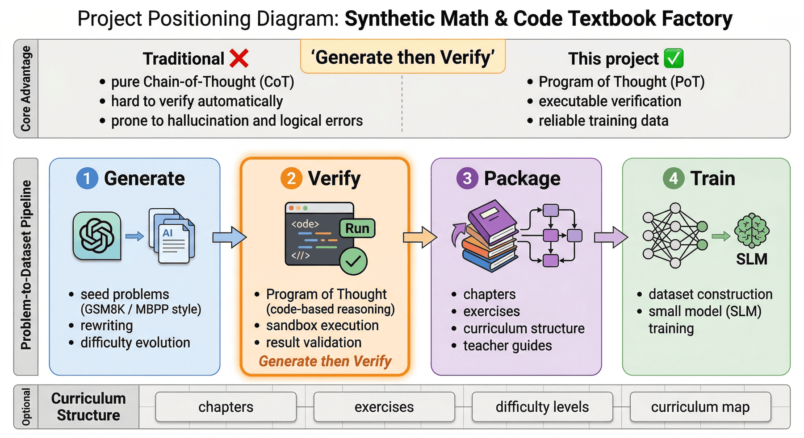


General-purpose large models can already answer many basic mathematical questions and write decent-looking Python code, but once we actually use their output as training data, we quickly encounter three problems.

First, apparent correctness does not mean verifiable correctness.
The model is very good at writing answers that "look like serious reasoning", but these reasoning texts are often mixed with implicit step skips, numerical substitution errors, inconsistent variable definitions, or the previous text says 12 but the next text continues counting as 15. Superficially, they look like correct solutions; for training systems, such examples will package erroneous logic into high-quality explanations.

Second, **normal CoT is difficult to automatically verify**.
If a sample only has a natural language thinking process, it is difficult for us to programmatically judge whether it is correct or not. Unless manual review is introduced, quality will quickly get out of control in mass production. In contrast, if the model is asked to output executable code, we can judge whether the key steps are true by running the results.

Third, **training requires structured course assets, not scattered samples**.
For small models (SLM), if the training material is just a bunch of unrelated questions, the effect is usually unstable. A more reasonable way is to organize them into textbook volumes, chapter exercises, course maps and teacher guides, so that the data itself has a "teaching sequence" and "difficulty gradient."

Therefore, the goal of P04 is not to simply "synthesize hundreds of math questions", but to build a textbook data factory with execution verification:

> Starting from GSM8K and MBPP style seed questions, math questions and coding questions are rewritten into more complete curriculum samples, and through program execution and inspection scripts, trainable teaching material assets are stably precipitated.

Methodologically speaking, the importance of this pipeline even exceeds the specific topic itself. Because in the future, when the team wants to expand to physics, statistics, financial modeling, algorithm questions or STEM multi-disciplinary textbooks, what is truly reusable is not a certain prompt, but this set of engineering methods of "seed sampling-evolutionary generation-program verification-textbook packaging-training packaging".

---

## 2. Project goals and boundaries

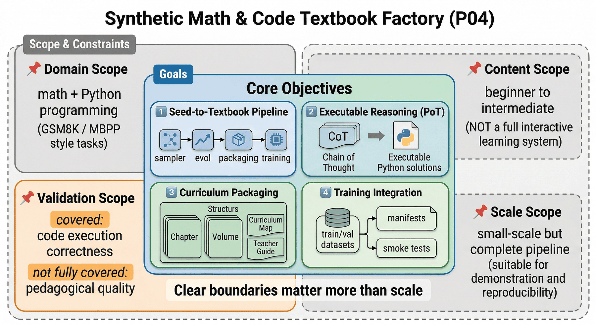


### 2.1 Project goals

This project focuses on the following four goals.

**Goal 1: Establish a transformation link from topic seeds to textbook chapters. **
The project starts from mathematics and coding seed questions. It does not directly generate a single SFT sample. Instead, it first forms a chapter draft and teaching material structure, and then produces a final record that can be used for training. Its core process includes modules such as `src/sampler.py`, `src/evol.py`, `src/sandbox.py`, `src/package_textbook.py` and `src/prepare_training_data.py`.

**Goal 2: Convert the "reasoning process" from unverifiable text to executable programs. **
The project emphasizes the PoT (Program of Thought) format and is not satisfied with "the model looks fully explained". Instead, it requires the model to provide Python solutions to key question types and execute them in a sandbox to reduce the illusion of chain of thought.

**Goal 3: Turn chapter assets into curricular deliverables. **
The final delivery is not an isolated JSONL, but a complete set of products such as textbook volumes, course maps, teacher guides, and training manifests. The project eventually resulted in two textbook volumes, supporting the curriculum volume and teacher guide.

**Goal 4: Form data assets that can be directly consumed by the training side. **
The project outputs training interface layer files such as `train.jsonl`, `val.jsonl`, `smoke_test.jsonl` and `training_manifest.json`, so that the teaching material data can not only be "displayed", but also "entered into training".

### 2.2 Project Boundaries

To keep this chapter reproducible, P04 also clearly sets boundaries.

#### 1) Subject boundaries

The current project only covers two directions: **Mathematics** and **Python code problem solving**. The seed source is concentrated on GSM8K and MBPP style tasks, which means that it is more suitable as a prototype of a reasoning teaching material factory rather than a full-subject education platform.

#### 2) Content boundaries

The current content coverage is mainly from **introduction to advanced** stages, emphasizing concepts, examples, exercises and verification clips, rather than complete video courses, interactive exercise systems or multi-modal teaching platforms.

#### 3) Verify boundaries

The current focus of verification is still **code execution correctness** and partial checking of script consistency. It has been able to filter out grammatical errors, variable illusions and obvious logical problems very well, but it has not yet fully expanded to higher-order teaching quality dimensions such as "whether the teaching explanation is the best", "whether the chapter ordering is optimal" and "whether the student's cognitive load is appropriate".

#### 4)Scale boundary

The project is small in scale but the process is complete. Its value does not lie in the large sample size, but in running through the engineering chain from generation to delivery. Therefore, it is more suitable as a practical case and a small-scale verification solution.

### 2.3 The role of boundary setting

Because the textbook factory can easily be described as an all-purpose system that "can generate questions, write code, and automatically publish books." But a truly credible and reusable engineering case should explain:

* In what disciplines is the job stable?
* Which verifications have been done and which ones have not yet been covered;
* Is it currently suitable for method demonstration or already suitable for production deployment?
* Can the data assets go directly into training or are they only suitable for display?

Writing these boundaries clearly is more valuable than exaggerating the scale.

---

## 3. Project positioning: P04’s capability chain position

If the overall large model data engineering is regarded as a capability chain, P04 solves a very critical part of it:

> **How ​​to upgrade "reasoning ability training" from ordinary text synthesis to "executable, verifiable, and curricular" data production capabilities. **

Previous chapters may have discussed methods such as pre-training cleaning, industry SFT, preference data, and QA systems; but this chapter emphasizes another type of data asset that is often underestimated: **textbook-style inference data**.

This type of data is different from ordinary question and answer data because it undertakes three tasks at the same time:

* It provides questions and answers to the model;
* It should expose an imitable solution process to the model;
* It also needs to reflect the knowledge organization structure and difficulty sequence at the sample level.

In other words, the most important thing about this chapter is not to explain "how to generate more math questions", but to show:

* Why mathematical reasoning training requires programmed verification;
* Why do textbooks need volumes and course maps instead of scattered questions and answers;
* Why should quality control be carried out before data production, rather than remediation after training?
* How to truly design generation, verification, teaching material packaging and training packaging into a continuous production capability.

In this sense, P04 is not just a "small inference data project", but more like a minimum reproducible prototype of an educational content factory.

---

## 4. Overall architecture: reasoning data pipeline from seed questions to textbook volumes

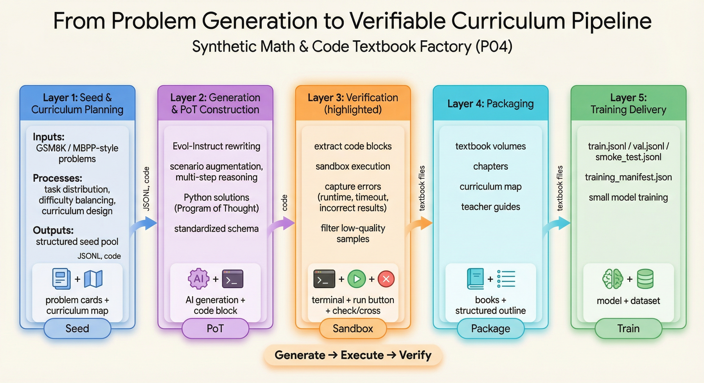


From an engineering perspective, P04 can be broken down into three layers.

### 4.1 The first layer: seed and chapter planning layer

This layer addresses “what do we want to teach?” Core actions include:

* Extract seeds from GSM8K and MBPP style questions;
* Form question type distribution and difficulty distribution;
* Map discrete problems to chapter plans and course maps;
* Keep the source of the question for easy follow-up.

This layer is not a simple random sampling, but preparation for the subsequent organization of teaching materials. Because if the upstream seed distribution is unbalanced, no matter how it is packaged later, the entire textbook will be biased.

### 4.2 Second layer: Evolutionary generation and PoT construction layer

What this layer solves is "how to turn the questions into teaching materials with more training value." Mainly include:

* Rewrite the original question in an Evol-Instruct style;
* Introduce scenarioization, constraints and multi-step reasoning;
* Let the model output Python code instead of just giving the natural language thought process;
* Organize the solution results into a unified schema.

This layer determines whether the data ultimately learns the "topic pattern of the question" or the "programmed reasoning ability."

### 4.3 The third layer: verification, packaging and delivery layer

What this layer solves is "whether these contents can be safely entered into training." Mainly include:

* Extract code chunks from model output;
* Use sandbox execution and capture errors, timeouts and return values;
* Clean low-quality samples and document reasons for failure;
* Packaged into textbook volumes, curriculum maps, teacher guides and training documents;
* Verify product consistency by checking scripts.

At this point, the project has truly upgraded from an engineering system that can generate questions to an engineering system that can produce teaching material assets. The current project has passed a total of 10 inspections, including 2 at the command level and 8 at the data/product level. The overall status is `PASS`.

---

## 5. Pre-engineering: key aspects of the teaching material factory

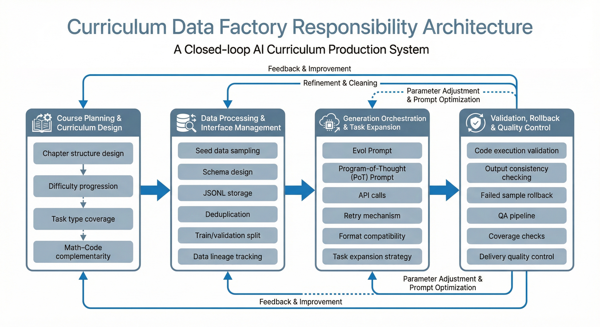


If the textbook factory wants to operate stably, it is more important not to emphasize single-point generation actions, but to first clearly define which responsibilities must be covered. At least the following four types of responsibility areas need to exist explicitly.

### 5.1 Course planning and chapter design

This layer is responsible for defining the textbook volume, chapter sequence, question type coverage and difficulty gradient. What it needs to answer is:

* What questions are suitable as a foundation;
* What questions better reflect advanced reasoning;
* How math and code content complement rather than duplicate.

### 5.2 Data processing and interface maintenance

This layer is responsible for seed sampling, schema design, JSONL placement, deduplication and training segmentation. It focuses on:

* where each sample comes from;
* Whether the fields are unified;
* Whether the training/validation set is leaked;
* Are intermediate products traceable?

### 5.3 Generate orchestration and task expansion

This layer is responsible for Evol prompts, PoT prompts, API calls, failure retries, and format compatibility. It connects "topic seeds" and "textbook chapter drafts" and determines whether the project will eventually form a collection of scattered questions or a teaching material asset with course organization capabilities.

### 5.4 Verification, rollback and quality control

This layer is responsible for checking whether the code can run, whether the results are consistent, whether failed samples need to be reworked, and whether the script covers key deliverables. The reason why it is important is that it is not enough to "look right" in the textbook scenario. Program execution and quality regression must be included in the process.

### 5.5 The role of key responsibility areas

Where many teams get stuck is not that they don’t know how to use models, but that key control points have not been removed, which ultimately leads to:

* The generation logic is changing, but the course structure is not maintained;
* There are many samples, but there is no statistics on the reasons for failure;
* The book has been packaged, but the training set fields are not uniform;
* The metrics looked good, but no one knew which layer the problem was originating from.

Writing these responsibilities clearly is essentially explaining: **Textbook Data Factory is a production line with a closed loop of verification and delivery, not a generation script. **

---

## 6. Seed layer: the necessity of question seeds

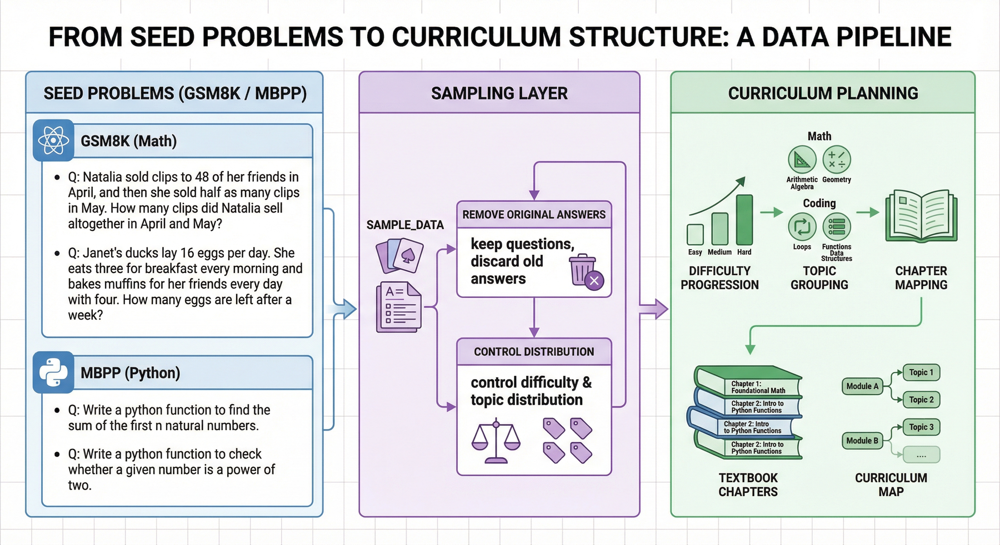


The most common misunderstanding of synthetic textbooks is to directly ask the large model to "please help me generate a mathematics textbook." Although this method is fast, it usually has three problems.

First, the distribution of questions is uncontrollable. The model will over-generate based on familiar patterns, resulting in a large number of questions that appear to be different but are actually the same.

Second, the difficulty gradient is unstable. Without seed anchors, it is difficult for the model to maintain the sequence of "from basics to advanced".

Third, the source is not traceable. Once you find that a certain type of question always goes wrong later, it is difficult to trace back which upstream model the problem comes from.

Therefore, this project starts from the seed question, first samples the data in `sample_data()`, and only retains the question itself as the starting point for subsequent evolution. The current process explicitly mentions sampling from the question pool and forming a chapter plan, and then generating a draft textbook chapter.

### 6.1 Why keep questions and discard old answers

In the current implementation, the project retains `seed_question` and keeps the original answer alone for reference, rather than directly using it as the final label. This is critical.

Because after being rewritten by Evol-Instruct, the background, constraints and even numerical relationships of the question may change. If you directly inherit the original answer, the old label will be mistakenly brought into the new question. The original chapter manuscript also clearly emphasizes:

> Evolved question values ​​may change and old answers no longer apply.

This shows that the project has distinguished "seed questions" and "final supervised truth values" from the very beginning, rather than simply treating rewritten questions as variations of the original question.

### 6.2 What should be controlled by the seed layer?

The seed layer of a textbook factory must control at least four things:

* **Field Coverage**: Both math and coding are required;
* **Difficulty Level**: It cannot be all basic questions or all difficult questions;
* **Topic Distribution**: To cover different topics such as arithmetic, function design, lists, string algorithms, etc.;
* **Evolvability**: The questions are suitable to be expanded into more complex situations.

Judging from the current results, the project has formed two teaching material lines, `math=30` and `code=18`, covering multiple topics.

---

## 7. Evol-Instruct: Question evolution mechanism

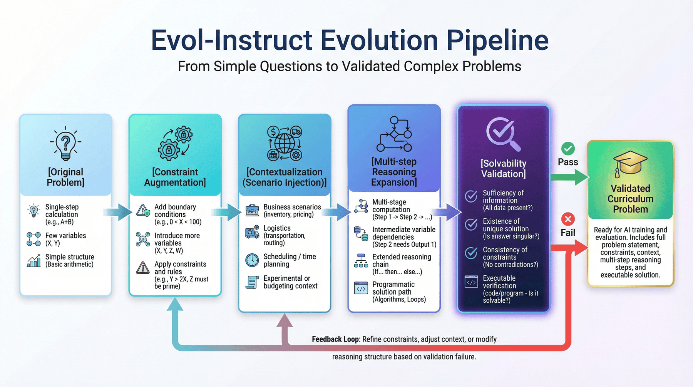


Simply rephrasing “how long does it take a train to travel 240 miles” into another statement does not increase the training value significantly. What the project really needs is to evolve the problem from a "single-step calculation" to a "multi-constraint, multi-variable, programmable solution" problem.

### 7.1 From simple questions to complex application questions

In the existing implementation, evolving prompt explicitly requires the model to do four things:

1. Add constraints;
2. Increase the depth of reasoning;
3. Perform scene-based rewriting;
4. Stay solvable.

These requirements may seem simple, but they are actually very consistent with the core goals of teaching material generation. Because truly high-quality practice is not to write the numbers bigger, but to make the relationship chain behind the question longer and more like real-world constraints.

### 7.2 Why “scenarioization” is important

In mathematics training, many original questions are very abstract, and it is easy for the model to remember the formal template without understanding the relationship. Putting the problem into a business, logistics, inventory, experiment, budget or itinerary scenario has two benefits:

* More variables and boundary conditions can be naturally introduced;
* Make the subsequent PoT more like "solving real problems" rather than "setting up formulas".

This is why in the example, the project changed the simple apple problem into a fruit store inventory and loss problem, and changed the speed and distance problem into a train stop planning problem. The current sample already reflects this rewriting direction.

### 7.3 Why does “increasing difficulty” also emphasize “maintaining solveability”?

Once many generation systems pursue difficulty, they will go to two extremes:

* The question is written in a convoluted way, but the information is actually insufficient;
* Add too many conditions to the problem, and eventually it becomes inconsistent or has no unique solution.

Textbook data cannot tolerate this kind of loss of control. Because the teaching content is different from open writing, it must be interpretable, verifiable, and reproducible. Precisely because of this, evolution is only the first half step, and the program must be followed to perform verification.

---

## 8. PoT Selection: Programmed Reasoning Path

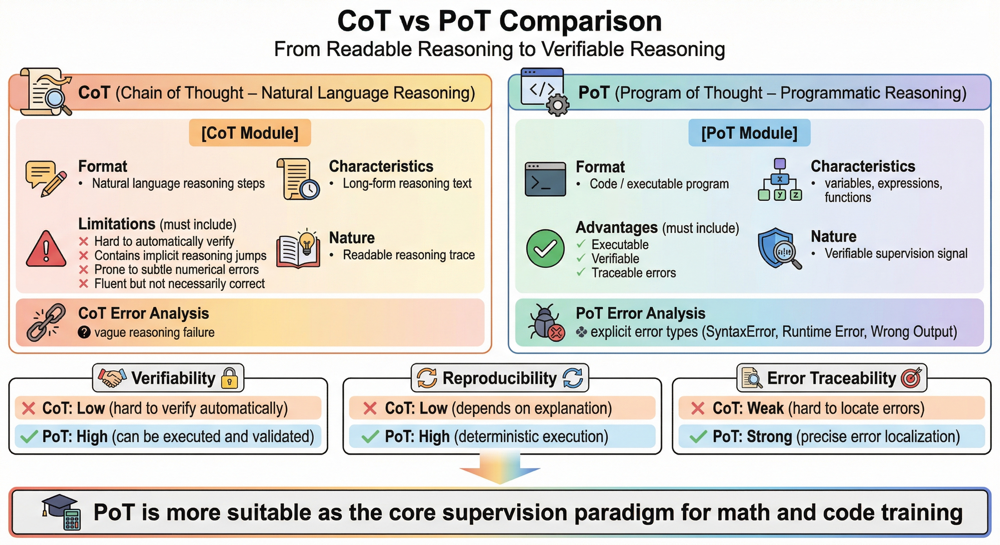


### 8.1 Value and limitations of CoT

CoT (Chain of Thought) is certainly valuable for inference training, as it allows the model to display intermediate ideas more explicitly. But the biggest problem with CoT is also very obvious:

* It’s long, but not necessarily true;
* It looks smooth, but it is not easy to automatically verify;
* It is easy to carry implicit step skipping and small numerical errors.

This means that pure CoT is more like a "readable inference trace" but not necessarily a "verifiable supervision signal".

### 8.2 Engineering advantages of PoT

PoT (Program of Thought) converts part of the reasoning into code, which brings three direct benefits:

**First, it is executable. **
The sample does not just write "calculate A first, then calculate B", but actually writes A, B, and C as variables and expressions.

**Second, it can be verified. **
If the code can run through, it means that at least the structure of the solution process is self-consistent; if the results are correct, it further enhances the credibility of the supervision.

**Third, traceable errors. **
If it fails, we can know whether it is `SyntaxError`, `Timeout`, the variable is undefined, or the execution result is wrong, instead of just knowing "this explanation doesn't feel right."

### 8.3 Why PoT is particularly suitable for mathematics/coding teaching materials

Because this type of textbook itself hopes that the model will learn:

* How to convert questions into variables;
* How to translate relationships into programs;
* How to go from program results back to natural language conclusions.

From a training perspective, this has more generalization value than simply memorizing the answer to a certain question. The project has made this a central link in the data factory, rather than a subsidiary function.

---

## 9. Generate links: from prompt to specific implementation of code solution

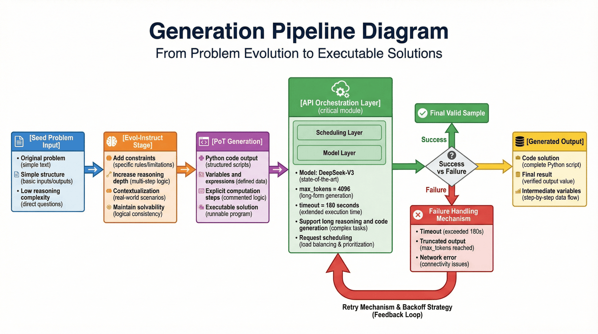


The generation link of this project can be understood as two steps.

### 9.1 Step One: Question Evolution

The system first transforms the seed questions into more complex questions. The existing prompt requires the model to act as a "math competition proposition expert" and add constraints, reasoning depth and realistic scenarios. The purpose of this step is to first make the question itself more valuable for training.

### 9.2 Step 2: PoT generation

After the question evolves, the system then asks the model to output a programmed solution. In other words, the model cannot just say "it should be calculated like this", but must actually give Python code.

The value of this step is to transform "seems to be able to do it" into "can really run". If the code cannot pass verification, no matter how beautiful the previous explanation is, it will not be able to enter the final data set.

### 9.3 Engineering details in API orchestration

The project currently uses DeepSeek-V3 as the generation engine. Since code generation and long inference output can significantly lengthen request times, `max_tokens` is increased to 4096 in `call_siliconflow` and the timeout is explicitly lengthened to 180 seconds. The reason for this choice is that its cost-effectiveness in code generation and mathematical reasoning is more suitable for the current process.

This type of setup may seem like a minor detail in small-scale operations, but is actually key to generating link stability. Because if the timeout policy is too short, the system will misjudge a large number of "long samples that are almost completed" as failures; if the token upper limit is too low, the code will easily be truncated in half.

### 9.4 Why retrying on failure is important

Build systems will inevitably experience network jitter, incomplete responses, or occasional API errors. The project adds multiple retries and back-off logic to the call layer, which can significantly improve the overall availability. This shows that the project has been upgraded from a "single test script" to an "engineering script that can run continuously in batches".

---

## 10. Sandbox verification: the core threshold of generation and verification

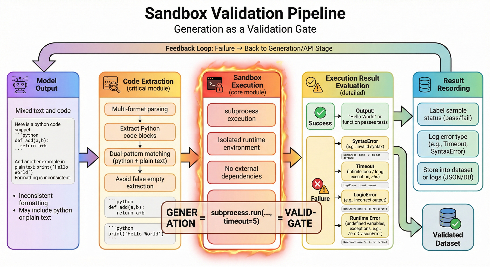


In P04, the sandbox is not an accessory component, but a life-and-death line that determines whether the data is trustworthy.

### 10.1 What happens if you don’t verify

If validation is not performed, model-generated code can easily appear:

* The code block is incomplete;
* Grammatical errors;
* Variable names are inconsistent;
* The logical structure is contradictory;
* The dependency does not exist;
* Brutal exhaustion causes runtimes to get out of hand.

These issues are not always immediately apparent when viewing to the naked eye. A lot of the code even looks very much like "excellent answers". For this reason, it is not practical to rely on manual visual inspection.

### 10.2 Why do code extraction first?

Model output is often irregular. Sometimes ```python 包裹，有时只是普通 ``` is used. If the extraction logic is not compatible, the system will misjudge a large number of otherwise usable codes as empty output. The original chapter has clearly given the two-level matching logic of `extract_python_code()`. This is a typical engineering detail: not gorgeous, but very critical.

### 10.3 Why execution timeout must be set

When executing model generation code, the biggest risk is not simply reporting an error, but getting stuck. For example, infinite loops, exponential enumeration, and out-of-control recursion will stop the entire pipeline. Therefore, the project uses `subprocess.run(..., timeout=5)` to control the execution time. If it cannot finish within 5 seconds, it will be terminated directly.

If this step is done correctly, the failed sample can be clearly attributed to:

* `SyntaxError`
* `Timeout`
* `LogicError`
* Variable is undefined or runtime exception

The current example shows that about 18% of failures mainly come from syntax errors, timeouts, and logical illusions. Although this number comes from a small-scale running test, it is enough to show that the verification link cannot be omitted. More importantly, the project finally passed 10 checks and received `PASS`, indicating that there is currently consistency between the verification and product layers.

### 10.4 Why does this step determine the dividing line between “teaching materials” and “illusion texts”?

What’s most scary about textbook data is that the content looks like teacher’s handouts, but in fact the answers are untenable. Sandbox execution allows the project to eliminate a batch of untrustworthy content before the sample enters the textbook volume.

> Teaching materials without verification are more like beautifully packaged texts; teaching materials with verification are closer to trainable assets.

---

## 11. Teaching material packaging: curriculum asset organization

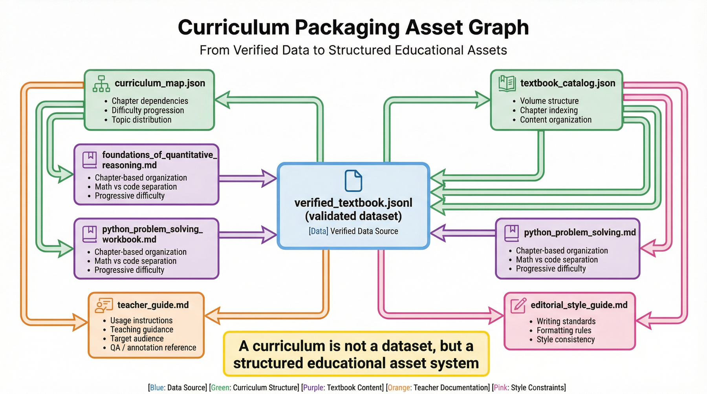


Even if you already have `verified_textbook.jsonl`, the project shouldn't stop here. Because both training and teaching require a richer organizational layer.

### 11.1 Textbooks are not a collection of samples

If you throw all the verified questions directly into the training set, you can certainly train, but this is not equivalent to a teaching material. The textbook also needs to answer these questions:

* Which questions should be learned first and which questions should be learned later;
* How math and coding content is divided into papers;
* How the difficulty progresses;
* Which questions are suitable for smoke tests;
* How a teacher or reviewer can quickly understand the entire set of material.

### 11.2 What teaching material deliverables are already included in the current project?

In addition to outputting verified chapter data, the current project also includes:

* `curriculum_map.json`
* `textbook_catalog.json`
* `editorial_style_guide.md`
* Two textbook volumes: `foundations_of_quantitative_reasoning.md` and `python_problem_solving_workbook.md`
* `teacher_guide.md`

This shows that the project has been upgraded from a "single data file" to a "collection of course assets".

### 11.3 Why course maps are important

The existence of course maps makes training data no longer just flat records, but has chapter dependencies, topic distribution and difficulty gradients. This has at least three subsequent values:

* Help reviewers quickly understand coverage;
* Help with data sampling and stratified segmentation before training;
* Helps maintain a consistent structure when adding new volumes in the future.

### 11.4 Why teacher guides are not just the “icing on the cake”

Many engineering projects feel like teaching packaging when talking about teacher guides. But in a textbook-based data factory, the teacher's guide actually has a strong engineering significance: it is an explanation layer for review, annotation, manual QA, and training operations personnel. It can explain what each volume teaches, how to use it, and what learning stages it covers. It can also be used as a communication interface for version updates.

---

## 12. Training encapsulation: textbook data enters the training system

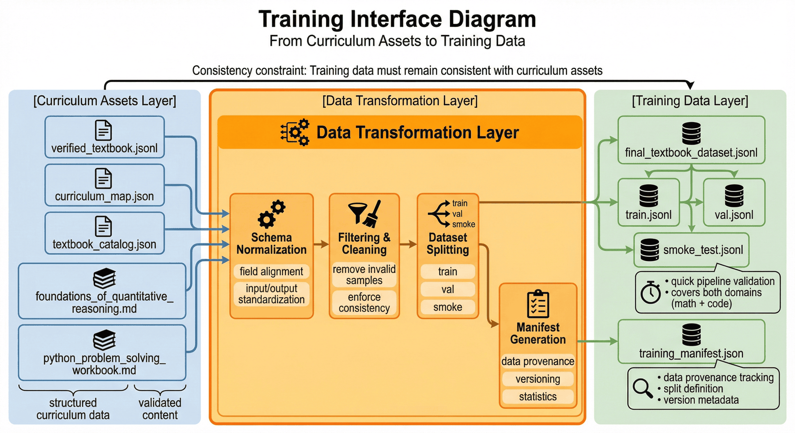


One of the ultimate goals of the project is to convert teaching material assets into a data format that can be directly consumed by the training side.

### 12.1 What is needed on the training side

The training system does not care which question this data comes from the earliest, it cares more about:

* Whether the sample schema is uniform;
* Whether train / val / smoke is segmented well;
* Whether necessary meta-information is recorded in the manifest;
* Whether the training data is consistent with the teaching material product.

### 12.2 Training assets for the current project

Complete deliverables for the current training side include:

* `final_textbook_dataset.jsonl`
* `train.jsonl`
* `val.jsonl`
* `smoke_test.jsonl`
* `training_manifest.json`

This means that the project does not separate "making teaching materials" and "entering into training", but connects the two.

### 12.3 Why smoke test must be in a single column

In training projects, the value of smoke test does not lie in evaluating the final effect, but in quick inspection:

* Is the basic schema correct?
* Whether the training script can read the data;
* Whether both subject areas are covered;
* Whether a certain version change destroys the basic sample quality.

The current inspection item also clearly mentions `smoke_covers_both_domains`, which shows that the project has regarded the smoke collection as part of the engineering inspection, rather than an optional accessory file.

---

## 13. Indicators and Results: Structural Signals of Current Projects

For textbook factories, the most misunderstood indicators are "how many chapters have been produced" and "how many pages of text have been produced." The numbers certainly have show value, but what's really more important is the **verified structural quality**.

### 13.1 Current key indicators

Current key results include:

* Number of seeds `48`
* Synthesis Chapter `48`
* Verification passed chapter `48`
* Pass rate `100.00%`
* Distribution of disciplines `math=30`, `code=18`
* Total token estimate `11039`
* Final textbook volume `2`

Together, these indicators indicate that the project already has a small but complete closed loop of teaching material data.

### 13.2 Why “100% pass rate” should be interpreted with caution

100% looks very nice, but also see: this relies heavily on the current scope being small and the template constraints being strong.

In other words, this indicator does not express "such problems have been completely solved", but:

* At current scale, verify that the link is stable;
* There is consistency between chapters, training documents and reports;
* The prototype of the factory has been completed.

This is a matter of engineering plausibility, not a general conclusion that can be extrapolated indefinitely.

### 13.3 What does topic distribution say?

The project covers a variety of topics such as arithmetic word problems, function design, lists and iteration, and string algorithms, which shows that the content of the textbook is not a rewrite of a single question type, but spans different structures of mathematics and programming.

### 13.4 What does the difficulty distribution say?

The current results show that `advanced=35` is obviously the most, indicating that the current factory prefers medium to high difficulty practice materials.

This brings two inspirations:

* On the one hand, it is suitable for demonstrating the value of "reasoning enhancement";
* On the other hand, it also means that if it is to target a wider range of learners in the future, basic and transitional questions will need to be supplemented.

---

## 14. Engineering effect: core issues solved by P04

If summarized in one sentence, what P04 actually solves is:

> ** Transform high-risk "inferential synthetic data" from unreliable text into structured teaching material assets supported by execution verification. **

Specifically, it solves at least four categories of engineering problems.

### 14.1 Solved the problem of "insufficient credibility of the thinking chain"

Through PoT and execution verification, the project no longer relies entirely on model natural language interpretation, but converts the intermediate process into programs and output results, thereby significantly improving the verifiability of supervision signals.

### 14.2 Solved the problem of “difficult organization of teaching materials”

Through curriculum maps, volumes and teachers' guides, the project makes teaching materials no longer just a collection of topics, but a deliverable with sequence, structure and thematic distribution.

### 14.3 Solved the problem of "training access fault"

The project not only produces intermediate products, but also outputs train / val / smoke / manifest, so that the training side can be directly connected.

### 14.4 Solved the problem of "Project Acceptability"

Currently, a total of 10 inspections have passed, which means that a strong consistent evidence chain can be formed between the project code, products and reports.

---

## 15. Cost and optimization: bottlenecks before scale expansion


### 15.1 Current cost characteristics

Current running results show that it takes about 30–60 seconds to generate a complex sample (Evol + Code), the API cost is low, and the cost of 1000 pieces of high-quality verification data is less than $1. This shows that in the current scope, the production cost is not the main bottleneck.

### 15.2 Where is the real bottleneck?

Real bottlenecks usually come from three places:

* Generation takes a long time and throughput is insufficient;
* Verification serialization is performed, and the overall batch running speed is slow;
* Rework and retries of failed samples will lengthen the total link.

### 15.3 How it can be expanded

Combined with the current implementation, future expansion can be prioritized in the following directions:

1. **Concurrent generation**: Change single-threaded loop to thread pool, asynchronous request or task queue;
2. **Task Distribution**: Use `Celery + RabbitMQ` or a lighter worker to distribute generation tasks;
3. **Verification Parallel**: Decouple sandbox execution and generation to create a concurrent verification queue;
4. **Fine-grained inspection**: Extended from "can the code run" to "whether the explanation is clear" and "whether the difficulty matches" and other multi-dimensional quality controls;
5. **Course Asset Expansion**: Adding finer difficulty gradients, recommended course paths and more teacher-side materials.

### 15.4 Why the optimization focus here is not “making it cheaper”

Because the current API cost of the project is already very low. What’s more worth investing in is actually:

* throughput;
* safe isolation;
* More detailed quality control;
* Richer course structure.

In other words, the main challenge in the next phase of this project is engineering maturity, not pure token cost.

---

## 16. Key Deliverables: Current Product List


One of the most direct ways to judge whether P04 has formed a closed engineering loop is to look at the deliverable chain. The current project has formed a complete product chain, including:

* Seed and intermediate processing files: `seed_pool.jsonl`, `chapter_plan.json`, `synthetic_textbook_chapters.jsonl`
* Validation and quality documents: `verified_textbook.jsonl`, `verification_failures.jsonl`, `execution_results.jsonl`, `quality_audit.jsonl`
* Course organization files: `curriculum_map.json`, `textbook_catalog.json`, `editorial_style_guide.md`
* Textbook documents: two volumes and teacher’s guide
* Training files: `final_textbook_dataset.jsonl`, `train.jsonl`, `val.jsonl`, `smoke_test.jsonl`, `training_manifest.json`
* Report files: `p4_report.md`, `p4_metrics.json`, `p4_test_results.json`, `p4_test_report.md`

This set of deliverables illustrates that the project already has three capabilities:

* Ability to produce content;
* Ability to verify content;
* Ability to organize content into consumable assets for training and review.

---

## 17. Summary of this chapter: The value of P04 method

The value of P04 does not lie in how many "looking awesome" reasoning texts it generates, but in that it turns a type of high-risk, high-illusion data production tasks into a reproducible, verifiable, and deliverable engineering pipeline.

If you put it into a larger methodological framework, it answers at least three important questions:

First, why the inference data cannot just look at the surface quality of the text. **
A thought chain without verification can easily become just a more convincing illusion.

Second, why textbook data needs course structure. **
Training materials are not a pile of samples. Textbook volumes, course maps and teacher guides will directly affect how they are used later.

Third, why small-scale projects can also embody a complete engineering closed loop. **
Even though there are currently only 48 seeds, 48 ​​chapters and 2 volumes, as long as sampling, generation, verification, packaging, training and inspection are all connected, it has formed a complete engineering closed loop.

From the perspective of engineering methods, what is most worthy of reuse in this case is not a certain local generation technique, but the working method behind it:

> First turn the reasoning into a program, then turn the program into a verifiable teaching material asset, and finally connect the teaching material assets to the training system.

This is the most common but most critical step that many teams miss when doing "reasoning enhancement".

---

## Special topic: Acceptance standards for teaching material factories

As has been emphasized many times before, the real value of P04 is not in "generating many questions", but in "how to judge whether these questions can be included in the teaching materials, whether they can be included in training, and whether they can be stably reused after generation." Therefore, teaching material factories cannot only have implementation pass rates, but also need a set of more detailed acceptance criteria.

Without this set of yardsticks, teams are prone to two types of misjudgments. The first misjudgment is to regard "the code can run" as "the teaching materials are available". But the real situation is that even if the code runs through, there may still be problems such as unclear meaning of the questions, skipped explanations, misaligned difficulty, and repeated chapters. The second misjudgment is to mistake "the chapters are written like textbooks" for "available for training." But what the training side really cares about is schema consistency, segmentation strategy, field stability and distribution balance. The superposition of these two misjudgments will eventually leave the project in a state that looks complete but is actually difficult to reuse.

### 1. Sample layer acceptance: whether each record is worth retaining

Sample layer acceptance is the lowest layer and the layer most easily ignored. The question it wants to answer is not "whether this sample can be generated", but "whether this sample is worthy of inclusion in the final textbook collection."

A teaching material sample that can be retained usually must meet at least the following conditions at the same time:

* The question is complete, with no known conditions missing, and no key units, variable ranges, or input and output constraints hidden in fuzzy expressions;
* The solution should be consistent with the question. There should not be a situation where the question is calculating the total price but the code is calculating the average, or the question has been rewritten but the program still uses the old logic;
* The program output is consistent with the final answer and is re-verifiable under the current question type;
* Paraphrasing can aid learning, rather than just rewriting synonyms outside of code;
* The language style is consistent with the positioning of the volume. The same chapter will not look like classroom lectures, competition analysis, or API documentation.

For textbook-type data, the most common problem in sample-level acceptance is not "obviously wrong", but "partially looks right, but the whole is not suitable as a teaching material." For example, the code for a question is solved correctly, but the explanation assumes that the reader has already mastered the proportion conversion; this may not be a problem for advanced volumes, but it will cause a cognitive leap for basic volumes. Another example is a code question that gives a complete function implementation, but does not explain why this data structure was chosen. Such a sample is helpful for training "people who can write code", but it is very helpful for training "people who can teach people to write code".

Therefore, the sample layer acceptance of P04 is more suitable to be judged by the "three questions method":

* Whether this record can be verified by machine;
* Whether this record can be read by learners;
* Whether this record can be stably consumed by the training system.

Only if it answers "yes" at the same time can it truly be qualified to enter the final data set.

### 2. Volume-level acceptance: Does the entire textbook have a teaching structure?

The biggest difference between the textbook factory and the ordinary sample factory is that it cannot only look at the accuracy of a single item, but also whether the volume layer structure is established. The volume-level acceptance focuses on whether the entire textbook is a material that can be "learned along the way", rather than a bunch of questions that happen to be placed in the same file.

The volume layer usually needs to check the following aspects:

* Whether the topic coverage is balanced, and a large number of arithmetic rewrite questions cannot be repeated in a certain volume, but there is a lack of function design, string processing or debugging analysis;
* Is the difficulty gradient natural? It cannot start with four arithmetic operations in one step, then suddenly jump to multi-constraint optimization in the next section, and then return to basic questions in the next section;
* Whether the chapter dependencies are clear, and the skills used in the following chapters should at least have a foreshadowing or minimal introduction in the previous chapters;
* Whether the question types are complementary to each other, rather than rewriting the same template repeatedly;
* Consistency between volume titles, chapter names, exercise arrangements, and instructor's guides.

From a book perspective, volume-level acceptance is actually checking the “learning path.” Many model teams are accustomed to discussing issues in the language of data distribution, but the textbook team is more accustomed to discussing issues in the language of "reader experience." The value of P04's method lies in that it connects these two languages. The so-called topic coverage is essentially a distribution problem; the so-called difficulty gradient is essentially a course sequencing problem; the so-called chapter dependency is essentially a structured pre-knowledge problem. They can all be written as project check items, rather than just at the level of editing experience.

If you want to further automate acceptance in the future, you can consider adding the following structured signals to the volume layer:

* Topic tags and difficulty tags for each chapter;
* The proportion of repeated question types in adjacent chapters;
* The first appearance of the basic concept in the book;
* The proportion of math questions, coding questions and comprehensive questions in each paper;
* Alignment of coverage between the Teacher's Guide and the volume table of contents.

These signals may not necessarily directly determine the choice, but they can help the team upgrade from "feeling that it is OK or not" to "discussing whether it is OK or not with evidence."

### 3. Training layer acceptance: whether the teaching material assets can stably enter training

Just because the textbook volume is written does not mean that the training problem has been solved. Training layer acceptance focuses on a different set of questions: whether these textbook assets have sufficient engineering stability when entering the SFT or small model distillation process.

Common acceptance points for the training layer include:

* Whether the schema is unified, whether field naming, null value processing, and separation forms are stable;
* Whether the three sets of train, val, and smoke data have clear responsibilities, and there will be no leakage of the verification set or the smoke set degenerating into display samples;
* Whether both subject areas are segmented to avoid training that only covers mathematics or only code;
* Whether the training manifest records sufficient statistical information and version sources;
* Whether the explanations, codes, and answers in the training samples can be reliably parsed by the same template.

One point worth emphasizing at this level is that textbook data is often more complex than ordinary question and answer data. Because it also contains questions, explanations, procedures, answers, chapter labels, difficulty labels and textbook source information. As long as the template is slightly unstable, the training script can easily misread, miss, or incorrectly truncate a field. Therefore, the training layer acceptance is not a subsidiary action, but a key component of whether the teaching material factory completes the closed loop.

Furthermore, the acceptance of the training layer also determines whether the teaching material factory can truly form a "version upgrade capability." If a version of the volume is very good-looking, but does not have a stable manifest, clear segmentation, and does not retain the source of the version, then even if the effect is improved in the future, it will be difficult for the team to tell which batch of teaching materials, which type of questions, and which explanation style have brought benefits. For inferential data, this kind of unexplainable improvement is often more dangerous than no improvement for the time being.

---

## Special Topic: The Operation Mechanism of a Textbook Factory

When the textbook factory begins to produce continuously, the team will soon discover that what really widens the gap is not a certain prompt technique, but whether there is a stable operating mechanism. Without an operating mechanism, projects can usually only be "one-time sprints"; with an operating mechanism, it is possible to turn P04 into a continuous iteration capability.

### 1. Division of roles: who is responsible for which section

Teaching material factories involve at least five types of responsibilities, and these responsibilities cannot be mixed with the same person for a long time.

* Subject Planning Role: Responsible for determining volume positioning, topic coverage, chapter order and difficulty gradient;
* Generate engineering roles: responsible for sampling, prompt orchestration, model calling and failure retry;
* Verification engineering role: Responsible for code extraction, sandbox execution, exception capture and verification statistics;
* Editor and QA roles: Responsible for language style, teaching explanation, chapter organization and manual sampling;
* Training access role: Responsible for final data segmentation, manifest, smoke test and training script docking.

Many small teams will compress these tasks to two or three people at the beginning, which is no problem. But even in small teams, it’s best to maintain clear separation of responsibilities. Because once all problems fall into the big basket of "model output quality", it will be difficult for the team to distinguish: whether the current problem is a subject planning problem, a generation problem, a verification problem, or a training access problem.

### 2. Version Rhythm: Why textbooks also need a release cycle

The teaching material factory, like the ordinary data pipeline, also needs rhythm. A minimal executable cadence can typically be:

* Freeze the seed pool and chapter plans at the beginning of the week;
* Complete generation, verification and failure retries mid-week;
* In the second half of the week, manual sampling, volume packaging and training packaging were completed;
* Output indicator reports, problem lists and adjustment suggestions for the next cycle at the weekend.

Such a cadence may seem a bit "traditional publishing," but it's extremely valuable for engineering stability. Because textbook data does not simply pursue throughput, but also takes into account structure, quality and trainability. If there are no freezing points, the chapter plan will continue to change during the generation process; if there are no sampling points, problems will be brought all the way to the training side; if there is no unified reporting point, the team can only say "this version seems to be better" based on impressions.

More importantly, release cadence also helps the team build "version mind." What readers, training engineers, and reviewers see is no longer an intermediate state that changes at any time, but a batch of textbook versions with clear boundaries. In this way, whether it is regression issues, effect comparisons or new volumes, it will be much clearer in the future.

### 3. Failure rework: turning bad samples into improvement clues

P04 The last asset that should not be wasted in this type of project is failed samples. Because failure samples often best reveal the true shortcomings of the current factory.

Failure rework usually requires retaining at least three types of information:

* At which level the failure occurred, whether it was question evolution, PoT generation, code extraction, sandbox execution or packaging;
* What type of failure is it, whether it is a grammatical error, a logical error, a timeout, an inconsistent answer, or an unqualified chapter structure;
* Who should handle the failure, whether it is prompt iteration, template adjustment, chapter rearrangement, or manual editing remediation.

The significance of this is to turn "rework" from a one-time fix to an input for the next round of optimization. As failure samples accumulate, the team can easily see: which types of questions are always prone to timeout, which types of explanations are always too lengthy, which types of chapter connections are always blunt, and which types of code questions are most likely to have variable illusions during the PoT stage. This information can better support subsequent optimization than simple statistics of "pass rate 100%".

### 4. Manual spot inspection: why do we still need people?

Performing verification has significantly improved data confidence, but it still cannot replace manual inspection. The reason is very simple. The teaching materials are not just about "getting the right answers", but also "teaching them clearly".

Manual spot inspection is best suited to focus on the following issues:

* Explain whether it is friendly to the target difficulty;
* Whether the order of chapters is natural;
* Is there any problem with wordy language, erratic style or inconsistent terminology?
* Although the procedures for some questions are correct, whether the teaching value is too low;
* Whether the code example is written in a misleading way.

In the long run, the safest approach is not to conduct large-scale, full-scale human review, but to establish a small-scale, highly representative sampling inspection mechanism. For example, each version extracts several basic questions, advanced questions, math questions, coding questions and high failure risk question types. This allows you to control labor costs while continuously calibrating automated processes.

---

## Special topic: Expansion route from project prototype to subject platform

P04 One thing has been proven so far: mathematics and code textbooks can be stably produced through the link of "seed sampling-evolutionary generation-program verification-textbook packaging-training packaging". The next question is no longer “can it be done?” but “where can it be expanded and how can it be expanded?”

### 1. Expand from dual subjects to STEM combined teaching materials

The most natural direction of expansion is to expand the current dual lines of mathematics and coding into a wider range of STEM combined teaching materials. Such as physics, statistics, data analysis, algorithms and discrete mathematics. For these disciplines, the core methods of P04 still hold true because they all share a common feature: many key steps can be verified through procedures, formulas, or external tools.

However, subject expansion does not mean simply copying prompts. Different disciplines will bring about at least three types of changes:

* Verifier changes, for example, physics questions may rely more on unit analysis and numerical simulation, statistics questions may rely more on data sampling and distribution testing;
* Changes in curriculum structure, for example, programming textbooks place more emphasis on project-driven development, and mathematics textbooks place more emphasis on conceptual progression;
* Changes in expression style, for example, algorithm questions focus more on complexity analysis, and data analysis questions focus more on experimental explanations.

Therefore, the most important thing to reuse in the expansion route is the "factory skeleton", rather than a certain already adjusted generation template.

### 2. Expand from pure text teaching materials to multi-modal teaching materials

The deliverables of the current project are mainly text-based teaching materials and code-based teaching materials. But in real teaching scenarios, diagrams, flow charts, tables, schematics and visual examples are equally important. If you want to do multi-modal expansion in the future, you can consider introducing:

* Question pictures and problem-solving flow charts;
* Visualization of code execution results;
* Chapters on chart understanding and data analysis;
* Blackboard instructions or classroom explanation cards for teachers.

The difficulty in this step is not to generate the picture itself, but to ensure that the picture and text are consistent and the teaching function is clear. As long as images are reduced to decoration, they will increase delivery costs without improving training value. In turn, if the image asset is designed to be part of chapter understanding, it can become an important foundation for the next stage of multimodal instructional data.

### 3. Expanding from offline teaching material production to learning feedback backflow

There is another more promising direction of the textbook factory, which is to connect learning feedback back to the data factory. In other words, in the future, the factory will not just produce teaching materials in one direction, but the results of the use of readers or training systems will in turn guide the next round of teaching material upgrades.

Feedback that can be reflowed generally includes:

* Which questions have the highest error rate;
* Which chapters are frequently skipped;
* Which explanations are most likely to cause misunderstanding;
* Which question types are more beneficial to training;
* Which knowledge points have a high passing rate but poor transfer effect.

Once this feedback is incorporated into structured records, the teaching material factory will further upgrade from a "content production line" to an "instructional data flywheel." From a manuscript perspective, this significantly enhances the long-term methodological value of the project, as it demonstrates that the textbook is not a static artifact, but a system asset that can be continuously iterated around learning outcomes.

---

## Special topic: Checklist before publishing textbook version

After the textbook factory enters continuous iteration, it also needs a very pragmatic capability, which is the version release list. Because once textbook-type data serves the three roles of editor, training, and reviewer at the same time, it cannot be decided whether to publish it just based on "it looks similar". A stable release list can bring volume quality, training interface, and project consistency back to the same table.

### 1. Check the three types of consistency before publishing

The most basic pre-release check usually checks three types of consistency:

* Textbook consistency: Whether the volume table of contents, chapter content, course map and teacher's guide are aligned with each other;
* Data consistency: whether the final textbook data, train/val/smoke segmentation and manifest match each other;
* Report consistency: Whether the indicators, deliverable list and inspection results are consistent with the current version of the real product.

As long as one of these three types of consistency is not aligned, version releases can easily leave hidden dangers. For textbook factories, the most common problem is not "completely wrong" but "each document is correct, but they don't match each other." The purpose of publishing the list is to try to expose such problems in advance.

### 2. Re-check teaching availability and not just engineering availability

Another difference between the textbook version and the ordinary data version is that it must be additionally checked for teaching availability. In other words, even if the project side documents are complete, you still need to confirm:

* Whether the new chapters really complement the course structure rather than repeating old question types;
* Whether the difficulty distribution is suddenly unbalanced due to a version update;
* Whether the teaching materials styles of mathematics and coding are still unified;
* Whether the instructions in the Teacher's Guide are still appropriate for the current volume content.

This step looks more like editing work, but in fact it is directly related to whether the training side and review side can still stably understand the current version. If the teaching structure suddenly changes without simultaneous explanation, subsequent interpretation of the effect of the version will become very difficult.

### 3. Finally confirm whether the problematic ledger has been cleared or explicitly inherited.

Release does not require that the version be problem-free, but it does require that the problems are either resolved or explicitly inherited. A more mature teaching material release process will usually be retained in the release notes:

* Which high-frequency failure types are fixed in this version;
* Which issues still exist but are known not to block current use;
* Which chapters or question types are still in the observation period;
* What gaps will be filled first in the next version?

The value of doing this is to allow the textbook factory to gradually establish a "version memory." Once version memory begins to accumulate, the team no longer just produces content repeatedly, but continues to operate a set of interpretable, comparable, and repeatable teaching material asset systems.

---

## Special Topic: Editorial Review Mechanism in Textbook Factory

One of the biggest differences between textbook data and ordinary training data is that it is naturally oriented towards "reading experience". Therefore, even if a project like P04 has execution verification, it still needs a layer of editorial review mechanism. Its goal is not to overthrow automation, but to specifically address those teaching quality issues that are most difficult for automation to cover.

### 1. Editorial review focuses on “whether it is worth learning”

Engineering verification is better at answering "is it right?" and editorial review is better at answering "is it worth teaching this way?" For example, for the same question, both solutions are correct, but one solution is too jumpy, and the other solution is more suitable as a chapter demonstration; another example is that both questions can train loops, but one of them can better reflect the variable update logic, and the teaching value is higher.

This shows that editorial review is not a decorative layer in the textbook factory, but helps the team complete the final screening: which samples are suitable to be retained as the main text of the textbook, and which ones are more suitable to be retained in exercises, supplementary questions, or replay sets.

### 2. The review mechanism allows the teaching material style to be sustained and stable

As volumes increase, without editorial review, what is most likely to happen is not code errors, but style drift. One version may be more colloquial, while another suddenly turns into a competition analysis style; some chapters emphasize explaining step by step, while other chapters assume that readers already understand many prerequisite concepts. Once the style drifts, although the training assets are still usable, the overall feel of the teaching material assets will be significantly reduced.

The purpose of the review mechanism is to give the team the opportunity to continuously calibrate:

* Explain whether density is appropriate;
* Whether the terminology within the chapter is consistent;
* Does the post-question summary really play a teaching role?
* Whether the mathematics volume and the code volume still maintain the same editorial tone.

For a book, this stability is itself an important quality indicator.

