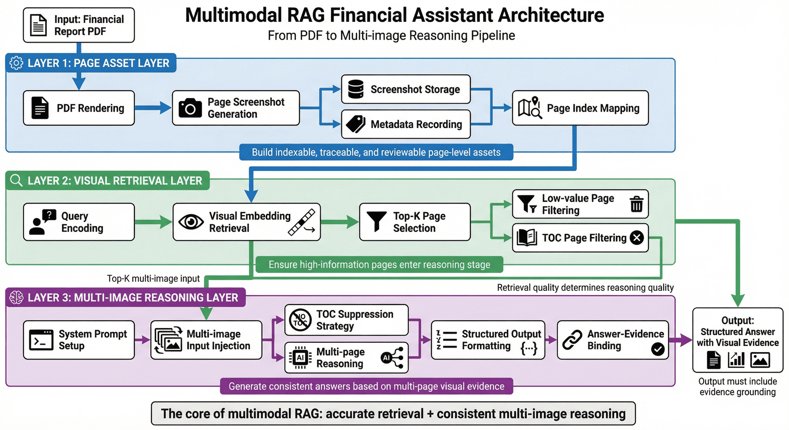
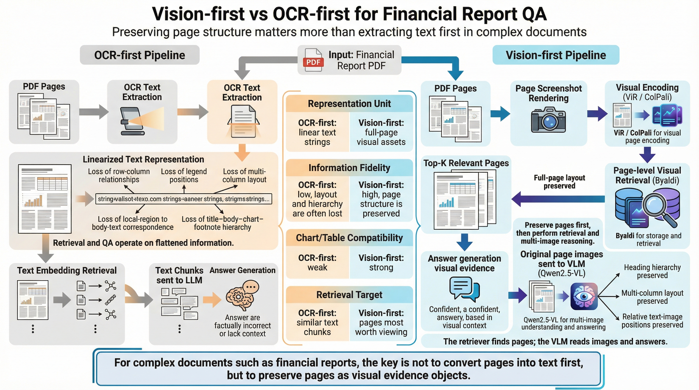
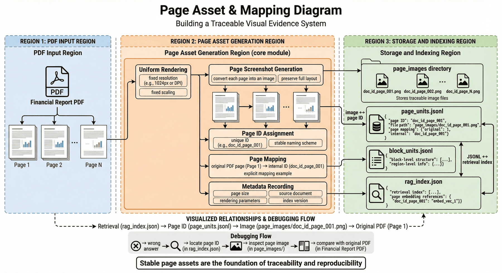
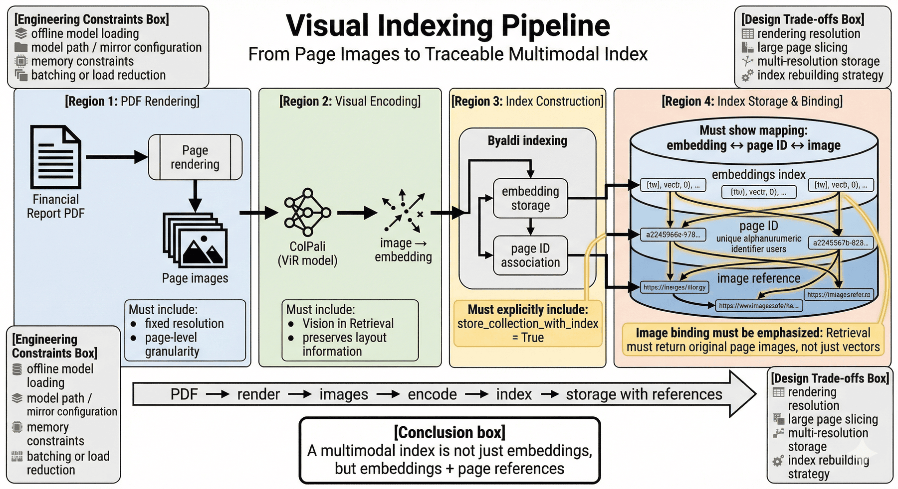
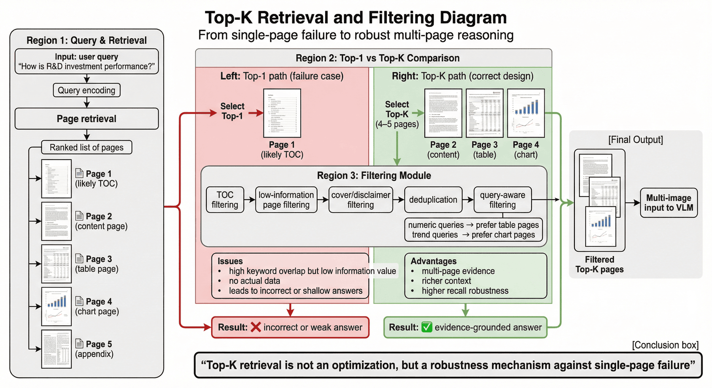
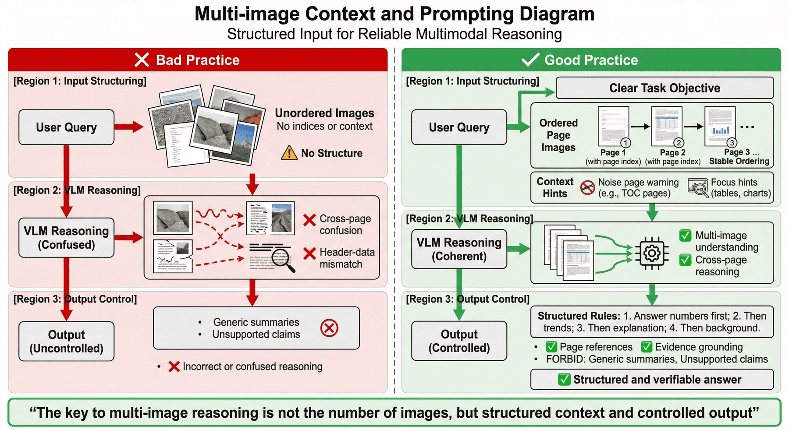
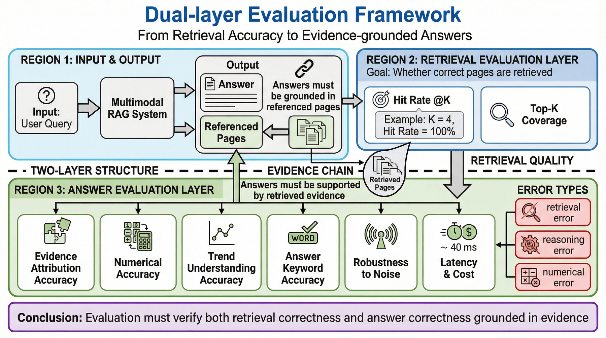
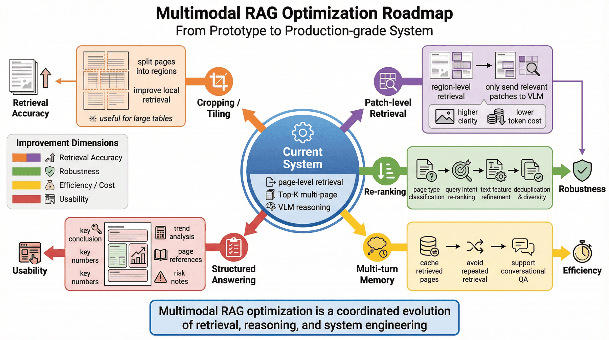
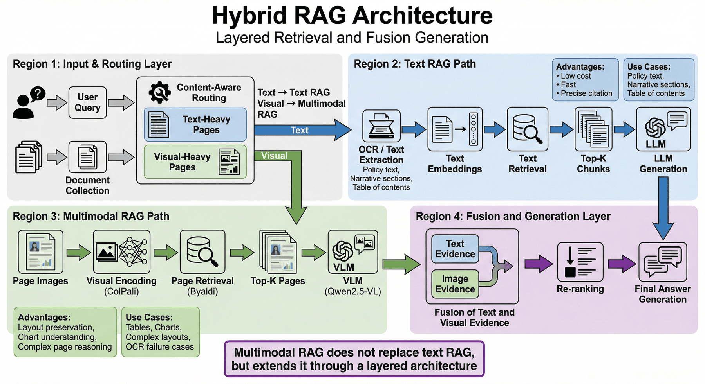

# Project 5: Multi-modal RAG corporate financial reporting assistant

## Overview of this chapter

P05 focuses on organizing complex PDF documents such as corporate financial reports and prospectuses into a searchable, interpretable, and evaluable multi-modal RAG pipeline. The focus of the chapter is not on a single question and answer, but on incorporating the visual structure of the page, chart information and text semantics into the retrieval and answer process.

This chapter can be understood according to four main lines:

* Page rendering and visual indexing: Incorporate complex PDF pages into page-level vector retrieval.
* Multi-page recall and evidence organization: handle chart pages, text pages, table of contents pages and cross-page relationships.
* Multi-modal answering and cost control: Complete multi-graph reasoning and answer generation under evidence constraints.
* Evaluation verification and reproduction boundaries: Determine the system status through result evaluation, inspection scripts and cost analysis.

If read in engineering order, this chapter corresponds to a complete link:

**Financial report PDF -> Page rendering -> Visual index -> Multi-page recall -> Evidence organization -> Multi-graph reasoning -> Effect evaluation -> Cost optimization**

The core goal of this structural correspondence is to expand complex document question and answer from OCR-driven text retrieval to an engineering system in which page vision and text semantics jointly participate.

---

## 1. Project background: The necessity of multi-modal RAG financial reporting assistant

General large models can already answer many financial knowledge questions, but once the question involves specific numerical values, chart trends, cross-page tables or page positioning in corporate financial reports, the model will immediately expose its limitations.

The most common problems fall into at least four categories.

The first category is **structural distortion**. For example, in a balance sheet, if the columns of "Ending Balance", "Beginning Balance", "Group" and "Company" are misaligned after OCR, even if the model recognizes all the numbers, it may get all the column relationships wrong. What this results in is not a "slight error" but a completely wrong financial interpretation.

The second category is **chart blindness**. Many financial reporting questions do not require reading verbatim, but require judging trends, such as "has the proportion of R&D investment increased or decreased in the past three years" and "at what stage does the inflection point of cash flow change occur?" If the system only processes text, it won't see graphic information at all.

The third category is **evidence fragmentation**. The main text, notes, chart descriptions, management discussion and analysis of corporate annual reports are often scattered on different pages. When a user asks "What are the operating results?" the answer may require a comprehensive revenue trend chart, R&D investment page, intangible assets notes, and chairman's speech. If a retrieval system only fetches one page at a time, or can only recall a single block of text, the answer will be severely one-sided.

The fourth category is **Noise False Recall**. The contents page of the financial report is particularly "dangerous" because it often summarizes most of the keywords in the book. It is very easy for traditional embedding retrieval to rank the table of contents pages at the front, causing the model to read a bunch of chapter titles but not the actual data pages.

Therefore, the goal of P05 is not to make a superficial demonstration that "can ask questions about PDF", but to build a multi-modal RAG prototype for complex document scenarios. It does not serve a single query, but a methodology:

> When the answer to the document exists in the layout, charts, tables and cross-page structure itself, the retrieval system cannot only retrieve the text, but must incorporate "visual" into the retrieval process.

---

## 2. Project goals and boundaries

### 2.1 Project Goals

This project focuses on the following four goals.

**Goal 1: Establish visual retrieval links for complex PDFs. **
That is, the financial report page is no longer forcibly compressed into plain text, but the page image is directly included in vector retrieval, so that the system can understand the layout, the presence or absence of charts, and the visual structure.

**Goal 2: Establish a question and answer mechanism for multi-page evidence combinations. **
Instead of having the model only look at a single page screenshot, it can perform joint inferences on the Top-K pages to answer cross-page, multi-evidence, mixed charts and text questions.

**Goal 3: Make the answer interpretable and positionable. **
The system output cannot just be a summary that "seems reasonable", but should be able to point to specific pages or evidence combinations to facilitate review and debugging.

**Goal 4: Form a reproducible, measurable, and optimizable engineering path. **
The project not only shows the implementation method, but also includes indicators, risks, failure modes and cost discussions, forming a more complete project case link.

### 2.2 Project Boundaries

In order to make the case reproducible, this project explicitly sets several boundaries.

#### 1) Document scope boundary

Currently, it mainly focuses on building indexes and Q&A on a single Chinese corporate financial report PDF. It is not a universal document platform, nor is it a unified solution that is equally effective for all office documents.

#### 2) Retrieve granularity boundaries

The current core granularity is **page-level visual retrieval**. This is great for processing charts and full-page tables, but for extremely long cross-page tables and particularly detailed small-area Q&A, further patch-level or region-level retrieval enhancements may still be needed.

#### 3) Generate capability boundaries

The current generation phase relies on large multi-modal models to interpret page screenshots, so the quality of answers will be affected by image clarity, page density, chart complexity, and the upper limit of the model's visual capabilities.

#### 4) Evaluation boundary

Current evaluation is more suitable as **method validation** rather than production-level acceptance. The existing problem size is still small enough to prove that the link is effective, but not enough to represent a large-scale real business environment.

### 2.3 The role of boundary description

What is most likely to be misjudged in engineering cases is not the method itself, but the scope of application of the method. An overwritten case may seem like "everything can be done", but when the team actually reuses it, they don't know where to start. On the contrary, writing the boundaries clearly can make it clear to readers:

* What types of documents are this solution suitable for?
* Which level is currently reached;
* Which parts have been stabilized;
* Which parts still need subsequent expansion.

This way of writing is more suitable for engineering reuse than simply pursuing "looking stronger".

---

## 3. Project positioning: P05’s capability chain position

If the overall large model application engineering is regarded as a capability chain, then P05 is at the core of the section **Complex document understanding and multi-modal retrieval enhancement**.

Topics such as plain text RAG, structured Q&A, SFT data factory, evaluation system and online acceptance may have been discussed in previous chapters. However, these methods will encounter a practical problem when it comes to financial report PDFs:

> When the answer is not just text, but part of a visual layout and diagrammatic structure, the assumptions of traditional text RAG no longer hold.

Therefore, the value of this chapter is not to repeat the introduction of "what is RAG", but to show:

* Why the PDF page itself should be entered into the search;
* Why visual retrieval and multi-modal generation need to be designed together;
* Why the failure points of complex documents occur more in retrieval and evidence organization rather than in the final generation of a sentence;
* How to precipitate a multi-modal prototype into a project case, instead of just "the model is very good at looking at the pictures".

In this sense, this chapter answers a larger question:

> How should RAG systems be upgraded when document knowledge is embedded in tables, charts, and page structures?

---

## 4. Overall architecture: from financial report PDF to multi-modal answer pipeline



From an engineering perspective, this project can be broken down into three floors.

### 4.1 The first layer: page asset layer

This layer solves "how to turn PDF into an evidence object suitable for visual retrieval". Mainly include:

* PDF page rendering
* Page screenshot persistence
* Page meta information record
* Page and original page number mapping

The goal of this step is not to answer the question, but to first convert the PDF into a page-level asset that is indexable, trackable, and reviewable.

### 4.2 The second layer: visual retrieval layer

What this layer solves is "how to find the most relevant page when faced with a problem." Mainly include:

* Query code
* Page visual vector recall
* Top-K multiple pages return
* Filter directory pages and low-value pages

This step determines whether the system can ultimately send pages with real data to the generation stage, and is the key threshold for multi-modal RAG.

### 4.3 The third layer: multi-graph reasoning layer

This layer solves the problem of "how to make the model conduct comprehensive analysis after getting multiple pages of screenshots instead of guessing picture by picture." Mainly include:

* System Prompt role setting
* Directory page suppression command
* Inject multiple pictures uniformly
* Output format constraints
* Answers are bound to evidence

At this point, the item changed from "can retrieve pictures" to "can answer stably based on visual evidence."

---

## 5. Data flow and core ideas: Vision-first retrieval chain

Many people will ask: Is it possible to solve the problem by OCR first and then text retrieval?

On a small, simple, well-formatted PDF, maybe. But in financial reporting scenarios, this road can easily encounter bottlenecks. The reason is that financial reports are not just "long content", but the structural expression of content is highly dependent on visual form.

### 5.1 Limitations of OCR-first

The biggest problem with OCR-first is not as simple as "the recognition rate is not high enough", but that it compresses the original three-dimensional page into a linear string. After compression, systems typically lose:

* Rank-and-row relationship
* Legend location
*Multi-column layout structure
* Correspondence between the local area on the page and the main text
* The visual hierarchy of "title-text-charts-notes" on the same page

Once these relationships are lost, subsequent embeddings, no matter how strong they are, will still work on the squashed information.

### 5.2 The value of Vision-first

The core idea of ​​Vision-first is: **Preserve the expressive ability of the page as a whole image first, and then let the retrieval model learn "which page looks like the page where the answer is located"**.

Doing so brings at least three benefits.

First, it preserves the layout. The model sees not just text, but also tables, graphics, heading hierarchies, and page structures.

Second, it fits naturally into charts. Even if there is not much text in the picture, as long as the visual features of the page are relevant enough, there is still a chance of being recalled.

Third, it is more consistent with the way complex documents are read. When real users ask questions about financial reports, they are essentially asking "Which pages are most worth reading" rather than "Which OCR string is the most similar".

### 5.3 Why does this project use ViR + VLM?

The core combination used in this project is **ViR (Vision in Retrieval) + VLM (Vision Language Model)**: ColPali is used for page visual coding, Byaldi is used for storage and recall, and the original image of the hit page is sent to Qwen2.5-VL for understanding and answering.

The key to this design is not the "model name itself", but the separation of responsibilities:

* The retrieval model is responsible for finding pages;
* The multi-modal generation model is responsible for image reading;
* Prompt is responsible for restricting answering behavior;
* Evaluation and logs are responsible for verifying whether the system really finds, reads and answers correctly.



---

## 6. Technology selection: ColPali, Byaldi and Qwen2.5-VL

If a project case only lists the tool names without explaining why they were selected, it is usually difficult for readers to actually reuse them. Therefore, the technology selection is explained clearly here.

### 6.1 ColPali’s position in document retrieval

The value of ColPali is that it does not treat pages as ordinary natural pictures, but prefers visual understanding of document scenes. This is very critical for content such as financial reports, tables, charts, and layout structures.

Compared to general-purpose image embedding, document retrieval models are more likely to capture:

* Table boundaries and column structure
* Distribution of title area and text area
* The difference between number-intensive pages and narrative pages
* The visual mode of the page where the chart is located

In other words, ColPali's advantage is not that "it must know all financial concepts", but that it is better at first judging "whether this page looks like the kind of document evidence page that the user is looking for."

### 6.2 Byaldi as an indexing framework

The significance of Byaldi is that it encapsulates the most troublesome part of multi-modal retrieval:

*Model loading
* PDF transfer
* Vector index construction
* Query search
* Original image associated storage

This allows projects to focus on search strategies, evidence organization, and answer quality rather than spending a lot of time on low-level tensor access.

### 6.3 Visual model in the generation stage

The generation phase of multi-modal RAG is not simply "send the picture in and let it be described", but requires the model to:

* Identify trends in charts;
* Read key values in high-density financial tables;
* Combine the content of multiple pages to make a summary;
* Try to ignore interference when noisy pages are present.

This requires that the model can not only see pictures, but also **document pictures**. Qwen2.5-VL-72B is chosen as the main visual generation model here because of its suitability for document parsing and diagram understanding tasks.

### 6.4 Engineering implications of selection

The real idea behind this set of technology stacks is:

* ColPali solves "which page to find";
* Byaldi solves "how to quickly implement page search";
* Qwen2.5-VL solves "how to really read the page after finding it".

This is more engineering controllable than "a universal model that does everything directly".

---

## 7. Page asset construction: stable page evidence base

In complex document projects, an issue that is often overlooked is: **Whether the page assets are stable and traceable**.

If the PDF is rendered temporarily for each query, on the one hand it will slow down the response, and on the other hand it will make debugging very troublesome. Because once the rendering parameters, scaling ratio, and cropping logic of a certain page change, the system behavior may be inconsistent.

### 7.1 What problems should the page asset layer solve?

The page asset layer must complete at least the following tasks:

* Unify page rendering resolution;
* Generate stable file names or IDs for each page;
* Save page number mapping;
* Record page size, source file, index version;
* Ensure that subsequent search results can point back to the same original image.

### 7.2 Why “replayability” is important

In multimodal RAG, if the system answers incorrectly, the troubleshooting path is usually not "Why did the model suddenly make nonsense", but:

1. Check whether the error page is recalled;
2. Is the picture blurred or cropped incorrectly?
3. Is the multi-image context disturbed by noise pages?
4. Does Prompt induce model over-summarization?

If the page assets are not properly saved, it will be difficult to locate the problem.

### 7.3 Correspondence with existing products of the project

The current project generates page-level assets and index-related artifacts such as `page_units.jsonl`, `block_units.jsonl`, `rag_index.json`, and `data/page_images`. This shows that it is not just a temporary demonstration, but already has a certain awareness of asset accumulation.



---

## 8. Index construction: How multi-modal indexes are organized

The implementation of the indexing phase consists of three key links: loading ColPali locally, reading PDF through Byaldi, completing visual encoding, and storing the original image reference together with the index.

This set of implementations corresponds to several key engineering judgments.

### 8.1 Local model loading and offline mode

The implementation has set up offline mode and mirror source, which shows that the project clearly considers the network environment and model reuse costs. This is also a project detail worth retaining, because many cases only write about "loading the model", but do not write about what to do if the download fails, is repeated, or the path is mismatched.

### 8.2 The original image must be tied to the index

`store_collection_with_index=True` This is crucial. Because the generation phase of multi-modal RAG does not take strings from the text library, but re-feeds the hit original image or page screenshot to VLM. Without this association, retrieval and generation are disconnected.

### 8.3 The real difficulty in the indexing phase

The real difficulty with indexing is usually not in “whether the API can be adjusted”, but in the following practical issues:

* What is the appropriate page rendering resolution;
* Whether it is necessary to slice extremely large table pages;
* Whether to retain dual versions of thumbnails and high-definition images;
* How to rebuild the index after the document is updated;
* How to download when the video memory is not enough.

### 8.4 Why index construction directly affects the upper limit of capabilities

Because in complex document projects, indexing is not a preparatory action, but part of the upper limit of capabilities. The indexing stage is rough, and no matter how powerful the subsequent generative model is, it can only "guess" based on fuzzy evidence.



---

## 9. Search design: Top-K multi-page recall

In financial report Q&A, a very typical pitfall is: **The question asked by the user is across two pages, but the system only wants to return one page**.

For example, "What are the operating results?" "How is the performance of R&D investment?" "What does the change in intangible assets indicate?" These questions often require multiple pages of content in real financial reports. Only returning Top-1 usually relies too much on single page information, or even directly hits the directory page.

### 9.1 Why does the directory page become a high-frequency false recall?

The contents page contains a large number of chapter titles, which naturally cover many high-frequency keywords, such as:

* Operating results
* Financial overview
* R&D investment
*Risk warning
* Balance sheet

For text-only embeddings, these types of pages are very "answer-like". But for users, the content page is often the most useless page, because it only tells you "in which chapter the answer may be" but does not give any actual data.

### 9.2 Value of Top-K

In the retrieval stage, you should not only select Top-1, but should select Top-K (recommended 4 to 5 pages) and filter the directory page.

The value of Top-K lies in:

* Increase the probability of hitting the real evidence page;
* Allow one question to be answered by multiple pages;
* Reduce the risk of complete failure caused by false recall of a single page;
* Provide a more complete context for subsequent multi-graph reasoning.

### 9.3 Why “multi-page recall” itself is a robust design

Many demos will take "retrieve the correct page" as the default premise. But what the real system needs to consider is:

> When the first place is unreliable, can the system use multiple pages of evidence to find out?

From this perspective, multi-page recall is not a nice-to-have, but a necessary robustness mechanism.

### 9.4 Further filtering logic that can be done

In addition to directory page filtering, you can also consider:

* Low information density page filtering
* Pure copyright statement or cover page filtering
* Remove duplicate pages
*Filtering page types that do not match the query type

For example, numerical problems can give priority to retaining table pages, and trend problems can give priority to chart pages.



---

## 10. Prompt word design: anti-interference constraints in the generation stage

In text RAG, Prompt is important; in multimodal RAG, Prompt is more important. Because the system gives the model not a few clear paragraphs of text, but multiple page screenshots that may be mixed with noise.

### 10.1 Key word prompt ideas in the generation phase

A key practice in the generation phase is to explicitly tell the model in the System Prompt that "it may contain a table of contents page, please ignore the table of contents and answer the question directly based on the page containing specific data."

Although this sentence seems simple, it is essentially doing **anti-noise constraints**.

### 10.2 Why multi-modal scenes are more likely to be disturbed by noise

Because the model sees images, not pre-arranged "correct evidence paragraphs." The image may contain both:

* Directory title
* Header and footer
* Decorative pictures
* Irrelevant appendix
* A small block of key figures in the text

Without explicit prompts, it’s easy for models to over-rely on what “looks like summaries” and ignore the really critical areas of data.

### 10.3 A more stable prompt word skeleton

Prompts for multi-modal financial report Q&A should often contain at least:

* Role: Professional financial/investment research/audit assistant;
* Task: Answer specific questions based on the provided page;
* Anti-interference: ignore the table of contents, cover page, and no data page;
* Evidence preference: give priority to tables, charts and clear numerical values;
* Uncertainty: If the evidence is insufficient, explain insufficient;
* Output format: organized by conclusion, evidence, page number, and trend interpretation.

### 10.4 Why Prompt also belongs to "post-retrieval processing"

Because one of the functions of Prompt is to help the model perform secondary screening in the recall page collection. In other words, Prompt is not only a generation control, but also a part of evidence cleaning.

---

## 11. Multi-graph context organization: multi-graph evidence arrangement

Sending multiple pages of pictures into the model does not mean that the model will be able to organize them well. In fact, one of the most common problems in multi-graph reasoning is: **There are too many pictures, but the context structure is messed up**.

### 11.1 Basic principles of multi-graph injection

* The question text should be given first to clarify the goal of this task;
* The order of pictures should be as stable as possible;
* If there are page numbers, it is best to let the model know which page each picture corresponds to;
* If a page may be a noisy page, the model should be reminded in the text to handle it with caution;
* It is best to require page numbers or source pages to be cited in the output.

### 11.2 Why order is important

If the order of the pictures is random, the model may mix the table header of the next page with the data of the previous page, which is especially likely to cause problems in cross-page table scenarios.

### 11.3 Why should we limit the output style?

Financial reporting questions can easily lead to "grand summary" answers. The model will say many correct but general financial clichés, such as "the company continues to innovate, operates steadily, and has long-term growth." These words are not completely wrong, but if the user asks "What is the proportion of R&D expenses? What is the trend?", this answer is of no value.

Therefore, in multi-image scenarios, it is especially necessary to make the model:

*Answer the numbers first;
*Answer trends again;
* Answer and explain again;
*Finally add background;
* Avoid generalized summaries.



---

## 12. Step-by-Step practice: the smallest reproducible link from indexing to question and answer

This part follows the existing implementation ideas of the project, focusing on how to organize the links into a reproducible engineering process.

### 12.1 Phase 1: Visual index construction

In the current implementation, the project encapsulates ColPali through Byaldi, visually encodes the PDF page, and stores the original image along with the index. The key to this step is not to "write a few lines of code", but to ensure that the subsequent system can stably retrieve the same page image.

```python
import os
from byaldi import RAGMultiModalModel

os.environ["HF_HUB_OFFLINE"] = "1"
os.environ["HF_ENDPOINT"] = "https://hf-mirror.com"

MODEL_PATH = "/path/to/models/colpali-v1_2-merged"
INDEX_NAME = "finance_report_2024"

def build_index():
    if not os.path.exists(MODEL_PATH):
raise FileNotFoundError(f"Cannot find model folder: {MODEL_PATH}")

    rag = RAGMultiModalModel.from_pretrained(MODEL_PATH, verbose=1)
    rag.index(
        input_path="annual_report_2024_cn.pdf",
        index_name=INDEX_NAME,
        store_collection_with_index=True,
        overwrite=True,
    )
```

### 12.2 Phase 2: Multi-page retrieval

The existing implementation sets `RETRIEVAL_K` to 4, which is a pragmatic default. It can provide certain evidence coverage without overexpanding multi-modal input.

```python
RAG = RAGMultiModalModel.from_index(INDEX_NAME)
RETRIEVAL_K = 4
results = RAG.search(user_query, k=RETRIEVAL_K)
```

### 12.3 Phase 3: Multi-graph reasoning

The existing implementation combines the question text with multiple page images to form a payload, and then sends it to Qwen2.5-VL for processing. There are two key points: one is to explicitly require the model to ignore the directory; the other is to set the image detail to `high` in order to read the small characters and dense numbers in the financial report.

```python
content_payload = [{
    "type": "text",
    "text": (
f"You are a professional CFO assistant. I have provided you with {len(results)} financial report screenshots."
f"It may contain a table of contents page. Please ignore the table of contents and answer the question directly based on the page containing specific data: {user_query}."
"If graphs are included, please interpret the data trends in detail."
    ),
}]

for res in results:
    content_payload.append({
        "type": "image_url",
        "image_url": {
            "url": f"data:image/jpeg;base64,{res.base64}",
            "detail": "high",
        }
    })
```

### 12.4 Phase 4: Result return and evidence organization

Strictly speaking, this step is omitted in many demos. But in engineering, it's very important. It is recommended to return at least:

* Question
* Hit page number
* Key conclusions
* Summary of evidence
* Model original output
* Latency and token statistics

Only by retaining these logs can failure replay and quality analysis be possible later.

---

## 13. Real operation records: operation evidence and logs

A real operation record shows that the system recalled pages 49, 91, 130, and 8 in response to the question "What are the operating results?" and combined these pages to generate analysis on R&D investment, intangible assets, social responsibility, etc.

This example illustrates at least three things.

First, the system does not rely solely on a single page of responses, but indeed performs a multi-page synthesis.

Second, the directory page does not completely block the results, indicating that multi-page recall and anti-interference Prompt play a role.

Third, the model has been able to extract more specific information from the mixed image and text pages, rather than just a general statement that "business is doing well."

Of course, this example also reminds us of a practical problem: the answer may still be mixed with general corporate narrative content, such as social responsibility, chairman's speech, etc. This shows that although multi-page recall improves coverage, it also brings a higher risk of topic proliferation.

### 13.1 Why running records are important

In engineering practice, the most fearful thing about a chapter is that it is only "theoretically feasible". Once the real log is put in, readers can see:

* Which pages have been recalled by the system;
* Whether the model output is over-expanded;
* Does the multi-modal link run through on real problems?

### 13.2 This type of log can also help Prompt adjust in reverse

For example, if the model always mixes macro expressions such as "Chairman's Speech" into the answer, then you can further add to the Prompt:

* Give priority to answering quantitative indicators;
*Non-numeric background information is for auxiliary purposes only;
* If the page lacks direct data, do not expand it into macro judgment.

---

## 14. Evaluation and verification: Verification method of multi-modal RAG

The easiest trap to fall into when answering questions about complex documents is that the answer sounds professional, but in fact the evidence may not be correct.

Therefore, the evaluation of multimodal RAG must cover at least two levels:

* **Search to see if the right page is found**;
* **Answer whether the correct conclusion is based on the correct page**.

### 14.1 What do the existing indicators of the project indicate?

The current project processes a total of `146` pages on a single PDF, parsing out `1341` blocks, of which `table_like=104`, `chart_like=4`. This shows that the system has incorporated non-textual evidence into the overall processing view. There are `8` questions in the evaluation set, the search hit rate is @4, the citation accuracy rate and the answer keyword accuracy rate are all 100%, and the average delay is about `40 ms`.

### 14.2 Why do these indicators look beautiful?

These results indicate that the current link is quite stable under controlled conditions. But what we really need to be wary of is not that the scores are not high enough, but that the scale of the evaluation questions is too small, which may make the indicators "too clean."

### 14.3 What indicators should be focused on in multi-modal scenarios?

It is recommended to establish at least the following types of indicators:

* Retrieval hit rate @K: whether the correct page appears in the recall collection;
* Accuracy of evidence citation: answer whether the page number quoted really supports the conclusion;
* Numerical accuracy: whether the key figures are copied and compared correctly;
* Trend understanding accuracy rate: whether the chart trend is correctly interpreted;
* Interference robustness: How much performance drops after adding the directory page;
* Average delay and cost: whether the system has engineering acceptability.

### 14.4 Why should "Chart Trend Understanding" be taken out separately?

Because diagram comprehension is not the same as text extraction. A model may be able to read words such as "2024", "revenue" and "R&D expenses", but it may still confuse the trend judgment or confuse year-on-year with month-on-month.



---

## 15. Interpretation of indicators: Boundaries of existing results

The current indicators of P05 are very neat, which in itself shows that the link design idea is correct. Especially in complex document scenarios, if the search, citation, and answer keywords can all remain consistent, it at least indicates that the project has good closed-loop capabilities.

But from an engineering perspective, this set of results is more like:

* **The system has been run through**;
* **Stable performance on the current sample**;
* **Has the foundation for continued expansion**.

It also means:

* The system has been adapted to all financial reports;
* All cross-page tables can be understood stably;
* All chart questions can be answered correctly;
* Has reached production-level general capabilities.

### 15.1 Why is it easy for small review sets to be “too smooth”?

Because there are few issues, coverage is usually narrow. The system may only perform well on the most typical and clear samples, without fully exposing its vulnerabilities to complex annotations, ambiguous issues, and unusually formatted pages.

### 15.2 Why this is a good sign

Because a good engineering case does not need to be "all-powerful" from the beginning. More importantly it clearly demonstrates:

* What has been verified so far;
* Nothing has been verified yet;
* Which area is most worth expanding next?

From this perspective, the P05 indicators are not just a "report card" but also the starting point for the subsequent expansion roadmap.

---

## 16. Failure Modes: Key Risks of Multimodal Financial Reporting Q&A

If you only look at successful cases, it is easy to mistakenly think that the main difficulties of multimodal RAG have been solved. But in real projects, failure modes are the most worthy of serious development.

### 16.1 Incorrect recall of directory page

This is the most typical question. The symptom is that the recall page contains a lot of keywords but no actual data.

### 16.2 The chart reads the right object but the wrong trend

For example, the model sees the revenue chart, but interprets "gradual recovery" as "continuous decline", or confuses the business lines corresponding to different color legends.

### 16.3 Table column alignment error

Especially in cross-page tables, ultra-wide tables, or dense financial notes, the model may capture the numbers but not the correlation.

### 16.4 Topic drift when synthesizing multiple pages

When there are too many recall pages, the model will mix the macro narrative in the secondary pages into the main answer, causing the answer to "look more complete", but actually deviate from the user's question.

### 16.5 Insufficient page clarity

If the resolution of the original image is not high enough, or the screenshot is compressed, small text, footnotes, and column headers will become blind spots in the generation phase.

### 16.6 Why failure replay is important

The current number of `failure replay` samples is 0, which shows that the failure sample library is still relatively thin. For a project that is preparing for continuous optimization, this is actually one of the assets that should be prioritized in the future. Because there is no accumulation of failure samples, it is difficult for the system to establish a truly valuable regression test set.

---

## 17. Cost Analysis: Cost Structure of Multimodal RAG

For the cost part, you can first capture some very intuitive data:

*ColPali index about `0.5s/page`;
* It takes about 2 to 3 minutes to build a 200-page financial report index;
* A 1024×1024 image has about 1000 to 1500 tokens in VLM;
* Top-4 retrieval means that the input token can easily reach 5000+;
* The cost of a single complex question and answer call to Qwen2.5-VL is about 0.05 to 0.1 yuan.

These numbers reveal a reality:

> The main cost of multimodal RAG is not just that "the model is more expensive", but that the page image significantly amplifies the contextual overhead of each question and answer.

### 17.1 Index Cost

The more pages, the higher the HD rendering, and the larger the model, the higher the indexing cost. This means that the index is usually suitable for offline batch processing, rather than ad hoc construction before each question.

### 17.2 Inference cost

Once the system adopts Top-K multi-page input, the inference cost will increase approximately linearly with the number of pages. If you add high-definition mode and long output, the cost and delay will rise rapidly.

### 17.3 Hidden costs

Those that are truly easily underestimated include:

* Failure retry cost;
* Log and page asset storage costs;
* Manual evaluation and verification costs;
* The operation and maintenance cost of re-indexing new documents.

### 17.4 Why costs must be measured individually

Because complex document projects are most afraid of "the effect demonstration can run, but no one dares to use it for a long time." Only when the cost analysis is clearly written can readers judge whether this solution is suitable for:

* Offline batch analysis;
* High-value, low-frequency Q&A;
* In-depth investment research assistance;
* It still needs to be further compressed before it can go online.

---

## 18. Optimization direction: deepening path of the current prototype

Currently, we can summarize three very representative optimization ideas: page slicing, local area retrieval and caching mechanism. Expand them here.

### 18.1 Page slicing (Cropping / Tiling)

For very large financial tables, a full-page screenshot is often neither conducive to retrieval nor generation. Dividing a page into multiple partial areas and indexing them separately can make it easier for the system to hit the "area that really has the answer."

### 18.2 Patch-level Retrieval

If patch-level retrieval is possible in the future, the system does not have to send the entire page to VLM, but only the local area most relevant to the problem. This can simultaneously improve clarity and reduce token costs.

### 18.3 Rearrange search results

If you currently mainly rely on a single path recall, you can add:

* Page type recognition and rearrangement;
* Sorting correction based on query intent;
* Combined with lightweight text features for secondary screening;
* Deduplication and complementary sorting.

### 18.4 Multiple rounds of question and answer and evidence memory

For continuous questioning scenarios, the system can cache pages that have been confirmed to be valid in the previous round to avoid recalling them from the beginning every time.

### 18.5 Answer template output

For enterprise-level users, it is best to provide answers not only in natural language, but also in structured output:

* Core conclusion
* Key figures
* Trend judgment
* Evidence page number
*Risk warning

This makes it easier to connect to downstream systems.



---

## 19. Project implementation: adaptability to high-value low-frequency scenarios

Not all question and answer systems are suitable for pursuing high concurrency right from the start. For multi-modal financial reporting assistants, a more reasonable implementation path is usually to start with high-value, low-frequency issues.

### 19.1 Suitable scenarios

* The investment research team provides in-depth financial report reading assistance;
* Auditors and financial analysts perform note verification;
* The company's internal knowledge assistant handles complex PDFs such as annual reports and prospectuses;
* Management can quickly locate the page where certain financial indicators are located.

### 19.2 Unsuitable Scenarios

* Large-scale high concurrency and low unit price Q&A;
* General customer service that requires millisecond response;
* Any document is required to be used out of the box;
* Ultra-low budget environments where the cost of image input is unacceptable.

### 19.3 Why is it more realistic to do high-value scenarios first?

Because these scenarios usually:

* The value of a single question is high;
* Users have high requirements for accuracy;
* Acceptable higher single cost;
* More willing to pay for the ability to "see charts, read notes, and synthesize across pages."

In other words, the first place where multimodal financial reporting assistants prove their value is often not in “replacing all searches” but in “providing significantly better answers to the most difficult complex document questions and answers.”

---

## 20. Relationship with traditional text RAG: Upgrading and layering

A common misunderstanding is: since multimodal RAG is stronger, should text RAG be completely replaced?

This may not be the case in reality.

### 20.1 Text RAG still has value

For content such as tables of contents, chapter descriptions, policy statements, and executive narratives, text RAGs are still often cheaper, faster, and easier to accurately quote.

### 20.2 What part is multimodal RAG more suitable for?

* Chart intensive page
* Form intensive page
* Page with complex layout
* OCR easily distorts pages
* Issues that require dependence on visual context

### 20.3 A more reasonable long-term pattern

In the long run, a more reasonable architecture is often not "using only one RAG", but:

* Text page search;
* Visual search for chart pages;
* Finally do the fusion in the rearrangement or generation phase.

This not only retains the efficiency advantage of text RAG, but also uses multi-modal RAG to cover complex scenes.



---

## 21. Quality baseline: usable standards for multimodal financial reporting assistants

The role of the quality baseline is to clarify the lower limit of the system's usability, rather than pursuing an abstract perfect score.

This type of system needs to establish at least the following five baselines.

### 21.1 Retrieve baseline

For the core question set, the correct evidence page should be able to stably enter the Top-K, and the content page should not occupy the front row for a long time.

### 21.2 Numerical Baseline

The key figures in the model answers cannot be frequently copied incorrectly, listed correctly or incorrectly, or be ignored.

### 21.3 Trend Baseline

For typical chart problems, the system should be able to stably distinguish basic trend judgments such as increases, decreases, fluctuations, and turning points.

### 21.4 Evidence Baseline

It is best to provide an answer that points to the page or source of evidence on which it is based, rather than giving an unverifiable "conclusion".

### 21.5 Cost Baseline

The system must run within acceptable latency and cost, otherwise even if the effect is good, it will be difficult to enter the real workflow.

### 21.6 Why a baseline is more reliable than a single demonstration

The results of a single demonstration do not mean that the system is stable; only by establishing a baseline can we judge when the system should be expanded and when it should be reworked.


---

## 22. Deliverables and Reproduction Path

To make the entire link reproducible, in addition to principles and code, a set of key products also needs to be retained.

### 22.1 Existing main deliverables

The current project has produced the following key products:

* `data/processed/page_units.jsonl`
* `data/processed/block_units.jsonl`
* `data/processed/rag_index.json`
* `data/page_images`
* `data/eval/reference_questions.jsonl`
* `data/eval/evaluation_results.jsonl`
* `data/eval/failure_replay.jsonl`
* `data/reports/p5_report.md`
* `data/reports/p5_metrics.json`
* `data/reports/p5_test_results.json`
* `data/reports/p5_test_report.md`

### 22.2 Why these products are important

* Page assets allow evidence to be reviewed;
* Index files make retrieval reproducible;
* Evaluation question set allows quality to be compared;
* Test reports allow system status to be tracked;
* Failure replay is the basis for continued optimization in the future.

### 22.3 Reproduction steps

1. Prepare a Chinese financial report PDF with many charts and tables;
2. Render the page and build a visual index;
3. Design a set of questions covering values, trends, cross-pages and interference pages;
4. Run multi-page search and multi-image Q&A;
5. Verify your answer by comparing the page number with the original picture;
6. Precipitate failure cases into replay sets.

## 23. Summary: The key to multimodal RAG is not “the model can read pictures”, but “the system can use pictures”

The key significance of P05 is not to prove that "large visual models can read financial reports", but to organize this matter into a searchable, verifiable, and repeatable engineering link:

> RAG systems must incorporate vision into the retrieval itself when answers exist within pages, charts, tables and layout structures, rather than just adding an image as a last resort.

Judging from the existing project materials, P05 already has several key engineering features:

* Have clear problem definition and method boundaries;
* Have links from page assets to visual index;
* Multi-page recall and anti-catalog interference design;
* Have real operating records;
* Have basic evaluation and verification results;
* There are also cost and subsequent optimization directions.

It can be seen from this that it is no longer just a multi-modal demo that "looks new", but closer to a complex document RAG engineering case for the team to refer to.

This chapter can be summed up in one sentence:

> The difficulty of multimodal RAG is never just to let the model see pictures, but to redesign retrieval, evidence organization, prompt words, evaluation and cost control around "visual evidence".


---

## Special topic: Evaluation set design and annotation specifications

One of the most common misunderstandings in multimodal RAG projects is to only use a small number of "seemingly difficult questions" for demonstrations without carefully building a review set. This is indeed convenient in the short term, but it is difficult to support subsequent optimization. Because when system performance fluctuates, teams often cannot tell whether the problem comes from retrieval, evidence organization, visual understanding, or answer generation.

### 1. What types of evaluation questions should be covered?

For financial reporting multi-modal Q&A, the evaluation set should at least not only contain questions of “find a certain number”. A more reasonable design usually covers the following categories:

* Numerical extraction questions to test whether the system can accurately locate and read financial data;
* Trend judgment questions, testing whether the system can understand line charts, bar charts or proportion changes;
* Cross-page integration questions test whether the system can combine information from different pages into complete answers;
* Picture and text comparison questions, testing whether the system can verify the text description and chart evidence against each other;
* Interference suppression questions, testing whether the system will be misled by the contents page, cover page, chapter page or keyword accumulation page;
* Unanswered question, testing whether the system can clearly state when the evidence is insufficient instead of hard-coding.

Only when these question types are included in the evaluation set can the team more accurately identify what the system is good at and where it is weak. Otherwise, the model may perform well on numerical questions but continue to fail in trend understanding; if the latter is not included in the evaluation set, the team will mistakenly believe that the system is "almost ready to go online."

### 2. Annotation should not only write the final answer

The annotation of multimodal RAG is more complex than plain text QA because the "correct answer" is often not the only content that needs to be annotated. A sufficiently useful review sample usually contains at least:

* Question text;
* Reference answer or range of acceptable answers;
* Key evidence page number;
* Type of evidence, indicating whether the question relies more on tables, charts, text, or a multi-page combination;
* Error tolerance rules, such as whether rounding of values is allowed and whether synonymous expressions of trend words are allowed;
* Common error patterns, such as the most likely to recall the catalog page by mistake, the most likely to misread the year-on-year comparison, etc.

The value of marking all this information is that the problem can be diagnosed in more detail later. For example, after a certain change, the overall score remained unchanged, but the "proportion of key evidence pages entering the Top-K" decreased, and at the same time, the "proportion of the model's correct answers based on language common sense" increased. For complex document systems, this is not progress, but implicit degradation. Without fine annotation, this degradation is often difficult to detect in time.

### 3. The evaluation set requires a two-layer structure of regular set and pressure set.

In order to take into account stable tracking and problem discovery, the evaluation set is best divided into two layers:

* Regular set, used for stable regression testing after each change;
* Stress sets designed to specifically expose the most vulnerable boundaries of a system.

The regular set usually covers the most common core problem types of the system. The sample size does not have to be particularly large, but it must be stable. The stress set emphasizes challenge and is suitable for inclusion in:

* Tables with dense fonts;
* Problems with combining cross-page tables and charts;
* The problem of high similarity between the contents page and the text page;
* The same concept appears repeatedly on multiple pages but has different semantics;
* Questions that require a high level of "no answer" judgment.

The significance of this two-tier structure is that the regular set helps the team see the overall trend, and the pressure set helps the team find the real bottleneck. Only when both exist simultaneously can evaluation not only guide daily iterations, but also support mid- and long-term optimization.

### 4. Failure replay needs to be continuously supplemented

The review set is not a document written once and for all, it should grow with failure cases. For projects like P05, the most valuable new evaluation samples often come from real failure replays.

The ideal approach is to consider whether to convert it into a replay sample whenever the following problems occur in the system:

* The content page is recalled incorrectly, resulting in incorrect answers;
* Misalignment of table columns causes numbers to be read as strings;
* The chart trend reads reverse;
* When combining multiple pages, mix different years or subjects together;
* Give high confidence answers without evidence.

These replay samples will constantly remind the team that the most worthy aspects of the system are not necessarily the "most complex-looking features", but the errors that are most likely to damage user trust.

---

## Special topic: Access control conditions before enterprises go online

For multi-modal financial reporting assistants to move from demonstrations to real usage scenarios, the key is not to make the answers more gorgeous, but to establish clear online access control. Because financial reporting Q&A naturally involves high-value decisions, once the system continues to distort key figures, trend judgments or evidence positioning, users will quickly lose trust.

### 1. Document access control: not all PDFs should be directly stored in the database

The first access control of the system should be placed in the document access stage. Because different financial report PDFs vary greatly in scanning quality, layout complexity, chart density, and language style, accessing them without filtering will often double the difficulty of subsequent retrieval and generation.

It's at least worth checking when the documentation comes in:

* Whether the page rendering is clear and whether there are large areas of blur or hyphenation;
* Whether the page number mapping is stable;
* Whether charts, tables and text can be preserved normally;
* Whether there are greatly rotated pages, extra-long folded pages or scanned skewed pages;
* Whether the document belongs to the document type that has been verified by the current system.

The significance of doing this step well is that the system will not directly put documents that clearly exceed the capability boundary into the index, and then blame all subsequent problems on the model.

### 2. Search access control: the evidence page must pass the line first

The second gate of multimodal RAG should be placed at the retrieval layer. The reason is very simple. If the core evidence page cannot enter the Top-K for a long time, it will be difficult to save the model no matter how strong it is later.

When searching for access control, you can focus on:

* Top-K hit rate for evidence pages on core question sets;
* High false recall rate for low-value pages such as catalog pages, copyright pages, and cover pages;
* Stability of the same issue on different versions of the index;
* Whether complementary pages in multi-page problems can enter the candidate set at the same time.

Evaluation in the generation phase is meaningful only if these indicators reach acceptable levels. Otherwise, the team will continue to optimize prompts but always rely on wrong evidence.

### 3. Answer the access control: The answer must not only be similar, but also be able to be reviewed

For enterprise scenarios, answering access control should not only depend on "whether the language is fluent", but also whether the answer can be reviewed. A more reliable answer to access control usually includes at least:

* Key figures should not be copied incorrectly, missed or ignored frequently;
* The trend conclusion cannot be opposite to the direction of the chart for a long time;
* For cross-page questions, answers cannot confuse different subjects, different years or different calibers;
* For questions with insufficient evidence, the system should be able to express conservatively or refuse to answer;
* It is best to include page numbers or evidence descriptions for answers to facilitate manual review.

The essence of this kind of access control is to transform "answer like an expert" into "answer so that it can withstand verification." In a financial reporting scenario, the latter is much more important than the former.

### 4. Operational access control: the system must be able to be maintained for a long time

There is another type of access control that is often overlooked before going online, which is operational access control. In other words, even if the system performs well, it will be difficult to maintain it for a long time without stable index reconstruction, log management, evaluation regression and exception handling mechanisms.

Operational access control can at least include:

* Whether the index update time after new documents are entered into the database is controllable;
* Whether key logs are retained to facilitate locating failure problems;
* Whether the evaluation set and replay set can automatically return after version changes;
* Is there a degradation path when abnormally high costs or abnormally long delays occur;
* Manual review to see if roles are clear, especially in high-stakes Q&A scenarios.

Only by including operational access control into the online conditions can multi-modal RAG be transformed from "a demo with good results" to "a system that someone dares to continue to use."

---

## Special topic: Collaboration process of multi-modal financial reporting assistant

P05 When a project like this is implemented, it is often not possible for a single model engineer to complete it independently. It naturally requires multi-party collaboration in document processing, retrieval, visual understanding, evaluation and business understanding. Therefore, the collaborative process itself should be part of the chapter, rather than being implicit in the project experience.

### 1. Division of roles: Different roles are responsible for different issues

A clear collaboration structure usually includes:

* Document processing engineering role, responsible for PDF rendering, page assets, index construction and storage;
* Retrieval engineering role, responsible for recall strategy, rearrangement, false recall management and cache optimization;
* Multi-modal generation role, responsible for Prompt, picture organization and answer structure constraints;
* Evaluation role, responsible for problem sets, annotation specifications, regression evaluation and failure replay;
* Domain experts or business roles are responsible for judging whether the questions really meet the needs of financial report reading and whether the answers are business usable.

If the boundaries between these roles are not clear, the project is prone to a typical problem: all failures are attributed to "the model does not understand the diagram." But the real situation is often more complicated. Sometimes the index is not built well, sometimes the problem design is unreasonable, and sometimes the business expectations themselves are not suitable for the current system capabilities.

### 2. Daily iteration: moving from failure cases to the next round of optimization

For this kind of system, the most effective collaboration rhythm is usually not around "what features did we add today", but around "what is the most worth fixing failure case this week". A practical iteration cadence might be:

* First collect this week’s representative failure questions and answers;
* Then determine whether the problem belongs to retrieval, generation, evaluation or document access;
* Then decide whether to add replay, adjust Prompt, adjust sorting, or limit document access boundaries;
* Finally, verify whether the problem is truly alleviated in the next round of regression testing.

The benefit of this cadence is that it focuses cross-role collaboration on the same set of samples to discuss, rather than having each role work from their own local perspective.

### 3. Business docking: serve high-value decisions first, and then expand scenarios

If multi-modal financial reporting assistants want to be accepted in enterprises, the safest way is usually to first serve high-value, low-frequency, reviewable scenarios, such as investment research assistance, financial analysis, audit verification, or rapid management positioning. A common feature of this type of scenario is that users are willing to spend time looking at the evidence, and are also willing to accept the output form of "answers with page numbers and manual review recommended".

The collaborative benefits of this are clear:

* Business roles can more accurately provide high-value issues;
* Engineering roles can refine search and prompt words around a small number of key scenes;
* Evaluation characters can accumulate high-quality replay faster;
* The team can first form a consensus on usage within a smaller scope, and then gradually expand externally.

In the long run, this collaborative approach of "drilling down on the most worthwhile scenarios first" will have a better chance of making the system truly product-level than pursuing covering all documents, all questions, and all users from the beginning.

---

## Special Topic: Evidence Presentation and Answer Display Standards

In the actual use of multi-modal financial reporting assistants, there is another critical but often underestimated issue, which is how the answers should be displayed. If the system only outputs a smooth text, it will look like an "intelligent question and answer" in the short term, but it will be difficult to build trust in the long term. For high-value document scenarios such as financial reports, a more reasonable approach is to regard answer display as part of the system design.

### 1. Answers should give priority to showing conclusions, evidence and limitations.

An answer structure more suitable for enterprise scenarios usually includes at least three parts:

* Core conclusion, directly answering the user’s current questions;
* Description of the evidence, indicating the page number, page type or key tables/charts that are the main basis;
* Restriction prompt, indicating whether the current answer relies on multi-page synthesis, whether there is insufficient evidence, or whether manual review is recommended.

The advantage of this structure is that it can display "what the model says" and "why the model says that" at the same time. For finance, auditing and investment research users, the latter is often as important as the former.

### 2. Page numbers and evidence types are best presented explicitly.

If the system has completed page-level indexing and multi-page recall, it is best to expose this information explicitly at the front end or reporting layer instead of just leaving it in the log. The most valuable thing is usually not a complex visualization, but a few stable fields:

* Hit page number;
* Whether the evidence belongs to text, tables or figures;
* Whether it involves multi-page synthesis;
* Which page is the main evidence page and which pages are auxiliary pages.

The significance of this is that users can quickly judge whether the answer is worth continuing to believe, and it also facilitates the team to quickly return to the original evidence when a dispute arises. For complex document systems, this "review" capability is more important than one-time generation.

### 3. Use restraint when answering uncertain answers.

Multimodal document Q&A is very easy to give high-confidence answers in a "barely understand" state. To avoid this, it is best to explicitly reserve certain types of restrained expressions in the answer display specification, for example:

* The current evidence page does not fully cover the issue;
* The current page can support trend judgment, but it is not enough to support precise numerical conclusions;
* This question involves multiple entities or multiple years, and further verification is recommended;
* The contents page or overview page has been recalled, and the current conclusion may need more text pages to support it.

Rather than weakening the system, such restraint can significantly increase user trust. Because in financial reporting scenarios, users are usually more accepting of "the system knows where they are uncertain" rather than "the system always confidently says it is wrong."

---

## Special Topic: From Q&A Assistant to Analysis Workbench

P05 currently displays a multi-modal financial report Q&A assistant, but from the perspective of engineering evolution, it can completely move towards the form of an analysis workbench. The reason why it is worth adding this layer is that in real scenarios, enterprise users often not only need to "ask a question and get an answer", but also need to continuously browse, compare and track evidence.

### 1. The analysis workbench emphasizes continuous tasks more than Q&A.

The Q&A Assistant is more suitable for answering single questions, while the Analysis Workbench is more suitable for supporting continuous tasks, such as:

* Track multiple financial themes around the same company;
* Compare the same indicator across years;
* Continuously pursue the same question and retain the evidence context;
* Organize the results of multiple questions and answers into a briefing or review list.

Once entering this continuous task form, the focus of system design will expand from "whether a single answer is good enough" to "whether evidence can be continuously reused, whether answers can be continuously organized, and whether question chains can be managed."

### 2. The current project has reserved key foundations for the workbench form.

The reason why P05 is suitable for expansion into the workbench direction is that it already has several important foundations:

* Page assets can be reviewed;
* Evidence pages can be referenced stably;
* Multi-page recall is naturally suitable for continuous question reuse;
* Failure replay and evaluation set can support subsequent iterations.

This means that if the team wants to build a stronger enterprise document analysis interface in the future, it does not need to overturn the existing project, but can continue to build on the existing "index-evidence-answer" main chain.

