# 项目七：Agent Tool-Use 数据工厂

## 本章概览

P07 聚焦把 Agent 的工具使用行为组织成可训练、可评估、可扩展的数据资产。章节重点不在单个函数调用，而在工具规范、执行轨迹、恢复行为、安全边界和训练封装之间的完整数据链。

本章可以按四条主线理解：

* 工具规范与任务设计：明确 schema、调用条件和任务结构。
* 执行轨迹与恢复建模：保留 success、failure、recovery 等不同类型行为链。
* 安全边界与记忆机制：把 unsafe block、权限限制和记忆读写纳入监督对象。
* 数据封装与评估验收：形成可训练样本、验证指标和检查机制。

如果按工程顺序阅读，本章对应的是一条完整链路：

**工具 schema -> 任务设计 -> 轨迹生成 -> 模拟执行 -> 恢复建模 -> 安全阻断 -> 数据封装 -> 评估验收**

这一结构对应的核心目标，是构建一条能够覆盖执行、恢复和安全控制的 Agent Tool-Use 数据流水线。

---

## 1. 项目背景：Agent Tool-Use 数据工厂的必要性

通用大模型在开放域问答、摘要和写作等任务中已经展现出很强的语言能力，但一旦进入 Agent 场景，仅靠语言能力就明显不够了。

最常见的问题有三类。

第一类是**动作失真**。模型知道应该“去查一下”，但不知道该调用哪一个工具，或者明明应该查数据库却跑去搜索，明明应该先读记忆却直接回答。

第二类是**执行失真**。模型虽然选对了工具，却填错了参数，或者没看懂工具 schema，或者拿到返回结果后不会继续往下推理。这说明会说“我要调用工具”，并不等于真的会执行工具链。

第三类是**边界失真**。当用户请求涉及危险操作、越权访问或不该持久化的记忆时，模型可能仍然机械地执行。一个没有安全阻断与边界建模的 Agent，在真实场景里是非常危险的。

因此，P07 的目标不是简单收集一些函数调用示例，而是搭建一个**Agent Tool-Use 数据工厂**，把工具定义、任务轨迹、恢复行为、记忆读写和安全阻断组织成一条可复用的数据生产线。

这条生产线服务的不是一次性实验，而是一种方法论：

> 当团队未来需要从简单单工具问答迁移到复杂多工具 Agent、企业 Copilot、工作流助手和具身任务代理时，真正可以复用的不是某个函数调用 prompt，而是这套“从工具规范到监督轨迹”的工程方法。

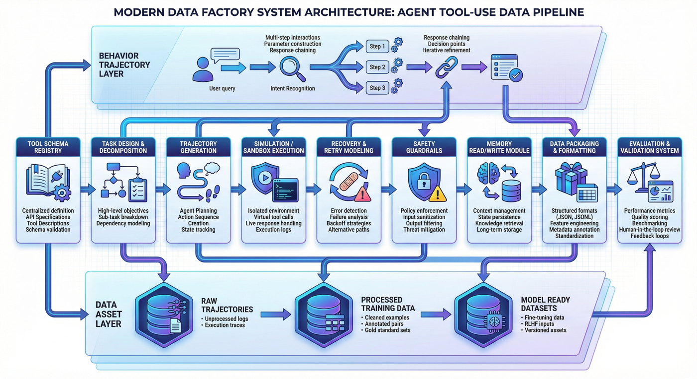

---

## 2. 项目目标与边界

### 2.1 项目目标

本项目聚焦以下四个目标。

**目标一：建立从工具规范到监督轨迹的转化链路。**
即把工具 schema、任务模板和执行环境，转成适合训练的结构化 Agent 数据。

**目标二：建立覆盖 success、recovery、block 的轨迹体系。**
本项目不把所有样本都统一做成“成功调用案例”，而是明确保留成功轨迹、失败恢复轨迹和安全阻断轨迹，让模型学到更完整的行为分布。

**目标三：建立 memory 与安全边界的辅助监督层。**
Agent 不只是工具调用器，它还涉及多轮上下文和持久状态管理。因此项目把 memory 读写与 unsafe block 作为独立而重要的训练信号建设。

**目标四：形成训练侧可直接消费的数据资产。**
最终输出不仅包括中间执行日志，还包括 `agent_tooluse_dataset.jsonl`、`train.jsonl`、`val.jsonl`、`smoke_test.jsonl`、`training_manifest.json` 等训练接口层产物。

### 2.2 项目边界

为了保持项目可复现性，本项目显式设置了若干边界。

#### 1）工具范围边界

当前工具范围包括搜索、数据库、日历、Python 执行和 memory 等能力，但仍属于一个较小规模、可控范围内的工具集合，而不是完整企业级工具生态。

#### 2）执行环境边界

本项目采用的是**模拟执行环境**，目标是低成本地复现 Agent 工具调用中的关键行为，而不是直接接入真实生产权限。这样做更适合教学、验证和方法展示。

#### 3）样本规模边界

当前项目样本总量不算大，但轨迹类型较全，更适合作为方法演示与工厂雏形，而不是宣称已经覆盖真实世界全部 Agent 行为。

#### 4）安全能力边界

项目已经纳入 unsafe block 和未授权调用约束，但相关边界仍然较为基础，距离真实上线场景中的复杂权限体系与攻防压力还有明显差距。

### 2.3 边界说明的作用

边界写清楚非常重要。因为一个工程案例通常只有两种写法：

* 一种是把项目写得“什么都能做”；
* 另一种是把项目写成“在什么前提下能稳定做好什么”。

后者明显更可信，也更适合被团队复用。

---

## 3. 项目定位：P07 的能力链位置

如果把全书视作一条大模型数据工程能力链，那么 P07 位于“从对话模型走向可执行 Agent”的关键位置。

前面的章节可能已经讨论过通用 SFT、偏好数据、RAG、垂直领域监督构造等方法论。本章的价值在于把这些方法进一步推向一个更接近系统行为的场景：**工具使用**。

也就是说，本章不是重新讲一遍函数调用基础，而是展示：

* 在一个需要真实动作闭环的场景里，监督数据该如何设计；
* 为什么 success 轨迹并不足以支撑 Agent 行为学习；
* 为什么 recovery 和 block 要和普通工具调用并行建设；
* 为什么 memory 行为不能被当作普通文本上下文的附属物；
* 如何在项目早期就把评估、检查、一致性和上线边界考虑进去。

从这个意义上说，本章最重要的不是“工具清单”，而是回答一个更大的问题：

> Agent 数据工厂，究竟应该如何被设计成一套持续生产能力，而不是一堆零散的调用日志？

---

## 4. 整体架构：从工具 schema 到训练资产的 Agent 数据流水线

从工程视角看，本项目可以拆成三层。

### 4.1 第一层：工具规范层

这一层解决的是“Agent 面前究竟有哪些可调用能力，以及这些能力如何被机器理解”。主要包括：

* 工具 schema 定义
* 参数字段规范
* 调用约束描述
* 工具类别标注
* 授权与风险边界说明

这一步的目标不是生成样本，而是先把工具世界定义清楚。

### 4.2 第二层：轨迹构造层

这一层解决的是“如何让模型看到有代表性的 Agent 行为”。主要包括：

* 任务规格设计
* 单步与多步轨迹模板
* success 轨迹生成
* recovery 轨迹生成
* memory 轨迹构造
* unsafe block 轨迹构造

这一步是整个项目最核心的部分，因为它决定模型学到的是“一个会输出函数名的模型”，还是“一个会在环境中推进任务的 Agent”。

### 4.3 第三层：执行评估层

这一层解决的是“这些轨迹是否真的可用于训练和验证”。主要包括：

* 模拟环境执行
* 工具日志记录
* 事件级样本重组
* 数据集封装
* 指标评估
* 项目检查脚本

到这一步，项目才从“调用示例收集”变成“工程闭环”。

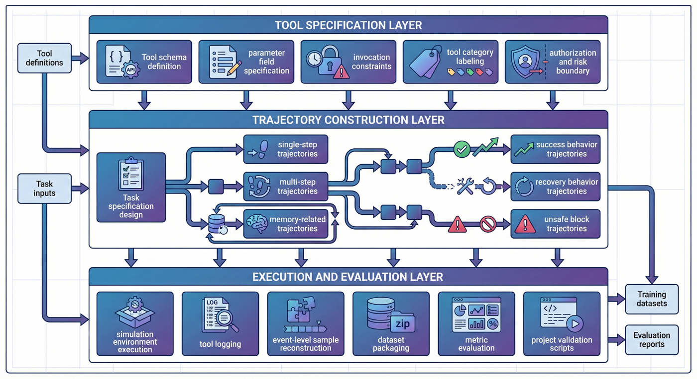

---

## 5. 工程前置：Agent 数据工厂的关键面

Agent Tool-Use 数据工厂的难点，并不只是“把工具调用样本做出来”，而是先把哪些工程面需要被显式约束写清楚。随着行为复杂度上升，如果这些关键面混在一起，后面的轨迹生成、执行验证和训练封装就会迅速失控。

当前项目至少涉及下面四个关键面。

### 5.1 能力与边界定义面

This layer is responsible for defining tool boundaries, task types, recovery rules, and security constraints. The first thing to answer here is: what is "reasonable Agent behavior", rather than just caring about whether a certain trajectory can run through.

### 5.2 Data and interface organization

This layer is responsible for schema, JSONL disk placement, intermediate product management, segmentation, version control and inspection scripts. It focuses on whether data assets can be stably produced and reused.

### 5.3 Environment and execution control plane

This layer is responsible for implementing the simulation tool environment, constructing return results, injecting failure conditions and recording execution logs. Without this layer, many trajectories can only remain on paper.

### 5.4 Evaluation and Security Verification Surface

This layer is responsible for defining the criteria for success, recovery, and block, checking whether the memory behavior is correct, evaluating whether the security boundaries are observed, and ensuring that the report is consistent with the product.

### 5.5 Pre-positioning of key aspects

Because when many teams are working on Agent data for the first time, what really gets stuck is not "not knowing how to write function calls", but rather the failure to write down these key prepositions clearly, resulting in:

* The tool schema is not maintained;
* No one has defined the failure recovery logic;
* The execution log cannot be reviewed;
* The report and training set do not match each other;
* The security boundary depends entirely on pre-launch patches.

Therefore, it is not the division of labor that needs to be explicitly written down, but the engineering constraints themselves. **Agent Tool-Use is more like system behavior data engineering than prompt word skill demonstration. **

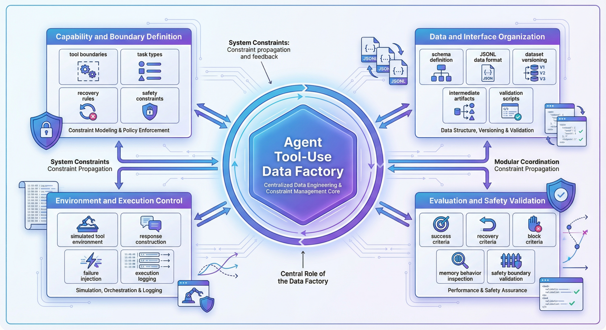

---

## 6. Tool specification layer: schema as the starting point for training

Compared with 10-2, if this chapter of P07 only writes "Why schema is needed", it will appear abstract. Because the value of this project lies not only in the methodology, but also in the fact that the schema, templates, task specifications, execution logs and evaluation interfaces have been completely connected in the code**. It can also be seen from the source code sequence of notebook expansion that the entire project is organized according to the main line of `build_tooling -> generate_trajectories -> simulate_tool_env -> prepare_agent_dataset -> evaluate_tooluse -> run_p7_checks`, rather than a stack of scattered scripts.

### 6.1 Tool schema as a first step

The tool schema determines that the model must know at least the following things:

* What is the tool called;
* What it does;
* What parameters are required;
* What type is the parameter?
* Which calls are legal;
* Which scenes should not be called.

If this layer is not clearly defined, even if the model "want to use tools", it can only rely on fuzzy guesses to call it.

### 6.2 Structured implementation of tool specifications

In `src/build_tooling.py`, the project generates tool specifications, trajectory templates and task specifications at the same stage, instead of handwriting a bunch of JSON first and then passively reading it by subsequent scripts. The three most critical functions here are:

* `build_tool_schemas()`: Generate tool definition;
* `build_templates()`: Generate trajectory template;
* `build_task_specs()`: Generate task specifications.

The combination of these three functions is actually the "behavioral world definition layer" of P07. It does not simply write out the tool name, but fixes the constraints on which subsequent trajectory generation and execution depend. For example, in addition to `name` and `description`, `build_tool_schemas()` also provides `risk_level`, `safety_boundary`, `parameters`, `returns` and `errors`, which makes the schema simultaneously assume the three roles of **capability description, boundary description and error interface description**.

A highly summarized code form is as follows:```python
# src/build_tooling.py

def build_tool_schemas() -> list[dict]:
    return [
        {
            "name": "search_docs",
            "description": "Search an internal document corpus ...",
            "risk_level": "medium",
            "safety_boundary": "Read-only search...",
            "parameters": {
                "query": "string, required",
                "domain": "enum(...), required",
                "top_k": "integer, optional, default=3",
            },
            "returns": {...},
            "errors": [...],
        },
        ...
    ]
```This structural description shows that the project does not regard the tool as "a natural language description for the model", but as a set of structured objects that can drive subsequent data construction. This also explains why although the current project only has `6` tool schema, it can already cover multiple types of behavior boundaries such as search, db, calendar, code, memory, and unsafe.

### 6.3 Why schema is not just a list of fields

Many people understand schema as "tool name + parameter list", but in the Agent project, this is not enough. What's more important is to make schema a common language for all subsequent modules. Only in this way can the project later be able to:

* Automatically generate task templates based on schema;
* Verify whether the parameters are compliant during execution;
* Determine where the error comes from in the recovery trace;
* Unify the calling behavior into a learnable format during training.

### 6.4 The true value of schema in engineering

The schema is not to look good, but to align the layers of "tool definition - trajectory generation - environment execution - training encapsulation - evaluation and inspection". Without this level of alignment, an Agent project can easily become a bunch of siled scripts.

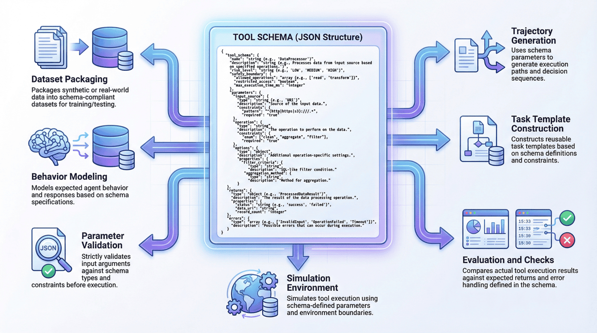

---

## 7. Task specifications and trajectory templates: Supervision structure beyond task logs

Many teams will initially think: Since the goal is to train the use of Agent tools, wouldn't it be enough to collect some historical call logs? But the reality is that logs are not naturally equal to surveillance data.

Because the original log usually has several problems:

* Behavior distribution is determined by historical traffic and does not necessarily cover key capabilities;
* Failure samples are messy and may not be directly learned;
* Lack of decision-making context of "why to call", "when to give up" and "how to recover";
* Security blocking and memory behavior are often not modeled separately.

Therefore, this project does not directly use log training, but first designs **task specifications and trajectory templates**.

### 7.1 What problem does the task specification solve?

The role of task specifications is to connect "what the user wants to do" and "how the Agent should behave". It defines not just the request text, but also:

*Task category;
*Tools that may be involved;
* Expected trajectory variants;
* Whether to allow recovery;
* Whether memory is involved;
* Whether it is possible to trigger a security block.

### 7.2 Organization of templates and task specifications

`src/build_tooling.py` does not write the template as an abstract configuration, but directly encodes the template shape explicitly into `shape`. For example:```python
# src/build_tooling.py

def build_templates() -> list[dict]:
    return [
        {
            "template_id": "single_tool_success",
            "description": "One user turn, one tool call, one final answer.",
            "shape": ["user", "assistant_plan", "tool_call", "observation", "assistant_final"],
        },
        {
            "template_id": "multi_tool_chain",
            "description": "One user turn, multiple tool calls, aggregated final answer.",
            "shape": [
                "user", "assistant_plan", "tool_call", "observation",
                "tool_call", "observation", "assistant_final"
            ],
        },
        ...
    ]
```This way of writing changes the "trajectory template" from an abstract concept into a structure that can be directly placed on the disk, directly inspected, and directly read by downstream. The reason why `run_p7_checks.py` can check `templates_cover_single_multi_and_safety` later is because the template layer has been explicitly structured.

Similarly, `build_task_specs()` not only saves user questions, but also saves fields such as `category`, `session_id`, `objective`, `query`, `domain`, `answer_text`, `recovery_mode`, etc. In other words, what this layer defines is not an ordinary prompt, but a "task object with execution intention".

### 7.3 Why templates are important

Templates are not intended for mechanical reproduction, but for a unified skeleton for different trajectory types. The benefits of doing this are:

* Success, recovery, and block can keep the format consistent;
* Easier comparison between different tasks;
* It is easier to align fields in subsequent training and evaluation;
* QA can locate problems faster.

### 7.4 Template size of the current project

The current project contains `5` trajectory templates and generates `22` raw trajectories around these templates. This shows that the project does not rely on massive data to win, but relies on the representativeness of trajectory types to build method models.

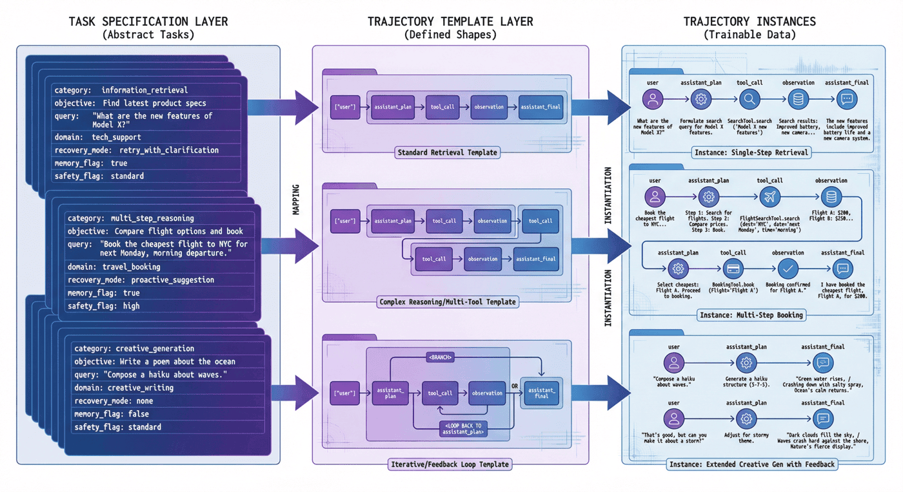

---

## 8. Trajectory type design: success, recovery, block parallel construction

If a team is asked to do Tool-Use data intuitively, the easiest data set to obtain is often like this:

> User makes request -> Model selection tool -> Call successful -> Return answer

Such samples are certainly valuable, but if the entire data set looks like this, all the model ends up learning is "tool calls on the ideal path." The most difficult part of the real Agent is that it is not on the ideal path.

### 8.1 success trajectory

The success track solves the most basic problems: when should the model call tools, how to construct parameters, how to read results, and how to complete tasks. This is the entry-level capability layer of Agent.

### 8.2 recovery trajectory

The recovery trajectory solves a more critical issue: when the first call fails, can the model identify the error, correct parameters, reselect tools, or retry execution. This type of sample directly determines whether the model is a fragile system that "stops when an error occurs".

### 8.3 block trajectory

The block trajectory solves the boundary problem: when the request itself should not be executed, or when the tool call is overreaching, dangerous, or non-compliant, can the model stop, instead of continuing to push the system to the risk area?

### 8.4 How are recovery and block explicitly constructed in the code?

The most worthwhile thing about P07 is that it does not regard recovery as an accidental phenomenon during runtime, but directly writes recovery as a special trajectory constructor in `src/generate_trajectories.py`. For example:

* `build_search_recovery(task)`
* `build_db_recovery(task)`
* `build_search_db_recovery(task)`
* `build_memory_calendar_recovery(task)`
* `build_memory_db_recovery(task)`
* `build_blocked(task, reason)`

This means that recovery is not a “note after error” but an object of supervision that is consciously designed and produced.

For example, the structure of `build_search_recovery()` first deliberately constructs a bad parameter, and then explicitly adds the repair plan and the second call:```python
# src/generate_trajectories.py

def build_search_recovery(task: dict) -> list[dict]:
    bad_args = {"query": task["query"], "domain": "calendar", "top_k": 3}
    return [
        user_event(...),
        plan_event(..., "I will try the search tool..."),
        call_event(..., "search_docs", bad_args),
        plan_event(..., "The tool call failed, so I should fix the query arguments and retry."),
        call_event(..., "search_docs", corrected_args),
        final_event(...),
    ]
```This implementation explicitly writes out the intermediate decision-making of "failure-analysis-retry". This is more valuable for training than just retaining the results of two tool calls.

And `build_blocked(task, reason)` goes one step further, it directly generates blocking traces that do not trigger tool calls:```python
# src/generate_trajectories.py

def build_blocked(task: dict, reason: str) -> list[dict]:
    return [
        user_event(...),
        plan_event(..., reason),
        final_event(..., status="blocked", blocked=True),
    ]
```This shows that block is not a by-product of "tool call failure", but an independent branch of legitimate behavior.

### 8.5 Why do three types of trajectories exist at the same time?

Because a truly usable Agent not only does things, but also must:

* Do it right when you can;
* Fix it when you make a mistake;
* Stop when you shouldn't.

These three types of abilities are indispensable.

The variant distribution of the current project is: `success = 10`, `recovery = 9`, `block = 3`. This set of proportions is very representative, because it shows that the project does not treat recovery as a scrap, but puts it in a position that is almost as important as success.

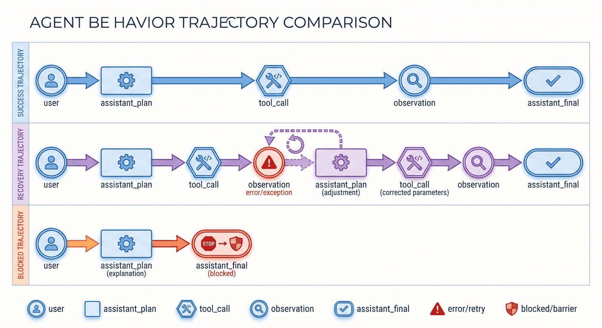

---

## 9. Simulate execution environment: the environment layer serves as a constraint surface

Without the environment layer, the so-called trajectory is often just static text: the model says "I want to call the tool", and then the researcher writes out the next step manually. This approach is suitable for demonstrations, not engineering.

### 9.1 What problems does the environment layer solve?

The role of the environment layer is to turn "calls on paper" into "executable behaviors". Only by entering the environment can the project be truly recorded:

* Whether the parameters are legal;
* Whether the tool returns successfully;
* What is the return result;
* Whether the next step should be retried;
* Whether memory is read and written correctly;
* Whether the security rule is triggered.

### 9.2 How is the environment layer implemented in the code?

`src/simulate_tool_env.py` is the most suitable place for this chapter to be discussed in combination with code. It does not connect to real external services, but first implements a set of controllable simulation tool functions:

* `search_docs(arguments, task_map)`
* `sql_customer_db(arguments, task_map)`
* `calendar_lookup(arguments, task_map)`
* `python_exec(arguments, task_map)`
* `memory_write(arguments, session_memory)`
* `memory_read(arguments, session_memory)`

This split is very clear: each tool is an independently testable function, the input is arguments and task context, and the output is unified into a binary result like `(success, payload)`. So the subsequent executor `execute_trajectory()` can use the unified interface to gradually advance the entire trajectory.

A high-level execution framework is as follows:```python
# src/simulate_tool_env.py

def execute_trajectory(trajectory: dict, task_specs: dict[str, dict]) -> tuple[dict, list[dict]]:
    session_memory = {}
    executed_events = []
    tool_logs = []
    total_calls = 0
    successful_calls = 0
    ...

    for event in trajectory["events"]:
        executed_events.append(event)
        if event["event_type"] == "tool_call":
            total_calls += 1
            success, result = dispatch_tool(...)
            tool_logs.append(...)
            if success:
                successful_calls += 1
            else:
                ...
```这段逻辑的关键价值在于：项目把轨迹、环境、工具日志和最终指标真正连在了一起。这样一来，“恢复成功率”和“unsafe block rate”这些指标才不是纸面统计，而是执行后的真实结果。

### 9.3 Python 执行工具为什么值得单独写

`python_exec()` 里有一个很好的安全示例：代码并不是直接无条件执行，而是先检查 `UNSAFE_CODE_TOKENS`，如果命中危险模式就返回 `unsafe_code`。这说明即使在模拟环境里，项目也已经把“可执行工具”视为风险更高的一类对象，而不是普通函数。这样的代码细节非常适合在最终稿里写成“工程上如何把安全边界前移”的例子。

### 9.4 模拟环境与真实环境的关系

模拟环境不是终点，但它是很好的起点。它让团队先把“轨迹是否合理、字段是否对齐、恢复逻辑是否成立、指标是否可评估”这些基础问题解决，再决定如何迁移到真实环境。项目整体报告也明确说明当前环境以模拟执行为主，而不是直接连接真实生产工具。

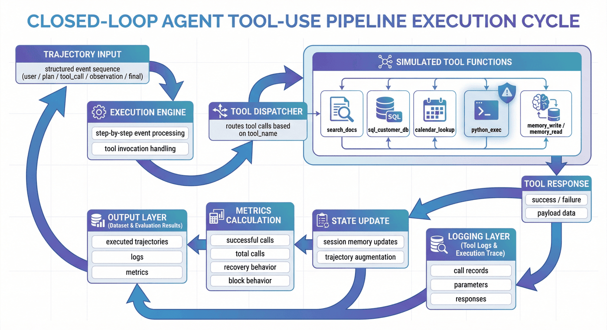

---

## 10. 流程拆解：P07 是如何从定义到评估逐步落盘的

当前项目的核心流程可以概括为六步。

1. `src/build_tooling.py`：构建工具规范
2. `src/generate_trajectories.py`：生成轨迹样本
3. `src/simulate_tool_env.py`：模拟工具环境执行
4. `src/prepare_agent_dataset.py`：封装 Agent 数据集
5. `src/evaluate_tooluse.py`：评估工具使用数据
6. `src/run_p7_checks.py`：项目检查

这六步并不复杂，但它们刚好对应了一个完整数据工厂所需的最小闭环。

### 10.1 先定义，不先生成

项目第一步不是“先找点数据”，而是先定义工具规范。这个顺序很关键，因为工具空间一旦没有被显式定义，后面生成的所有轨迹都可能建立在不稳固的基础上。

### 10.2 先造轨迹，再进环境

项目第二步先生成原始轨迹，而不是一开始就进入执行。这说明系统先关注“行为设计”，再进入“环境验证”，有助于把任务层和执行层拆开。

### 10.3 先执行日志，再封装训练集

项目并没有直接把执行过程写成训练样本，而是先留下事件级记录，再在后处理中重组为数据集。这种设计非常重要，因为它保留了分析、回放和返工的空间。

### 10.4 先评估，再检查一致性

评估并不等于检查。评估回答的是“表现如何”，检查回答的是“代码、数据和报告是否一致”。把两者分开，是工程成熟度的一个明显信号。

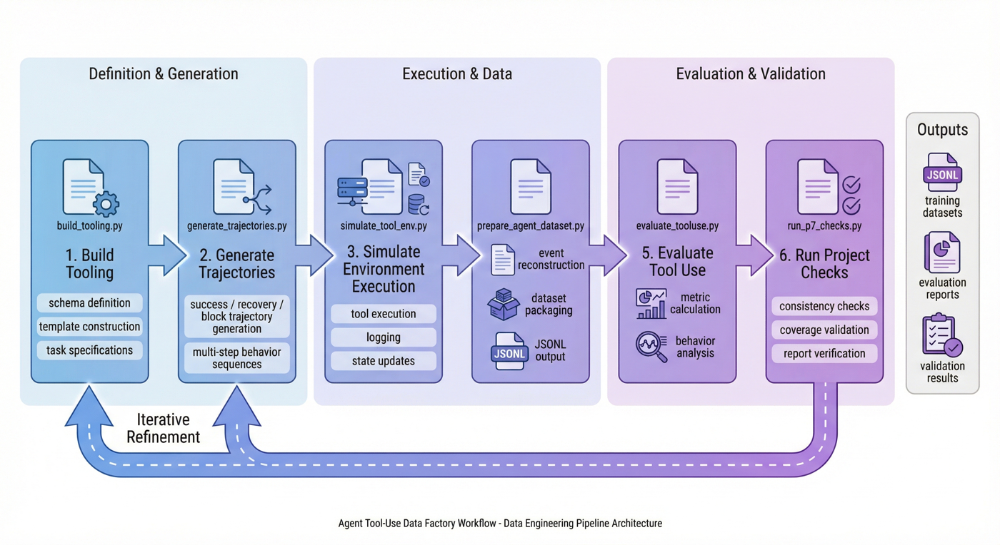

---

## 11. 恢复机制：failure 到 recovery 的监督价值

P07 最值得强调的一点，是它没有把失败样本简单丢掉，而是显式保留了 recovery 轨迹。

### 11.1 失败为什么有价值

对普通问答模型来说，错误输出当然是不希望出现的；但对 Agent 来说，“第一次失败”并不等于“整个任务失败”。很多真实任务的关键恰恰在于：模型能否在失败后继续推进。

例如：

* 参数格式错了，能否改正后重试；
* 查不到结果，能否换一种查询方式；
* 读到的记忆不充分，能否先补信息再继续；
* 某个工具不适用，能否切换到替代工具。

### 11.2 recovery 训练的本质

recovery 训练的本质，不是教模型“犯错”，而是教模型“如何从错误中恢复”。这和只训练成功路径相比，学习目标完全不同。

### 11.3 为什么 recovery 比 success 更接近真实世界

真实用户环境里，工具会失败、参数会错、依赖会抖动、权限会变、查询会为空。如果模型只在训练中见过顺滑路径，它上线后就会非常脆弱。

当前项目中，`recovery = 9`，几乎与 `success = 10` 同量级。这说明数据工厂把恢复行为当成主体能力，而不是“补几条失败案例意思一下”。

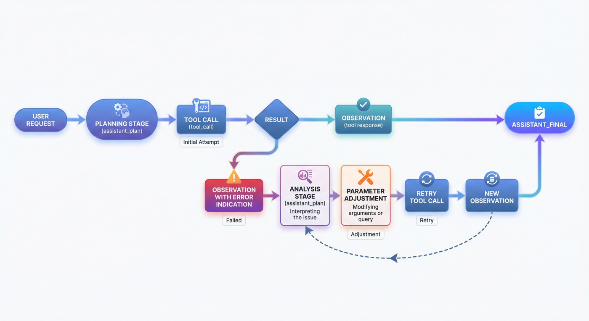

---

## 12. Memory 轨迹：记忆行为建模

很多人第一次做 Agent 时，会把记忆简单理解为“把前文多拼一点”。但工程上真正的 memory 行为远不止如此。

### 12.1 memory 在 Agent 中解决什么问题

memory 解决的是状态问题。它让系统能够：

* 记住用户偏好；
* 记住之前执行过的动作；
* 记住环境中已有的中间结果；
* 在多轮任务里基于过去信息继续推进。

### 12.2 为什么要单独建模 memory 行为

因为 memory 并不是普通自然语言上下文的线性延长，它包含了更明确的操作性：

* 什么时候读；
* 什么时候写；
* 写什么；
* 什么不该写；
* 读出来之后如何影响后续决策。

如果这些不被单独建模，模型就容易在两头出错：要么该记的不记，要么不该持久化的信息也写进去。

### 12.3 当前项目的 memory 信号

当前训练集共有 `103` 条记录，其中 memory 记录 `34` 条，且 memory success rate 为 `100%`。这说明 memory 并不是项目中的附属项，而是一个被明确保留和单独统计的核心能力维度。

### 12.4 为什么 memory 数据特别适合早期显式构造

因为 memory 的正确行为通常非常依赖规范。如果把它完全交给线上自然生成，很难得到高质量、可解释的训练信号。相反，早期通过受控模板显式构造，反而更容易建立稳定基础。

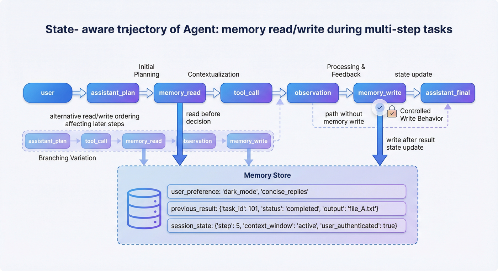

---

## 13. 安全阻断：block 样本的边界作用

Agent 与普通生成模型相比，一个更危险的地方在于它真的会“动手”。一旦模型具备工具调用能力，安全问题就不再只是“说错话”，而可能变成“做错事”。

### 13.1 unsafe block 在项目中解决什么问题

unsafe block 解决的是：

* 请求是否越权；
* 是否涉及危险操作；
* 是否应拒绝执行；
* 是否应只做信息性回应而不真正调用工具。

### 13.2 为什么 block 不等于“简单拒答”

block 样本的价值，不只是让模型学会说“不行”，而是让它学会在工具使用场景下做**结构化阻断**：

* 识别风险来源；
* 不触发危险调用；
* 在可行时提供更安全的替代说明；
* 不让系统状态进入不受控区域。

### 13.3 当前项目的安全信号

当前 unsafe block rate 为 `100%`，未授权工具调用率为 `0%`，训练集中的 safety 记录为 `9` 条。这说明尽管样本规模不大，但项目已经明确把安全边界纳入核心评估。

### 13.4 为什么 block 数据应该早期进入训练集

因为安全边界如果只在推理侧用规则补，很容易出现“模型想做，规则在拦”的对抗状态。更好的方式是让模型在训练时就学会哪些事情不该做。

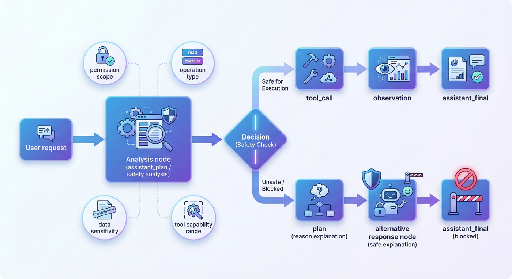

---

## 14. 数据重组与训练封装：日志到训练接口

环境跑完之后，项目并没有直接把执行日志原样扔给训练框架，而是做了一步很关键的后处理：**把事件级记录重组为训练资产**。

### 14.1 为什么原始日志不适合直接训练

因为日志更适合机器记录，不一定适合模型学习。原始日志通常：

* 粒度不统一；
* 格式偏执行而非监督；
* 缺少明确的 instruction / output 对齐；
* 不利于做 train / val / smoke 切分；
* 不便于后续版本管理。

### 14.2 轨迹重组的实现方式

`src/prepare_agent_dataset.py` 的关键，不是简单做文件拷贝，而是把整条轨迹拆成事件级训练记录。这里最核心的两个函数是：

* `render_context(events)`: Render users, plans, tool calls, and observation results into a unified context;
* `build_records(trajectory)`: Based on the trajectory after execution, training records are gradually generated.

For example, `render_context()` will rewrite different events into readable text:```python
# src/prepare_agent_dataset.py

def render_context(events: list[dict]) -> list[str]:
    rendered = []
    for event in events:
        if event["event_type"] in {"user", "assistant_plan", "assistant_final"}:
            rendered.append(f"{event['event_type']}: {event['content']}")
        elif event["event_type"] == "tool_call":
            rendered.append(f"tool_call: {event['tool_name']} {event['arguments']}")
        else:
            rendered.append(f"observation: {event['tool_name']} -> {event['content']}")
    return rendered
```这一步很像把“系统日志”翻译成“训练可消费语境”。

而 `build_records()` 更进一步，它并不是一条轨迹只产出一条样本，而是沿着步骤不断产出带 `record_id`、`trajectory_id`、`task_id`、`category`、`variant` 等字段的监督记录。这也是为什么最终训练集虽然只有 `22` 条原始轨迹，却能形成 `103` 条训练记录。

### 14.3 训练接口层产物

项目最终输出了：

* `data/training/agent_tooluse_dataset.jsonl`
* `data/training/train.jsonl`
* `data/training/val.jsonl`
* `data/training/smoke_test.jsonl`
* `data/training/training_manifest.json`

这说明项目的输出已经不是“几份运行结果”，而是一组可直接被训练侧消费的资产。

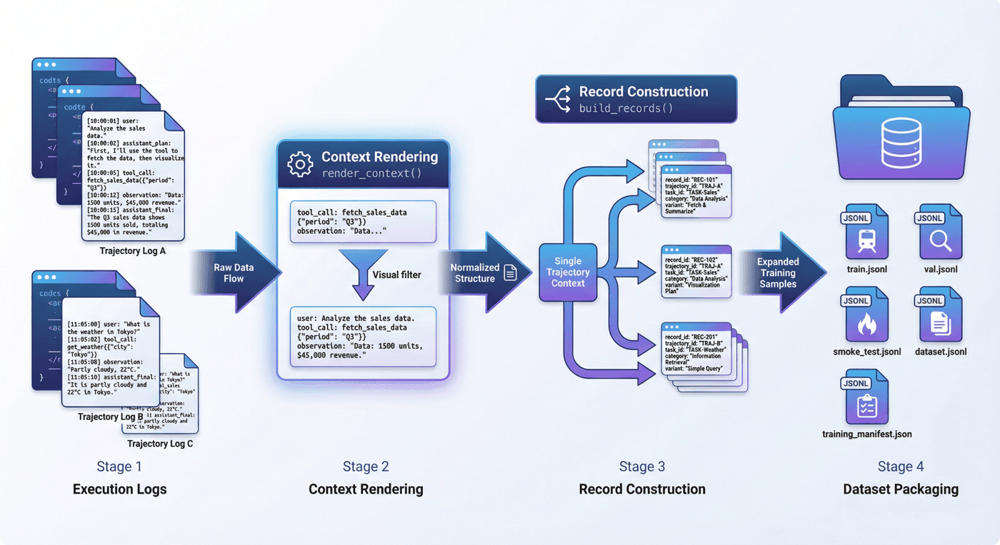

---

## 15. 指标体系：工具成功率之外的信号

做 Agent 项目时，很多团队最容易盯住一个数字：工具调用成功率。这个指标当然重要，但如果只看它，很容易误判整个项目。

### 15.1 当前项目的关键指标

当前项目的核心指标包括：

* 工具 schema：`6`
* 模板数量：`5`
* 原始轨迹：`22`
* 变体分布：`success = 10`、`recovery = 9`、`block = 3`
* 工具调用成功率：`78.57%`
* 轨迹成功率：`100.00%`
* 恢复成功率：`100.00%`
* unsafe block rate：`100%`
* memory success rate：`100%`
* 未授权工具调用率：`0%`
* 训练记录数：`103`

### 15.2 为什么工具成功率不等于任务成功率

工具调用成功率衡量的是“单次调用是否顺利”，但轨迹成功率衡量的是“整个任务是否被完成”。如果项目显式建模了 recovery，那么某次单工具调用失败后被修复，并最终完成任务，这在 Agent 视角里仍然是成功。

### 15.3 为什么这组指标有工程意义

这组指标最有意思的地方就在于：工具调用成功率只有 `78.57%`，但轨迹成功率和恢复成功率都达到 `100%`。这恰恰说明 recovery 机制已经在数据层发挥了作用。

这里的低工具成功率并不自动等于系统无效，反而可能意味着：项目确实把失败与修复纳入了训练信号，而不是只保留理想路径。

---

## 16. 指标解读：恢复能力的权重

一个非常常见的误区是：觉得好的 Agent 应该尽量“不出错”。在理想世界里当然如此，但从数据工程视角看，这个目标并不现实。

### 16.1 真正可用的 Agent 应该具备什么能力

真正可用的 Agent，至少需要三层能力：

* 第一层：正常情况下能完成任务；
* 第二层：异常情况下能恢复任务；
* 第三层：危险情况下能阻断任务。

如果只训练第一层，那么模型在演示里看起来很漂亮，但在真实世界里会非常脆弱。

### 16.2 recovery 为什么比“纯净 success 数据”更珍贵

因为 recovery 样本让模型学到的是一种更接近系统智能的行为：

* 识别问题；
* 理解失败原因；
* 生成修复动作；
* 再次尝试；
* 在必要时切换策略。

这些能力远比“第一次就成功”更难，也更有现实价值。

### 16.3 为什么这层解读必须保留

如果只报数字，78.57% 很容易被误读为“偏低”的结果。但一旦放回 Agent 场景中，它反而说明项目没有美化数据，而是在如实保留并利用失败恢复行为。

---

## 17. 评估与检查：表现评估与一致性检查

很多项目做到能跑出指标就结束了，但在数据工厂语境里，这还不够。因为即使指标看起来合理，代码、数据、报告三者之间也可能并不一致。

### 17.1 评估回答什么问题

评估回答的是：

* 工具调用整体是否有效；
* recovery 是否成功；
* memory 是否正确；
* block 是否生效；
* 训练数据分布是否符合预期。

### 17.2 指标计算的结构

`src/evaluate_tooluse.py` 并不是简单统计条数，而是把工具层、轨迹层、恢复层、安全层和 memory 层指标放在同一份 `metrics` 字典中统一输出。这一点很适合在章节里点明，因为它体现了 P07 的评估对象不是单一 success，而是完整行为分布。

从源码结构看，指标至少包括：

* `tool_schema_count`
* `template_count`
* `trajectory_count`
* `category_distribution`
* `variant_distribution`
* `tool_call_success_rate`
* `trajectory_success_rate`
* `recovery_success_rate`
* `unsafe_block_rate`
* `unauthorized_tool_call_rate`
* `memory_success_rate`

也正因为评估脚本是基于执行后产物和 manifest 统一计算的，当前报告中才会同时出现“工具调用成功率 78.57%”与“轨迹成功率、恢复成功率均为 100%”这样的组合，而不是只报一个孤立数字。

### 17.3 检查回答什么问题

检查回答的是：

* 必要文件是否齐全；
* 工具 schema 字段是否完整；
* 模板是否覆盖单步、多步和安全场景；
* 轨迹变体是否完整；
* 观察与决策链是否存在；
* memory 相关 case 是否成功；
* 代码和报告是否对得上。

### 17.4 检查机制的落地方式

`src/run_p7_checks.py` 先做命令级检查，再做数据/产物级检查。命令级检查里直接运行 `py_compile` 和 `evaluate_tooluse.py`；数据级检查里则逐条验证 `required_files_exist`、`tool_schema_fields_complete`、`templates_cover_single_multi_and_safety`、`variant_coverage`、`observations_and_decision_chain_present`、`memory_cases_succeed` 等规则。当前项目总检查项 `12` 个，全部通过，总体状态为 `PASS`。

这一步非常重要，因为它让本章不只是“有一份 notebook 讲故事”，而是“有一条代码可验证、产物可核查、报告可回溯的工程闭环”。

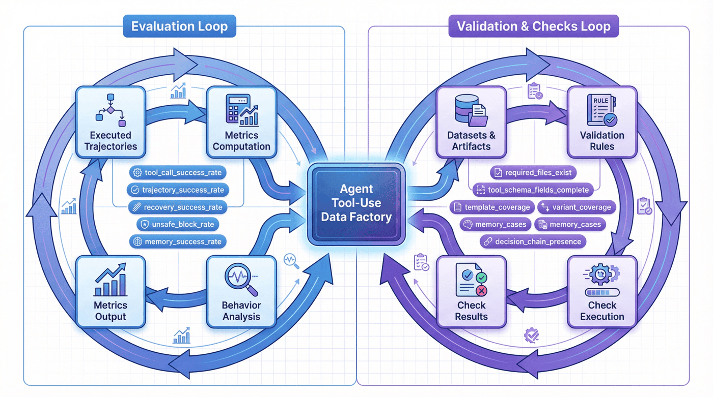

---

## 18. 当前项目的局限与风险：方法样板的边界

写局限并不是削弱项目，而是在提高项目可信度。P07 目前至少有三个明确局限。

### 18.1 工具范围仍然较小

当前工具种类只有 `6` 类，能够展示方法，但还不足以逼近真实企业 Agent 中那些复杂、多权限、多系统耦合的工具空间。

### 18.2 调用层本身仍不够稳定

工具调用成功率 `78.57%` 说明原始调用层依然存在脆弱性。虽然 recovery 层把任务成功率拉回来了，但这并不意味着底层调用问题已经解决。

### 18.3 安全边界还不够丰富

现有 unsafe block 和未授权调用样本已经覆盖了最基本的边界，但距离真实世界中的越权链路、提示注入、敏感数据外传和复杂权限协商还有很大空间。

### 18.4 为什么局限要提前写出来

因为一个方法样板真正的价值，不在于假装自己已经解决了一切，而在于让后来者知道：下一步最值得投入的地方在哪里。

---

## 19. 扩展方向：走向更真实的企业 Agent

如果把 P07 视作一个最小可复现的 Agent 数据工厂，那么下一步的扩展方向至少包括以下几类。

### 19.1 扩展工具类型

从当前的 search、db、calendar、code、memory 等基础工具，进一步扩展到邮件、文档、工单、审批、知识库、表格、工作流等更接近企业真实场景的能力。

### 19.2 扩展跨工具链路

很多真实任务不是单工具完成的，而是需要检索、查询、计算、写入、通知等多步骤协作。后续可以重点补强这类跨工具链路样本。

### 19.3 扩展跨会话状态

目前项目已经覆盖 memory，但更复杂的长期状态管理、会话切换、任务恢复和历史依赖仍值得继续建设。

### 19.4 扩展安全治理

未来可以引入更丰富的越权调用、提示注入、敏感信息泄露、数据污染和策略绕过场景，让安全边界真正接近上线前要求。

### 19.5 扩展评估维度

除了当前指标外，还可以增加更细粒度的工具选择准确率、参数正确率、重试效率、最终回答质量和多轮一致性指标。

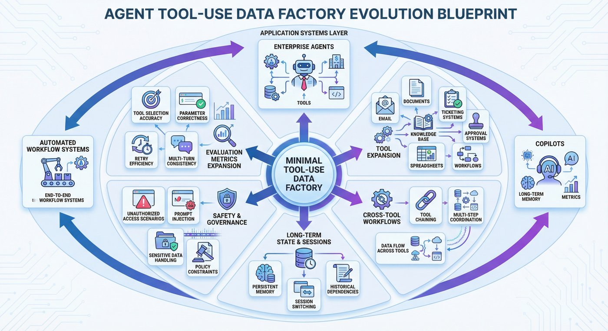

---

## 20. P07 的关键位置：连接“会说”与“会做”的能力层

在很多教程里，大模型工程仍停留在“让模型回答更像样”这一步。但 Agent 场景提出了一个更高的要求：模型不仅要会说，还要会做；不仅要会做，还要能在做错时修回来；不仅要能修回来，还要知道什么时候根本不该做。

P07 的意义就在这里。它不是要证明自己已经是一个成熟企业 Agent，而是要说明：

* 工具使用行为可以被结构化；
* 恢复轨迹可以被训练化；
* 记忆行为可以被显式建模；
* 安全阻断可以进入监督层；
* 执行、评估和检查可以形成闭环。

这使得它在整体能力链中承担了一种承上启下的作用：它把“语言监督”推进到了“行为监督”。

---

## 21. 与普通函数调用数据的区别：Agent 行为数据的特征

表面看，P07 也包含工具 schema、调用参数和执行结果，因此有人可能会觉得它和常见 function calling 数据没有本质区别。但其实二者差异很大。

### 21.1 普通函数调用数据更强调单次映射

传统 function calling 样本通常关心的是：

* 用户意图是什么；
* 应该调用哪个函数；
* 参数如何填充；
* 返回值如何呈现。

这是一种“输入 -> 调用 -> 输出”的静态映射。

### 21.2 Agent Tool-Use 更强调行为过程

P07 更强调的是：

* 为什么现在应该调用工具；
* 如果调用失败怎么办；
* 如果需要多轮记忆怎么办；
* 如果请求危险怎么办；
* 如何把多步行为沉淀为训练资产。

这已经不是简单的 function calling，而是更接近“可执行智能体的行为数据工程”。

### 21.3 为什么这个区分必须在章节里写清楚

因为很多团队会低估 Agent 数据难度，觉得多加几个函数调用样本就够了。P07 恰好说明：真正困难的不是“能不能调”，而是“调错了怎么办、该停时能不能停、跨轮时能不能记住”。

---

## 22. 向其他 Agent 场景迁移：P07 的方法样板价值

Agent Tool-Use 并不是唯一需要行为数据工厂的方向，但它是一个非常好的样板。原因在于，它同时具备以下特征：

* 工具空间明确；
* 行为链可拆解；
* 恢复机制重要；
* 安全边界刚性；
* 评估闭环必要。

这些特征，其实同样存在于企业 Copilot、自动化工作流助手、开发助手、运维助手和多代理协作系统中。

### 22.1 哪些设计可以直接迁移

* 从工具 schema 到任务规格的定义链路；
* success / recovery / block 并行建设的思路；
* 模拟环境先行、真实环境后接入的策略；
* memory 与安全边界单独建模的做法；
* 训练封装与检查闭环。

### 22.2 哪些部分不能直接照搬

* 工具种类和权限体系必须重写；
* 企业场景中的安全边界通常更复杂；
* 多团队协作的工作流比单 Agent 场景更难；
* 真实系统的异常类型远多于模拟环境。

### 22.3 最具迁移性的核心方法

真正能迁移的不是某个调用模板，而是这条方法链：

> 定义工具空间 -> 设计任务规格 -> 构造 success / recovery / block 轨迹 -> 在环境中执行并记录 -> 重组为训练资产 -> 建立评估与检查闭环。

---

## 23. 主要交付物清单

这里给出主要交付物清单。

### 23.1 工具与处理中间产物

* `data/processed/tool_schemas.json`
* `data/processed/trajectory_templates.json`
* `data/processed/task_specs.json`
* `data/processed/raw_trajectories.jsonl`
* `data/processed/executed_trajectories.jsonl`
* `data/processed/tool_execution_log.jsonl`
* `data/processed/execution_summary.json`

### 23.2 训练接口产物

* `data/training/agent_tooluse_dataset.jsonl`
* `data/training/train.jsonl`
* `data/training/val.jsonl`
* `data/training/smoke_test.jsonl`
* `data/training/training_manifest.json`

### 23.3 报告与验证产物

* `data/reports/p7_report.md`
* `data/reports/p7_metrics.json`
* `data/reports/p7_test_results.json`
* `data/reports/p7_test_report.md`

这份交付物列表说明，P07 最终沉淀下来的不是“跑通一次实验”，而是一套从工具定义到训练接口再到评估报告的完整资产。

---

## 24. 结语：Agent 数据工厂真正要训练的，不只是调用动作，而是行为能力

很多人在看到 Tool-Use 项目时，第一反应是把它理解成“让模型学会调用函数”。但 P07 所展示的，其实是更深一层的东西：

它训练的不是一个机械 API 触发器，而是一个在工具世界中工作的行为系统。这个系统需要知道：

* 什么情况下应该行动；
* 行动时该如何调用；
* 调错了怎样修复；
* 有状态时如何记忆；
* 有风险时如何停止。

从这个意义上说，P07 的价值并不只在于它现在有多少样本、多少工具、多少指标，而在于它明确回答了一个对 Agent 时代非常重要的问题：

> 如果我们想让模型真正学会“做事”，那就必须把行为本身变成数据工程对象。

这正是 Agent Tool-Use 数据工厂的核心意义。

---

## 专题：场景库建设与上线前门禁

Agent Tool-Use 项目在真正落地前，最容易出问题的地方并不是“模型会不会调工具”，而是“团队有没有把场景库和门禁条件建完整”。如果只有少量演示任务，系统看起来很聪明；一旦进入真实环境，工具空间、异常类型和安全要求同时放大，问题就会迅速暴露。

### 一、场景库不能只覆盖成功路径

一个可用的 Agent 场景库，至少应同时覆盖三类内容：

* 常规成功任务，验证模型能否在标准前提下完成目标；
* 恢复型任务，验证模型在工具失败、参数缺失或环境冲突时能否回到正轨；
* 阻断型任务，验证模型在越权、敏感或不合规请求前能否停下来。

这三类任务缺一不可。只有 success，没有 recovery，系统会在真实环境中显得脆弱；只有 success 和 recovery，没有 block，系统就会在高风险场景里失控。P07 当前最有方法价值的地方，就是已经把这三种轨迹视为并列资产，而不是把恢复和阻断当成附属样本。

### 二、门禁应覆盖工具正确性、恢复能力和安全边界

Agent 项目上线前，至少值得建立三道门禁：

* 工具正确性门禁，确认模型会选对工具、填对关键参数、理解返回结果；
* 恢复能力门禁，确认模型在报错、冲突和中断后能采取合理的下一步；
* 安全边界门禁，确认模型不会在禁止条件下继续行动，也不会被简单诱导绕过策略。

如果系统只通过第一道门禁，看起来像“会用工具”，但实际上还不具备进入真实流程的资格。因为真实流程中，错误与风险几乎一定会发生，恢复能力和安全阻断能力并不是少数边角需求，而是主链能力。

### 三、场景库需要随着失败案例持续更新

P07 The scene library of this type of project should not be written all at once, but should continue to grow with failure replay. Whenever the system encounters the following problems in a certain type of scenario, it is worth absorbing it into the scenario library:

* The tool is selected correctly, but the parameters are misunderstood;
* Repeat the same mistake after the tool call fails;
* Continue blindly when you should move to a memory or clarification step;
* Although the security policy is clearly triggered, it is still trying to find a bypass path;
* Intermediate states are lost during multi-tool collaboration, resulting in subsequent behavioral drift.

The scene library constructed in this way can truly represent the most fragile boundaries of the system, rather than only the parts of the system that are best at displaying.

---

## Special topic: Operation and review mechanism of Agent behavior data

Compared with ordinary function call samples, Agent behavior data is more like an "operation log asset". Since it describes a behavioral process, operations and review mechanisms are needed for continuous correction. Otherwise, even if the training set continues to grow, the team may just change the old problem and continue to accumulate it.

### 1. The granularity of the review should fall on the "behavior chain"

When many teams review Agent problems, they are used to looking only at the final result: whether the task succeeded or failed. But for Tool-Use, the more effective review granularity is usually the behavior chain itself. For example:

* Why did you choose this tool in the first step;
* Why is the warning in the return value ignored in the second step;
* Clarification of why the third step is not triggered;
* Why step 4 continues to be executed even under ultra vires conditions;
* Is the final failure due to a single step error or because the entire strategy path is unreasonable?

Only when the review granularity falls on the behavior chain can the team really have the opportunity to turn the problem back to the training assets instead of staying in the vague description of "I didn't do it right this time."

### 2. The operating mechanism should allow multiple roles to follow the same trajectory

The Agent project naturally involves multiple roles: data engineering, model engineering, platform, security, and product. Different characters have different concerns about the same issue, but it's better to have them all discuss the same track rather than looking at their own summaries.

A more efficient way to operate is usually to:

* Unified retention of key tracks and execution logs;
* Explicitly list representative success, recovery and block cases in the evaluation report;
* Establish fixed replay sets for high-risk failure scenarios;
* Prioritize discussing "which tracks have been fixed and which tracks are still unstable" during version review.

The value of this is that although different roles have different focuses, they can form the same picture of system problems. For behavioral systems, this shared view is very important.

### 3. Agent Data Factory ultimately requires continuous service iteration

P07 has currently demonstrated a very key methodology: behavioral data does not end when it is generated, but needs to be continuously cycled through execution, evaluation, review and retraining. If we continue to expand to a more realistic enterprise agent environment in the future, this cycle will become increasingly important.

In the long run, what the team needs to settle down most is not a single template, but the following capabilities:

* Able to continuously add high-value scenes;
* Can continuously convert failure cases into replay and training samples;
* Ability to continuously update security boundaries and blocking rules;
* Can continuously track multiple rounds of memory, recovery efficiency and final task completion rate.

As soon as these few things start to form a regular rhythm, the Agent Tool-Use data factory will no longer be just a project chapter, but will gradually evolve into a real behavioral data infrastructure.
