# プロジェクト 2: 垂直フィールド専門家 SFT (法務)


## 章の概要

P02 は、規制文書、システム説明、および法的タスク要件を、トレーニング可能で品質検査可能でスケーラブルな垂直フィールド SFT データ生産ラインに編成することに重点を置いています。この章の焦点は、単一の質問と回答の生成ではなく、シード知識から監督資産への安定した変換プロセスにあります。

この章は、次の 4 つの要点に従って理解できます。

* シード知識の処理: 規制 PDF および機関文書から使用可能な構造化知識の断片を抽出します。
* タスク システムとサンプルの合成: 法的解釈、法的 Q&A、事例分析、リスクの拒否など、さまざまなタスク レイヤに分割されます。
* 品質管理とプリファレンスの強化: QA、プリファレンスのペア、およびリスク境界サンプルを介した監視シグナルの安定化。
* トレーニングのパッケージ化とオンラインでの受け入れ: 処理されたデータ資産を、トレーニング可能、検証可能、納品可能な最終製品に編成します。

エンジニアリング順に読むと、この章は完全なリンクに相当します。

**オリジナル規定PDF -> 洗浄とダイシング -> タスク設計 -> 指示合成 -> プリファレンス強化 -> QA品質検査 -> トレーニングパッケージ化 -> オンライン受付**

この構造に対応する中心的な目標は、法律知識をタスクの階層化、品質制約、受け入れメカニズムを備えた監督データ資産に処理することです。

---

## 1. プロジェクトの背景：Legal SFT Data Factoryの必要性

汎用の大規模モデルは、オープンドメインの質問応答においてすでに非常に優れた言語表現機能を備えていますが、法的なシナリオに入るとすぐに問題が露呈します。

歪みには最も一般的な 3 つのタイプがあります。

最初のカテゴリは **知識の歪み** です。モデルでは、同様の条項を混合したり、古い法律と新しい法律を混合したり、もともと特定の主題や特定の前提にのみ適用されるルールを一般的な結論に変えたりします。この種のエラーは、通常の百科事典の Q&A では単なる「不正確な回答」に過ぎませんが、法的なシナリオではユーザーの判断に直接影響します。

2 番目のカテゴリは **タスクの歪み**です。法的な回答の多くは、単に「結論を与える」だけではなく、モデルが事件の問題点を特定し、事実と規範を区別し、適用可能な条件を与え、不確実な場合には境界を明確に保持する必要があります。法的規制を暗記するだけのモデルは、コンプライアンス支援を提供できるモデルであることを意味しません。

3 番目のカテゴリは **スタイルの歪み**です。法的シナリオには表現スタイルに関する強い要件があります。ランダムな結論に飛びつくことも、「専門の弁護士に相談することをお勧めします」とすべての質問に答えることもできません。必要な慎重な表現を保ちながら、できるだけ明確で理解しやすくする必要があります。実はこの背景には、SFTと好みによって決まる行動スタイルの問題があります。

したがって、P02 の目標は、単に「いくつかの法的な質問と回答を生成する」ことではなく、法的分野**に **SFT データ ファクトリー**を構築し、規制文書、タスク システム、品質管理、好みのシグナル、およびリスク境界を再利用可能な生産ラインに整理することです。

この生産ラインは 1 回限りの実験ではなく、方法論として機能します。

> 将来、チームが法律から税務、金融、医療、顧客サービス、その他の分野に移行する必要がある場合、実際に再利用できるのは、特定のプロンプトではなく、「シード知識から監督データに至るまで」の一連のエンジニアリング手法です。

---

## 2. プロジェクトの目標と限界

### 2.1 プロジェクトの目標

このプロジェクトは以下の 4 つの目標に焦点を当てています。

**目標 1: 法律分野のシード コーパスから監督データへの変換リンクを確立する。 **
つまり、非構造化 PDF 内の規制規定、システムの説明、および関連する知識の断片が、トレーニングに適した構造化サンプルに変換されます。

**目標 2: 法的シナリオを重視した業務体系を確立する。 **
このプロジェクトでは、すべてのサンプルを一律に「質問と回答のペア」にしているのではなく、モデルがさまざまな形のドメイン機能を学習できるように、サンプルを法的な質問と回答、法規定の解釈、事例分析などのさまざまなタスクの種類に明確に分割しています。

**目標 3: 監査可能、拒否可能、およびバージョン管理可能な QA メカニズムを確立します。 **
合法的なデータだけがレビューされずに生成されると、誤ったサンプルがバッチで増幅されやすくなります。したがって、プロジェクトには SFT サンプルがあるだけでなく、プリファレンス ペア、レビュー記録、およびリスク拒否サンプルも構築されます。

**目標 4: トレーニング側で直接利用できるデータ資産を形成する。 **
最終出力には、元の中間生成物だけでなく、`train.jsonl`、`val.jsonl`、`smoke_test.jsonl`、`training_manifest.json` などのトレーニング インターフェイス層アセットも含まれます。

### 2.2 プロジェクトの境界

プロジェクトの再現性を維持し、明確な境界を設けるために、このプロジェクトでは明示的にいくつかの境界を設定します。

#### 1) 知識源の境界

現在の対象範囲は、大規模な実際のユーザー相談記録、判決文書の完全なデータベース、または弁護士の調査報告書ではなく、主に規制および制度の文書からの中国の法律文書です。これは、このプロジェクトが現実世界のすべての法的問題をカバーすると直接主張するよりも、メソッドのデモンストレーションおよび工場のプロトタイプとして適していることを意味します。

#### 2) タスクの境界

このプロジェクトは現在、次の 3 種類のタスクに焦点を当てています。

* 法律Q&A (legal_qa)
* 法令の説明
* ケース分析 (case_analysis)

これら 3 種類のタスクは、「知識の表現 - 規範的解釈 - 事実の分類」という主要な経路をカバーするには十分ですが、契約レビュー、訴訟戦略、検索ベースの引用、複数ラウンドの事件処理支援など、より複雑なタスクにはまだ完全に拡張されていません。

#### 3) 監督方法の境界

このプロジェクトでは好みのペアとレビュー記録を導入しましたが、全体的なアプローチは依然として、各項目を作成するオープンエンドの人間の専門家に完全に依存するのではなく、テンプレート化された教師 + ヒューリスティックな審査員 + 手動の QA** というハイブリッド アプローチに基づいています。

#### 4) オンライン機能の境界

リスク拒否サンプルとリスク登録が含まれていますが、サンプル サイズはまだ小さく、工場に安全境界を導入する方法を実証するのに適していますが、「オンラインでの生産をサポートするには十分」と言っても過言ではありません。

### 2.3 境界設定の役割

明確な境界線を書くことが非常に重要です。通常、エンジニアリング プロジェクトを拡張するには次の 2 つの方法しかないからです。

* 1 つは、「何でもできる」ようにプロジェクトを作成することです。
* もう1つは、「どんな条件で何が安定してできるか」をプロジェクトとして書くことです。

後者の方が明らかに信頼性が高く、チームによる再利用により適しています。

---

## 3. プロジェクトの位置付け: P02 の機能チェーンの位置付け

この本全体が大規模なモデル データ エンジニアリング機能チェーンとみなされる場合、P02 は「命令の微調整と優先データ」セクションの中核となります。

前の章では、一般的な SFT データ設計、嗜好データと報酬シグナル、注釈プラットフォーム、QA システムなどの方法論について説明しました。この章の価値は、これらの手法を **実際の業界のシナリオ**、つまり法律に戻すことです。

言い換えれば、この章は SFT の一般知識を再教育することではなく、次のことを示すことです。

* 高度に専門的で、リスクが高く、コンプライアンスが強力なシナリオでは、SFT データ設計はどのような新たな問題に遭遇するでしょうか?
* 法的タスクを分割するときに、普遍的な Q&A テンプレートをコピーするだけではだめな理由。
* ここで QA を生産プロセスにフロントローディングする必要がある理由。
* SFT だけでは不十分な理由は、選好ペアとリスク拒否サンプルを構築する必要があるからです。
* プロジェクトの初期段階でバージョンの進化、コスト、人間とマシンのコラボレーションをどのように考慮するか。

この意味で、この章で最も重要なことは、「技術コンポーネントのリスト」ではなく、より大きな質問に答えることです。

> 業界の SFT データ ファクトリーは、1 回限りのデータ合成スクリプトではなく、継続的な生産機能のセットとしてどのように設計されるべきでしょうか?

---

## 4. 全体的なアーキテクチャ: 規制 PDF からトレーニング資産までの法的データ パイプライン


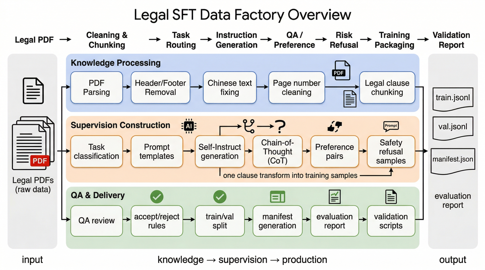

エンジニアリングの観点から見ると、このプロジェクトは 3 つのフロアに分かれています。

### 4.1 第 1 層: 知識処理層

この層は、「クリーンで管理可能な法的知識があるかどうか」を扱います。主に以下が含まれます：

* PDF の解析
* ヘッダーとフッターのトリミング
* 中国語の単語の分割修復
* 埋め込まれたページ番号のクリーニング
* 条項のスライスと構造化

このステップの目標は、トレーニング サンプルを生成することではなく、元の法律テキストを監督シードとして適切な知識単位に変換することです。

### 4.2 第二層：監視構造層

この層は、「知識の断片をさまざまな種類のトレーニング サンプルに変換する方法」という問題を解決します。主に以下が含まれます：

* タスクの種類の区分
* プロンプトテンプレートとコマンドシステムの設計
* 自己指示合成
* CoT明示的
* 優先ペアの構築
* リスク拒否のサンプル構造

このステップは、モデルが「条項を暗記する」か「法務業務で安定して動作する」かを決定するため、プロジェクト全体の中核部分です。

### 4.3 第 3 層: 品質検査と納品層

このレイヤーが解決するのは、「これらのサンプルが本当にトレーニングやオンラインに使用できるかどうか」です。主に以下が含まれます：

* QA監査記録
* 承認/拒否ルール
* トレーニング分割
* マニフェストの生成
* 評価報告書
* プロジェクトチェックスクリプト

この時点で、プロジェクトは「データ生成実験」から「エンジニアリングクローズドループ」に変わりました。

---

## 5. プレエンジニアリング: 法的データファクトリーの重要な側面

多くのチームが垂直分野の SFT を初めて使用する場合、デフォルトでは 1 人のアルゴリズム エンジニアが知識の照合、テンプレートの作成、品質レビュー、トレーニング セットのパッケージ化を担当します。しかし、法律の現場では、このような役割の組み合わせはすぐに破綻することがよくあります。

より合理的な分割には、通常、少なくとも次の種類の役割が含まれます。

### 5.1 ドメイン設計と知識境界

タスクの境界の定義、サンプルの種類の決定、法的範囲の整理、高リスクの問題の特定を担当します。この役割は必ずしも現役の弁護士である必要はありませんが、少なくともどの質問が「答えられる知識の質問と回答」であり、どの質問が「個人の法的意見」に近いものであるかを区別できなければなりません。

### 5.2 データ処理と構造化されたオーケストレーション

PDF の解析、クリーニング ルール、スライス ロジック、データ スキーマ、中間製品の配置、セグメンテーション、および検査を担当します。この役割が重視するのは、データの安定した生成能力であり、単一の答えがどれほど美しく書かれているかではありません。

### 5.3 生成制御とタスクオーケストレーション

Self-Instruct テンプレート、タスクのサンプリング、プロンプト単語の配置、結果の後処理、バッチ呼び出し、失敗時の再試行を担当します。 「知識の入力」と「教師付きサンプルの出力」を接続します。

### 5.4 QAと受け入れの閉ループ

監査プロトコル、ランダム検査ルール、再作業メカニズム、エラー ラベル、アップグレード パスの策定を担当します。法的なシナリオでは、この役割は非常に重要です。プロジェクトが最終的に使用可能かどうかは、モデルが生成したサンプルの数ではなく、誤ったサンプルが特定され排除されているかどうかに依存するためです。

### 5.5 主要な責任領域の役割

なぜなら、多くのチームが初めて業界 SFT を実行するときに、本当に行き詰まっているのは「コードを書けない」ことではなく、制作プロセスを役割とリンクに分割できていないことであり、その結果、次のような結果が生じるからです。

* タスクの境界が定義されていない
* サンプルが正しいかどうかについては誰も責任を負いません。
* リワークルールは実装されていません
* バージョンの更新は完全に口頭による同期に依存しています

責任の分担を明確に書き留めることは、基本的に次のことを説明することになります: **業界の SFT は、シングルポイント スクリプトというよりもコンテンツ制作ラインに似ています。 **

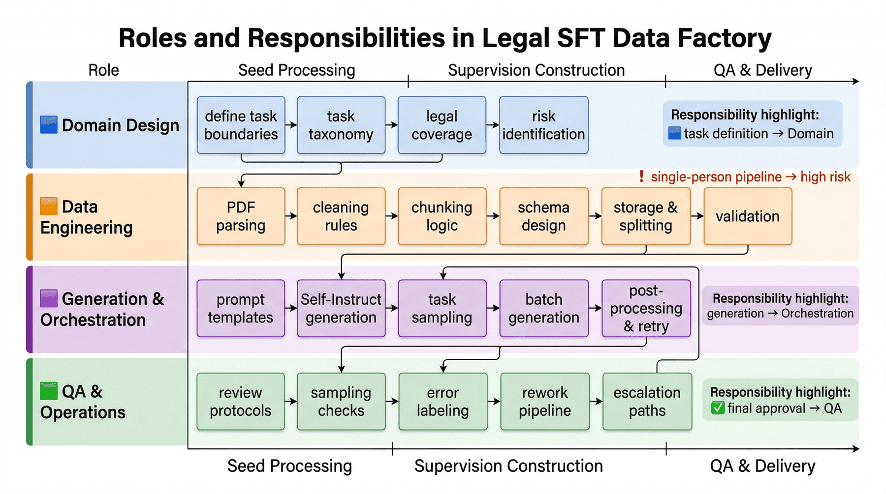

---

## 6. シード データ: シード層は監視の開始点として機能します。

一般的な Q&A では、多くのチームがナレッジ ベース、Web ページ、またはフォーラムから質問と回答のペアをトレーニング データとして直接取得します。しかし、法廷の現場はこれには適していません。

理由は簡単です。法律に関する Q&A では、ユーザーの発言が不完全であることが多く、情報源が必ずしも信頼できるものではないからです。オープンな質問と回答をトレーニングのグラウンド トゥルースとして直接使用すると、モデルは多くのあいまいな表現、未検証の結論、不安定なスタイルを学習します。

したがって、このプロジェクトは、比較的安定したシード コーパスを構築するために、法的および制度的なテキストから開始します。この層の価値は、「すべてのユーザーの問題をカバーする」ことではなく、追跡可能、説明可能、および実用的な知識ベースを提供することです。

### 6.1 最初のシードとしての規制文書

* 構造は比較的明瞭で、細かく切断するのに適しています。
* 比較的権限が高く、基本的な監督に適しています。
* 練習方法、知識に関するQ&A、ルールの概要の説明を容易にします。
* 品質管理は小規模プロジェクトの方が達成しやすいです。

### 6.2 規制文の境界

また、データ ファクトリが規制文書のみに依存している場合、2 つの明らかな問題に遭遇します。

まず、規制文書は当然のことながら「標準化された表現」に偏っており、ユーザーが実際に質問する方法と同等ではありません。
第二に、規制文書は「説明」と「引用」をサポートするのにより適していますが、複雑な事例分析、曖昧な事実分類、ビジネス シナリオの口語表現を十分にカバーできません。

したがって、規制文書は第 1 レベルのシードとして適していますが、完全な監視データそのものと誤解されるべきではありません。

---

## 7. PDF の解析とインテリジェントなクリーニング: 法律文書のフォーマット クリーニング

法令PDFの最大の特徴は、内容は非常に厳格である一方、形式が機械にとって非常に不親切であることです。

人間が読む場合、ヘッダー、フッター、ページ番号、透かし、段落区切り、2 段組レイアウト、単語区切りはそれほど問題にはなりません。しかし、機械にとって、これらはトレーニング サンプルを汚染するノイズ源となります。

### 7.1 プレーンテキスト抽出の制限

多くの初心者は PDF を処理するときに、文字列を出力できるツールを直接使用し、テキストをセグメント化のために送信します。このアプローチは、通常のシナリオではほとんど使用できないかもしれませんが、法的なシナリオでは非常に問題になります。

なぜなら、法文が解析されてずれてしまうと、次の 2 つの災害を引き起こす可能性が最も高いからです。

* もともと別々だった節が 1 つの文にまとめられました。
* 法律記事の元々連続したロジックは、ページ番号、ヘッダー、単語の区切りによって断片化されました。

これは、サンプルの読みやすさに影響を与えるだけでなく、後続の Self-Instruct が「一見合理的に見えますが、実際にはソースが間違っている」間違ったフラグメントに基づいて監視データを生成することを可能にします。

### 7.2 コンポーネントの選択

|コンポーネント |選択 |機能 |選定理由 |
| ------ | ------------- | ------------- | ------------------------------------ |
| PDF の解析 | `pdfplumber` |ページのテキストと座標を読み取る |境界ボックスに基づいてヘッダーとフッターのトリミングを行うことができ、機関向け PDF の処理に適しています |
|クリーニングロジック | `Regex` |単語の分割を修復し、ページ番号を削除し、汚れた文字を削除します。法的 PDF のエラーの多くはルールベースであり、初期段階では正則化が最も直接制御可能です。
|生成モデル | `DeepSeek-V3` |命令の合成と推論の拡張 |推論の品質とコストを考慮し、大規模合成に適しています |
|アレンジロジック | `Python` |バッチ処理、サンプリング、後処理 |再現可能な最小プロセスの迅速な構築を促進します。

### 7.3 ヘッダーとフッターのトリミング

法的 PDF で最も典型的な繰り返しノイズは、ヘッダーとフッターから発生します。たとえば、規制の名前が各ページの上部に繰り返し表示され、ページ番号または出版情報がフッターに繰り返し表示されます。解析段階で削除しないと、テキストと誤認され、トレーニング データに繰り返し入力されてしまいます。

したがって、このプロジェクトでは各ページを読み取るときに、上部と下部の約 5% の領域を直接切り取り、中央のテキスト領域のみを残します。これを行うことの利点は次のとおりです。

* 発生源からのノイズが低減されるため、抽出後の洗浄よりも安定しています。
* ほとんどの規制 PDF への優れた適応性。
* 実装はシンプルで、最小限の再現可能なソリューションとして適しています。

対応する実装は次のとおりです。

```python
with pdfplumber.open(file_path) as pdf:
    for page in pdf.pages:
        width, height = page.width, page.height
        bbox = (0, height * 0.05, width, height * 0.95)
        page_crop = page.crop(bbox=bbox)
        text = page_crop.extract_text()
```

### 7.4 埋め込まれたページ番号を削除する

ヘッダーやフッターと比較すると、より微妙な問題は、テキストに埋め込まれたページ番号です。たとえば、次のとおりです。

```text
……应当依法承担相应责任。 - 195 - 当事人……
```

「ダッシュ番号ダッシュを削除する」ルールを単純に記述すると、テキスト内に合法的に存在する番号付けやリスト構造を誤って削除してしまう可能性があります。したがって、このプロジェクトでは、より慎重な正規化によってページ番号の前後の境界を制限し、テキスト番号に簡単に触れることなく、独立したページ番号ブロックに近いフラグメントのみを削除します。

この種のクリーニングは「コードの接着」のように見えますが、エンジニアリングでは多くの場合非常に重要です。なぜなら、それが決定するのは次のとおりだからです。

> 私たちは法文に微妙な修正を加えているのでしょうか、それとも法文自体を損なうために粗雑なルールを使用しているのでしょうか?

### 7.5 中国語の単語の分割を修復する

中国語の PDF に関するもう 1 つの一般的な問題は、次のような「誤ったスペース」です。

```text
法 律 规 定
合 同 关 系
```

人間の場合、これは読解には影響しませんが、モデルの場合、単語の分割統計が破壊され、生成の流暢性に影響があり、下流のサンプルの利用可能性が低下します。そこで、本プロジェクトでは、隣接する漢字間の異常なスペースを定期的に修復し、複数回の置換により単語切れが続く状況に対処します。

### 7.6 きめ細かい洗浄制御の必要性

なぜなら、業界の SFT の最初のステップは、「より多くのデータを生成する方法を見つける」ことではなく、まずシード層が汚れていないことを確認することだからです。シード テキストに多くの書式設定の損傷がある限り、後続のテンプレート、CoT、設定、QA はすべて汚いベースで機能し、コストはますます高くなるだけです。

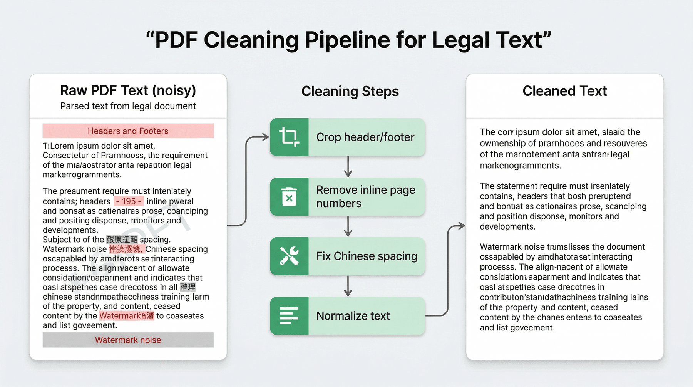

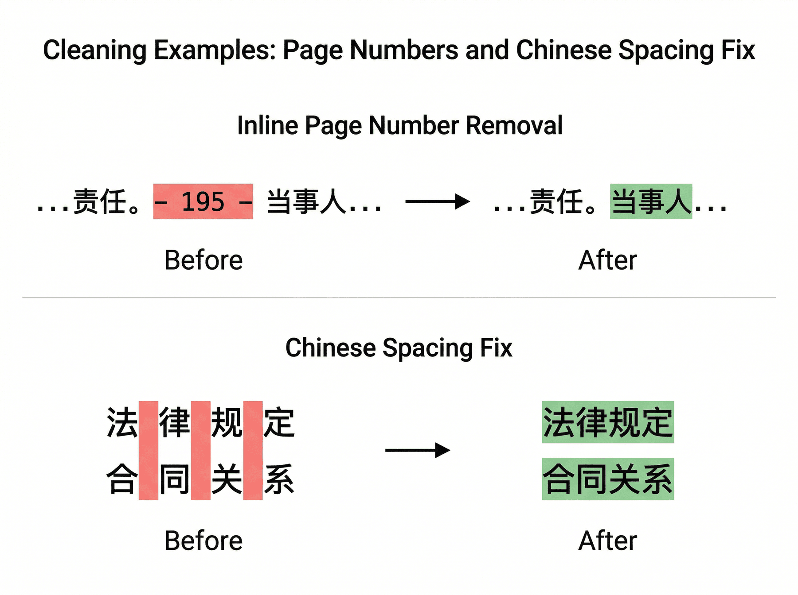

---

## 8. ダイシングとスキーマ: 法的シードへの構造化されたアプローチ

基本的なクリーニングが完了した後、プロジェクトは長いテキストを生成モデルに直接送信せず、最初に**切り取りと構造化**を行います。

### 8.1 必要なステップとして細かく切断する

規制や制度に関する文章は非常に長いことが多く、それをモデルに直接入力する場合には 3 つの問題があります。

* コンテキストが長すぎ、高価で、ノイズが多いです。
* さまざまな記事のトピックが混在しているため、単一の監視単位として使用するのには適していません。
* 将来的にサンプルの出所を追跡することは困難であり、QA や後戻りには役立ちません。

したがって、より合理的なアプローチは、法的条項、条項の段落、または比較的独立した知識に基づいて各部分を断片に切り出し、各断片を追跡可能な種子サンプルに変えることです。

### 8.2 ここでスキーマはどのような問題を解決しますか?

いわゆるスキーマは見栄えを良くするためのものではなく、後続のすべてのリンクが統一フィールドに基づいて連携できるようにするためのものです。一般的な合法種子サンプルには、少なくとも次のものが含まれている必要があります。

* `id`: 一意の識別子
* `source_name`: ソース規制またはシステム名
* `article_no`: 小節番号またはチャプター位置
* `text`: クリーンアップされたテキストフラグメント
* `task_type`: 将来的にはどのような種類のタスクが拡張される予定ですか?
* `risk_level`: リスクの高いトピックかどうか
* `metadata`: バージョン、クリーニングログ、分析ソースなどの追加情報。

このスキーマ層を使用すると、プロジェクトは次のことを行うことができます。

* 特定の監督サンプルがどの法律に基づいているかを追跡します。
* さまざまなソースからのサンプル分布を比較します。
* 高リスクサンプルを個別にトリアージします。
* トレーニング セット内で問題を発見したら、上流のシードを確認します。

### 8.3 シード層ベースとしてのスキーマ

なぜなら、多くのデータ プロジェクトが失敗するのは、モデルが貧弱だからではなく、最初に統一されたフィールドが確立されていなかったためです。その結果、次のような結果が生じます。

* QA はソースをレビューできません。
* 好みのペアを対象サンプルに関連付けることはできません。
* train/val セグメンテーションはソースごとに分離できません。
* バージョンのロールバックを開始する方法はありません。

スキーマは業界の SFT ファクトリーの基礎であり、付属品ではありません。

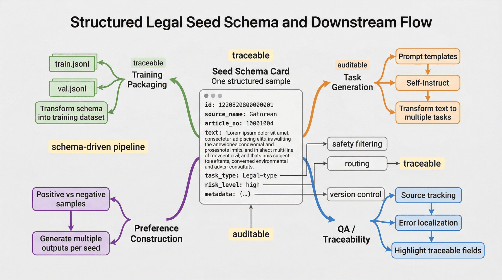

---

## 9. タスクシステム: 法的SFTのタスク階層

チームに合法的な SFT を直観的に実行するように依頼した場合、取得するのが最も簡単なデータ セットは次のようなものになることがよくあります。

> 指示: 民法第 30 条について説明してください。
> 出力: この記事では...

このようなサンプルは確かに貴重ですが、データセット全体がこのようであれば、モデルは単なる「法則の再現」で終わってしまいます。

法務の現場で本当に求められるのは、ただ規範的な文章を暗唱するだけではなく、さまざまな業務形態において安定して業務を遂行できる能力です。したがって、このプロジェクトでは、監督タスクを少なくとも 3 つの主要なカテゴリに分類します。

### 9.1 法的Q&A (legal_qa)

このタイプのタスクは、実際のユーザーの質問に近いシナリオを対象としています。重点を置くのは次の点です。

* 規範的な表現をユーザーが理解できる質問に変換します。
* 比較的明瞭な自然言語で回答します。
* 必要に応じて、条件付きの説明と境界のヒントを提供します。

このタイプのタスクは、モデルの「ユーザー インターフェイス機能」をトレーニングします。

### 9.2 法令の説明

このタイプのタスクは、原文の理解と規範的解釈を目的としており、次の点に重点を置いています。

* 条項の意味を回復する。
* 適用される条件を説明します。
* 重要な概念を区別する。
* 必要に応じて、どのような状況がこの記事で直接カバーされないのかを示してください。

この種のタスクは、モデルの「標準的な表現能力」を訓練します。

### 9.3 ケース分析 (case_anasis)

これは、法的推論に最も近いタイプのタスクであり、以下の点に重点が置かれています。

* 事実から議論を抽出します。
* 関連する法的規定がどのように適用されるかを決定する。
* 結論が確立されるための条件と不確実性を説明します。
* 事実が不十分な場合は、恣意的な結論を下さないようにしてください。

このタイプのタスクは、モデルの「事実とルールのマッピング能力」をトレーニングします。

### 9.4 タスク分割の品質管理の役割

タスクの分割はテーブルをより美しくするためではなく、非常に一般的な問題を回避するために行われます。

> サンプルがたくさんあるように見えますが、実際にはすべてのサンプルが同じ能力を繰り返し訓練しています。

法律分野においては、この「見かけは多様でも実態は統一」という問題が特に深刻です。質問応答、説明、分析、その他の機能を明確に区別することによってのみ、モデルはより完全な動作分布を学習する機会を得ることができます。

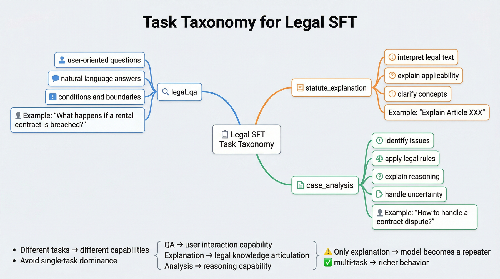

---

## 10. タスクの分散とサンプル構造：分散バランス制御法

タスク システムが整備されたら、次の問題は「それを生成できるかどうか」ではありません。ただし、「生成されたディストリビューションが健全かどうか」は重要です。

このプロジェクトの現在の製品には、3 つの主要カテゴリのそれぞれに 2,577 のタスクがあり、タスク構造が比較的バランスが取れていることを示しています。最終的なトレーニング セットのサイズは 7,737 エントリであり、プロジェクトが規制のシードからより完全な監督データ資産のセットまで拡張できたことを示しています。同時に、法的情報源の分布は不均等であり、民法の関連サンプルが 3,882 件、刑法の 1,710 条、会社法の 855 条があります。さまざまな法的分野のカバー範囲が依然として明らかに集中しています。

この一連の数字は少なくとも 3 つのことを意味します。

まず、このプロジェクトはもはや「ランダムにいくつかのサンプルを作成する」というものではなく、比較的明確なタスク構造を形成しています。
第 2 に、工場にはシードからマルチタスク監視サンプルまで拡張する能力がすでに備わっています。
第三に、法的な適用範囲は依然として次のステップで最も最適化する必要がある領域の 1 つです。

### 10.1 タスクのバランシングとソースの配布

タスクの種類だけを見てみると、3 種類のサンプルは確かにバランスが取れています。しかし、ソースをさらに詳しく見てみると、サンプルが主にいくつかの法的管轄区域に集中していることがわかります。これは、モデルは「タスク形式」の点では比較的バランスが取れていますが、「知識の分布」の点では依然として特定の領域に偏っている可能性があることを意味します。

### 10.2 サンプル構造の重要性

なぜなら、サンプルの総数は「スケールがどのくらいの大きさか」には答えられるだけで、「モデルのどこに偏りが生じるか」には答えられないからです。産業データ エンジニアリングでは、多くの場合、絶対的なサイズよりも分散構造の方が重要です。

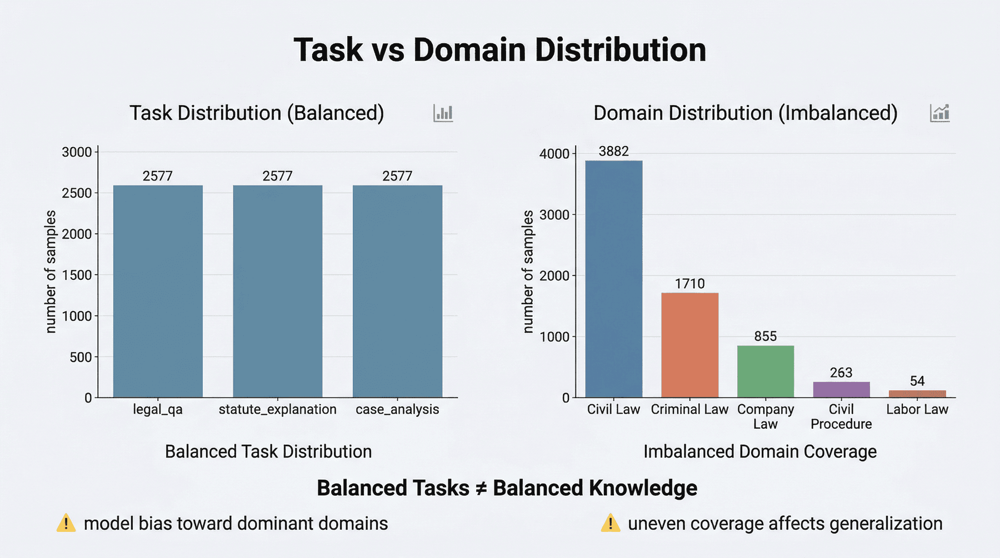

---

## 11. Self-Instruct: 制御合成の必要性

規制シードから SFT サンプルまで、その中間で最も重要なステップは合成拡張です。このプロジェクトでは、人間がすべての法的な質問と回答を 1 つずつ書く必要はありません。代わりに、プロジェクトでは Self-Instruct メソッドを使用して、教師モデルが法的規定とタスク テンプレートに基づいて候補サンプルを自動的に生成できるようにします。

### 11.1 合成拡張の役割

手作業のみに依存すると、プロジェクトはすぐにコストで圧倒されてしまいます。現在のプロジェクトの推定手動レビュー時間に基づくと、193.28 時間に達し、対応するレビューコストは約 23,193.6 元です。メインのサンプルをすべて手動で作成すると、全体的な投資額が高くなります。むしろ、最初は教師モデルを使って自動拡張し、レビューや難しい案件にマンパワーを集中させる方が現実的です。

### 11.2 法的構成に関する制約

一般的な Q&A では、生成モデルはさまざまな自然言語の回答を比較的自由に書くことができます。しかし、法的なシナリオでは、自由が大きくなるほどリスクも高くなります。モデルは簡単なので、

* 無関係な文節を一見正しい答えにつなぎ合わせます。
* 実際には根拠のない結論を常識的に補足してください。
* 自信過剰に「何をすべきか」の提案を出力する。
* 境界問題については少しも不確実性を残さないでください。

したがって、このプロジェクトでは、完全にオープンな生成ではなく、テンプレートの制約の下で合成を使用します。教師モデルの自由度は、タスク テンプレートと形式の要件によって制御されます。

### 11.3 加重ルーレットとタスクのサンプリング

データ分布を期待どおりにするために、プロジェクトでは 3 種類のタスクの単純な平均ランダム化を行わず、加重ルーレット メカニズムを通じてサンプリングを行います。その中心的なアイデアは次のとおりです。

* 複雑なケース分析は、モデルの価値の高い推論能力をより適切にトレーニングできるため、モデルの重みが高くなります。
* 法的文書や概念分析などのタスクも重要ですが、この段階ではサンプル割り当てを過密にする必要はありません。
* タスク比率は、乱数に暗黙的に含まれるブラック ボックスではなく、明示的に調整可能なエンジニアリング パラメーターである必要があります。

このアプローチの価値は、「データ分布」を統計後の結果ではなく、制御可能なオブジェクトに変えることです。

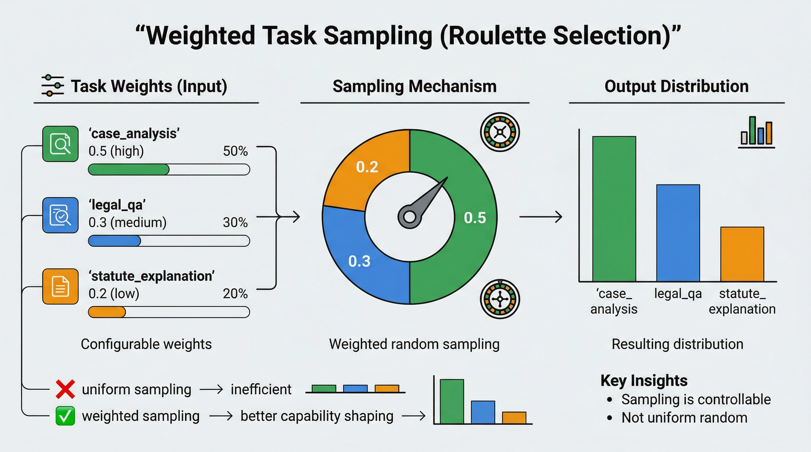

---

## 12. CoT の明示性: 法的推論に対する表現上の制約

多くのチームが法的な SFT を行う場合、「専門家の感覚」を「長くて形式的な答え」として解釈してしまいがちです。しかし、実際にモデルを法務アシスタントらしくするのは、多くの場合、長さではなく、推論プロセスが見えるかどうか、結論が階層的かどうか、境界が表現されているかどうかです**。

### 12.1 明示的思考チェーンの役割

事例分析タスクは特に中間推論に依存します。トレーニング データが最終結論のみを保持している場合、モデルは多くの場合、結果を出力することのみを学習しますが、次のことは学習しません。

* まず争点を特定します。
* 次に、適用される規格を決定します。
* 次に、条件付きの結論を出します。
* 最後に、不確実性もあります。

したがって、プロジェクトの生成後の処理中に、モデル出力の「思考プロセス」フィールドを明示的に作成し、それを統一されたマークダウン形式またはセグメント化された形式に結合するように最善を尽くします。この目的は、「モデルが思考のように見える」ことを追求することではなく、トレーニング プロセスのためのより完全な動作テンプレートを提供することです。

### 12.2 CoT 使用法上の境界

法的シナリオにおける CoT を無限に拡張することはできません。長すぎる推論、詳細すぎる推論、または内部派生ログに類似しすぎる推論は、エンド ユーザーとして直接回答するのに必ずしも適しているとは限りません。より実践的なアプローチは、次のように「構造化推論」レベルで CoT を制御することです。

1. 論点の整理
2. 比較ルール
3. 適用条件の分析
4. 結論と境界線を与える

この形式では、サンプルを長い独り言に変えることなく、推論のパスが保存されます。

### 12.3 CoTの工学値

このプロジェクトでは、CoT の価値は主に次の 2 つの側面に反映されます。

* モデルが法的分析に近い表現順序を学習できるようにします。
* QA レビューのためのより明確な中間基盤を提供し、「結論は正しいが推論が間違っている」サンプルを特定しやすくします。

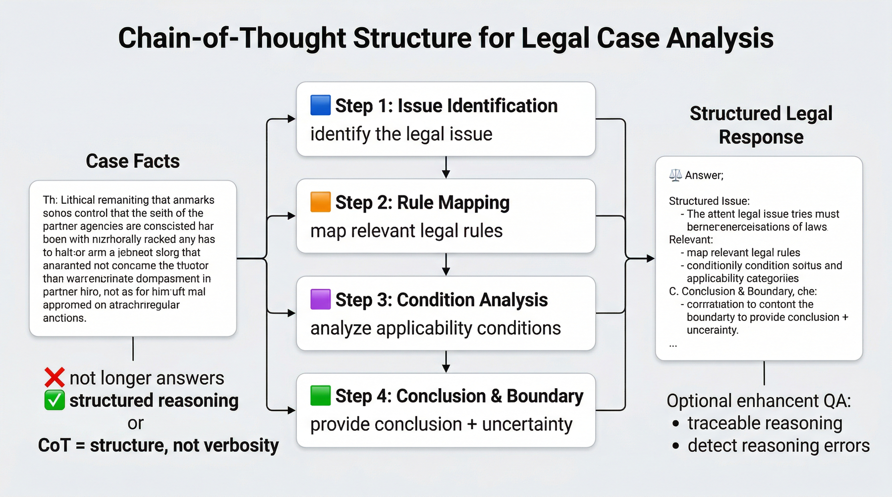

---

## 13. プリファレンスペアとレビュー記録: 多層監視信号

多くの場合、SFT サンプルだけがモデルに「何が受け入れられる答えなのか」を伝えることしかできません。しかし、法的なシナリオでは、これでは十分ではありません。なぜなら、多くの答えには単純に「正しい」か「間違っている」というものではなく、スタイル、リスク、境界管理、表現上の注意の違いが含まれるからです。

ここで、優先順位のペアが重要になります。

### 13.1 法的シナリオにおける優先ペアの役割

これにより、次のような状況が解決されます。

* どちらの答えも基本的には正しいですが、一方の答えはより抑制的で、より明確で、恣意的ではありません。
* どちらの回答もルールについて言及していますが、一方の回答はルールが適用される条件をより説明しています。
* どちらの回答もアドバイスを提供していますが、もう 1 つは有益なメモと法的アドバイスをより適切に区別しています。

これらの違いは単一のラベルで表現するのが難しく、「どちらが優れているか」を表現するには好みの調整が適しています。

### 13.2 現在のプロジェクトの優先信号の構築

プロジェクトの現在の成果物は、好みのペアの数が 7731 であることを示しており、これは被験者が受け入れた SFT の数と基本的に平行しています。これは、工場が最初に SFT を完了してから一時的にプリファレンスを追加するのではなく、最初からプリファレンス信号をメインの監視と並行して構築される資産として扱っていることを示しています。

### 13.3 レビュー記録の役割

多くのチームは QA を完了した後、「合格」サンプルのみを保持し、レビュー記録を保持しません。これにより、次の 2 つの問題が発生します。

* このサンプルがなぜ受け入れられたか拒否されたのかは、後になっては誰にもわかりません。
* 失敗したサンプルをリサイクルしたり、テンプレートを逆に修正したりすることはできません。

したがって、このプロジェクトにはレビュー記録が製品の一部として含まれています。これを行うことの利点は次のとおりです。

* 追跡可能なサンプル品質履歴。
* 二次仲裁をサポートできます。
* エラー パターンは、拒否の理由から発生する可能性があります。
* これにより、次回のテンプレート最適化の基礎を提供できます。

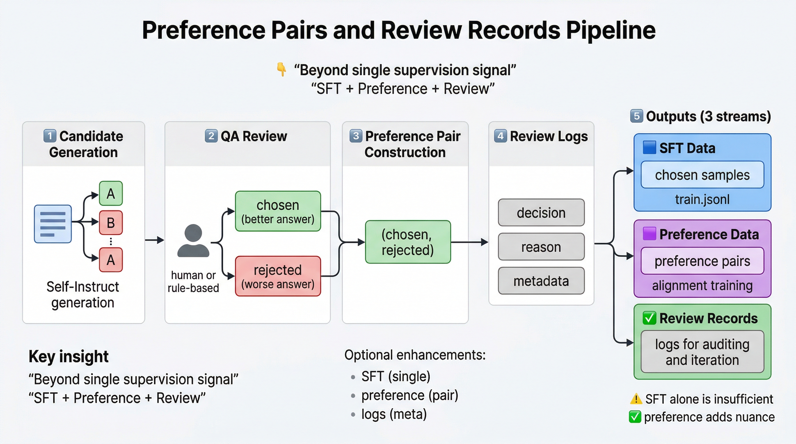

---

## 14. リスク否認: 国境管理データ

法的シナリオは通常、一か八かのシナリオです。このモデルは「回答が多ければ多いほど良い」というものではありませんが、いつ拒否するか、手動に移行するか、境界線を維持するかを認識する必要があります。

### 14.1 リスクの拒否とシステムプロンプトの関係

多くのチームは、オンラインに移行する前に考えるでしょう。いずれにしても、システム プロンプトにはすでに「特定の法的アドバイスを提供しない」と書かれており、それだけで十分です。実際、それだけでは十分とは言えません。

なぜなら、モデルが実際に学習する行動パターンは、最初にトレーニング データから得られるからです。トレーニング セットに多数のものが含まれる場合:

* 個々のケースについて直接結論を導き出す。
* 証拠が不十分な問題については決定的な勧告を行う。
* 非常に機密性の高い質問に対して過度に操作的な回答を出力する。

その場合、推論中にシステム プロンプトに依存するだけでは、これらの動作を安定して抑制することは多くの場合困難です。

### 14.2 リスク拒絶サンプルの役割

危険な拒否サンプルの本質は、「安全に答えない方法」という行動パラダイムをモデルに提供することです。例えば：

* 情報が不足していることを明確に述べてください。
* リマインダーは、特定の事実や証拠と組み合わせる必要があります。
* 一般的な法的情報と個々の事件の意見を区別する。
* 専門家にさらに判断を求めることをお勧めします。

### 14.3 現在のプロジェクトのリスク境界の構築

既存製品ではリスク拒否サンプルとリスク登録項目が6項目あります。これは少額ですが、プロジェクトがリスクの境界を「口頭での考慮事項」から明示的なデータ資産に移したという重要なシグナルを送っています。

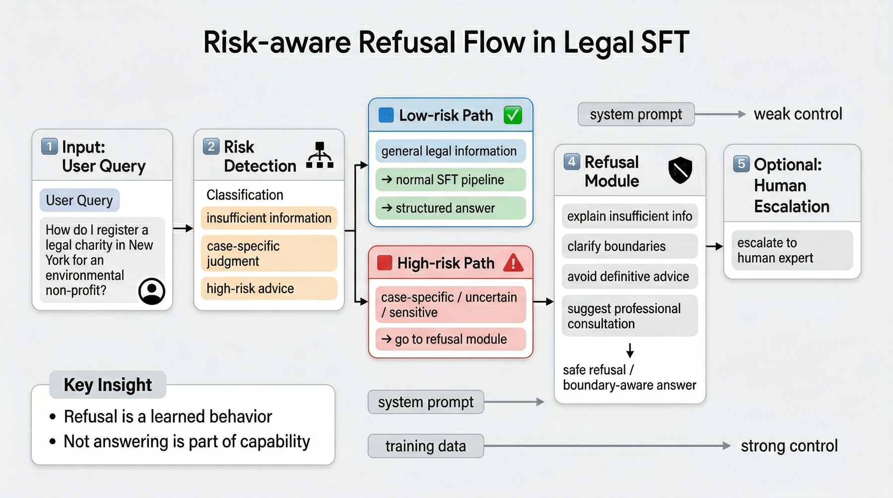

---

## 15. QAプロトコル: 法的データの品質ゲート

業界の SFT で最も過小評価されているのは QA です。多くの場合、チームは「より多くのサンプルを生成する方法」にエネルギーのほとんどを集中させますが、オンライン プロセスの品質を実際に決定する「不良サンプルをブロックする方法」を無視します。

法的なシナリオでは、適格な QA プロトコルは少なくとも 3 つのことに答える必要があります。

1. どのような種類のサンプルを受け入れるべきですか?
2. どのようなサンプルを拒否する必要がありますか?
3. 問題が発見された後、1 回限りのクリーニングを行うのではなく、どのようにやり直しますか?

### 15.1 監査の次元

監査の次元は次の 5 つの項目に分割できます。

* **正しさ**: 結論がシード規制およびミッションの意図と一致しているかどうか。
* **完全性**: 主要な条件、例外、または該当する前提条件が欠落しているかどうか。
* **表現の明確さ**: 専門家以外のユーザーでも理解できるかどうか。
* **形式の一貫性**: 確立された出力テンプレートに準拠しているかどうか。
* **リスク境界**: 境界を越えて、ケースバイケース、恣意的、または非常に機密性の高いアドバイスを提供するかどうか。

### 15.2 受け取り、やり直し、および拒否のルール

実行可能な QA プロトコルには、「合格/失敗」という 2 つの状態だけがある必要はありません。より実用的な設計には、少なくとも次のものが含まれます。

* **承認**: トレーニング セットに直接入力できます。
* **修正**: 本文は正しいですが、表現、形式、境界線が不十分であり、修正が必要です。
* **拒否**: 事実または仕様のエラー、リスクが高すぎる、タスクの不一致、トレーニング アセットに入力されていません。

### 15.3 エラーのラベル付け

拒否されたサンプルには、QA レコード内で次のように誤ったラベルを付けることをお勧めします。

* 引用エラー
* 結論は限界外です
* 条件がありません
* 不適切なスタイル
* タスクの不一致
* 事実が不十分にもかかわらず答弁を強要

### 15.4 QAプロトコルの必要性

生成ロジックのみを作成し、QA プロトコルを作成しない場合、業界 SFT は簡単に「データ ファクトリ メソッド」ではなく「データ生成チュートリアル」に堕落してしまいます。

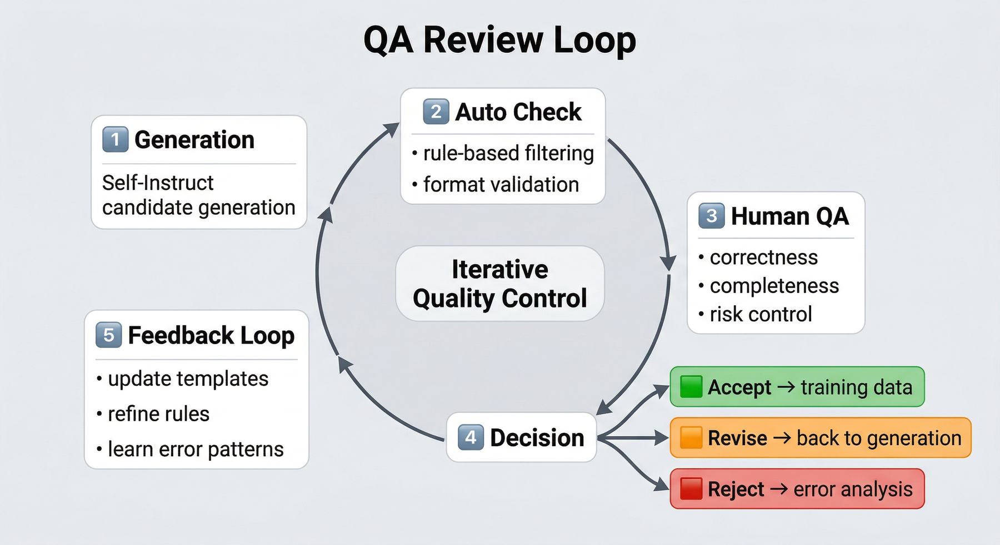

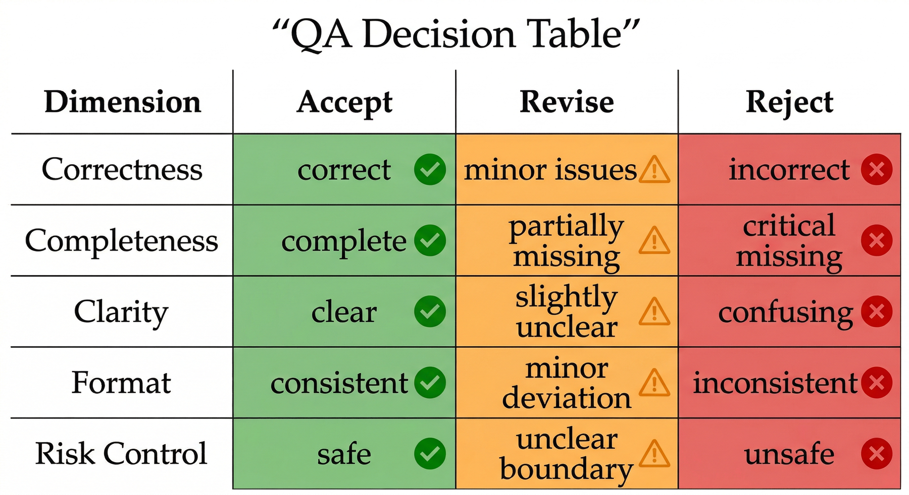

---

## 16. サプライヤーの連携と人・機械の分業：規模拡大中の監査メカニズム

小規模な実験では、多くの場合、チーム メンバーがレビュー作業のほとんどを自分たちで完了できます。しかし、プロジェクトが継続的な反復に入ると、手動レビューのコストがすぐに大きなボトルネックになります。

現在のプロジェクトの手動レビューの推定時間は約 193.28 時間、レビュー費用は約 23,193.6 元です。この数字は、たとえそれがまだ手法実証プロジェクトであっても、人間によるレビューのコストが低くないことを示しています。より合理的な階層的なレビューとサプライヤーの協力メカニズムなしで拡大を続けると、コストはすぐに制御不能になります。

### 16.1 階層的レビュー

すべてのサンプルが同じレベルの人的介入を必要とするわけではありません。通常、より合理的なアプローチは次のとおりです。

* リスクが低く、ルールが明確なサンプルは、最初に機械によって事前検査されます。
* 中リスクのサンプルは、アノテーターまたはドメイン運用担当者によってレビューされます。
* その後、高リスクまたは分岐したサンプルは上級職員または専門家の仲裁にエスカレーションされます。

### 16.2 サプライヤーとの協力のリスク

外部の注釈またはレビュー リソースが導入されると、チームは次の 2 つの落とし穴に陥る可能性が高くなります。

* 「なぜそうするのか」ではなく、「何をすべきか」だけを与えてください。
* 仕様のみを示し、反例や境界例は与えません。

これは特に法的なシナリオに当てはまります。 「答えが正しいかどうか判断してください」という単なるガイドラインでは十分ではありません。査読者は以下を確認する必要があります。

* 基本的に正しいが、恣意的すぎるため返す必要がある答えはどれですか。
* たとえ答えが保守的であっても、過度に保守的であれば、その回答は適格ではありません。
* どの質問が回答を追加し続けるのではなく、リスク拒否を引き起こすか。

### 16.3 コラボレーションメカニズムのプロジェクトの場所

データ ファクトリの「ファクトリ」という言葉は、最終的にはコラボレーション メカニズムに当てはまらなければならないからです。人やプロセスについて書かずにモデル、テンプレート、スクリプトだけを書くと、チームの実装を真にサポートすることが難しくなります。

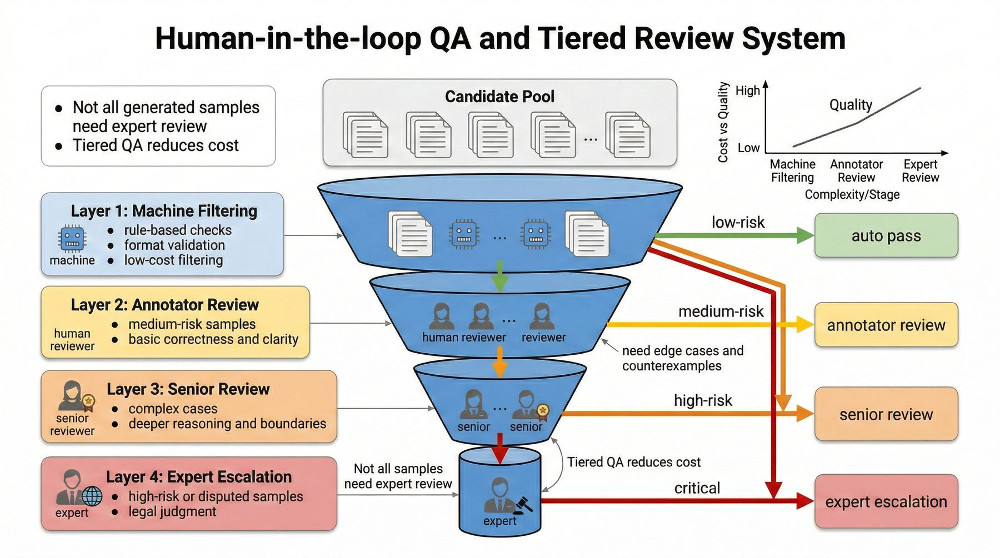

---

## 17. トレーニングのカプセル化: 監視サンプルからトレーニング インターフェイスまで

生成、レビュー、および設定構造が完了した後、データ ファクトリは、これらのプロダクトをトレーニング側で直接使用できるインターフェイスにカプセル化する必要もあります。

### 17.1 別の段階としてのトレーニングのカプセル化

多くのプロジェクトはサンプルの完成後に終了しますが、実際にトレーニングに入って初めて次のことを発見します。

* フィールドが統合されていないため、トレーニング スクリプトを読み取ることができません。
* train/val セグメンテーションは不安定です。
* スモーク テストは実際のサンプル形式を表すことはできません。
* レポート、メトリック、データ ファイルが相互に一致しません。

したがって、トレーニングのカプセル化では、単に JSONL をエクスポートするだけでなく、次のことが保証されます。

* 件名フィールドは完了しています。
* トレーニングと検証の分割は再現可能です。
* マニフェストにはデータ範囲とバージョンを記述することができます。
* スモーク テストにより、インターフェイスの問題がすぐに明らかになります。

### 17.2 このプロジェクトの主なトレーニング成果物

* `final_sft_dataset.jsonl`
* `train.jsonl`
* `val.jsonl`
* `smoke_test.jsonl`
* `training_manifest.json`

### 17.3 スモークテストの機能

スモーク テストの価値は、モデルのパフォーマンスを評価することではなく、フィールドの欠落、コーディング エラー、サンプル形式の一貫性のなさ、読み取りロジックとマニフェストの不一致など、トレーニング リンク内の明らかな問題をできるだけ早く検出することです。

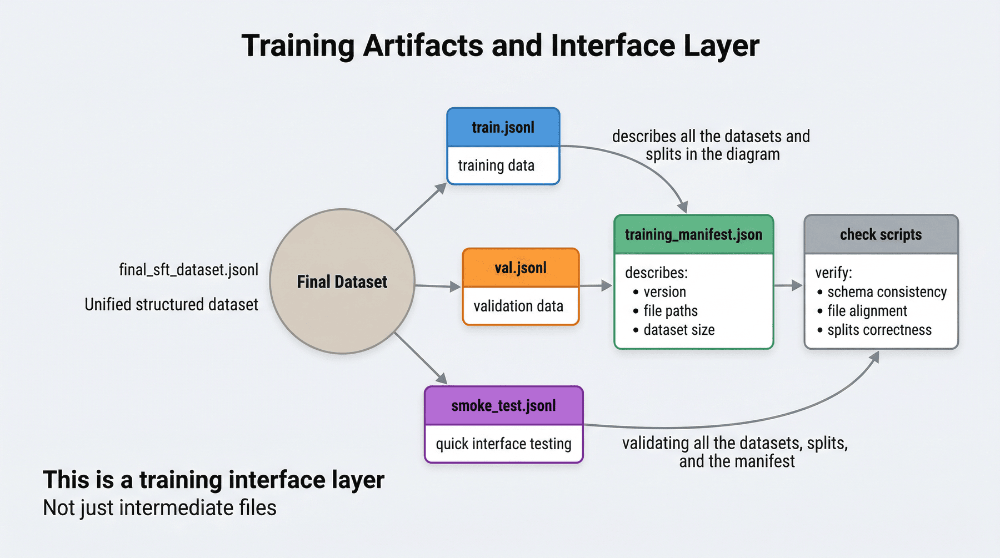

---

## 18. 結果表示: 現在のプロジェクト出力の概要

現在の結果から判断すると、P02 は法律分野で比較的完全な監視資産を形成しており、下流検証を追加した後、このプロジェクトはもはや単なる「データ ファクトリ プロセスのランスルー」ではなく、監視信号の有効性の軽量検証を行う機能を持ち始めています。

### 18.1 サンプルサイズ

* シード法の数: `2577`
* テンプレート教師によって生成された価値の高い SFT: `7731`
* ヒューリスティックな審査員によってフィルタリングまたは構築された低品質のコントロール: `7731`
* 優先ペアの数: `7731`
* 最終的なトレーニング セットのサイズ: `7737`

これは、このプロジェクトが、少数の手動サンプルや 1 回限りのサンプル データにとどまるのではなく、元の規制のシードから大規模で完全に構造化された監督資産のセットにまで拡大したことを示しています。

### 18.2 タスクの分散

現在の 3 つの主要なタスク カテゴリは引き続き完全に連携しています。

* `legal_qa = 2577`
* `statute_explanation = 2577`
* `case_analysis = 2577`

この分布は、プロジェクトがタスク レベルで適切な制御機能を備えており、特定のタスク タイプがサンプル スペースを大幅に占有する状況がないことを意味します。

### 18.3 ソースの配布

現在の法的情報源の分布は次のとおりです。

* `中华人民共和国民法典 = 3882`
* `中华人民共和国刑法 = 1710`
* `中华人民共和国民事诉讼法 = 951`
* `中华人民共和国公司法 = 855`
* `中华人民共和国劳动法 = 333`

これは、このプロジェクトがすでに管轄区域を越えて拡張する能力を備えていることを示していますが、異なる管轄区域の範囲は依然として不均一であり、民法に関連するサンプルの割合が大幅に高くなっています。

### 18.4 選好とリスクのデータ

* QA レビュー記録: `7731`
* 高リスク拒絶サンプル: `6`
* 平均 QA 評価: `5.0`

これは、プロジェクトがメインの SFT データを構築しているだけでなく、QA、好み、リスク境界に関連する補助的な監視レイヤーも構築していることを示しています。業界の SFT にとって、これは単に合計サンプル サイズを増やすことよりも重要であることがよくあります。

### 18.5 トレーニング層および配信層の製品

* トレーニング セットの分割: `train = 6947`、`val = 790`、`smoke = 24`
* `training_manifest.json` カプセル化が完了しました
* プロジェクトチェックリンクが通過し、トレーニングとレポートの副産物を相互に調整できます。

これは、プロジェクトの出力が「複数の JSONL ファイル」ではなく、トレーニング側で直接使用でき、スクリプトの整合性チェックによって検証できる一連の資産であることを示しています。

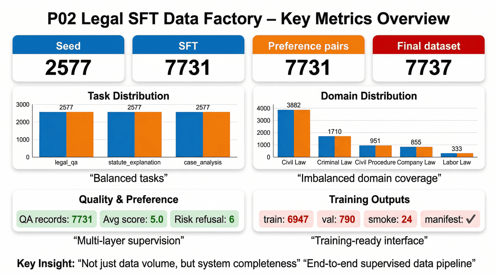

---

## 19. 軽量なダウンストリーム検証: 最小限の検証設計

以前のバージョンでは、P02 はすでに「データ ファクトリがスムーズに動作している」ことを示すことができました。しかし、プロセスが存在することを証明するには十分ではありません。次の質問に答えることがより重要です。

> QA、プリファレンス構築、リスクガバナンスを経たこのデータは、未処理または低品質の候補よりも本当に優れているのでしょうか?

新しい軽量ダウンストリーム検証は、まさにこの問題を解決するものです。

### 19.1 設計の検証

このプロジェクトは、固定ランダム シード `seed = 20260409` の下で 50 個のペアのサンプルをランダムにサンプリングし、2 種類のデータ (`chosen` と `rejected`) に対して軽量の品質検証を実行します。ここでの目標は、完全なモデルのベンチマークを追求することではなく、プリファレンスと QA が実際にコスト管理可能かつ再現可能な方法で品質ギャップを引き起こしているかどうかを迅速に回答することです。

この検証方法は現段階のプロジェクト目標に適しています。ここで焦点を当てているのは、完全な下流モデルの論文ではなく、データ エンジニアリング手法です。優れたダウンストリーム検証は最初から重いものである必要はありませんが、少なくとも 3 つの要件を満たす必要があります。

* 再現できる。
* 説明できる。
* 以前のデータ設計の前提条件に直接対応できます。

### 19.2 検証指標

この 50 項目のサンプリングでは、プロジェクトはいくつかの非常に代表的な指標カテゴリーを使用しました。

* `chosen` 平均品質スコア
* `rejected` 平均品質スコア
* ペア勝率
* 法律引用範囲
* 安全でないショートカットの表現率

これらの指標の良い点は、それらが純粋に抽象的なスコアではなく、法的 SFT の本当の目標に直接関連していることです。

* 品質スコアは全体的な受容性を反映します。
* ペアの勝率は、選好構造が実際に良い回答と悪い回答を区別しているかどうかを反映します。
* 法的記事の引用範囲は、回答が法的根拠を保持しているかどうかを反映します。
* 安全でないショートカットの発現率は、リスクの高い任意の発現が効果的に抑制されているかどうかを反映します。

### 19.3 検証結果

現在の結果から判断すると、次のようになります。

* `chosen` 平均品質スコア: `5.0 / 5`
* `rejected` 平均品質スコア: `1.0 / 5`
* 試合勝率: `100.00%`
* 法的記事の引用範囲: `chosen = 100.00%`、`rejected = 0.00%`
* 安全でないショートカットの表現率: `chosen = 0.00%`、`rejected = 100.00%`

この一連の数値はライト サンプリングから得られたものですが、非常に明確に示しています。

まず、現在のプリファレンス構造と QA メカニズムは正式に「レビュー」されていませんが、実際には高品質のサンプルと低品質のサンプルを区別しています。
第 2 に、法的シナリオにおいて重要な 2 つの目標 (法的根拠の維持と恣意的な近道を避ける) は、`chosen/rejected` 間で大きな違いを示しています。
第三に、P02 の教師あり設計は、非常に重要なエンジニアリング機能を持ち始めました。つまり、サンプルを生成できるだけでなく、これらのサンプルがトレーニング セットに含める価値がある理由を最初に証明することもできます。

### 19.4 軽量検証と高重量ベンチマークの違い

ここでの下流検証はまだ**軽量検証**であり、完全なトレーニングベンチマークではなく、紙ベースのアブレーション研究でもないことを強調しておく必要があります。その価値は、大規模なレビューを置き換えることにあるのではなく、この章の過去のパズルの最も弱いピースを埋めることにあります。

> 「データ構造は合理的である」から「データの効果は予備的な証拠によって裏付けられている」まで。

このステップはすでに非常に重要です。なぜなら、多くのデータ エンジニアリング プロジェクトの最大の問題は、テスト後の検証を行わずに構築プロセスについてのみ言及していることだからです。結局のところ、出力されたデータが本当に有効であるかどうかを判断することは困難です。

### 19.5 この一連の結果の工学的意味

この軽量な検証により、少なくとも 3 つのエンジニアリング レベルのシグナルがもたらされました。

まず、プリファレンスペアと QA 記録は保存する価値があり、不可欠な付属品ではないことを示します。これらはサンプルをスクリーニングするのに役立つだけでなく、その後のトレーニングのためのより明確な行動境界も提供します。

第二に、「明示的な法的根拠」の設計が有効であることを示している。 `chosen` サンプルは法的参照範囲が 100% に達していますが、`rejected` は 0% です。これは、現在のテンプレートと品質検査メカニズムにより、モデルの出力が一般的な話ではなく実際の法的説明に近づくよう大幅に促進できることを示しています。

第三に、「セキュリティ境界の明示性」が効果を発揮し始めていることを示しています。安全でないショートカットの表現率は、`chosen` では 0%、`rejected` では 100% です。これは、プロジェクトが推論中にこの問題をシステム プロンプトに完全に任せるのではなく、データ レベルで高リスクの表現を積極的に抑制できたことを意味します。

### 19.6 このような実験をどのように解釈するか

このタイプの実験のポイントは、特定の極端な結果を主張することではなく、次の 3 つのことを説明することです。

* 最小限の再現可能なダウンストリーム検証が追加されました。
* これは、前に示した主要な設計の前提条件を直接検証します。
* すべての評価問題を一度に解決しようとするのではなく、その後のより重いトレーニング実験の方向性を提供します。

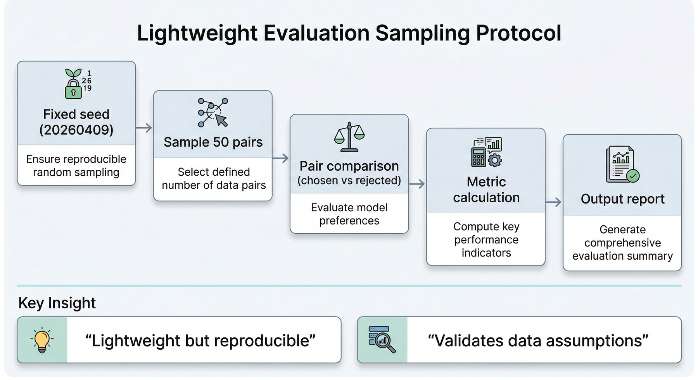

---

## 20. 結果の解釈: 現在のデータ ファクトリの構造シグナル

単に結果を列挙するだけでは意味が限られます。さらに重要なのは、これらの数値に反映されているエンジニアリングの現状を理解することです。

### 20.1 2577 年から 7737 年まで。工場が拡張する能力があることを示します。

これは、プロジェクトが「法規文の整理」の段階に留まらず、知識シーズからマルチタスク監視データへの拡張を達成したことを示している。

### 20.2 3 種類のタスクのバランスが取れており、タスクの枠組みが安定していることを示しています

特定のタイプのタスクが他のタスクよりもはるかに多い場合、それは通常、テンプレート システムまたはサンプリング ロジックに不均衡があることを意味します。現在の 3 種類のタスクの数は完全に一致しており、タスク分散層の制御性が高いことがわかります。

### 20.3 管轄区域の不均等な分布は、次の段階の焦点が拡大を続けることではなく、適用範囲を補完することであることを示しています。

現在の主な対立は、もはや「サンプルがあるかどうか」ではなく、「サンプル範囲のバランスが取れているかどうか」です。これは、単にヒープ数を継続することよりも重要です。

### 20.4 設定、QA、および軽量の下流検証は、プロジェクトが「適切な応答」から「より安定した応答」に移行していることを示しています

対象となる SFT のみがある場合、モデルがより適切な法的行動パターンを学習したかどうかを証明するのは困難です。検証のない好みのペアだけがある場合、好みの構築が実際に役割を果たしているかどうかを証明することも困難です。新しく追加された 50 の軽量ダウンストリーム検証は、優先順位と QA に関する直接的な検証後の証拠を提供します。`chosen` と `rejected` は、品質、引用、セキュリティの点で大幅に分離されています。

言い換えれば、現在のプロジェクトは、より成熟したデータ エンジニアリングの特徴を持ち始めています。

> トレーニングサンプルを生成するだけでなく、最小限の検証で「どのようなサンプルがトレーニングに値するか」を証明することもできます。

### 20.5 人間によるレビューのコストはすでに目に見えており、将来的には自動化と協調的な最適化を考慮する必要があることを示しています

人によるレビューコスト 193.28 時間は、小規模な実証プロジェクトでは決して低くありません。そうしないと、「もう少し合法的なデータを生成するには、API マネーが少しだけかかる」と誤解してしまいがちです。実際、本当にコストがかかるのは、多くの場合、その後のレビューとやり直しです。

### 20.6 このサプリメントはどのような変化をもたらしますか?

新たに追加された軽量下流検証により、「データ設計が有効かどうかをどう判断するか」の連携が完了します。

したがって、この章は単なる「法的な SFT データ ファクトリ プロセスの説明」ではなく、より完全なエンジニアリングの閉ループを形成します。

* 目標と境界線を持ちましょう。
* データリンクとミッション設計があります。
* QA、プリファレンス、リスク管理があります。
* トレーニング インターフェイスと検査の閉ループがあります。
* 以前の設計判断をサポートするために、最小限の再現可能な下流検証も行われます。

---

## 21. 品質ベースライン: 法的 SFT データの使用可能な基準

ここでの品質ベースラインは、抽象的なフルスコア基準を追求することではなく、どのような種類のデータがトレーニングに入力するのに十分であり、どのような種類のデータを引き続き再加工する必要があるかを明確に示すことです。

このタイプのプロジェクトでは、少なくとも次の 4 つのベースラインを確立する必要があります。

### 21.1 正確性のベースライン

答えが種子規制の意味に明らかに違反することはできず、重要な結論を何もないところから追加することも、結論に影響を与える範囲で該当する条件を省略することもできません。

### 21.2 ベースラインの表現

回答は明確かつ完全で、曖昧な部分が最小限である必要があります。たとえ法律用語であっても、法律の条項を機械的にコピーするのではなく、専門家以外のユーザーにとっても可能な限り読みやすいものである必要があります。

### 21.3 ベースラインのフォーマット

同様のタスクは、一貫した出力スケルトンに従う必要があります。たとえば、ケース分析のカテゴリには、場合によっては段落、場合によっては断片のセットではなく、問題、ルール、分析、結論を含めるようにする必要があります。

### 21.4 リスクベースライン

一か八かの課題には境界線の感覚が反映されている必要があります。証拠が不十分な質問、事実が不完全な質問、または個々の事件の意見に明らかに近い質問に遭遇した場合、明確な判断を強要するのではなく、回答は慎重に表現されるか、拒否のテンプレートをトリガーする必要があります。

### 21.5 ベースラインスコアとシングルスコア

抽象的に「全体的な品質が良い」と言うのと比較すると、品質ベースラインは閾値のようなものです。そのラインを超えれば次のステップに進むことができます。そうでない場合は、やり直す必要があります。これは、単一の平均スコアよりもエンジニアリング上の価値があります。

---

## 22. バージョンの進化: 業界 SFT データセットのバージョン管理

成熟したデータ ファクトリは、データ セットの最初のバージョンを最終的な答えとはみなしません。代わりに、バージョンの進化を自然にサポートする必要があります。

### 22.1 V1: まず規制を整理して削除する

最初のバージョンの価値は、PDF から構造化シードへの安定したリンクを確立することです。その答えは、「シード層は確実に生成できるか?」です。

### 22.2 V2: 3 種類の主要タスクの導入

2 番目のバージョンの価値は、データを「知識の断片」から「監督サンプル」に移動することです。このバージョンでは、タスクシステムと分散制御の問題を解決します。

### 22.3 V3: 設定ペアを追加し、レコードを確認する

3 番目のバージョンの価値は、サンプルが「正しい回答」をトレーニングできるだけでなく、「より良い回答」もトレーニングでき、品質履歴を追跡できることです。

### 22.4 V4: リスク拒否とオンライン境界を追加

第 4 版の価値は、工場が最も基本的なコンプライアンスと安全意識の能力を備えられるように、高リスクの行動を個別にモデル化することです。

### 22.5 バージョン進化の記録値

これは非常に直感的に説明できます。データ ファクトリは一度に成長するわけではありません。各バージョンには独自の中核となる目標があります。最初のバージョンですべての問題が解決されるわけではありません。バージョン アップグレードのトリガー条件は、抽象的な完璧主義ではなく、実際の問題から生じる必要があります。

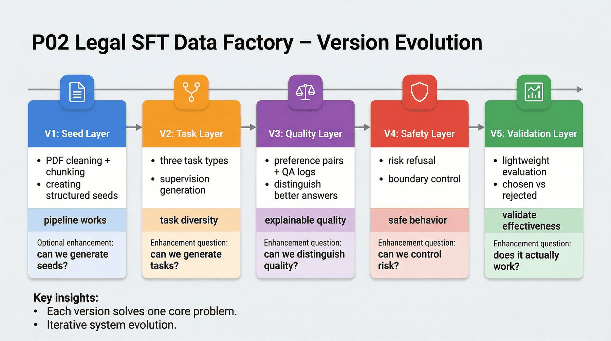

---

## 23. コストの最適化: 法的データの主要なコスト項目

多くのチームが大規模なモデル データ プロジェクトに取り組んでいるとき、最初に考えるのはモデル API のコストです。しかし、法的な SFT では、通常、本当にコストがかかるのは生成ではなく、次のような部分です。

* 手動レビュー
* エラーの手直し
* 高リスクサンプルのアップグレード処理
* バージョン回帰チェック

### 23.1 現在のプロジェクトのコストへの影響

現在のプロジェクトの人によるレビュー時間は 193.28 時間に達しました。この数字自体が非常に良い思い出となるでしょう。業界データ ファクトリーは決して「モデルをさらに実行する」という問題ではなく、「人間とマシンのコラボレーションが制御不能になるのをどのように防ぐか」という問題です。

### 23.2 自動化に最も優先すべきリンクはどれですか?

法的シナリオでは、自動化の優先順位は通常、最終的な仲裁ではなく、以前の機械的なスクリーニングです。次に例を示します。

* 不適格な形式のサンプルは削除されます。
* 低リスクテンプレートサンプルの事前認定。
* 明らかに範囲外の式をルールでインターセプトします。
* レビューレコードのエラータイプのクラスタリング。

### 23.3 コスト分析の必要性

プロジェクト部分では「その方法が実現可能である」ことを示すだけでなく、入出力関係も説明する必要があるためです。理論的には優れた解決策でも、実際には人的コストに耐えられない場合、それは真に実装可能な方法ではありません。

---

## 24. 検証閉ループ: 法的データ パイプラインの整合性チェック

プロジェクトが成熟しているかどうかは、出力ファイルがあるかどうかだけでなく、整合性検証があるかどうかによって決まります。

### 24.1 スクリプトの動作を確認する

なぜなら、業界データプロジェクトでは「部分的には正しいが、全体としては意味がわからない」という問題が起こりやすいからです。例えば：

* コードは実行できますが、製品にファイルがありません。
* サンプル数は正常に見えますが、train/val にリークがあります。
* 指標には合格と表示されていますが、レポートでは古い数値が引用されています。
* 好みのペアの数が対象サンプルの数と一致しません。
* スモークテストは実際のトレーニング形式を表すものではありません。

### 24.2 現在のプロジェクトの検証状況

プロジェクトの検査結果は次のとおりです。

* 総検査項目：13項目
* 合格したチェック項目: 13
* 全体的なステータス: PASS

コマンドレベルの検査は、`py_compile`、`evaluate_factory` などを対象としています。データ/製品レベルの検査は、`required_files_exist`、`seed_count_positive`、`accepted_count_matches_seed_x_tasks`、`preference_pairs_cover_accepted`、`qa_reviews_cover_accepted`、`train_val_no_overlap` などの主要プロジェクトをカバーします。

### 24.3 閉ループのエンジニアリング上の役割を検証する

それは、非常に重要なエンジニアリングの習慣を体現しているからです。つまり、データ プロジェクトの完了基準は、「大量のファイルが生成されたように見えること」ではなく、「コード、製品、統計情報、レポートが相互に一致していること」です。

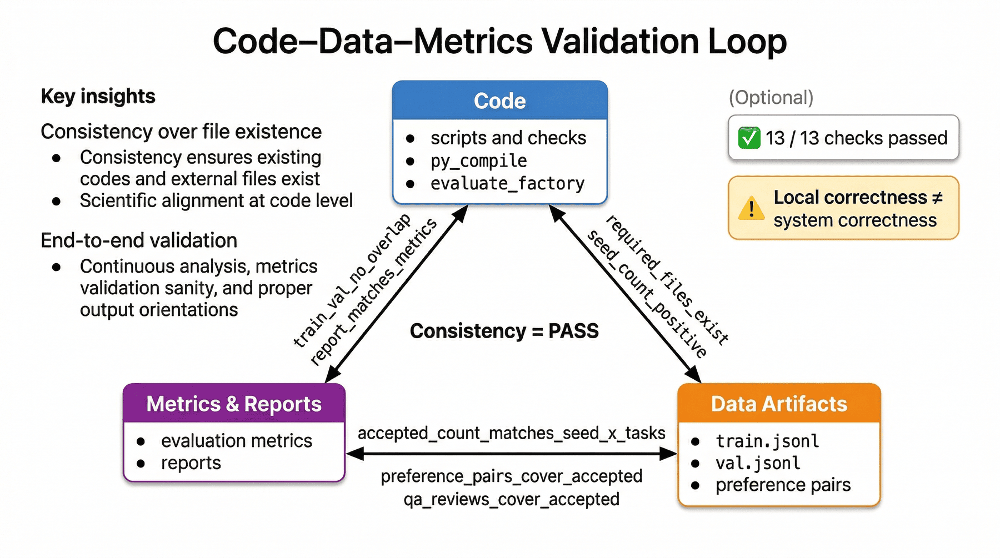

---

## 25. 制限とリスク: 現在の工場の制約

成功だけを語る訴訟は、通常、十分に信頼できるものではありません。これは、法的な SFT に特に当てはまります。これは、当然のことながら、データ ソース、監査コスト、リスク境界の影響を受けるからです。

### 25.1 不均一な管轄区域の適用範囲

現在のサンプルは少数の法的管轄区に大きく偏っており、知識の幅という点でモデルのパフォーマンスが不均一になる可能性があります。次の段階での最も重要なタスクの 1 つは、ロングテール管轄区域と実際のビジネスに関する高頻度の問題を完了することです。

### 25.2 より高い合成比

合成はコスト管理のために必要な手段ですが、合成比率が高すぎるとテンプレート キャビティや教師オフセットの問題が発生します。モデルは「テンプレートのように答える」ことは学習できるかもしれませんが、ユーザーの多様な表現を真に把握できるわけではないかもしれません。

### 25.3 リスク拒否サンプルの数がまだ少なすぎる

リスク拒否メカニズムは確立されていますが、サンプルサイズはまだ小さいです。実際のオンライン シナリオでは、これでは十分ではありません。特に、個別の提案、デリケートな紛争、不十分な証拠の判断などのシナリオでは、より豊富な拒否および保持境界サンプルが必要です。

### 25.4 QA は高価です

サンプルサイズが拡大するにつれて、人間によるレビューのコストは増加し続けます。よりきめ細かい事前レビュー、仲裁、再入札のメカニズムがプロセスに導入されない場合、その後の拡張は大きな抵抗に直面することになります。

---

## 26. 異業種移行：合法工場のモデル価値

垂直型 SFT が必要な業界は法律だけではありませんが、これは良い例です。その理由は、法廷の現場には次のような特徴が同時にあるからです。

* 強力に構造化された知識
* 強力なタスク制約
* 明確なリスク境界線
* QA 要求の厳格さ
* 人間と機械のコラボレーションには高コストがかかる

これらの特徴は、実際に税務、金融、医療、顧客サービスやコンプライアンスなどの業界にも存在します。

### 26.1 直接転写可能な設計

* 非構造化ドキュメントから構造化シードへのリンクをクリーニングします。
* 最初にタスク システムを分割してから拡張するという実践。
* SFT、選好ペア、リスク拒否の並列構築のアイデア。
* QA プロトコル、エラーのラベル付け、および再作業メカニズム。
* トレーニングのカプセル化と検証の閉ループ。

### 26.2 直接コピーできない部分

* 法的シナリオにおけるリスク境界は、医学的または経済的境界と同じではありません。
* 法解釈業務は他の業界では主要な業務ではないかもしれません。
* 法的文書のスタイルは、顧客サービスや販売スタイルと同じではありません。
* 高リスクの拒否のトリガー条件は、業界によって書き換えられる必要があります。

### 26.3 メソッドチェーンの移行

実際に移行できるのは特定のプロンプトではなく、次のメソッド チェーンです。

> 権威あるシードを見つける -> 構造化されたダイシングを行う -> タスクシステムを設計する -> 制御された合成拡張 -> QA とプリファレンスを確立する -> リスク境界を個別にモデル化する -> カプセル化と一貫性検証をトレーニングする。

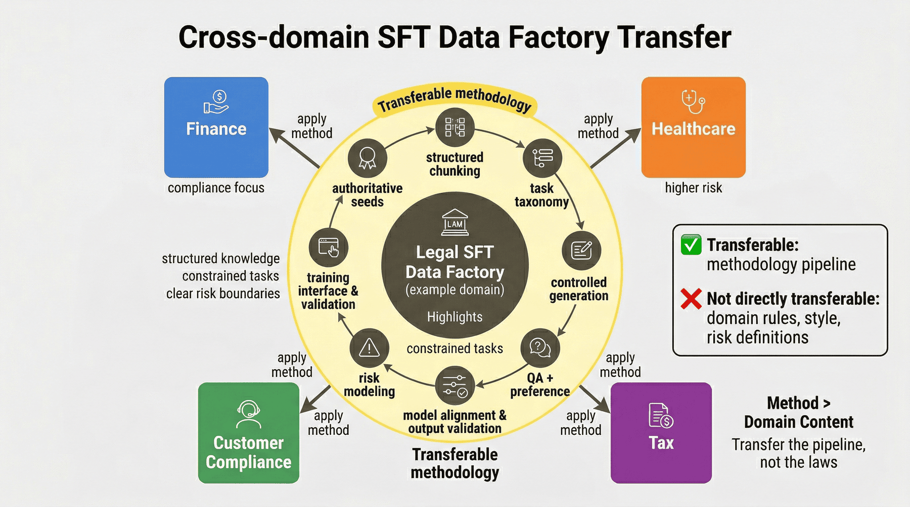

---

## 27. 主要成果物一覧

主な成果物のリストをここに示します。

### 27.1 種子と加工中間体

* `data/processed/raw_chunks.jsonl`
* `data/processed/legal_seed_dataset.jsonl`
* `data/processed/instruction_taxonomy.json`

### 27.2 主な監視製品と補助的な監視製品

* `data/processed/domain_expert_sft.jsonl`
* `data/processed/synthetic_candidates_rejected.jsonl`
* `data/processed/legal_preference_pairs.jsonl`
* `data/processed/legal_qa_review.jsonl`
* `data/processed/legal_risk_refusal_sft.jsonl`
* `data/processed/legal_risk_register.jsonl`

### 27.3 トレーニングインターフェース製品

* `data/training/final_sft_dataset.jsonl`
* `data/training/train.jsonl`
* `data/training/val.jsonl`
* `data/training/smoke_test.jsonl`
* `data/training/training_manifest.json`

### 27.4 レポートおよび検証製品

* `data/reports/p2_report.md`
* `data/reports/p2_metrics.json`
* `data/reports/p2_test_results.json`

これらの成果物を列挙することは、単にリストを提示するだけでなく、業界の SFT ファクトリーの結果が単なるトレーニング セット ファイルではなく、相互に関連するデータ資産のセットであることを説明することを目的としています。

---

## 28. まとめ: 発電を工場に組織化する

プロジェクト全体を振り返ってみると、プロジェクトが実際に解決する問題は、「モデルに法的な質問と回答をより多く生成させる方法」ではなく、次のことにあることがわかります。

* 権威あるが汚い PDF から有用な知識を抽出する方法。
* 知識をさまざまな種類の監督タスクに分解する方法。
* ランダムな拡張ではなく、生成プロセスを制御可能にする方法。
* 好みのペアとリスクの拒否を通じてモデルの動作境界をデータに組み込む方法。
* QA、コスト、バージョン、検証の閉ループを工場設計に組み込む方法。

この章で私が一番伝えたいこともこれです。

> 高度に専門的な産業において、SFT データ エンジニアリングの目標は決して「より多くのサンプルを作成する」ことではなく、高品質の監視資産を継続的かつ安定して生産できる組立ラインを確立することです。

法律は、このアプローチの代表的なシナリオの 1 つにすぎません。チームがシードから監督、生成から品質検査、サンプルからオンラインインターフェイスまでのこのリンクを習得している限り、チームは他の業界でデータファクトリーを構築するための基本的な方法ベースを手に入れることができます。

---

## 特別トピック: SFT データの法的公開ゲート

法律分野のデータ ファクトリと一般的な質問と回答のデータ ファクトリの最大の違いの 1 つは、当然、エラー コストがより高くなるということです。一般的な Q&A の場合、回答が不十分な場合は単に経験が不十分である可能性があります。法的な Q&A では、誤った監督シグナルがリスクの推奨、拒否の境界、専門家の信頼に直接増幅される可能性があります。したがって、P02 などのプロジェクトでは、バージョン リリースに入るときに明確なアクセス制御条件が必要です。

### 1. 公開する前に、コンテンツのリスクとエンジニアリングのリスクの両方を検討する必要があります。

法定SFTデータは、「データ量が十分か」「形式が不均一か」だけではなく、以下のことも同時に判断する必要があります。

* 法律条項、判例の概要、リスク警告の引用に明らかな誤りや時代遅れの表現があるかどうか。
* 拒絶反応サンプルと高リスク相談サンプルが重要な境界をカバーしているかどうか。
* 設定ペアと QA レコードが実際に現在のバージョンの結論をサポートしているかどうか。
* トレーニング インターフェイス、マニフェスト、テスト結果がバージョン製品と一致しているかどうか。

言い換えれば、法的データバージョンのリリース閾値は、内容の信頼性チェックとエンジニアリング整合性チェックの両方に合格する必要があるため、通常のデータバージョンよりも当然高くなります。

### 2. アクセス制御の価値は、「注意」をシステム属性にすることにあります。

多くのチームが業界データを作成するとき、後の段階で手動でレビューするように注意を残しますが、より安全なアプローチは、注意をゲートの解放に移すことです。アクセス制御が構造化された方法で書き留められている限り、チームは徐々に安定した習慣を形成します。最初に公開してから説明を追加するのではなく、まずリスク境界を確認し、資産を監視し、証拠を検証してから、このバージョンのトレーニングと表示を開始するかどうかを決定します。この種の制度化された注意こそが、業界の SFT データに保持しておく価値のある長期的な機能です。

