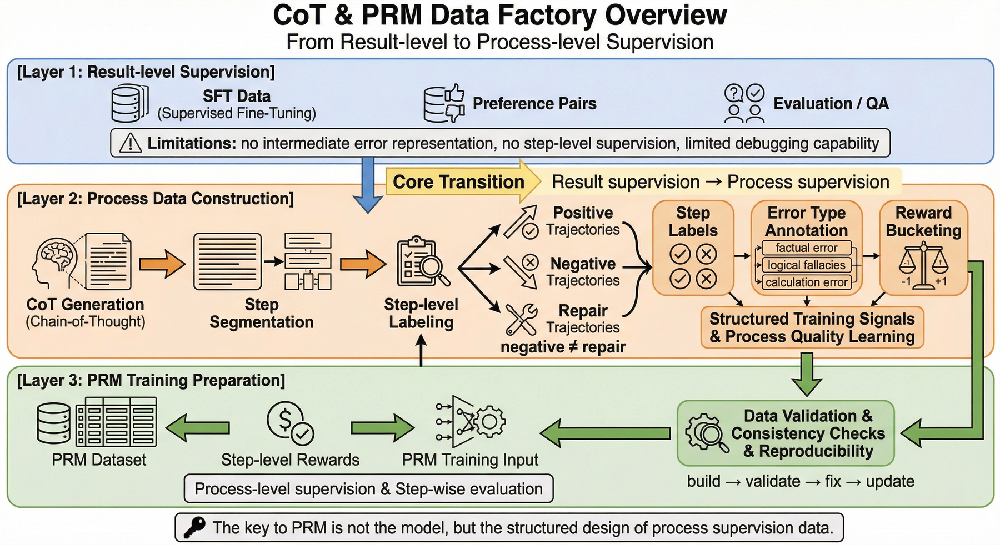
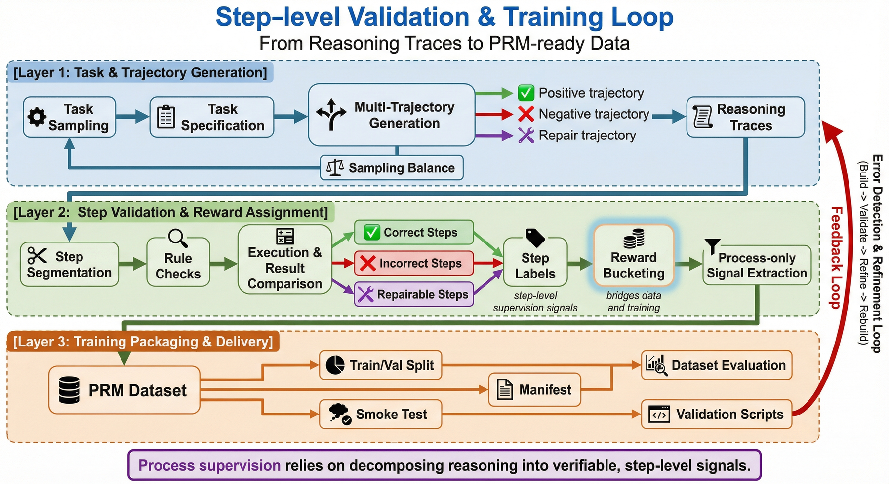
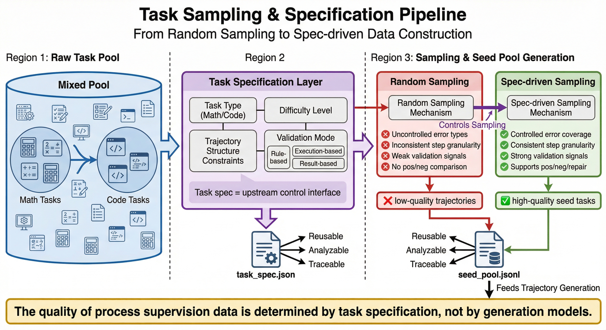
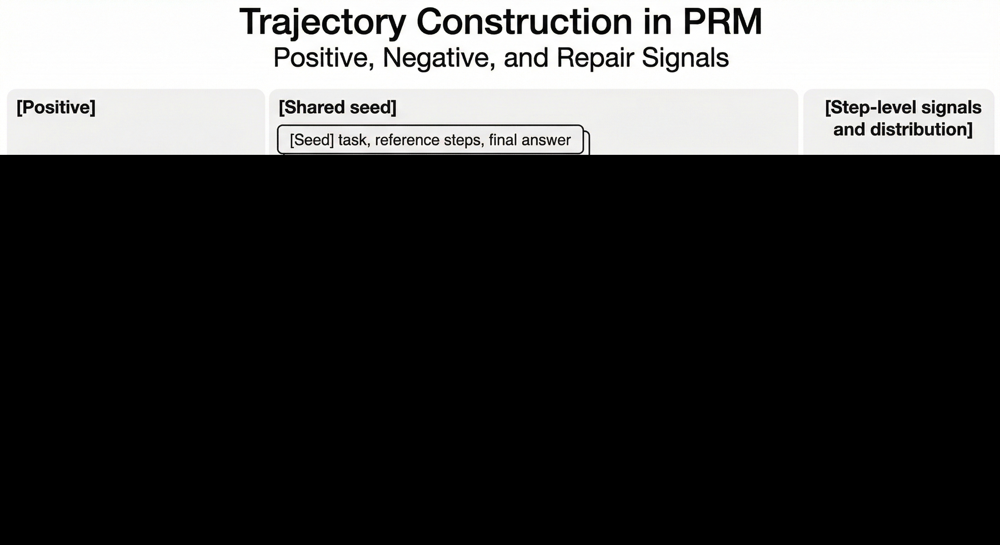
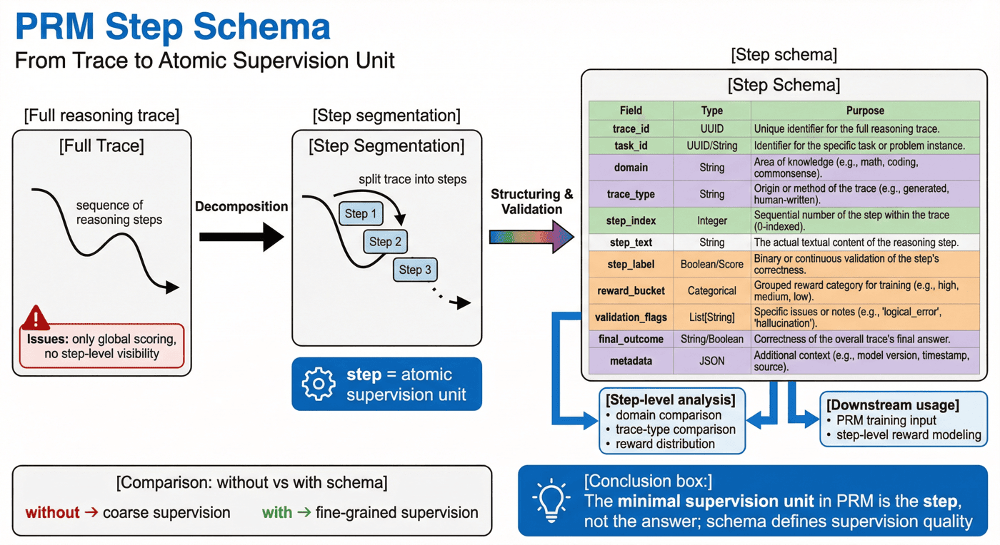
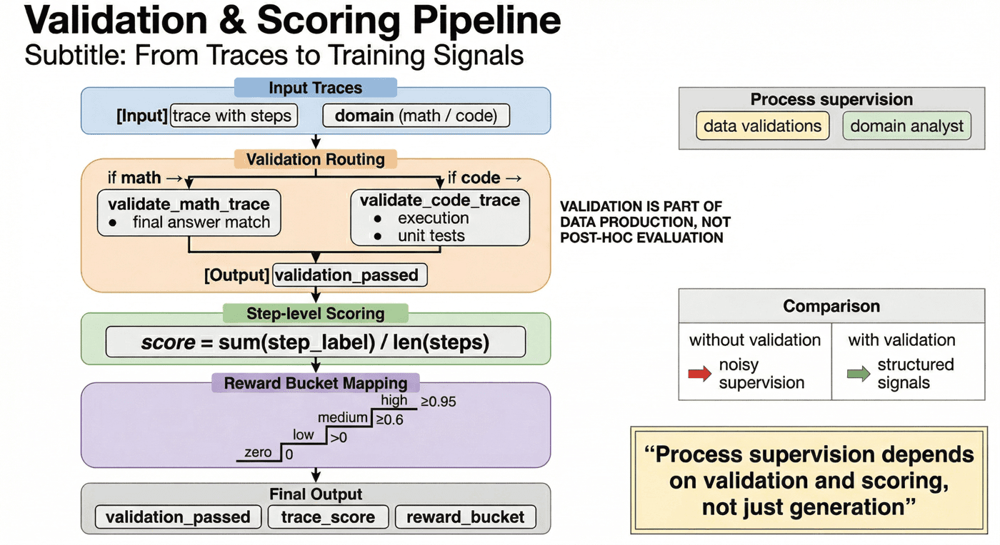
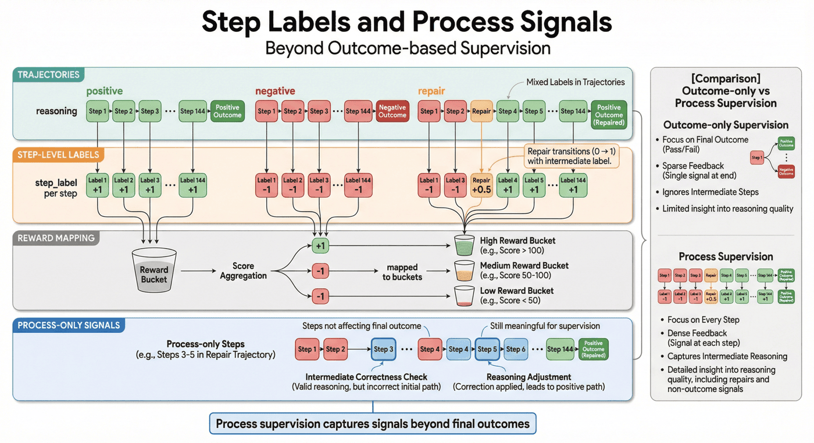
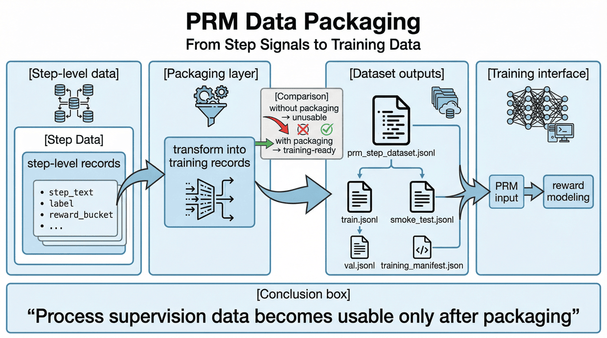
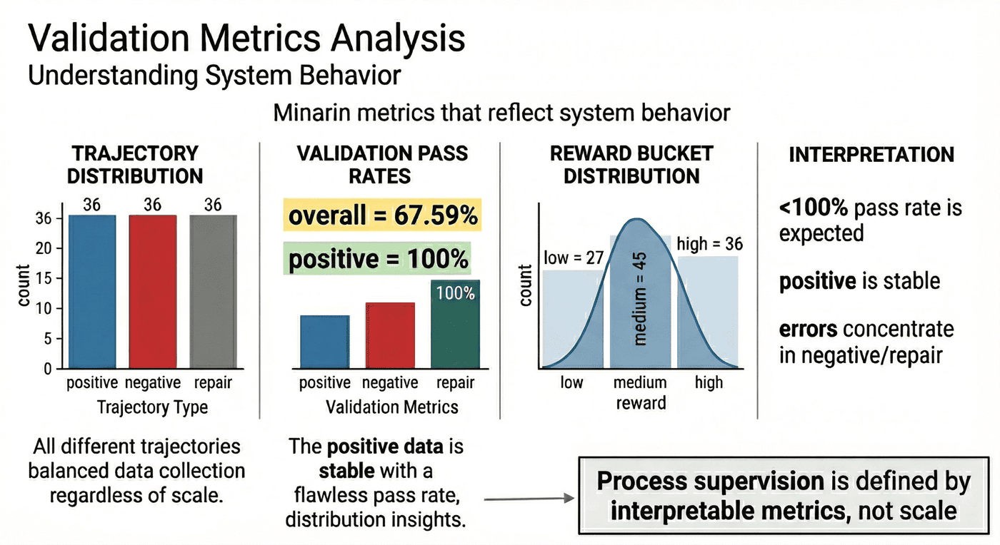
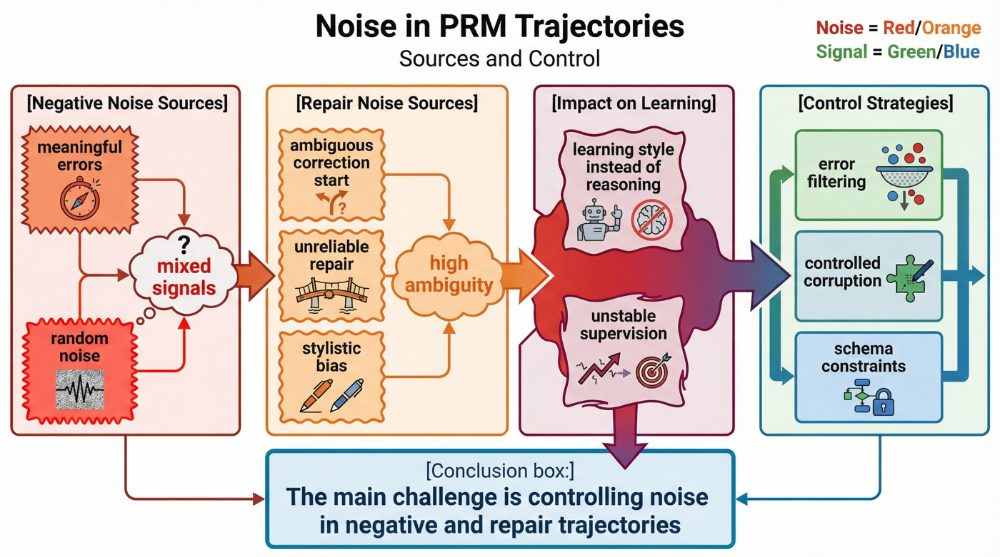

# 项目六：CoT 推理数据集构建与 PRM 训练

## 本章概览

P06 聚焦把推理过程本身组织成可训练、可验证、可分析、可迭代的过程监督数据资产。章节重点不在单条思维链展示，而在 step 级监督、奖励分配和 PRM 训练接口之间的工程化衔接。

本章可以按四条主线理解：

* 种子任务与轨迹生成：从任务采样进入 CoT 轨迹构造。
* step 校验与奖励分配：围绕过程标签、reward bucket 和轨迹类型组织监督信号。
* PRM 封装与训练切分：把处理结果整理为可直接训练的过程监督数据。
* 评测与项目检查：通过指标、检查脚本和噪声分析验证数据工厂状态。

如果按工程顺序阅读，本章对应的是一条完整链路：

**任务采样 -> 轨迹生成 -> step 校验 -> reward 分配 -> PRM 封装 -> 训练切分 -> 数据评测 -> 项目检查**

这一结构对应的核心目标，是把 CoT 与 PRM 数据从结果监督扩展为围绕 step 级信号构建的过程监督流水线。

---

## 1. 项目背景：CoT 与 PRM 数据工厂的必要性

通用大模型在开放域生成任务上已经具备较强能力，但一旦进入数学求解、代码推理、复杂规划或多步判断场景，问题就会迅速暴露出来。

最常见的问题不是“模型不会说”，而是“模型虽然会说，却不会稳定地按正确过程推理”。

第一类问题是**结果正确但过程不可用**。模型可能给出正确答案，但中间推理只是模板化铺陈、后验解释甚至随机拼接。这样的轨迹如果直接拿来做监督，模型学到的不是推理能力，而是一种“正确答案的语言包装术”。

第二类问题是**过程看起来合理，但关键步骤已经错了**。这类样本对结果监督来说只会被归为“答错”，但对过程监督来说，真正重要的是定位：到底是条件识别错了、公式替换错了、代码执行错了，还是修复路径本身有问题。

第三类问题是**错误分布并不均匀**。正例轨迹往往更干净，而负例和修复轨迹更容易出现噪声、标注歧义和中间状态不一致。如果项目没有把这些轨迹拆开管理，就会导致 PRM 训练时信号污染。

因此，P06 的目标不是再做一个“带 CoT 的 SFT 小样本”，而是搭建一个**CoT 与 PRM 数据工厂**，把种子任务、轨迹生成、步骤标签、验证信号、过程奖励与训练接口组织成一条可复用、可检查、可扩展的生产线。

这条生产线服务的也不是一次性实验，而是一种更普适的方法论：

> 当团队未来需要把过程监督从数学和代码扩展到表格推理、工具调用、Agent 规划甚至复杂业务流程时，真正能被复用的不是某条思维链，而是这套“从任务到步骤监督”的工程方法。

---

## 2. 项目目标与边界

### 2.1 项目目标

本项目聚焦以下四个目标。

**目标一：建立从种子任务到 step 级监督的转化链路。**
也就是说，项目不是停留在题目和答案层，而是把多步推理轨迹显式生成出来，并进一步切解为可供 PRM 训练的 step 记录。

**目标二：建立可区分不同轨迹类型的过程数据体系。**
项目明确区分 positive、negative、repair 三类轨迹，使过程监督不再只有“对/错”两个粗粒度状态，而能表达更接近真实推理过程的数据分布。

**目标三：建立自动验证与 reward 分配闭环。**
过程监督的难点不在于生成，而在于筛选。项目通过规则检查、执行验证、结果比对与 reward bucket，将“轨迹质量”从主观判断尽可能转成可复核信号。

**目标四：输出训练侧可直接消费的 PRM 数据资产。**
最终交付不只是中间脚本，还包括 `prm_step_dataset.jsonl`、`train.jsonl`、`val.jsonl`、`smoke_test.jsonl`、`training_manifest.json` 等训练接口层产物。

### 2.2 项目边界

为了保持项目可复现性，本项目显式设置了若干边界。

#### 1）任务范围边界

当前项目只覆盖**数学**和**代码**两类推理任务。这两个领域适合先做过程监督示范，因为它们相对容易构造可验证信号，也更便于把错误步骤与最终结果对齐。

#### 2）轨迹类型边界

当前轨迹分为三类：

* positive
* negative
* repair

这样的设计已经足以展示过程监督的基本形态，但尚未覆盖更复杂的轨迹关系，例如多分支搜索、工具调用回退、规划-执行混合链路等。

#### 3）监督粒度边界

本项目强调 step 级 supervision，但主要仍聚焦于**规则校验 + 启发式评分 + 数据封装**，而不是完整展开一个大规模 PRM 模型训练平台。也就是说，它更像一个过程监督数据工厂雏形，而不是终局形态。

#### 4）规模边界

当前种子任务为 36 个，生成轨迹 108 条，总 step 数 534，规模可控，更适合作为方法展示和结构分析，而不是大规模工业训练库。现有数据已经足够说明流程、指标和噪声问题，但不能被夸大为“已经覆盖广泛推理场景”。

### 2.3 边界设定的作用

过程监督项目最容易出现的误判，就是看到有 CoT、有步骤标签、有 reward，就误以为已经做出了成熟的 PRM 数据体系。实际上，可信的数据工厂不是靠术语堆起来的，而是靠边界管理建立的。

对于 P06 来说，边界写清楚的价值在于：

* 让当前结论所依赖的任务域保持清楚；
* 避免把小规模验证结果误读为通用结论；
* 帮助后续扩展时明确优先级，而不是盲目扩量；
* 让项目更像一条可持续演进的工程能力，而不是一段概念展示。

---

## 3. 项目定位：P06 的能力链位置

如果把全书视作一条大模型数据工程能力链，那么 P06 位于“结果监督走向过程监督”这一段的核心位置。

前面的章节已经讨论过 SFT 数据、偏好对、评测与 QA 等通用问题。但一旦进入 reasoning 场景，团队会很快发现：

* 单纯结果标签无法表达中间错误；
* 单纯偏好比较不足以定位 step 级信号；
* 单纯“思维链展示”并不等于过程监督可训练；
* 训练前的数据验证，比训练本身更决定最终上限。

因此，本章的价值不在于重复介绍 PRM 概念，而在于把这些方法落回一个**可执行的工程项目**：CoT 推理数据集构建与 PRM 训练准备。

也就是说，本章不是在回答“PRM 是什么”，而是在回答更具体的问题：

* 过程监督数据到底应该如何被组织？
* 为什么 step 标签要早于 PRM 训练被设计？
* 为什么 negative 与 repair 轨迹不能混成一类坏样本？
* 为什么 reward bucket 不是锦上添花，而是后续训练接口的重要桥梁？
* 在有限资源下，怎样先做出一个可运行、可复核、可继续扩张的 PRM 数据闭环？

从这个意义上说，本章最重要的不是“多训练一个模型”，而是回答一个更大的问题：

> 当团队想让模型学会更好的过程，而不是只学会更好的结果时，数据工程应该怎样重新设计？



---

## 4. 整体架构：从种子任务到 PRM 训练资产的过程监督流水线

从工程视角看，本项目可以拆成三层。

### 4.1 第一层：任务与轨迹生成层

这一层解决的是“如何稳定获得可分析的推理轨迹”。主要包括：

* 任务采样
* 规格定义
* 多轨迹生成
* 轨迹类型控制
* 正负修复样本配比

这一层的目标不是马上输出训练集，而是把原始任务扩展成一组可比较、可分析、可验证的 reasoning traces。

### 4.2 第二层：步骤验证与奖励分配层

这一层解决的是“这些过程值不值得学”。主要包括：

* ステップセグメンテーション
* ルールチェック
* 結果の実行と比較
* ステップラベルの生成
* 報酬バケットの割り当て
* プロセスのみの信号抽出

これは、プロジェクト全体の中で最も重要な部分です。なぜなら、システムが「思考の連鎖を書く」ことができるか、または「信頼できるプロセス信号を蓄積する」ことができるかどうかを決定するからです。

### 4.3 3 番目の層: トレーニングのカプセル化と配信層

この層は、「これらのプロセス データをトレーニングおよび評価システムで直接利用できるかどうか」を扱います。主に以下が含まれます：

* PRMステップデータのカプセル化
* train/val セグメンテーション
・発煙試験施工
* マニフェストの生成
*データセットの評価
* プロジェクトチェックスクリプト

この時点で、プロジェクトは「推論トレースの生成」から「プロセス監視データ パイプラインの構築」に移行しました。



---

## 5. シード タスク: タスク層は監視の開始点として機能します

多くの人が PRM について話すとき、報酬モデルやスコアリング モデルにすべての注意を集中しますが、上流のタスク層の設計は無視します。

しかし、実際のエンジニアリングでは、PRM トレーニングの上限は次の要素に大きく依存します。 **最初にシステムに認識させるタスク、難易度、プロセスの種類。 **

### 5.1 シードタスクが必要な理由

明確なタスクプールがないと、プロジェクトは簡単に「いくつかの推論トレースをランダムに生成する」状態に陥りやすく、これは多そうに見えるかもしれませんが、実際には無秩序に分散されており、難易度が不均一であり、これらのステップが監視に値する理由を説明できません。

タスクレイヤーを明示的にすると、プロジェクトでは次のことが可能になります。

* 質問のソースと仕様を制限します。
* さまざまなタスク領域間の基本的なバランスを維持します。
* 特定のトラックがどのシードから来たトラック;
* トレーニング後、問題がタスク、軌道、検証プロセスにあるかどうかを確認します。

### 5.2 現在のプロジェクトで最初に数学とコードを選択するのはなぜですか?

数学とコーディングは、プロセス監視の優れた出発点です。

一方で、それらはすべて比較的明確な正確性基準を持っており、結果の比較と自動検証が容易になります。一方で、単純に善悪を分類するのではなく、ステップレベルのエラーを真に明らかにするのに十分な強力な複数ステップ推論特性を備えています。

### 5.3 シード タスクが最終トレーニング サンプルと等しくない理由

シードタスクは「監視ソース」の層にすぎず、最終的な監視ユニットではありません。 P06 の真の価値は、シード タスクを複数の軌跡に拡張し、次に軌跡をステップに分割し、最後に PRM データをエクスポートすることです。このリンクの意味は次のとおりです。

> プロジェクトはトピックそのものではなく、トピックの周囲で生成されるプロセス信号に焦点を当てます。

---

## 6. タスクのサンプリングと仕様設計: 事前スケジューリング層

`sampler.py` は、この層で GSM8K と MBPP から 2 種類のシードを構築する役割を果たします。数学タスクは最終的な答えを抽出して参照ステップに分割し、コード タスクは `reference_code`、`test_setup_code`、`test_list` を保持し、最終的に `seed_pool.jsonl` と `task_spec.json` に分類されます。このようにして、後続のトレース生成と検証に必要なフィールドを上流段階で準備できます。

対応する実装は次のとおりです。```python
for index, record in enumerate(gsm8k):
    final_answer = extract_final_answer(record["answer"])
    steps = split_reasoning_steps(record["answer"])
    if not final_answer or len(steps) < 2:
        continue
    seeds.append(
        {
            "seed_id": f"math_{index}",
            "domain": "math",
            "topic": infer_math_topic(record["question"]),
            "question": record["question"],
            "reference_steps": steps,
            "final_answer": final_answer,
            "source_dataset": "gsm8k_train",
        }
    )
````task_spec` は、プロジェクトの制約を構造化された構成として書き込みます。```python
task_spec = {
    "seed_count": len(seeds),
    "domain_distribution": dict(Counter(seed["domain"] for seed in seeds)),
    "trace_targets": {
        "positive": "correct reasoning trace",
        "negative": "corrupted or wrong reasoning trace",
        "repair": "wrong step followed by correction",
    },
    "validation_targets": [
        "final_answer_match",
        "step_level_quality_labels",
        "code_execution_and_unit_tests",
    ],
}
```プロジェクト プロセスの最初のステップは `src/sampler.py` です。最初にタスクをサンプルして仕様を生成し、次に推論軌道の生成に入ります。 P06 「データ分散」をモデルのランダム性に任せるのではなく、明示的に管理する必要があるエンジニアリング オブジェクトとして最初から扱います。

### 6.1 仕様設計はどのような問題を解決しますか?

いわゆるタスク仕様は、基本的にいくつかの質問に答えるものです。

* 現在のタスクは数学ですか、それともコーディングですか?
* 問題の難易度の目安はどれくらいですか?
※軌道生成には特別な構造が必要ですか？
* その後の検証は、最初にルール、実行、または結果の比較に依存しますか?

これらの問題を仕様レイヤーに転送することで、その後のプロジェクトの生成、検証、分析の境界が統一されます。

### 6.2 サンプリングを「多様化」するだけではいけない理由

多くのプロジェクトではサンプリングを行ったとしていますが、実際には質問をランダムに選択しているだけです。しかし、PRM の場合、ランダムは合理的ではありません。なぜなら、プロセスの監督者がより懸念しているのは、表面上のさまざまな質問ではなく、次のことだからです。

* エラーの種類が十分に豊富かどうか。
* ステップ粒度がセグメンテーションに適しているかどうか。
* 信号が利用可能かどうかを確認します。
* プラスの修復軌道とマイナスの修復軌道を比較する根拠はありますか?

### 6.3 タスク仕様の工学的価値

現在のプロジェクトは、`seed_pool.jsonl` と `task_spec.json` を明確に出力します。これは、コード内のタスク定義を隠さず、上流のスケジューリング情報を明示的にディスクに配置していることを示しています。これを行うことの利点は次のとおりです。

* 異なる仕様が軌道の品質に及ぼす影響は、後で比較できます。
* 特定の種類のタスクがレビュー中にノイズを生成する可能性が高いかどうかを追跡できます。
* タスク レイヤーと軌跡レイヤーは、チェーン全体を毎回書き直すのではなく、個別に反復できます。
* インターフェイスは、新しいタスク ドメインへの将来の拡張のために予約できます。



---

## 7. 軌道生成: ポジティブ、ネガティブ、リペアの並列構築

P06 の 3 種類の軌道は `generate_traces.py` で明示的に構築されます。正の例では参照ステップを直接使用します。否定的な例では、キー数値の改ざんや参照コードの変更によってエラーが発生します。修復軌道は、エラー軌道の後に修正ステップを追加します。この実装は、実用的なデータ合成ロジックに「プロセス監視」を実装します。

対応する実装は次のとおりです。```python
wrong_steps = [dict(step) for step in correct_steps]
wrong_steps[-1]["text"] = corrupt_numeric_text(wrong_steps[-1]["text"])
wrong_steps[-1]["label"] = 0

negative_final = {
    "step_idx": len(wrong_steps) + 1,
    "text": f"Final answer: {corrupt_numeric_text(seed['final_answer'])}",
    "label": 0,
    "kind": "final",
}

repair_steps = wrong_steps + [negative_final]
repair_steps.append(
    {
        "step_idx": len(repair_steps) + 1,
        "text": f"Correction: the previous arithmetic was wrong. The correct final answer is {seed['final_answer']}.",
        "label": 1,
        "kind": "repair",
    }
)
```この実装は、修復トレースが個別に作成された新しい質問ではなく、修復ステップがネガティブ トレースの後に明示的に追加されていることを示しています。コード タスクの実装ロジックは似ていますが、エラーが `mutate_python_code` から発生し、検証が後続の単体テストの実行に依存する点が異なります。

P06 の中核プロセスの 1 つは `src/generate_traces.py` です。これは、1 つの標準応答軌跡のみを保持するのではなく、シード タスクに基づいて複数の推論軌跡を生成します。

### 7.1 なぜ正の軌道しか生成できないのでしょうか?

プロセス監視が正の軌道のみを保持する場合、モデルは確かに「正しく見えるプロセスがどのようなものであるか」を学習できますが、それでも効果的に区別することはできません。

* どの部分的なステップが信頼できないか。
* どの修復方法が効果的か。
* どのエラーが後続のステップで増幅されるか。

これにより、PRM はプロセスの品質を識別できるモデルではなく、長くてきちんとフォーマットされた軌道を好むスコアラーに簡単に変質する可能性があります。

### 7.2 負の軌道はどのような問題を解決しますか?

負の軌跡の価値は、それが「エラープロセス」に明示的な基準枠を提供することです。それを通じて、システムは次のことを学習できます。

* 中間ステップが正しいパスからどのように逸脱するか。
* 最終的な失敗の前兆は何ですか。
* どのエラーが単なる局所的な逸脱であり、どのエラーがリンク全体の崩壊を引き起こすか。

### 7.3 なぜ修復軌道がより重要であり、より危険なのか

修復軌跡は、通常の負の例よりも現実世界の推論修正プロセスに近いものになります。これはシステムが以下を学習するのに役立ちます。

* エラーが発生した後に正しいパスに戻る方法;
* どのような種類の治療法が効果的か。
* 修復プロセス中にどのようなコンテキストを保存する必要があるか。

しかし、修復軌跡はノイズが発生する可能性が最も高い場所でもあります。なぜなら、修復ロジック自体が不安定な場合、モデルが学習するのは「エラーを修正する方法」ではなく、「エラーを一見合理的と思われる継続的な推論に再パッケージ化する方法」である可能性があるからです。

### 7.4 現在のプロジェクトの軌跡構造は何を示していますか?

既存の指標は、プロジェクトが 108 個の軌道を生成し、そのうち 3 種類の軌道 (`positive=36`、`negative=36`、`repair=36`) が完全に対称であることを示しています。これは、プロジェクトの軌道構造が、一時的に複数のサンプルを生成するのではなく、3 種類のプロセスを並列監視対象として明確に設計することであることを示しています。



---

## 8. ステップ分割とスキーマ: プロセス監視の最小単位

軌跡の生成が完了した後、プロジェクトは推論トレース全体をトレーニングに直接使用するのではなく、最初にステップレベルのセグメンテーションを実行します。このステップは、P06 と通常の CoT サンプル ライブラリの最も重要な違いの 1 つです。

### 8.1 ステップが必要な単位である理由

全体の軌跡は「一般的に良いか悪いか」を表現することしかできず、「具体的にどのステップが良くてどのステップが悪いのか」を表現することはできません。

PRM が学びたいのは、まさにこのよりきめ細かい判断能力です。

* 特定のステップが論理的に一貫しているかどうか。
* 特定のステップが前のステップと一貫しているかどうか。
* 特定のステップで間違った事実または間違ったコードが導入されたかどうか。
* たとえそれが最終的な失敗に直接つながっていなかったとしても、特定のステップが危険信号を立てたかどうか。

### 8.2 ここでスキーマはどのような問題を解決しますか?

いわゆるステップ スキーマは、フィールドをより完全にするためのものではなく、検証、統計、トレーニングをすべて同じ単位で実行できるようにするものです。一般的なステップ レコードには少なくとも次のものが含まれている必要があります。

* `trace_id`
* `task_id`
* `domain`
* `trace_type`
* `step_index`
* `step_text`
* `step_label`
* `reward_bucket`
* `validation_flags`
* `final_outcome`
* `metadata`

このスキーマ層を使用すると、プロジェクトを次のようにフォローアップできます。

* 異なるドメインのステップの品質の違いを分析します。
* さまざまなトレースタイプのノイズ構造を比較します。
* 特定の報酬バケットがどのステップ分布に由来するかを追跡します。
* ステップデータを PRM トレーニング インターフェイスに直接カプセル化します。

### 8.3 ステップ スキーマを個別に保持する必要がある理由

多くのプロセス監視プロジェクトが失敗するのは、モデルが貧弱すぎるためではなく、最小監視単位が最初から明確に設計されていないためです。その結果、次のような結果が生じます。

* トレーニング中は、解答全体のみを採点できます。
* エラーが発生した場合、特定の手順を確認できません。
* データのセグメント化はサンプル レベルでのみ大まかに処理できます。
※ノイズ解析用のグリッパーはありません。

この観点から見ると、ステップ スキーマは補助的な設計ではなく、PRM データ ファクトリの基礎となります。



---

## 9. 自動検証: プロセス監視の結果の検証

`validate_and_score.py` は、この層でのドメイン ルーティング、結果検証、`trace_score` 計算、報酬バケット マッピングのつなぎ合わせ、つまり数学タスクの最終的な答えの照合、コードの実行、コーディング タスクの単体テストを担当します。このようにして、自動検証を完全な閉ループ プロジェクトとして実装できます。

対応する実装は次のとおりです。```python
if trace["domain"] == "math":
    passed, validation = validate_math_trace(trace)
else:
    passed, validation = validate_code_trace(trace)

label_sum = sum(step["label"] for step in trace["steps"])
score = label_sum / max(1, len(trace["steps"]))
bucket = reward_bucket(score)

enriched["validation_passed"] = passed
enriched["trace_score"] = round(score, 4)
enriched["reward_bucket"] = bucket
```その中で、報酬バケットはブラック ボックス スコアではなく、ルールによって解釈できるセグメント化された関数です。```python
def reward_bucket(score: float) -> str:
    if score >= 0.95:
        return "high"
    if score >= 0.6:
        return "medium"
    if score > 0:
        return "low"
    return "zero"
```この方法で記述する利点は、検証が依存するシグナル、バケットのソース、およびそれらの間の関係が明確になることです。

P06 の中間コア ステップは `src/validate_and_score.py` です。これは、生成された軌跡を検証し、スコアを付け、ラベルを割り当てます。このステップは、プロジェクトが監視信号を蓄積しているのか、生成されたノイズを増幅しているのかを決定するため、非常に重要です。

### 9.1 データ作成プロセスの前に検証を行う必要がある理由

多くのチームは検証をトレーニング後の評価として理解していますが、プロセスの監督はそうではありません。ダーティな軌跡が PRM データに入ると、後でトレーニングされたモデルは、真のプロセス品質を識別することよりも、「疑似推論パターン」を識別することに優れている可能性が高くなります。

したがって、ここでの検証はプロジェクトの終わりではなく、生産ラインの一部です。

### 9.2 自動検証はどのような信号に依存できますか?

既存のプロセスの説明から判断すると、このプロジェクトは **ルールのチェック、実行、結果の比較**を組み合わせて、軌跡とステップにラベルと報酬を割り当てます。これは、現在の検証がテキストの表面にとどまらず、形式的な正確性、実行可能性、結果の一貫性を組み合わせようとしていることを示しています。

数学的タスクでは、この検証は結果の比較に依存する可能性が高くなります。コードタスクでは、実行結果、テストサンプル、または構文/動作チェックを組み合わせる方が適しています。この設計により、「ステップ品質」は単なる主観的な説明ではなくなります。

### 9.3 検証が可能な限り厳密ではないのはなぜですか?

多くの人は、ルールを厳しくさえすれば、よりきれいなデータが得られると直感的に感じています。ただし、プロセス監視プロジェクトでは、検証が厳しすぎると問題が発生する可能性もあります。

* 貴重な中間エラーが過剰に削除されました。
* 修復トラックは意味を失います。
* データ分布は正の例が大半を占めており、PRM がエラー訂正境界を学習するのは困難です。
* プロジェクトは結果のみのバリアントになります。

したがって、より合理的な戦略は、「全面的に浄化する」のではなく、どのステップが成功し、どのステップが失敗したか、どのステップが失敗したがプロセス信号として保持する価値があるかという構造的な差異を保持することです。

### 9.4 現在のプロジェクトの検証結果は何を示していますか?

既存の指標によると、全体的な軌道検証の合格率は `67.59%` ですが、正の軌道の合格率は `100.00%` に達しており、現在の問題が主に負の軌道と修復軌道の制御に焦点を当てていることが示されています。この結果は、その後のプロジェクトの最適化では、やみくもに量を拡大するのではなく、洗浄と検証の品質の向上を優先する必要があることを明確に示しているため、非常に価値があります。



---

## 10. ステップラベルの設計: プロセスフィールドの運用化

多くの人がプロセスの監督について話すとき、「高品質の思考連鎖」、「信頼できる手順」、「プロセスの一貫性」などの抽象的な概念を使用します。しかし、このプロジェクトで実際に実践できるのは、これらの抽象的な言葉ではなく、フィールド、統計、トレーニングに入力できるデータラベルです。

### 10.1 ステップラベルの役割

ステップラベルの価値は、「プロセス品質」を機械の消耗品である監視信号に分解することです。タグを通じて、プロジェクトは以下を識別できます。

* どのステップを強化する必要があるか。
* どのステップが罰せられるべきか。
* どのステップが結果の付属物ではなく、プロセス固有のシグナルであるか。
* どのステップが負の軌道にあるが、依然として局所的に価値があるか。

### 10.2 タグがバイナリ分類にのみ使用できない理由

シンプルなポジティブとネガティブの分類は、実装が簡単で直感的にトレーニングできるため、確かに魅力的です。しかし、これは PRM にとってはあまりにも大雑把すぎることがよくあります。その理由は次のとおりです。

※リペアトラックは前半に誤り、後半に修正がある場合がございます。
* 負の軌道には重大なエラーが 1 つだけ存在する可能性があります。
* 一部のステップは、最適ではありませんが、純粋なノイズとみなすべきではありません。

したがって、P06 では、ステップ ラベルと報酬バケットの結合構造が導入され、すべての複雑さを 1 つのラベル ビットに乱暴に圧縮することが本質的に回避されます。

### 10.3 プロセスのみの監視信号が重要なのはなぜですか?

既存のインジケーターは、プロジェクト内に `144` プロセス専用の監視信号ステップがあることを示しています。この数値が工学的に意味することは明らかです。プロセス監視は、結果のみの代替手段では置き換えることのできない追加のシグナルを提供します。最終結果のみを見る場合、これら 144 ステップの値は単純に無視されます。

これは、PRM データ ファクトリーが「単に答えを分解する」のではなく、結果を超えた新しい監視レイヤーを構築していることを示しています。



---

## 11. 報酬バケット: 階層型スコアリング メカニズム

多くのチームがスコアリングを行う場合、問題全体を「軌道にスコアを与える」ということに単純化する傾向があります。もちろん、このアプローチはすぐに実行できますが、スコアがまばらすぎる、境界が主観的すぎる、トレーニング インターフェイスが不安定であるなど、すぐに問題に遭遇することもあります。

### 11.1 報酬バケットの工学的重要性

報酬バケットの価値は、連続分数よりも「高度」であるということではなく、エンジニアリングの初期段階で解釈可能な間隔を表現するのにより適しているということです。バケットを使用すると、チームは以下をより明確に区別できます。

* 明らかに強化に値する高品質のプロセス。
* 一定の価値はあるものの、十分に安定していない中間プロセス。
* ダウングレードまたは削除する必要がある低品質のプロセス。

### 11.2 バケットが連続分数よりも安定している理由

小規模なプロセス監視プロジェクトでは、継続的なスコアによって次の 2 つの問題が発生することがよくあります。

* 得点力を安定させるのは難しい。
* その後、0.73 と 0.78 の差がどこから来るのかを説明するのは困難です。

対照的に、バケットを使用すると、プロジェクトで次のことが簡単になります。

* ルールは明確に定義されています。
* 分布統計は簡単です。
* トレーニング マッピングはシンプルです。
* 検査中に異常なサンプルを見つけやすくなります。

### 11.3 現在のプロジェクトのバケット構造は何を示していますか?

既存の報酬バケットの配分は、`high=36`、`medium=45`、`low=27` です。この分布は少なくとも 2 つのことを意味します。

まず、すべての軌跡を「平均的に良好」にするのではなく、このプロジェクトでは、品質の区別できる階層を作成します。
第 2 に、現在のデータは中品質および高品質のプロセスに偏っていますが、それでも PRM の比較学習の基礎を提供するのに十分な低品質のサンプルを保持しています。

---

## 12. PRM データのカプセル化: トレーニング インターフェイス層

このセクションでは、ステップレベルのデータセットの実際の構造に重点を置きます。 P06 はトレース全体をトレーニング ディレクトリに直接コピーしませんが、各ステップを PRM トレーニング レコードに再編成し、`train.jsonl`、`val.jsonl`、`smoke_test.jsonl`、および `training_manifest.json` を生成します。これは、トレーニング システムによって消費される最小単位は質問ではなく、ラベルと報酬を含むステップ記録であることを示しています。

対応するパッケージ構造は次のとおりです。```python
record = {
    "record_id": f"{trace_id}_step_{step_idx}",
    "domain": domain,
    "trace_type": trace_type,
    "prompt": question,
    "step_text": step_text,
    "label": step_label,
    "reward_bucket": reward_bucket,
}
```この段落があると、本文は結果の概要ではなく、プロジェクトの実施に近くなります。

軌道の生成、ステップのセグメンテーション、検証、報酬の分配が完了した後も、プロジェクトは、これらの中間信号をトレーニング システムで直接利用できるデータ形式に再パッケージ化するという、見落とされがちなステップを完了する必要があります。

P06 のプロセスでは、このステップは `src/prepare_prm_data.py` を担当します。その重要性は、プロジェクトが最終的に構築するのは、散在する中間ファイルの束ではなく、真にトレーニング可能なデータ資産のセットであるということです。

### 12.1 カプセル化層が重要な理由

カプセル化層がない場合、プロジェクトには次のような共通の障害が発生します。

* 研究側は「すでにステップラベルを持っている」と言っています。
* トレーニング側は「これらのファイルを直接使用することはできません」と言っています。
※レビュアーより「train/valのカット方法が分からない」とのコメントがありました。

カプセル化層の役割は、以前の複雑なプロセス監視信号を、トレーニングおよび評価システムに入力できる標準資産に再編成することです。

### 12.2 現在のプロジェクトによってどのような主要なトレーニング成果物が出力されますか?

既存のレポートは、プロジェクトが明確に出力したことを示しています。

* `data/training/prm_step_dataset.jsonl`
* `data/training/train.jsonl`
* `data/training/val.jsonl`
* `data/training/smoke_test.jsonl`
* `data/training/training_manifest.json`

これは、プロジェクトが「分析軌跡」段階にとどまっておらず、トレーニング インターフェイス層の実装を完了していることを示しています。

### 12.3 スモーク テストとマニフェストも存在する必要がある理由

多くのデータ プロジェクトは train/val に焦点を当てますが、smoke test とマニフェストは無視します。実はこの2点はとても重要なのです。

* `smoke_test.jsonl` は、プロジェクトがトレーニング前の迅速な検証を考慮していることを示します。
* `training_manifest.json` は、データのバージョン、規模、セグメンテーション、メタ情報管理を考慮したプロジェクトであることを示します。

このような製品はモデルのスコアを直接向上させるわけではありませんが、プロジェクトの保守性と再現性を大幅に向上させます。



---

## 13. データのスケールと構造: 現在のファクトリーの信号の形成

プロジェクトのレビューでは、誰もが最初に「データは何個作成されましたか?」と尋ねがちです。しかし、PRM の場合、サイズはもちろん重要ですが、構造はさらに重要です。

既存のプロジェクトの主要な数値は次のとおりです。

* シードタスク `36`;
* `108` アイテムを追跡します。
* 合計ステップ数 `534`;
* プロセス専用監視信号ステップ `144`;
* トレーニング セットには `534` ステップレベルのレコードがあります。
* トークンの合計推定値 `58381`。

### 13.1 これらの数字は何を示していますか?

まず、このプロジェクトは、CoT サンプルの分離されたコレクションではなく、完全な「タスク -> 軌跡 -> ステップ -> トレーニング データ」の拡張リンクを形成しました。

第 2 に、ステップ数がタスク数よりも大幅に多く、監視ユニットが問題レベルに留まるのではなく、プロセス レベルに正常に移行したことを示しています。

第三に、`144` プロセスのみのシグナル ステップは、プロジェクトが単に回答テキストを並べ替えただけではなく、結果を超えた新しいシグナルを実際に導入したことを示しています。

### 13.2 総量より構造が重要な理由

PRM データ セットに多くのステップがあるだけで、次のステップが含まれていない場合:

* 軌道タイプの区別;
* 報酬のレイヤリング;
* 検証閉ループ。
*明確にセグメント化されています。

そうなると、その価値はまだ限られています。

P06 現時点で最も保存する価値があるのは、まさにこれらの構造設計がすでに実施されているということです。規模は小さいものの、閉ループは比較的完成度が高い。ここで最も重要な点は次のとおりです。 **プロセスの監視は量からではなく、構造から始まります。 **

---

## 14. インジケーターの解釈: 現在の検証結果の意味

多くの場合、結果を書くとき、「100 以上の軌跡が生成されました」など、合計数のみを報告することが好まれます。しかし、本当に価値があるのは、システムの動作を理解するのに役立つメトリクスです。

### 14.1 現在の主要指標

既存のプロジェクトの最も重要な成果には次のものがあります。

* 全体的な検証合格率: `67.59%`
* ポジティブな弾道のパス率: `100.00%`
※3種類の軌跡の数は対称：`36 / 36 / 36`
* 報酬バケットの配布: `36 / 45 / 27`

これらの指標を合わせて見ると、「トラック数」だけを報告するよりもはるかに説明的になります。

### 14.2 合格率が 100% 未満であることがなぜ良いのか

多くのプロジェクトは「すべてパス」を成功とみなします。しかし、プロセス監視の場合、すべてのトレースが高品質であることが検証されれば、多くの場合、より警戒する価値があります。それは次のことを意味する可能性があるからです。

*肯定的な例のみが保持されます。
* 検証ルールが緩すぎます。
* ノイズは無視されます。
* PRM は真の境界を学習できません。

P06 `67.59%` の現在の全体的な合格率は高くありませんが、マイナスおよび修復軌道のノイズの課題が明らかになりました。この「問題を明らかにする」というエンジニアリング状態は、多くの場合、すべてが完璧であるかのように振る舞うよりも価値があります。

### 14.3 なぜ肯定的な例の 100% 合格には二重の意味があるのでしょうか?

`100.00%` に達するポジティブ トレースの合格率は、フォワード サンプル生成の品質が向上していることを確かに示していますが、別のことも思い出させます。現在のプロジェクトの主なプレッシャーは、もはやポジティブ トレースではなく、エラー トレースと修復トレースのクリーニングと制御にあるということです。

これは、プロジェクトが「どこにでも問題があるかもしれない」という混沌とした状態ではなく、次の最適化の方向性が明確であることを示しています。



---

## 15. 評価とプロジェクト検査：自己検査層

`run_p6_checks.py` 特定のプロジェクト アクセス制御のセットを自動チェックとして作成します。最初に `py_compile` と `evaluate_prm.py` を実行し、次に必要なファイルが存在するかどうか、両方の数学/コード ドメインが表示されるかどうか、3 種類の正/負/修復軌跡がカバーされているかどうか、ステップ ラベルが正と負の両方のカテゴリをカバーしているかどうか、報酬バケットが完了しているかどうか、および train/val が重複しているかどうかをチェックします。

対応する実装は次のとおりです。```python
dataset_checks = [
    {
        "name": "required_files_exist",
        "passed": all(path.exists() for path in REQUIRED_FILES),
    },
    {
        "name": "both_domains_present",
        "passed": {"math", "code"} <= {trace["domain"] for trace in traces},
    },
    {
        "name": "trace_types_present",
        "passed": {"positive", "negative", "repair"} <= {trace["trace_type"] for trace in traces},
    },
    {
        "name": "train_val_no_overlap",
        "passed": not ({record["record_id"] for record in train} & {record["record_id"] for record in val}),
    },
]
```这些检查项把“项目检查”落实为可运行的工程约束。

P06 的流程中，除了 `evaluate_prm.py` 之外，还有 `run_p6_checks.py`。这说明项目不仅关注数据能否生成，还关注代码、产物和报告之间是否一致。

### 15.1 为什么评测不能只看训练后模型表现

项目章节最需要展示的是“工程闭环”，而不是最后模型分数。因为在很多真实团队里，真正最先出问题的不是 PRM 模型本身，而是：

* 某个关键产物漏生成；
* train/val 有重叠；
* 某类 step label 根本没覆盖；
* reward bucket 缺失；
* 代码和报告写的不是同一份数据。

### 15.2 当前项目的检查覆盖说明了什么

现有检查结果显示：

* 总检查项：`10`
* 通过检查项：`10`
* 总体状态：`PASS`
* 命令级检查覆盖：`py_compile, evaluate_prm`
* 数据级检查覆盖：`required_files_exist, both_domains_present, trace_types_present, step_labels_cover_both_classes, reward_buckets_present, train_val_no_overlap ...`

这说明当前项目的检查不是流于形式，而是确实覆盖了代码可运行性、文件存在性、数据分布与训练切分等关键环节。

### 15.3 为什么检查脚本值得写进章节主体

一个没有检查层的 PRM 项目，很容易在演示阶段看起来正常，在复现阶段却完全失控。把检查脚本写进章节主体，本质上是在强调：

> 过程监督项目的可信度，不只来自好看的样本，也来自它是否能自证自己没有明显工程错误。

---

## 16. 噪声控制：negative 与 repair 轨迹治理

P06 当前最值得深入讨论的，并不是正例轨迹做得多漂亮，而是为什么负例和修复轨迹会成为主要短板。

### 16.1 为什么负例天然更脏

负例轨迹的问题在于，它们往往混合了两种完全不同的成分：

* 有研究价值的“真实错误路径”；
* 没有监督价值的“随机胡写噪声”。

如果项目没有把二者区分开，PRM 很可能学到的是“如何惩罚风格奇怪的文本”，而不是“如何识别真正错误的推理步骤”。

### 16.2 为什么修复轨迹更容易产生歧义

repair 轨迹看起来很理想，因为它模拟了模型犯错后修复的过程。但真正难的是：

* 修复从哪一步开始算；
* 前面错误步骤是否保留；
* 修复后的正确步骤是否要降权；
* 修复轨迹是否会形成风格性偏差。

这些问题如果没有在 schema 和验证层写清楚，repair 数据很快就会成为最不稳定的一类资产。

### 16.3 当前项目给出的明确信号

现有报告已经明确指出，整体通过率的短板主要集中在 negative 和 repair 轨迹，后续优化方向应优先放在 trace 校验与修复轨迹质量控制，而不是盲目扩大规模。

这是一条非常重要的工程结论，因为它把“下一步做什么”从泛泛而谈，收敛成了明确的生产线问题。



---

## 17. 成本与收益：结构闭环的优先级

在很多团队里，一提到过程监督，就会立刻联想到更长的 CoT、更复杂的标注、更高的训练成本。这个判断并不完全错，但也容易误导：

真正昂贵的，从来不是“多几个 step”，而是**在没有验证闭环之前盲目扩量**。

### 17.1 小规模项目的真实收益

像 P06 这样的小规模过程监督项目，最大的价值不在于立刻产出一个强 PRM，而在于先把以下问题做实：

* step 是否可切；
* 标签是否稳定；
* reward 是否可解释；
* train/val 是否可控；
* 噪声是否能被定位。

一旦这些基础问题没有解决，规模越大，脏数据扩张得越快。

### 17.2 为什么本章更强调“结构收益”

P06 当前规模并不大，但它已经具备以下几个关键特征：

* 有完整的阶段链路；
* 有真实指标；
* 有清晰短板；
* 有训练接口产物；
* 有检查与评测闭环。

这意味着它的主要价值，在于“把过程监督工程化地讲清楚”，而不是“用海量数据证明 PRM 一定有效”。

### 17.3 一个更现实的工程判断

对多数团队来说，第一版 PRM 项目更适合遵循这样一条原则：

> 先把过程信号做成可信资产，再讨论如何把资产放大。

---

## 18. 主要交付物：产物清单

项目章节不应该只说明“做了什么”，还应该说明“最后留下了什么”。

从现有报告来看，P06 已经形成较完整的交付物体系：

### 18.1 中间数据产物

* `data/processed/seed_pool.jsonl`
* `data/processed/task_spec.json`
* `data/processed/cot_traces.jsonl`
* `data/processed/trace_summary.json`
* `data/processed/validated_traces.jsonl`
* `data/processed/step_rewards.jsonl`
* `data/processed/validation_summary.json`

### 18.2 训练数据产物

* `data/training/prm_step_dataset.jsonl`
* `data/training/train.jsonl`
* `data/training/val.jsonl`
* `data/training/smoke_test.jsonl`
* `data/training/training_manifest.json`

### 18.3 报告与检查产物

* `data/reports/p6_report.md`
* `data/reports/p6_metrics.json`
* `data/reports/p6_test_results.json`
* `data/reports/p6_test_report.md`

这样的交付物结构说明，项目已经不只是一个 notebook 里的演示，而是一套相对完整的数据工程产出。

---

## 19. 局限与风险：当前过程监督约束

很多工程案例最容易犯的错误，就是只讲自己的结构和结果，不讲自己的脆弱点。

但对 PRM 项目来说，局限不但不能省略，反而应该被放到靠后的主体章节中，明确写出来。

### 19.1 当前项目的主要局限

根据现有报告，P06 的主要局限至少包括：

* 整体验证通过率仍只有 `67.59%`；
* negative 与 repair 轨迹更容易带入噪声与标注歧义；
* 当前只覆盖数学和代码两类推理任务；
* 数据规模还不适合直接当成大规模 PRM 训练库。

这些局限并不削弱项目价值，反而让章节更可信，因为它们说明项目不是在回避问题，而是在暴露问题。

### 19.2 为什么“先扩量”反而可能是错误方向

现有报告明确指出，如果继续扩量而不先提高清洗和验证，PRM 数据会先变脏，而不是先变强。这个判断非常关键，因为它把工程优先级拉回到正确顺序：

* 先改善 trace 质量；
* 再提升 reward 可信度；
* 最后再扩大任务覆盖和数据规模。

### 19.3 为什么这些风险判断必须保留

因为真正会被团队复用的案例，通常都不是“宣称已经做完”的案例，而是“把下一步应该怎么做说明白”的案例。

---

## 20. 后续扩展：走向更复杂的过程监督系统

P06 当前已经搭好了一个很好的起点，但它更大的价值在于，为后续扩展保留了清晰路径。

### 20.1 扩展方向一：扩大任务范围

现有建议已经指出，可以把任务范围继续扩展到：

* 表格推理
* 科学推理
* 计划推理

这类任务的共同特点是，过程更复杂、验证更困难，也因此更能体现 step 级监督的必要性。

### 20.2 扩展方向二：细化 reward 定义

当前 reward bucket 已经有了基础层次，但未来还可以继续细化：

* 区分局部正确与全局正确；
* 区分形式错误与逻辑错误；
* 区分可修复错误与不可修复错误。

这样可以让过程信号更适合下游 PRM 或混合训练范式。

### 20.3 扩展方向三：迁移到复杂 Agent 任务

从方法论上看，P06 当前已经具备迁移潜力。因为很多 Agent 任务本质上也是多步过程：

* 先规划；
* 再执行；
* 再观察；
* 再修正。

只要把“step”的定义从文本推理扩展到动作与状态，PRM 数据工厂的方法就有机会迁移到更复杂场景。

---

## 21. 总结：可信过程信号的价值

P06 最值得保留的，并不是它已经做出了多大规模的 PRM 数据集，而是它清楚展示了一个非常关键的工程判断：

> 结果监督关注模型最后有没有答对，而过程监督关注模型到底是怎么走到这个结果的。

从现有项目材料来看，P06 已经具备几个很关键的工程特征：

* 有明确的任务边界；
* 有从 seed 到 trace 到 step 的结构链路；
* 有三类轨迹的显式区分；
* 有基于规则、执行和结果比对的自动验证；
* 有 reward bucket 与 process-only signal；
* 有训练接口产物与检查闭环；
* 也有清晰的噪声短板与后续方向。 

这意味着它已经不再只是一个“带 CoT 的数据 demo”，而更接近一个可供团队参考的过程监督工程案例。

可以概括为一句话：

> PRM 数据工厂真正要建设的，不是更长的答案，而是更可信的过程。

---

## 专题：PRM 数据的标注一致性与 QA 机制

过程监督项目最容易被低估的部分，不是模型调用本身，而是标注一致性。因为结果监督只需要判断“最后对不对”，过程监督却要判断“中间每一步在不在正确轨道上”。这会显著提高标注和 QA 的复杂度。

### 一、为什么 step 级标注更容易出现歧义

对同一道题，两个评审者通常比较容易对最终答案达成一致，却很可能对中间步骤的质量给出不同判断。例如，一步推导可能结果正确，但跳过了关键解释；又或者局部表达不够严谨，但整体方向没有偏离。类似情况在结果监督里影响较小，在 PRM 里却会直接改变 reward 信号。

因此，P06 这类项目的 QA 不能只围绕“有没有错”展开，还必须围绕：

* 这一步是否可被接受为训练信号；
* 这一步的错误属于形式错误、逻辑错误还是可修复错误；
* 这一步是否仍然保留了对后续步骤有价值的信息；
* 这条轨迹是否应该进入 repair 通道，而不是直接丢弃。

把这些问题写清楚，团队才能把 step 级监督从“主观印象”推进到“结构化判断”。

### 二、过程监督更需要分层 QA

相比传统 SFT，PRM 更适合采用分层 QA 机制。比较实用的一种分法是：

* 样本层 QA：检查任务、答案和轨迹三者是否匹配；
* step 层 QA：检查每一步的格式、逻辑连续性和局部正确性；
* 轨迹层 QA：检查 success、negative、repair 三类轨迹是否各自成立；
* 数据集层 QA：检查 reward bucket、任务分布和 train/val 切分是否稳定。

这种分层方式的价值，在于它能帮助团队快速定位噪声来源。否则，一旦发现训练效果不好，所有问题都会被粗暴归因成“PRM 数据不够好”，但没人知道究竟是 step 切分、标签分桶、repair 设计，还是轨迹分布出了问题。

### 三、QA 不只是删错，还要保留“有用的错”

PRM 数据和普通高质量问答数据还有一个重要区别，就是它不应把所有错误过程都视为毫无价值。很多 repair 轨迹恰恰依赖“先犯错，再修正”的结构，才能形成对模型有价值的过程信号。

因此，QA 的目标不应该只是清空错误，而是判断：

* 哪些错误会污染监督，应当剔除；
* 哪些错误虽不正确，但修复路径清晰，适合作为 repair 资产保留；
* 哪些错误可以转化为 failure replay，用于后续规则补强；
* 哪些错误说明 step 切分方式本身需要调整。

一旦团队建立了这种心智，就不会再用“纯净数据集”的思路去误伤 PRM 最有价值的一部分信号。

---

## 专题：PRM 进入训练系统时的策略选择

P06 已经把过程监督数据做成了训练接口，但真正进入训练时，还会遇到另一个现实问题：这些过程信号究竟应该怎么用。不同团队、不同阶段，对 PRM 数据的使用方式往往差异很大。

### 一、PRM 数据不一定一上来就单独训练

在很多真实项目里，PRM 数据并不会独立承担全部训练任务。更常见的做法，是把它和结果监督数据、SFT 数据或偏好数据一起组成组合式训练策略。原因在于，过程信号擅长塑造推理路径，但未必单独就能覆盖风格、拒答、安全和任务广度。

因此，一个更现实的训练视角通常是：

* 用结果监督保证答案边界；
* 用过程监督增强中间推理质量；
* 用偏好或规则数据约束输出行为；
* 用 smoke 集和 replay 集持续观察回归。

从系统工程角度看，PRM 不是替代一切，而是补上“模型为什么会这样推理”的这一层能力。

### 二、不同阶段适合不同使用方式

在项目早期，PRM 数据更适合作为“结构验证资产”。也就是说，先用它验证 step 切分、reward 逻辑和训练模板是否靠谱，而不是一上来追求大规模收益。随着数据质量提升，再逐步把它放到更重要的位置。

这通常意味着：

* 第一阶段先看数据结构和训练可读性；
* 第二阶段看少量任务上的过程提升是否清晰；
* 第三阶段再考虑扩大任务覆盖和训练占比；
* 第四阶段才讨论是否形成稳定 PRM 训练子系统。

这种渐进方式的价值，在于避免团队在过程信号还不稳定时就做过度投入。

### 三、PRM 项目最终要形成自己的版本语言

当 P06 继续迭代时，团队会越来越需要一套专门描述 PRM 数据版本的语言。例如：

* 本版本扩了哪些任务；
* step 切分规则是否变化；
* reward bucket 是否重定义；
* repair 轨迹占比是否上升；
* 哪些高噪声样本被移出；
* 哪些 replay 问题已被吸收。

只有这些信息被稳定保留，团队才能真正评估“这版 PRM 比上一版好在哪里”。否则，即使训练结果变了，也很难判断变化来自哪一种过程信号调整。对于过程监督这种高度结构化的数据类型来说，版本语言本身就是工程能力的一部分。

---

## 专题：过程监督项目的 replay 集价值

P06 这类项目还有一项很值得长期保留的资产，就是 replay 集。因为过程监督的很多问题，并不会在总体指标里立刻显现，却会在某些典型轨迹上反复出现。只要把这些高频问题沉淀成 replay，团队就能在每轮迭代中更快判断：当前改动到底是在改善真实问题，还是只是让指标看起来更顺。

### 一、replay 集最适合收集哪些问题

对 PRM 来说，最值得放进 replay 集的通常不是随机失败，而是那些会持续破坏过程信号可信度的问题，例如：

* step 切分导致上下文断裂；
* repair 轨迹看似修复，实际只是重写答案；
* 局部步骤合理，但整体方向早已偏离；
* reward bucket 对同类错误给出了不稳定分配。

这些问题一旦被固定下来，就能成为后续规则改动、验证改动和训练模板改动的重要回归样本。

### 二、replay 集能帮助团队建立“问题记忆”

很多过程监督项目最怕的，不是当前有噪声，而是每次都重复踩同样的噪声。replay 集的作用，就是把这些问题从一次性经验，变成可持续复核的项目记忆。只要这份记忆在，团队就更容易回答一个关键问题：这版 P06 真的是更好了，还是只是换了一种方式重复过去的问题。
