# プロジェクト 8: エンタープライズ レベルの DataOps プラットフォームの構築: データ プロジェクトから組織レベルのガバナンス機能まで

## 章の概要

P08 は、分散したデータ エンジニアリング アクションを、管理可能、追跡可能、ロール可能、評価可能な DataOps プラットフォームに編成する機能に焦点を当てています。この章の焦点は、単一のコンソール ページではなく、オブジェクト モデリング、バージョン管理、実験追跡、リネージ ロールバック、および監視可能な閉ループの間の体系的な関係にあります。

この章は、次の 4 つの要点に従って理解できます。

- オブジェクト モデルとプラットフォームの仕様: テナント、プロジェクト、ロール、API、権限の境界を明確にします。
- バージョン ガバナンスと実験の追跡: バージョンの進化、実験の記録、リリース ステータス、ロールバック パスを管理します。
- 血縁関係と運用の可観測性: 指標、ログ、アラーム、監査、事故レビューをプラットフォームのメインチェーンに統合します。
- 受け入れと組織的な配信を確認する: スクリプトと成果物を確認して、プラットフォームの一貫性と拡張性を確認します。

エンジニアリング順に読むと、この章は完全なリンクに相当します。

**オブジェクト モデリング -> プラットフォーム仕様 -> バージョン管理 -> 実験追跡 -> リネージとロールバック -> 可観測性と監査 -> 検査と受け入れ -> 組織的デリバリー**

この構造に対応する中心的な目標は、データ プロジェクト内の散在的なアクションを、持続可能に実行される組織レベルの DataOps プラットフォーム プロトタイプにまとめることです。

---

## 1. プロジェクトの背景：DataOpsプラットフォームの必要性

小規模プロジェクトでは、チームは多くの場合、プロセス全体を完了するために少数のメンバーの経験と暗黙の協力に依存します。
1 人がクリーニング スクリプトを作成し、別の人がサンプルを整理し、別の人が評価を設定し、別の人が結果を確認し、最後にプロジェクト リーダーが要約して報告します。
このアプローチは、プロジェクトが短く、チームが小さく、バージョンが少ない限り、多くの場合機能します。

しかし、プロジェクトが通常の反復に入り始めるとすぐに、このアプローチはすぐに無効になります。

最も一般的な問題は、通常 3 つのカテゴリに分類されます。

最初のカテゴリは **制御不能なバージョン** です。
データのバージョン、実験パラメータ、プロンプトワード構成、評価セットの基準、およびレポートの結論は、多くの場合、異なるディレクトリに分散され、異なるメンバーの手に渡されます。
結果が変わると、チームは「変化」はわかりますが、「変化がどのように起こったか」はわかりません。
統合されたバージョン管理がなければ、結果を確実に解釈することはできず、ましてや確実にロールバックすることもできません。

2 番目のカテゴリは、**責任が焦点外である**です。
実験の効果が低下すると、アルゴリズム エンジニアはそれがデータの問題だと考え、データ チームはラベル付けの問題だと考え、ラベル付けチームは評価基準の変更だと考え、プラットフォーム チームはスケジュールの異常だと考えるかもしれません。
プラットフォームに統合されたリネージと監査リンクがない場合、レビューは「誰もが部分的な証拠を持っていますが、誰も全体的な状況を復元することはできません」になります。

3 番目のカテゴリは **操作上の盲目**です。
多くのチームはジョブ スケジューリング システムを持っていますが、実際のプラットフォームの可観測性機能はありません。
ジョブは正常に実行される可能性がありますが、出力データは異常です。
インジケーターは変動する可能性がありますが、異常は特定のバージョンに関連付けられません。
アラームがトリガーされる可能性はありますが、構造化されたインシデントのレビューと修復ループはありません。

したがって、P08 の価値は「プラットフォームのコンセプト マップを作成する」ことにあるのではなく、エンタープライズ レベルの DataOps の最も重要なガバナンス オブジェクトをプロトタイプ システムに編成することにあります。
**ロール権限、プラットフォーム アーキテクチャ、データ バージョン、実験系統、ロールバック イベント、SLA、アラーム、監査、およびインシデント レビュー。 **

---

## 2. プロジェクトの目標と限界

### 2.1 プロジェクトの目標

P08の目標は4つのポイントに要約できます。

**目標 1: 統一されたプラットフォーム仕様層を確立します。 **
まず、プラットフォームのスコープ、コア アーキテクチャ、API、キュー、ガバナンス戦略、運用モデルを定義します。これにより、プラットフォームは最初から散在したスクリプトの集合ではなく、オブジェクト、境界、構造を備えたシステムになります。

**目標 2: 追跡可能なデータ バージョンと実験リンクを確立します。 **
プラットフォームは、どのデータ バージョンがあるかだけでなく、それらのバージョンを誰が使用するか、どの実験が参照されるか、どの実験でリグレッションが発生するか、そしてどのバージョンが最終的にリリースに入るのかを把握する必要があります。

**目標 3: 観察可能で再現可能な機能を確立します。 **
このプラットフォームは、「実験が完了したかどうか」を記録するだけでなく、アラーム、SLA、回復時間、ロールバック、インシデントのレビューも記録し、障害パスをプラットフォームの一部にします。

**目標 4: チェック可能な配送のクローズド ループを確立します。 **
このプロジェクトは、仕様、シミュレーション結果、インジケーター ファイルを出力するだけでなく、コード、製品、ドキュメントを相互に整合させるための検査スクリプトとテスト レポートも出力します。既存のプロジェクトには合計 `13` 回の検査があり、すべて合格しました。

### 2.2 プロジェクトの境界

P08 も境界線を明確に設定しています。

まず、これはプラットフォームのプロトタイプであり、量産グレードのコントロール プレーンではありません。
2 番目に、複雑なインタラクティブ UI ではなく、仕様設計、シミュレーションの実行、インジケーターの計算、ガバナンス メカニズムに重点を置いています。
第三に、README に記載されている `render_p8_chapter.py` は現在欠落しており、この不一致はマスクされずに明示的に保存されています。

### 2.3 境界記述の役割

プラットフォーム プロジェクトは、次の 2 つの歪みで書かれる可能性が最も高くなります。

- 1 つは「何でもできる」ユニバーサル プラットフォームです。
- もう1つは「デモのみ」のコンセプトプロジェクトです。

より信頼できる書き方は 3 番目の方法です。
**このプロトタイプでは、どのような境界の下で、どの主要なガバナンス機能が構造化および実装されています。 **

---

## 3. プロジェクトの位置付け: P08 の機能チェーンの位置付け

データ エンジニアリング機能チェーン全体を継続的なオペレーティング システムと見なす場合、P08 の位置はデータ収集、クリーニング、または注釈自体ではなく、プラットフォームの後期段階にあります。

それが解決する問題は「データセットを作成する方法」ではなく、次のことです。

> データ プロジェクト、評価プロジェクト、トレーニング プロジェクト、フィードバック プロジェクトがますます増えている場合、チームはプラットフォームをどのように使用してこれらのアクションを統一的に管理できるでしょうか?

したがって、この章の焦点は、特定のスクリプトを説明することではなく、プラットフォームの観点からエンジニアリングの問題を示すことです。

- プラットフォームオブジェクトを定義する方法。
- バージョンと実験の関係を整理する方法。
- 失敗したパスを保存する方法。
- 観察、監査、レビューをシステム オブジェクトに変換する方法。
- プラットフォーム製品をチェック可能、検証可能、スケーラブルにする方法。

ミッションステートメントによると、P08 は、バージョン管理、スケジューリング、品質検査、モニタリングに加え、組織のインターフェースや運用リズムに関連する内容もカバーする必要があります。
現在のプラットフォームでは、テナント、プロジェクト、ロール、API、キュー、UI パネル、データ バージョン、実験、アラーム、監査、インシデント レビューが明示的に管理されています。

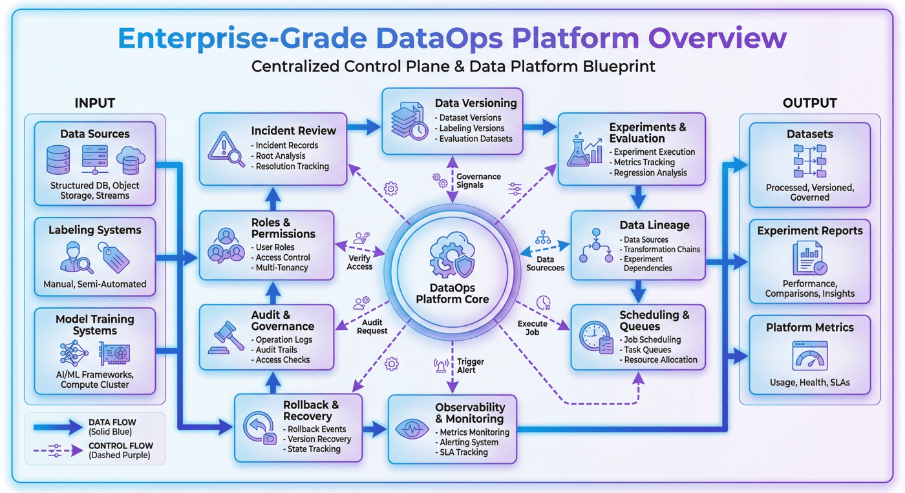

---

## 4. 全体的なアーキテクチャ: DataOps プラットフォームの階層構造

現在のプラットフォームには、**4 つのコア レイヤー**、**4 つのキュー**、**5 つの UI パネル**がすでに含まれています。
これは、プラットフォーム プロトタイプが単一のスケジューラーを中心に展開しているのではなく、「システム レベル + 実行中のオブジェクト + ガバナンス ビュー」によって編成されていることを示しています。

工学的な観点から見ると、より簡単に説明できる解体方法は通常 4 階建てです。

### 4.1 アクセス層とサービス層

この層は、テナント、プロジェクト、ユーザー、および外部システムへのアクセスを提供します。
通常、これには API インターフェイス、認証ロジック、ロール検証、コンソール エントリが含まれます。
プラットフォームには最初に内部ロジックがあり、その後一時的に入り口が提供されるわけではありません。それどころか、プラットフォームは「誰がどのような立場でシステムに参加するのか」を最初から明確にする必要があります。

### 4.2 スケジューリング層と実行層

この層は、プラットフォーム上で実際にタスクを完了する役割を果たします。
タスクキュー、スケジュールルール、実行ステータス、失敗時の再試行、およびイベントトリガーが含まれます。
この層がなければ、プラットフォームは単なるメタデータ システムになります。この層だけでは、プラットフォームは通常のスケジューリング システムに退化します。
したがって、プラットフォームには実行機能とガバナンス機能の両方が組み込まれている必要があります。

### 4.3 メタデータとガバナンス層

これは、DataOps プラットフォームのコア層です。
この層は、バージョン、実験、系統、監査、アラーム、SLA、ロールバック、およびガバナンス ポリシーの記録を担当します。
このレベルで、プラットフォームと「スクリプト ツール」の間のギャップが実際に拡大します。
このレイヤーがなければ、チームができるのはタスクが完了したかどうかを知ることだけです。
このレイヤーにより、チームはタスクがなぜこのように実行されるのか、問題が発生した場合の追跡方法、およびリグレッションが発生した場合の撤退方法を理解できます。

### 4.4 ストレージとアセット層

この層は、データのバージョン、実験結果、評価レポート、操作ログ、設定ファイル、操作記録を扱います。
これにより、プラットフォームが抽象的なプロセスではなく、真に再利用可能なデータ資産とガバナンス資産を管理することが保証されます。

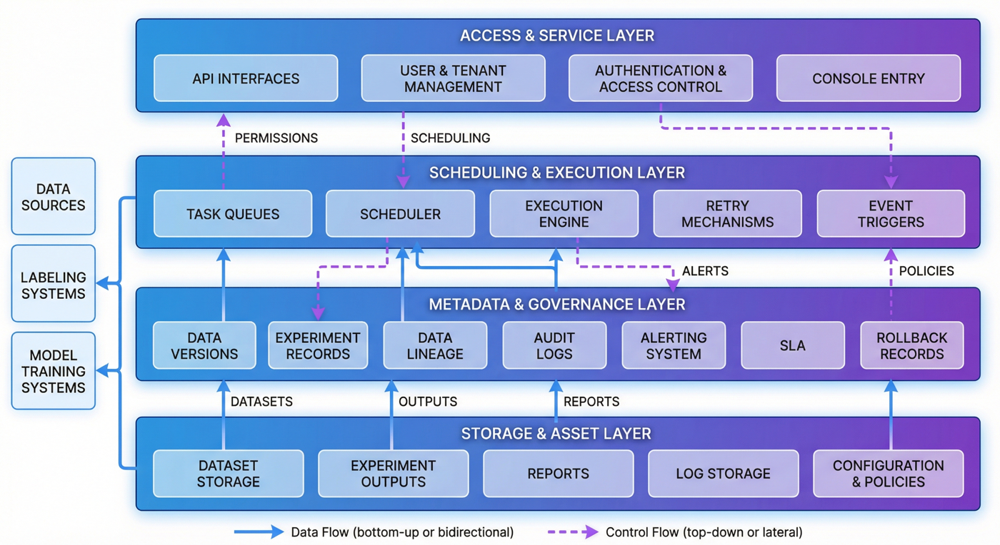

---

## 5. プラットフォームプロセス：仕様作成、シミュレーション動作、評価検査

既存のプロジェクトのプロセスは次のとおりです。

1. `src/build_platform_specs.py`: プラットフォーム仕様とガバナンス設計の生成
2. `src/simulate_platform_ops.py`: シミュレーション プラットフォームの操作
3. `src/evaluate_platform.py`: 評価プラットフォームの指標
4. `src/render_p8_chapter.py`: チャプター プレビューのレンダリング (README に記載されていますが、現在は見つかりません)
5. `src/run_p8_checks.py`: プロジェクトのチェック

この順序は、プラットフォーム プロジェクトと通常のデータ スクリプト プロジェクトの違いを反映しているため、非常に重要です。

> プラットフォームは、まず「システムとは何か」を定義し、次に「システムが何を行うか」を実行し、最後に「システムがどのように実行されているか」を評価する必要があります。

言い換えれば、P08 は、最初に大量のタスク ロジックを作成し、その後ドキュメントを埋めていくというものではありません。
代わりに、最初にプラットフォームの仕様層とガバナンス層を確立し、次にプラットフォームの運用と運用をシミュレーションします。

これは、プラットフォーム構築の重要な原則を反映しています。

- **最初にオブジェクトとルールを定義します。**
- **操作とイベントを再定義します。**
- **最後に指標と受け入れを定義します。 **

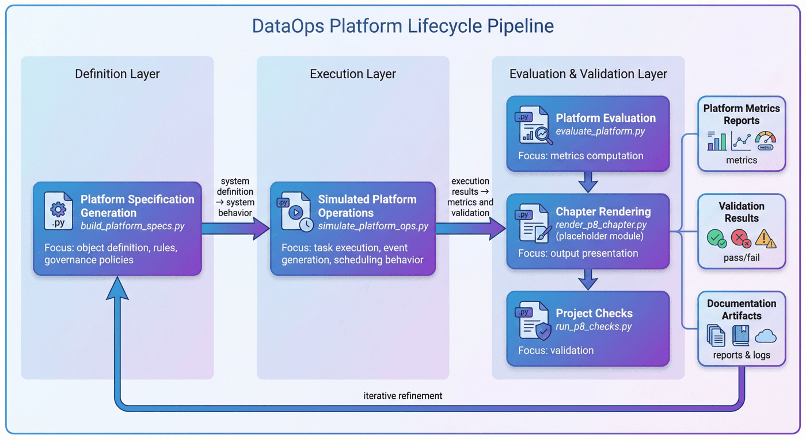

---

## 6. オブジェクト モデリング: プラットフォームの主要なオブジェクト階層

現在プラットフォームによって管理されている主なオブジェクトには次のものがあります。

- テナント `3`
- プロジェクト `3`
- 役割 `5`
- API `6`
- コア層 `4`
- キュー `4`
- UI パネル `5`

この一連のオブジェクト関係は、P08 が最初に「機能メニュー」から起動するのではなく、最初に「プラットフォーム オブジェクト」から起動することを示しています。
これは、エンタープライズ レベルのプラットフォームと個人用スクリプト システムの重要な違いの 1 つでもあります。

### 6.1 テナント

テナントは、プラットフォームのトップレベルのリソースおよびガバナンス境界です。
これは、リソースの分離を決定するだけでなく、権限、有効範囲、承認リンク、ガバナンス ルールも決定します。
テナントの概念のないプラットフォームでは、真の組織レベルでの共同利用を実現することは困難です。

### 6.2 プロジェクト

プロジェクトは、プラットフォームの実際の作業単位です。
データのバージョン、実験の実行、アラーム イベント、成果物、レポートの結果はすべて、特定のプロジェクトに帰属する必要があります。
プロジェクト層の存在により、プラットフォームが抽象的な管理シェルではなく、真にチーム作業を実行できる操作スペースであることが保証されます。

### 6.3 役割

現在、プラットフォームには `5` の役割があります。
ロールモデルの重要性は、「誰が何をできるか」を口頭でのコラボレーションからシステムの能力に変えることです。
例えば：

- バージョンを作成できる人。
- 誰がバージョンをリリースできるか。
- 監査ログを閲覧できる人。
- ロールバックを実行できるのは誰ですか。
- 事故調査の責任者は誰ですか?

プラットフォーム プロジェクトでは、役割は「企業レベル」に見えることを目的としたものではなく、責任の最も基本的な境界を確立することを目的としています。

### 6.4 API、キュー、UI パネル

このプラットフォームには、`6` API、`4` キュー、`5` UI パネルがあります。
これら 3 種類のオブジェクトは次のことを表します。

- **API**: プラットフォーム機能へのプログラムによる入り口。
- **キュー**: プラットフォーム タスクの実行キャリア。
- **UI パネル**: プラットフォーム ガバナンス ビューがどのように構成されているか。

これらを総合すると、P08 が単なるオフライン製品ではなく、「システムがどのように呼び出され、どのように実行され、どのように観察されるか」をプロトタイプレベルですでに考えていることがわかります。

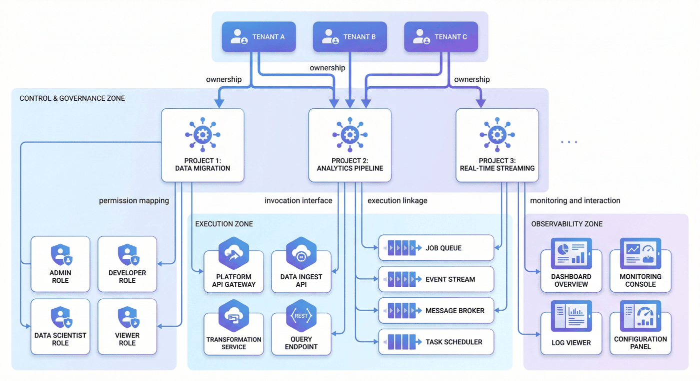

---

## 7. コード統合: プラットフォーム仕様を構造化製品に実装する方法

P08 の成果物にはすでに以下が含まれています。

- `data/processed/platform_scope.json`
- `data/processed/architecture_spec.json`
- `data/processed/api_catalog.json`
- `data/processed/task_queues.json`
- `data/processed/governance_policy.json`
- `data/processed/operating_model.json`

これは、プラットフォーム設計がテキスト記述レベルに留まらず、すでにコア仕様を構造化文書として完成させていることを示しています。

対応する実装は次のとおりです。この構造は、プラットフォーム仕様が構造化された製品にどのように実装されるかを反映しています。

```python
from pathlib import Path
import json

OUTPUT_DIR = Path("data/processed")
OUTPUT_DIR.mkdir(parents=True, exist_ok=True)

platform_scope = {
    "tenant_count": 3,
    "project_count": 3,
    "roles": [
        "admin",
        "platform_pm",
        "data_engineer",
        "qa",
        "ops"
    ],
    "core_layers": 4,
    "queues": 4,
    "ui_panels": 5
}

with open(OUTPUT_DIR / "platform_scope.json", "w", encoding="utf-8") as f:
    json.dump(platform_scope, f, ensure_ascii=False, indent=2)
```

この構造は、プラットフォーム設計の 3 つの特徴を反映しています。

1. プラットフォーム オブジェクトは明示的にモデル化されます。
2. 仕様の定義は運用プロセスに先行します。
3. プラットフォームの機能は、実行の最後に口頭で要約されるのではなく、構造化された成果物によって固定されます。

この表現方法は、単にアーキテクチャ図を表示するのに比べて、実装可能なプラットフォーム設計に近い表現方法となります。

## 8. バージョン管理: プラットフォームのバージョンセンター

現在のプラットフォームは合計 **6 つのデータ バージョン**を管理しており、そのうち **5 つはリリースされています**。
この規模は大きくありませんが、重要な議論を裏付けるには十分です。

> DataOps プラットフォームの場合、バージョンは付属フィールドではなく、ガバナンスの閉ループ全体の基本言語です。

### 8.1 バージョン管理と解釈可能性

バージョン管理のないプラットフォームでは、実験結果は「今回は何が出たか」というレベルでしか意味を持たないことが多い。
しかし、本当に重要な質問は次のようなものであることがよくあります。

* この結果はどのデータ バージョンに依存していますか?
* 以前のバージョンと比べて何が変わりましたか?
* どの変更が結果の変動を引き起こしましたか?
* このバージョンはリリースの準備ができていますか?
* ロールバックしたい場合、どこにロールバックすればよいでしょうか?

これらの質問にシステムが答えることができない場合、実験結果は組織に関する再利用可能な知識ではなく、1 回限りの観察にすぎません。

### 8.2 バージョン管理とディレクトリ名の違い

多くのチームは、「バージョン管理」と呼ばれる、日付や人名によってディレクトリを作成することに慣れています。
このアプローチでは、最も表面的な差別化機能を提供できますが、実際のプラットフォーム ガバナンス機能を提供することはできません。

真のバージョン管理には少なくとも次のものが含まれている必要があります。

* 一意のバージョン識別子。
* バージョンステータス。
* 上流の依存関係。
* 変更の概要。
* リリースと凍結のルール。
* ロールバック候補関係。
* 実験、レポート、および公開オブジェクトへの参照チェーン。

### 8.3 バージョン構成図

```python
dataset_version = {
    "version_id": "ds_v005",
    "project_id": "p02_legal_sft",
    "status": "released",
    "parent_version": "ds_v004",
    "change_summary": [
        "补充高风险拒答样本",
        "修复重复切块问题",
        "同步新评测标签"
    ],
    "rollback_candidate": True
}
```

この構造では、バージョンは静的なラベルではなく、実行、評価、ロールバックに参加できるガバナンス オブジェクトになります。

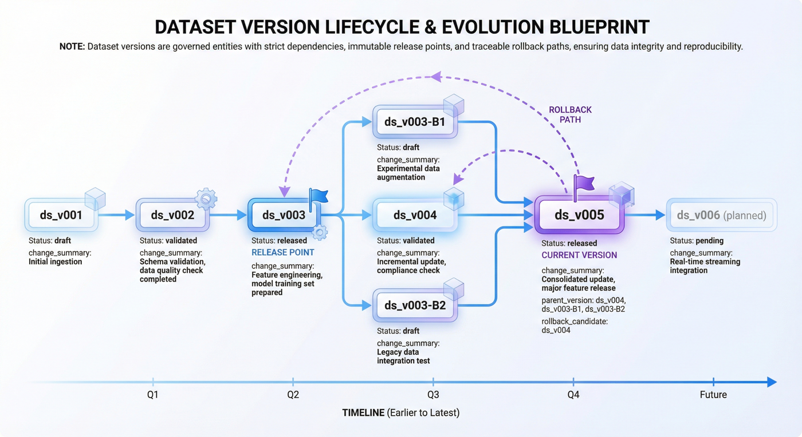

---

## 9. 実験追跡：操作記録と原因追跡

現在のプラットフォームでは、以下を含む合計 **7 件の実験**が記録されています。

* `completed = 5`
* `regressed = 1`
* `failed = 1`

この一連の数値は、プラットフォームが成功した実験を保持するだけではないことを示しているため、非常に代表的です。

### 9.1 すべての実験記録を保管する

プロジェクトの報告習慣の多くは、「最良の結果」だけを示します。
しかし、プラットフォーム ガバナンスの目標は、美しい宣伝資料を作成することではなく、チームの真の運営軌道を決定することです。

失敗した実験、回帰実験、不安定な実験は、通常、プラットフォームの最も貴重な資産です。なぜなら、それらは次のような答えになるからです。

* どの戦略が機能しないのか。
* どのバージョンが危険にさらされているか。
* どの指標がボラティリティに最も敏感であるか。
* どの実験結果が出版プロセスに入る価値がないのか。

### 9.2 実験対象にはどのような核となる情報を含める必要がありますか?

プラットフォーム レベルの実験的オブジェクトには、少なくとも次のものを含める必要があります。

* 実験ID
* プロジェクト
* 参照データのバージョン
* キー構成
* 運転状況
* 結果の概要
* 評価結論
* アラームをトリガーするかどうか
* ロールバックを関連付けるかどうか

これにより、プラットフォームは「実験が行われた」状態から「実験は責任を負わされ、レビューされ、アクセスできる」状態に移行できるようになります。

### 9.3 実験記録の簡略化した構造

```python
experiment_run = {
    "experiment_id": "exp_007",
    "project_id": "p02_legal_sft",
    "dataset_version": "ds_v005",
    "status": "regressed",
    "metric_summary": {
        "f1": 0.79,
        "latency_ms": 620
    },
    "requires_review": True
}
```

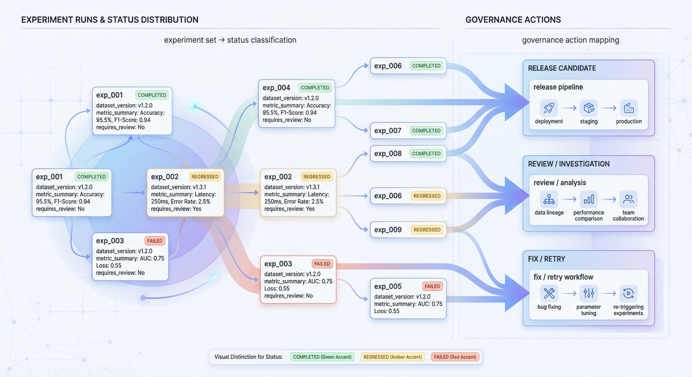

---

## 10. 系統図: バージョン、実験、イベントの関係

血統グラフの現在のサイズは次のとおりです: **21 ノード、19 エッジ**。
これは、プラットフォームがオブジェクト間の依存関係を表形式のレコードに留めるのではなく、グラフに整理し始めていることを示しています。

### 10.1 血統図における因果関係追跡の役割

系統マップの真の価値は、チームが次のような一連の重要な質問に答えるのに役立つことです。

* どの実験で特定のバージョンのデータが使用されていますか?
* 特定の実験の失敗はその後のリリースに影響を及ぼしますか?
* どのアラートがどの実験またはバージョンによってトリガーされましたか?
* 特定のロールバックによって返されるオブジェクトはどのリンクですか?
* 特定の結果レポートを生成するためにどのアップストリーム オブジェクトが使用されますか?

祖先マップがなければ、これらの問題は手動でしか追跡できません。
系統マップが利用可能であれば、それらはプラットフォームの日常的な機能になる可能性があります。

### 10.2 簡単なエッジ定義の例

```python
lineage_edge = {
    "from": "dataset:ds_v005",
    "to": "experiment:exp_007",
    "relation": "used_by"
}
```

### 10.3 プロトタイプ段階で血縁関係を導入する価値

多くのチームは、血統マッピングはプラットフォームが成熟するまで待つべきだと感じるでしょう。
しかし逆に、血液の導入が早ければ早いほど、持続可能なオブジェクトのデザインを形成することが容易になります。
バージョン、実験、アラーム、ロールバック、レポートが最初から相互に関連するグラフ オブジェクトとして扱われる場合、その後のプラットフォームの拡張はよりスムーズになります。
最初にそれらをいくつかの独立したテーブルに分散した場合、通常は後から血のつながりを追加する方がコストが高くなります。

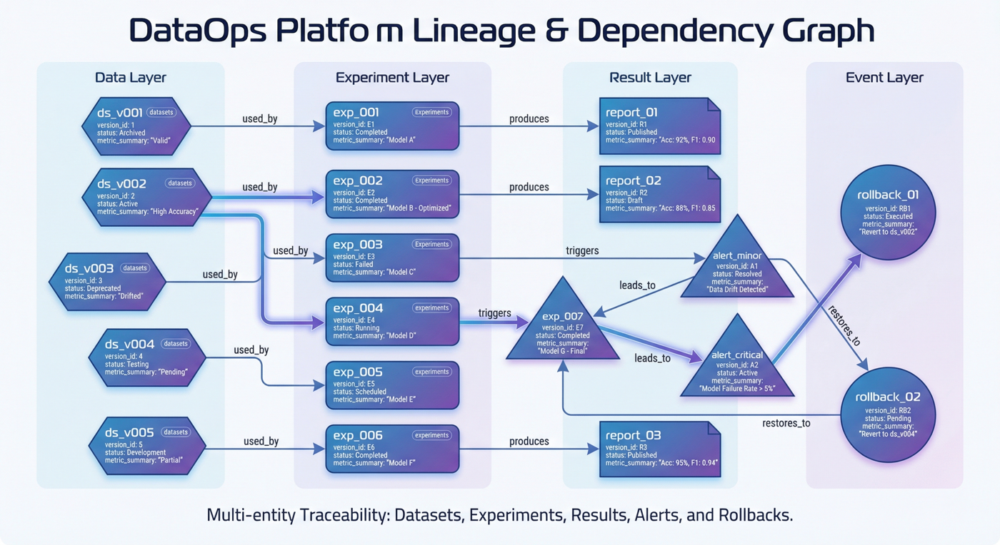

---

## 11. ロールバックメカニズム: プラットフォーム回復機能

現在のプラットフォームは、`rollback=1` イベントを明示的に予約しています。
これは、プラットフォームが進むパスだけでなく戻るパスも管理していることを示すため、重要です。

### 11.1 基本機能としてのロールバック

実際のデータ プロジェクトは直線的に改善するわけではありません。
データの改訂、クリーニングロジックの調整、測定セットの交換、さらにはタスクの順序の変更によっても、結果が悪化する可能性があります。

プラットフォームに明示的なロールバック機能がない場合、チームは問題発生後に履歴ファイルを一時的に復元したり、手動でバージョンを切り替えたり、古いオブジェクトを再デプロイしたりすることしかできません。
このアプローチの問題点は次のとおりです。

* 回復時間が長い。
* 操作は監査できません。
* 責任の境界があいまいになる。
* 経験は吸収できません。

### 11.2 ロールバック イベントには何を記録する必要がありますか?

適格なロールバック イベントには、少なくとも次のものが含まれている必要があります。

* ロールバックID
* トリガー理由
* 関連する実験またはアラーム
* ロールバック対象バージョン
* 実行時間
* 執行者
* 状態を復元する
* フォローアップレビューのリンク

### 11.3 組織の信頼におけるロールバックの役割

プラットフォームの後退が発生した場合、チームが最も恐れるのは「撤退の必要性」ではなく、「撤退のコストが制御不能であること」です。
ロールバック機能を備えたプラットフォームを使用すると、「何か問題が発生した場合の対処」を緊急消火から標準的なアクションに変えることができます。

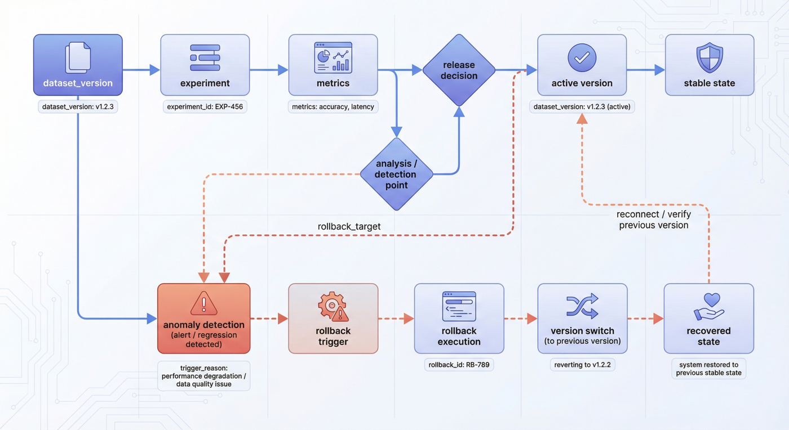

---

## 12. 可観測性: プラットフォームの健全性の判断

現在のプラットフォームの可観測性面には次のものが含まれます。

* アラーム `3` アイテム
* 解決率 `100.00%`
* SLA 遵守率 `100.00%`
* 平均インシデント復旧時間 `36.5` 分

これは、P08 が「タスクが正常に実行されたかどうか」をカウントするだけでなく、実際のプラットフォームの操作に近い問題の測定を開始することを示しています。

* 何か警告はありますか？
* アラームが解決されたかどうか。
* SLA が標準に準拠しているかどうか。
* 事故から立ち直るまでどれくらい時間がかかりますか。

### 12.1 ログを超えた可観測性

ログは重要ですが、ログは「何が起こったか」を答えているだけです。
プラットフォームの操作には他の次元も必要です。

* インジケーターは「逸脱しているかどうか」に答えます。
* アラームは「応答する必要がありますか?」と応答します。
* 監査は「誰が何をしたか」に答えます。
* 事故のレビューは「将来それを回避する方法」に答えます。

これらの次元が合わさって、プラットフォームの観察可能な閉ループを形成します。

### 12.2 SLA の観点

SLA の価値は、「システムの運用」を「サービスのコミットメント」に変換することです。
プラットフォームが組織での使用段階に入ると、チームはスクリプトを実行できるかどうかだけでなく、次のことも考慮します。

* プラットフォームが引き続き利用可能かどうか。
* 異常が時間内に検出されたかどうか。
* 許容可能な時間内に障害が回復したかどうか。
* 重要なガバナンス活動が保証されているかどうか。

### 12.3 簡略化されたアラーム構造

```python
alert = {
    "alert_id": "alert_003",
    "severity": "high",
    "category": "sla_risk",
    "related_object": "experiment:exp_007",
    "status": "resolved"
}
```

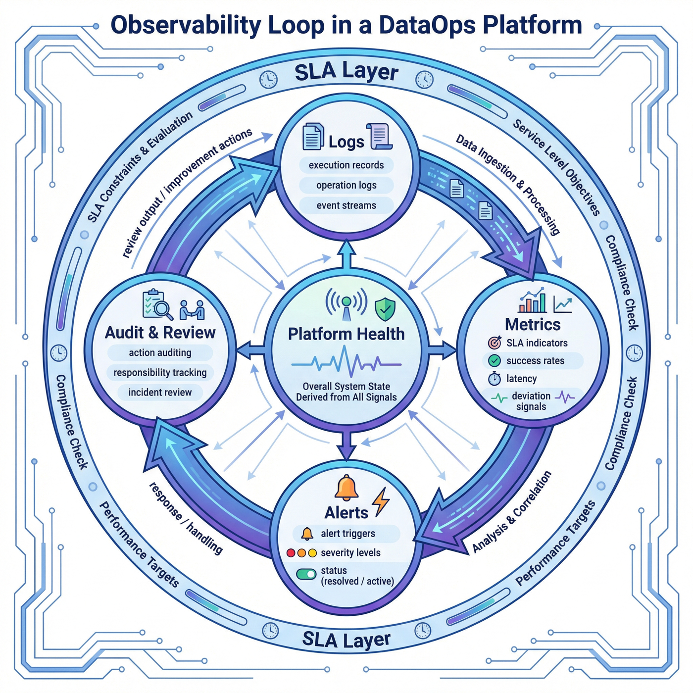

---

## 13. 監査と事故のレビュー: プラットフォームのコンポーネントとしてのインシデントのレビュー

P08 の主要な成果物には、次のものが明示的に含まれます。

* `alerts.jsonl`
* `audit_log.jsonl`
* `incident_reviews.jsonl`
* `sla_report.json`

これは、プラットフォームがインシデント処理をシステムの外部に任せていないことを示しています。
多くのチームはインシデントのレビューをプラットフォーム資産ではなく会議議事録やチャット記録に作成するため、これは非常に重要です。
この結果は次のとおりです。
この事件は「議論」されたが、プラットフォームは実際には強化されなかった。

### 13.1 インシデントレビューでは何を解決する必要がありますか?

本当に価値のある事故レビューでは、「問題が一度発生した」ことを記録するだけでなく、次のことも含める必要があります。

* 問題現象;
* 影響範囲。
* 根本原因の分析。
* 一時的な修復措置。
* 永久修理品。
* 責任ある役割。
* 有効期限;
* 対応するバージョンまたはオブジェクト。

### 13.2 監査ログとレビューの連携

監査ログは、「誰が何をしたか?」に答える責任があります。
インシデントレビューには、「なぜ問題が発生したのか、今後どのように問題が発生しないのか」に答える責任があります。
2 つが別々に存在する場合、プラットフォームは部分的な証拠しか提供できません。
連携があれば、プラットフォームは真に学習する能力を持つことができます。

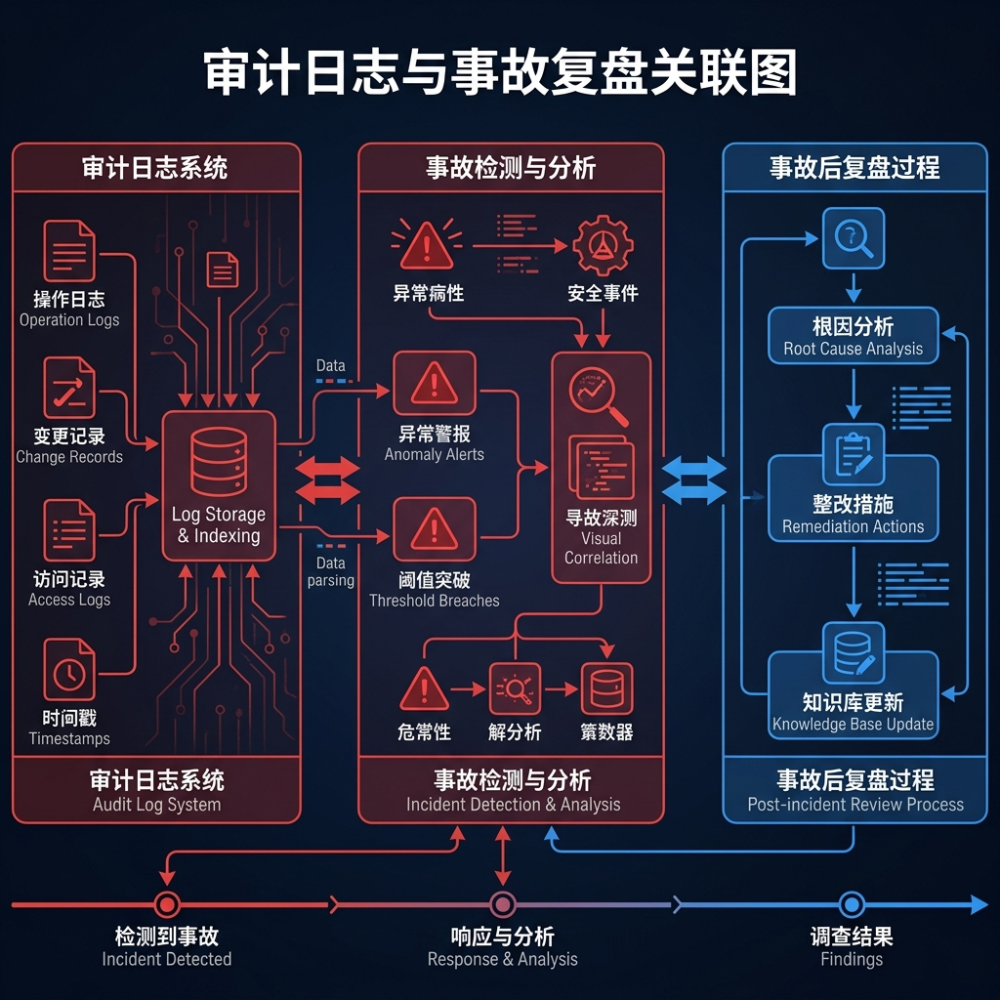

---

## 14. コンソールと操作ビュー: パネル化されたガバナンス オブジェクト

現在のプラットフォームには **5 つの UI パネル**があります。
現在のプロジェクトの焦点は UI 実装そのものではありませんが、この数字自体が、プラットフォームがガバナンス オブジェクトをさまざまなビューに編成する必要性を考慮していることを示しています。

DataOps プラットフォームの場合、パネルの価値は「見栄えの良い視覚化」ではなく、次の点にあります。

* オブジェクトをカテゴリに分類します。
* 実行ステータスを構造化された方法で表示します。
* さまざまなキャラクターが見る必要があるコンテンツを分離します。
* 日常のプラットフォームアクションをわかりやすい操作インターフェイスに変換します。

適切なコンソール ビューには通常、次のものが含まれます。

1. プラットフォーム概要パネル
2. バージョンとリリースパネル
3. 実験・評価パネル
4. アラートと SLA パネル
5. 監査およびレビューパネル

この設計方法は、プラットフォームが統一された寄せ集めページではなく、責任に応じてガバナンス オブジェクトを異なるビューに分割することを意味します。

---

## 15. プロジェクトチェック: プラットフォームの整合性検証

現在、プロジェクトには合計 `13` 件の検査があり、すべて合格しました。
その中には、コマンド レベルの検査用の `2` 項目と、データ/製品レベルの検査用の `11` 項目があります。
検査範囲には次のものが含まれます。

* `py_compile`
* `evaluate_platform`
* `required_files_exist`
* `role_and_permission_model_present`
* `architecture_layers_complete`
* `api_queue_ui_present`
* `version_lineage_links_valid`
* `experiments_reference_versions ...`

この種の検査は、プラットフォームがコード、製品、レポート間の一貫性を検証する機能を本当に備えているかどうかを判断するため、非常に重要です。

### 15.1 リンクの機能を確認する

多くのプロジェクト文書は、完全なアーキテクチャ図、フローチャート、指標の説明を含めて非常に美しく書くことができます。
しかし、コード、アーティファクト、レポートが相互に矛盾している場合、学習されるのはエンジニアリング手法ではなく、単なるケースラップです。

### 15.2 プラットフォームプロジェクトにおけるチェックの重要性

プラットフォーム プロジェクトの場合、検査は少なくとも 3 つの役割を果たします。

* 製品が完成しているかどうかを確認します。
* オブジェクトの関係が妥当かどうかを検証します。
* レポートの説明がデータと一致していることを確認してください。

### 15.3 簡略化したチェック例

```python
required_files = [
    "data/processed/platform_scope.json",
    "data/processed/architecture_spec.json",
    "data/processed/dataset_versions.jsonl",
    "data/processed/experiment_runs.jsonl",
    "data/reports/p8_metrics.json",
    "data/reports/p8_test_report.md"
]

for path in required_files:
    assert Path(path).exists(), f"Missing required artifact: {path}"
```

このチェックは単純に見えますが、プラットフォーム プロジェクトを「コンセプトが正しい」状態から「一貫して提供される」状態に効果的に進めることができます。

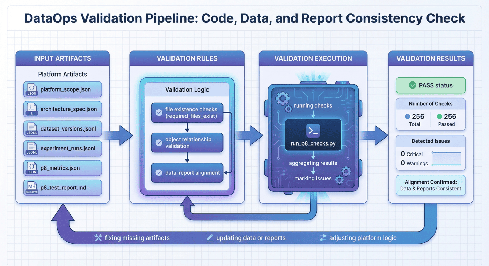

---

## 16. 主な成果物: プラットフォームの完全な製品チェーン

P08 の主な成果物は次のとおりです。

* `data/processed/platform_scope.json`
* `data/processed/architecture_spec.json`
* `data/processed/api_catalog.json`
* `data/processed/task_queues.json`
* `data/processed/governance_policy.json`
* `data/processed/operating_model.json`
* `data/processed/dataset_versions.jsonl`
* `data/processed/experiment_runs.jsonl`
* `data/processed/lineage_graph.json`
* `data/processed/rollback_events.jsonl`
* `data/processed/alerts.jsonl`
* `data/processed/audit_log.jsonl`
* `data/processed/incident_reviews.jsonl`
* `data/processed/sla_report.json`
* `data/console/ui_panels.json`
* `data/reports/p8_report.md`
* `data/reports/p8_chapter_preview.pdf`
* `data/reports/p8_preview_stats.json`
* `data/reports/p8_metrics.json`
* `data/reports/p8_test_results.json`
* `data/reports/p8_test_report.md`

この一連の成果物は、P08 が単なる最終レポートではなく、完全なプラットフォーム製品チェーンを形成したことを示しています。

この一連の文書からさらに詳しく見ることができます。

* プラットフォームは単なる「最終プレゼンテーション層」ではありません。
* 中間状態と統治オブジェクトは保持されます。
* レポート、メトリクス、チェックは、逆に書かれたものではなく、実際の成果物から得られます。

---

## 17. 結果の解釈: P08 の現在のプラットフォームの特性

P08 の重要な特徴は、プラットフォームを成功への道に沿って前進するだけの理想的なシステムに縮小するのではなく、以下を明示的に保持することです。

* 回帰実験。
* 失敗した実験。
* ロールバックイベント。
* アラートとインシデントのレビュー。
* ドキュメントとコードの間にある小さなギャップ。

これらの情報を総合すると、現在のプラットフォームが単に静的なアーキテクチャを表示するのではなく、実際のガバナンスにおいて最も重要なタイプのオブジェクトと状態をカバーし始めていることがわかります。

プラットフォームのプロトタイプが概念レイヤーと成功パスのみを保持している場合、その後のガバナンス機能を検証するのは困難になります。 P08 現在、少なくとも次の 2 種類の情報がシステムに組み込まれています。

* 1 つのタイプは、オブジェクト、ルール、バージョン、実験、監査などの構造化されたガバナンス オブジェクトです。
* もう 1 つのカテゴリは、回帰、障害、ロールバック、レビューなどの障害パス情報です。

プラットフォームは小さいかもしれませんが、主要なガバナンス オブジェクトと障害パスは体系的に保持される必要があります。この方法によってのみ、プラットフォームは組織レベルの機能に拡張し続けるための基盤を得ることができます。

---

## 18. 制限とリスク: プラットフォーム プロトタイプの境界

現在のプロジェクトには、明示的に保持する必要がある少なくとも 3 つの制限があります。

### 18.1 現在はまだプラットフォームのプロトタイプ

すでにオブジェクト モデリング、シミュレーション実行、メトリック評価、および検査の閉ループが備わっていますが、まだ実稼働グレードのコントロール プレーンではありません。
これは、オンライン プラットフォーム ソリューションとして直接ではなく、方法論モデルとしてより適切であることを示しています。

### 18.2 ドキュメントとコードの間に局所的な不一致が依然として存在する

README に記載されている `render_p8_chapter.py` は現在見つかりません。
これはプロジェクトの価値を覆すものではありませんが、プラットフォーム エンジニアリングとドキュメントの同期が依然として将来的に完了する必要があるリンクであることを示しています。

### 18.3 徹底したマルチテナントガバナンスはまだ始まっていない

プロジェクトにはテナントの概念が明示的に含まれていますが、BU や組織全体にわたる分離、承認、割り当て、ガバナンスの深さはまだ実際には明らかにされていません。
これは、プラットフォームがプロトタイプから組織レベルのシステムに移行するための重要なギャップの 1 つでもあります。

これらの制限を率先して書き出すことは、プロジェクトを弱体化させることはなく、訴訟の信頼性を高めることになります。

---

## 19. 次の拡張: 組織の DataOps に向けて

現在のプラットフォーム構造と組み合わせると、P08 の最も自然な拡張方向はおよそ 3 つあります。

### 19.1 プロトタイプガバナンスから複数BUの協調ガバナンスへ

現在の単一チームまたは小規模コラボレーションのプロトタイプを真のチーム間使用環境に拡張するには、さらなる改善が必要です。

* クォータ管理。
* よりきめ細かい権限。
* 承認および例外メカニズム。
* マルチテナント分離戦略。

### 19.2 静的記録から動的アクセス制御へ

現在のプラットフォームでは、バージョン、実験、アラーム、ロールバックをすでに記録できます。
次のステップでは、これらのオブジェクトを動的アクセス制御ロジックにさらに接続できます。たとえば、次のようになります。

* 実験的な回帰により、リリースが自動的にブロックされます。
* SLA リスクによりフリーズが発生します。
* 高リスクバージョンには手動による承認が必要です。
* 主要プロジェクトのロールバックにより、アップグレード プロセスが開始されます。

### 19.3 技術プラットフォームから運用プラットフォームへ

多くのプラットフォーム プロジェクトは「システムの構築」で止まりますが、真の組織レベルのプラットフォームには、次のような運用リズムも必要です。

* バージョン凍結日。
* 毎週のガバナンス会議。
* 義務メカニズム。
* 事故レビューのリズム。
* SLA の週次または月次レポート。
* ゲートレビューを投稿します。

これらのリズムがプラットフォーム オブジェクトと結びついて初めて、DataOps は「ツール」から「組織機能」に真の意味で変化することができます。

---

## 20. 章の要約: 責任、証拠、回復力

P08 の重要な価値は、「プラットフォームが多くの JSON ファイルを管理できる」ことを証明することではなく、別のより重要なことを証明することです。

> データ エンジニアリングが単一プロジェクトのコラボレーションから長期的な組織運営に移行する場合、プラットフォームの中心的な責任は、プロセスをより統一的に見せることではなく、バージョン、実験、障害、アラーム、ロールバック、レビューを追跡可能なシステム オブジェクトに変換することです。

既存のプロジェクトの結果から判断すると、P08 にはすでにいくつかの主要なエンジニアリング機能が備わっています。

* 「何でもできる」システムに一般化するのではなく、プラットフォームの境界を明確にします。
* 仕様の生成からシミュレーション操作、指標評価、プロジェクト検査までの完全なリンクがあります。
* バージョン、実験、系統、ロールバック、SLA、アラーム、監査、インシデント レビューなどの管理オブジェクトがあります。
* 成功したデモンストレーションを単に保持するのではなく、実際の失敗経路を用意します。
* `13/13` チェック合格レコードがあり、コード、アーティファクト、レポートが一貫していることを示しています。

したがって、P08 の真の価値は、「プラットフォームのプロトタイプを構築する」ことではなく、中程度の規模のプロジェクトを使用して、エンタープライズ レベルの DataOps プラットフォームの最も重要なガバナンス ロジックを、ナレーション付き、検証可能、再利用可能なケースに変えることです。

この章の最も重要な結論は、次の 1 つの文に要約できます。

> DataOps プラットフォームが本当に構築したいのは、より多くのページではなく、より完全なガバナンスの閉ループです。

---

## 特別なトピック: プロトタイプから組織のパイロットまでのプラットフォームの実装パス

多くのチームが P08 のようなプラットフォームのプロトタイプを見た後の最初の反応は、多くの場合、「まず大規模で包括的なプラットフォームも構築すべきでしょうか?」というものです。しかし、実装の経験から判断すると、プラットフォームが失敗する可能性が最も高いのは、すべての問題を一度に解決しようとすることです。より現実的なアプローチは、プラットフォームの構築を実装可能ないくつかの段階に分割して、オブジェクト モデル、ガバナンス機能、組織の導入率を同時に成長させることです。

### 1. 第 1 段階: まずオブジェクトと境界を固めます。

プラットフォーム化の最初のステップは、通常、UI を作成したり、すべてのスケジューラーを接続したりすることではなく、最も重要なシステム オブジェクトを強化することです。つまり、チームは少なくとも次の質問に最初に答える必要があります。

* プラットフォームが管理するテナント、プロジェクト、役割。
* データバージョン、実験、アラーム、ロールバック、監査の対象はそれぞれ何ですか?
* 哪些操作属于平台内动作，哪些仍然停留在外部脚本；
* 平台当前支持哪些边界内的工作流，不支持哪些边界外的需求。

这一阶段的成功标志，不是“功能很多”，而是“所有人开始使用同一套词汇描述同一件事”。一旦这一点做到了，后续无论接入指标、面板还是自动门禁，平台都会有明确依附对象；如果这一点没做到，后续新功能越多，系统就越容易失焦。

### 二、第二阶段：先打通版本、实验与发布主链

プロトタイプからパイロットに移行する場合、優先すべき最も重要なことは、すべてのガバナンス オブジェクトではなく、バージョン、実験、リリース間のメイン チェーンです。理由は簡単です。組織内で最も頻繁に起こる痛みを伴う意見の相違は、通常、この関係を中心に起こっています。

この段階では、プラットフォームは少なくとも次のことに答えることができるはずです。

* バージョンの作成者、作成時期、および変更内容。
* ある実験でどのバージョンを使用し、どのようなパラメータを使用して、どのような評価結果が得られたか。
* 特定の結果がリリースされた理由、またはロールバックされた理由。
* バージョン、実験、評価、またはスケジュールのフェーズで特定の回帰が発生するかどうか。

このメインチェーンがスムーズに動作する限り、プラットフォームは「制御不能なバージョン」や「責任の喪失」といった多くの問題を解決できるでしょう。対照的に、複雑なワークベンチ、統合されたチャートの大画面、きめ細かいワークフロー オーケストレーションなど、一見するとより魅力的な機能の多くは、後の段階で徐々に完成させることができます。

### 3. 第 3 段階: 障害が発生したパスをプラットフォームの主要構造に統合します。

組織のパイロット間の本当の違いは、多くの場合、成功したパスではなく、失敗したパスが主要な構造に組み込まれるかどうかにあります。プラットフォームが「誰が何を公開できたか」を記録するだけであれば、それはすぐに表示パネルに縮小されてしまいます。失敗した実験、回帰アラーム、承認ブロック、ロールバック イベントがすべて構造化されて保持されて初めて、プラットフォームは真のガバナンス インフラストラクチャになることができます。

通常、この段階で最も優先すべきことが 4 つあります。

* アラームはオブジェクト化され、アラームはメッセージング ツールだけに留まらなくなりました。
* ロールバック構造により、回復アクションが追跡可能で反復可能になります。
* インシデントのレビューは標準化されているため、インシデントの経験をプロセスにフィードバックできます。
* 例外承認は痕跡を残すため、高リスクのリリースは口頭コミュニケーションに依存しなくなります。

多くのチームは、プラットフォームに障害パスを書き込むと「システムが不安定」に見えるのではないかと心配しています。しかし逆に、失敗をあえて客観化することによってのみ、プラットフォームが安定するチャンスを得ることができます。なぜなら、安定性とは問題がないことを意味するのではなく、問題が発生したときにそれを特定し、回復し、そこから学ぶ能力を意味するからです。

### 4. 第4段階：マルチチーム導入と運用リズムのさらなる推進

主な構造が明確で、障害パスがシステムに含まれている場合、プラットフォームはマルチチームの導入を真に促進するのに適しています。現時点では、もはや「システムで何ができるか」だけではなく、「組織がシステムを利用する意思があるか、使い続けるか、プラットフォーム上で運用リズムを形成できるか」が焦点となっている。

通常、この手順を完了する必要があります。

* チームのオンボーディングメカニズム。
* プラットフォーム操作マニュアルと役割の説明。
* 週報、月報、勤務とレビューのリズム。
* 主要指標のカンバン表示。
* バージョンの凍結、リリースのレビュー、および例外承認のメカニズム。

プラットフォームが本当に組織的な試験運用に入ったという事実は、すべての技術的問題が解決されたことを意味するわけではありませんが、プラットフォームが真の協力関係を築き始めたことを意味します。現時点では、プラットフォーム構築はもはや純粋な技術プロジェクトではなく、テクノロジーと運用が共存する組織プロジェクトとなっています。

---

## 特集：プラットフォームレベルのインジケーターシステムと動作リズム

プラットフォーム プロジェクトでは誤解に陥りやすいのですが、それは、「指標」をタスクの成功率、CPU 使用率、平均消費時間などのいくつかの技術指標の積み重ねとして理解することです。これらの指標は確かに重要ですが、DataOps プラットフォームが本当に組織価値を提供しているかどうかを判断するには十分ではありません。プラットフォームレベルの指標は、使用量、品質、ガバナンス、リカバリの 4 つの側面を同時にカバーする必要があります。

### 1. 使用状況: そのプラットフォームは本当に採用されていますか?

プラットフォームが最初に答える必要があるのは、「どれだけ多くの機能を実行したか」ではなく、「チームがプラットフォーム上で重要なアクションを本当に完了したかどうか」です。したがって、ディメンションを使用するときは、少なくとも次のことに重点を置く必要があります。

* アクティブなテナントの数、アクティブなプロジェクトの数、およびアクティブな役割の範囲。
* バージョンの作成、リリースの承認、ロールバックの開始、アラームの確認など、プラットフォーム内の主要なアクションの完了率はすべて、プラットフォームの閉ループ内で完了します。
* プラットフォームを通じて入力された実験、リリース、監査記録の数。
* 異なるチームによる同じプラットフォーム オブジェクト モデルの使用における一貫性。

これらの指標が長期間にわたって低い場合、プラットフォームは存在するものの、実際には仕事の入り口になっていないことを意味します。これらの指標が徐々に増加すると、プラットフォームは「利用可能なツール」から「それを使用する組織」として考慮されるようになります。

### 2. 品質の側面: プラットフォームが不確実性を軽減するかどうか

このプラットフォームは、単にスクリプトを置き換えることを目的としたものではなく、システムの不確実性を軽減することを目的としています。品質の次元では次のことに重点を置くことができます。

* バージョンから実験までの引用完全率。
* 実験から報告されたアライメント率。
* リリース前検査の合格率。
* 時間を特定する回帰問題。
* ドキュメント、コード、製品間の一貫性のギャップの数。

これらの指標が総合的に反映しているのは、プラットフォームが「何か問題が発生したが、問題がどこにあるのかわからない」という状態を軽減したかどうかです。これが減少している限り、プラットフォームはすでに非常に現実的なエンジニアリング上の利点を生み出しています。

### 3. ガバナンスの側面: リスクの高い行為が制御に含まれるかどうか

DataOps プラットフォームと通常のオンプレミス システムの最大の違いの 1 つは、リスクの高いアクションに対してガバナンス制約を確立する必要があることです。したがって、ガバナンスの側面は以下に焦点を当てるのに適しています。

* すべての高リスクバージョンが承認されているかどうか。
* アラームが指定された時間内に確認され、処理されたかどうか。
* 監査ログの範囲が期待を満たしているかどうか。
* 主要な役割の権限への変更が痕跡を残すかどうか。
* インシデントのレビューが是正の閉じたループを形成しているかどうか。

この一連の指標は必ずしも「パフォーマンス」を直接向上させるわけではありませんが、プラットフォームが長期的に組織によって信頼できるかどうかを決定します。多くのプラットフォームは技術的には実行可能ですが、ガバナンスの側面が長い間欠けており、最終的には重要な瞬間にバイパスされることになります。

### 4. 復旧の次元: 問題発生後にシステムを正常に復旧できるかどうか

プラットフォーム構築において最も価値があるものの、見落とされがちな一連の指標は、回復の側面です。なぜなら、組織が本当に重視しているのは、単に「問題があるかどうか」ではなく、「問題が発生した後にすぐに回復できるかどうか、そして将来同様の問題を回避する方法を知っているかどうか」だからです。

ディメンションの復元では通常、次の点に重点を置くことができます。

* ロールバックのトリガー時間と成功率。
* 平均回復時間と重大なイベントの回復時間。
* 優先度の高いインシデントの完了率を確認します。
* 同様の問題の再発率。
* アラームの発生から復旧完了までのプロセス全体を追跡できます。

これらの指標は、プラットフォームを「問題が見える」から「問題に対処して経験を蓄積できる」へとさらにアップグレードするのに役立ちます。

### 5. 運用リズム: 指標は固定されたメカニズムに埋め込まれなければなりません

指標がレポートにのみ残されている場合、通常、指標はすぐに活力を失います。より効果的な方法は、固定された動作リズムにさまざまな次元の指標を埋め込むことです。

より実用的なリズムは次のとおりです。

* 日常レベルでの動作、アラーム、回復インジケーターに注意を払います。
* 毎週、バージョン、実験、回帰、アクセス制御の指標に焦点を当てます。
* 月次ベースでテナントの採用率、ガバナンスの成熟度、プラットフォームの収益指標に注意を払います。
* 四半期ごとに、チーム間のコラボレーション、システムの実行、プラットフォームの拡張に焦点を当てています。

このように、プラットフォーム指標はもはや単なる「レポート目的の統計」ではなく、組織の日常的なガバナンス活動に直接組み込まれています。指標がリズムに入ると、プラットフォームはプロジェクト製品から組織の習慣へと徐々に変化します。

---

## トピック: DataOps プラットフォーム構築における一般的なアンチパターン

プラットフォームを構築するのは難しいことではありませんが、難しいのは、最初は合理的に見えても、長期的にはシステムの速度を低下させるアンチパターンを回避することです。 P08 は、プロトタイプのケースとして、これらのアンチパターンを事前に明確に記述するのに適しています。

### 1. コンソールのみ、オブジェクトモデルなし

これは最も一般的で危険なアンチパターンです。チームはまず、リスト、グラフ、ボタンを備えたプラットフォームのような一連のページを作成しました。ただし、「バージョン、実験、ロールバック、アラートの関係は何ですか?」と尋ねると、明確な答えを得るのは難しいことがよくあります。その結果、ページ数はますます増え、システムの解釈はますます困難になります。

オブジェクト モデルのないプラットフォームは、短期的には迅速に反復できるように見えますが、長期的には管理が困難になります。すべての新しい関数は、安定したシステム オブジェクトではなく、UI レイヤーにのみハングできるためです。

### 2. 失敗したパスではなく、成功したパスのみを記録します。

結果を表示するために、多くの内部プラットフォームは成功したリリース、スムーズな実験、美しいインジケーターのみを保存し、失敗した実験、異常な回復、手動介入はシステムの外部に残しておきます。この結果、プラットフォームは「理想的なプロセス」についてのみ語ることができ、実際のレビューをサポートすることはできません。

組織がプラットフォームに依存すると、障害への道はプラットフォームの一部となるはずです。そうしないと、問題が発生するたびに、チームは答えを見つけるためにチャット記録、一時的なスクリプト、個人的な記憶に戻ることになり、プラットフォーム自体が最も重要な価値を失うことになります。

### 3. 最後まで監査と権限を残します。

もう 1 つの高頻度のアンチパターンは、最初にメイン プロセスを実行し、その後で監査、許可、承認の補足について考えることです。問題は、これらの機能が表面的な装飾ではなく、多くのオブジェクト関係の一部であることです。メインプロセスがそれを補うためにハードコーディングされるまで待つことは、多くの場合、システムの大部分を再構築することを意味します。

より賢明なアプローチは、たとえ最初は最小限のバージョンしかなかったとしても、役割の境界、監査トレース、および高リスクの操作制御ポイントをシステム スケルトンに組み込むことです。プラットフォームがこれらの問題を早く検討するほど、後の拡張が容易になります。

### 4. バージョン管理をディレクトリ命名仕様にする

一部のチームは、プラットフォームでのバージョン管理を「全員が命名規則に同意する」ものに堕落させるでしょう。命名規則は確かに役立ちますが、ガバナンスと同等ではありません。実際のガバナンスには、少なくともバージョンのメタ情報、参照関係、リリース時間、承認ステータス、ロールバックの関連付け、実験的な依存関係が含まれている必要があります。これらがなければ、いわゆるバージョン管理は依然として「きれいなフォルダー」に過ぎません。

P08 がバージョン センター、実験追跡、血縁関係を強調する理由は、まさにガバナンスをカタログ化と誤解することを避けるためです。ディレクトリはユーザーがファイルを見つけるのに役立ちますが、システムが因果関係を説明するのに役立つのは構造化されたオブジェクトだけです。

### 5. プラットフォームを組織メカニズムではなく技術ツールとして扱う

最後のアンチパターンは、多くのプラットフォームの成功が遅い根本原因でもありますが、プラットフォームを常にエンジニアによってエンジニアのために書かれた内部ツールとみなすことです。このように理解されている限り、プラットフォームはプロジェクトマネージャー、ガバナンスの役割、監査の役割、運用の役割を吸収することが難しく、一定のリズムを形成することも困難になります。

実際のプラットフォームは組織的なメカニズムでもある必要があります。誰が何に対して責任を負うのか、どのような状況で例外が認められるのか、どの指標を継続的に追跡する必要があるのか​​、どのインシデントをレビューする必要があるのか​​、どのリスクを口頭で発表できないのかを定義する必要があります。これらのメカニズムとプラットフォーム オブジェクトが結びついて初めて、DataOps は「システム」から「組織の機能」にアップグレードされます。

---

## 特別トピック: プラットフォームパイロットにおける役割の対立とガバナンスのコラボレーション

DataOps プラットフォームがパイロット段階に入った後、多くの場合、非常に現実的ではあるものの、それほど技術的ではない問題、つまり、異なる役割が同じプラットフォームの目標について一貫した理解を持っていないという問題に遭遇します。プラットフォーム チームは構造と統一性を重視し、ビジネス チームは効率を重視し、ガバナンス チームは境界と責任を重視し、管理職はリズムと結果を重視します。これらの観点をプラットフォームが明確に吸収できない場合、プラットフォームはパイロット期間中に頻繁に摩擦を経験することになります。

### 1. 役割の衝突は通常悪いことではなく、シグナルです

プラットフォーム パイロットでの一般的な競合には次のようなものがあります。

* ビジネス チームはすぐにリリースしたいと考えていますが、ガバナンス チームは追加の承認を必要としています。
* アルゴリズム チームは柔軟に実験したいと考えており、プラットフォーム チームは統一されたバージョン エントリを必要としています。
* 運用保守チームは安定性に重点を置き、プロジェクト チームはローカル効率に重点を置いています。
* 経営陣はダッシュボード全体を確認したいと考えており、現場チームはきめ細かいコンテキストを必要としています。

これらの矛盾は、プラットフォームが失敗したことを意味するのではなく、プラットフォームが実際の協力関係に真につながり始めたことを意味します。重要なのは、競合を排除することではなく、アドホックなコミュニケーションに繰り返し陥るのではなく、競合がプラットフォーム オブジェクトとガバナンス メカニズムに吸収されるようにすることです。

### 2. プラットフォームは、役割ごとに異なる「正しさ」を提供する必要がある

プラットフォーム エンジニアリングにとって、非常に重要な理解は、役割が異なれば「正しい」も異なるということです。エンジニアにとって、正確性とは、オブジェクトの関係が明確であり、バージョン参照が完全であることを意味する場合があります。ガバナンスの役割にとって、正確性とは、高リスクの行動が追跡され、追跡可能であることを意味する場合があります。ビジネス上の役割の場合、正確性とは、プロセスが過度にブロックされていないことを意味する場合があります。管理職にとって、正確性とは、リスクと進捗状況が一目でわかることを意味する場合があります。

これは、プラットフォームが 1 つのビューだけですべての人にサービスを提供できないことを意味します。より成熟したアプローチは、同じオブジェクトに関する異なるロールに異なるレベルの情報を公開することです。

* エンジニアリングの役割は構造と依存関係を確認します。
* ガバナンスの役割は、承認、監査、リスクを確認します。
* ビジネスロールは、進行状況、ブロック、配信ステータスを確認します。
* 管理者の役割は、マイルストーン、傾向、全体的な健全性を確認します。

これが達成されると、「プラットフォームが使いにくい」ように見える多くの問題は、実際には「プラットフォームはこの役割に適したビューを追加する必要がある」という問題に変わります。

### 3. 協調的なガバナンスの鍵は、違いをプロセスに書き込むことです

プラットフォームがプロトタイプから組織能力に移行するとき、最も解決しなければならないのは、「最終的に全員が完全に合意する」ことではなく、「全員が一致しない場合に、システム規制をどのように進めるか」である。これは通常、次のことを意味します。

* どのリリースをレビューする必要があるか。
* どの返品を一時的に解放でき、どの返品をブロックする必要があるか。
* 誰が例外を開始でき、誰が例外を承認できるか。
* レビューの結論に基づいてプラットフォーム変革の次のラウンドに入る方法。
* どの競合がプロセスの問題であり、どの競合がオブジェクト設計の問題であるか。

これらの違いがプロセスに書き込まれるとすぐに、プラットフォームはガバナンスの回復力を備えたものになります。組織に紛争が完全に存在しないことは必要ではありませんが、紛争が発生した場合には秩序ある方法で解決することが必要です。これは、P08 がプラットフォームケースとして追加するのに最も適した実用的な価値でもあります。

---

## 特別なトピック: プラットフォーム リリースのレビューと例外処理メカニズム

DataOps プラットフォームがマルチチームで使用される段階に入ると、必然的にリリースレビューと例外処理に直面することになります。多くの組織の問題は、ルールがないことではなく、ルールが文書に書かれているだけで、実際にはプラットフォームの運用リズムに入っていないことです。リリース レビューと例外処理を章に記述すると、読者がより明確に理解できるようになります。プラットフォーム ガバナンスとは、事実を記録するだけでなく、「どのような条件で変更が許可されるか」を管理することも意味します。

### 1. リリースレビューの焦点は「今リリースすべきかどうか」を決定することです

プラットフォームのバージョンやキーデータのバージョンがリリースレビューに入るとき、実際に判断する必要があるのは通常、「このバージョンに問題があるかどうか」ではなく、「このバージョンが現在の証拠に基づいてリリース基準を満たしているかどうか」です。したがって、レビュー会議は、次の質問を中心に、より適切に組織されます。

* すべての検査項目が合格したかどうか、合格しなかった場合、不合格となった項目のリスク レベルはどれくらいか。
* 現在のバージョンに新しい高リスクのオブジェクトが導入されているか、それとも新しいチーム間の依存関係が導入されているか。
* 回帰が発生した場合、ロールバックの準備ができているかどうか。
* このリリースが主要なテナント、主要なプロジェクト、または主要な SLA に影響を与えるかどうか。

この種のプラットフォームのレビューは基本的に、リリースの決定を個人的な判断から構造化された判断にアップグレードします。

### 2. 例外処理はプラットフォーム オブジェクトとして記録する必要がある

組織には、迅速化、例外、または一時的な回避策が必要な状況が常に存在します。問題は、例外を許可するかどうかではなく、プラットフォームによって例外を対象化できるかどうかです。成熟した例外処理メカニズムは通常、少なくとも次のものを保持します。

* 例外の理由;
* 有効範囲;
* 有効時間。
* 役割を承認します。
* 期限切れ後のリカバリとレビューアクション。

この情報がプラットフォームに入力できる限り、例外はもはやガバナンスの失敗ではなく、ガバナンスの一部になります。一方で、例外が常にシステムの外部で発生すると、プラットフォームは徐々にその権限を失います。

---

## 特集: プラットフォーム導入の促進戦略

多くのプラットフォーム プロジェクトは技術的には利用可能ですが、まだ立ち上げられていません。根本的な原因は多くの場合、機能が不十分ではなく、導入戦略の欠如にあります。 P08 このタイプのプラットフォームが組織内で実際に使用慣性を形成するには、通常、導入を別個のタスクとして設計する必要があります。

### 1. まず高周波の問題点を把握し、機能拡張を拡張する

プラットフォームの導入を実装する最も効果的な方法は、通常、一度にすべてのチームに導入するのではなく、バージョン追跡、実験的な回帰の位置づけ、リリース前の検査、ロールバック記録など、最も困難で頻繁で最も簡単に実行できるシナリオを最初に取得することです。これらの高頻度の問題点がまずプラットフォームによって安定して受け入れられる限り、チームは自然に使用の継続性を高めるでしょう。

### 2. 初回使用コストを十分に低く抑える

多くのプラットフォームが失敗するのは、長期的な価値が不十分だからではなく、最初のアクセスコストが高すぎるからです。通常、より良いアプローチは次のとおりです。

* プリセットされたプロジェクトテンプレート。
* 最低限必要なオブジェクトを提供します。
* いくつかのメタデータを自動的に生成します。
* 主要な結果を既存のレポートやダッシュボードに直接マッピングします。

このようにして、チームが最初にプラットフォームに参加したとき、「追加の作業を行っている」と感じるのではなく、元の作業に基づいてより強力な構造的機能を獲得しているように感じます。

