# プロジェクト 9: プライバシー保護データ パイプライン

## 章の概要

P09 は、機密データがトレーニング、分析、共有リンクに入る前のガバナンス プロセスに焦点を当てています。この章の焦点は、単一ポイントの感作解除技術ではなく、制御境界、機密記録の処理、運用上の応答および受け入れメカニズムを完全なプライバシー保護データ パイプラインに組織化することにあります。

この章は、次の 4 つの要点に従って理解できます。

* 管理境界とプライバシー仕様: コンプライアンスの範囲、分類ポリシー、アクセス境界、および技術的オプションを明確にします。
* 機密レコード処理チェーン: 完全な PII 検出、匿名化、隔離、およびストレージの分割。
* 運用と対応の閉ループ: アラーム、監査、プリフライト、インシデント シミュレーション、事後分析をメイン プロセスに組み込みます。
* 評価と承認のメカニズム: 指標、成果物、検査スクリプトを通じて、コード、製品、レポートの一貫性を検証します。

エンジニアリング順に読むと、この章は完全なリンクに相当します。

**コンプライアンス範囲の定義 -> 分類ポリシー -> アクセス境界 -> 機密記録の処理 -> 隔離と警報 -> 運用および保守の事前検査 -> 事故シミュレーション -> 指標評価 -> プロジェクト検査**

この構造の中心的な目標は、プライバシー管理を部分的な処理アクションから、再現可能でレビュー可能で許容可能なエンジニアリング システムにアップグレードすることです。

---

## 1. プロジェクトの背景：プライバシー保護データパイプラインの必要性

トレーニング データ、ビジネス ログ、分析データ プラットフォームが拡大し続けるにつれて、同じ問題に直面するチームがますます多くなるでしょう。生データには当然、ID 情報、財務情報、従業員情報、医療情報、その他の機密性の高い属性が含まれていますが、ビジネス部門やアルゴリズム部門は、分析、モデリング、または共有のために、できるだけ早くデータを統合プラットフォームに送信したいと考えています。

このときのリスクは「メールボックスが削除されたかどうか」だけではなく、以前のリンクが正しく設計されているかどうかです。例えば：

* 元のレコードと機密解除されたレコードが同じ領域に配置されているかどうか。
* どのロールが生データにアクセスできるのか、またどのロールが匿名化された結果の読み取りのみを行うことができるのか。
* 誰かが通常のプロセスをバイパスしてエクスポートを開始したときにシステムが警告を発できるかどうか。
* 不正なアクセスが試みられた場合、システムには隔離および回復メカニズムが備わっていますか?
* 最終プロジェクトでは、これらのコントロールが README にとどまるのではなく、実際に機能することをどのように証明しますか。

P09 の中心的な目標は、この種の問題を解決することです。プロジェクト全体の報告書によると、P09の焦点は「感作を解除する」ことではなく、分類、許可、感作を解除、隔離、監査、事前検査、事故調査を組織化するプライバシー処理システムを構築することだという。これは、非常に機密性の高い記録がトレーニングまたは分析システムに入る前のセキュリティ管理のニーズに応えます。

このタイプのプロジェクトは、単一点アルゴリズムを実証するのではなく、**ガバナンスされたデータ エンジニアリング** の一種であるため、非常に代表的です。

> 真に成熟したプライバシー パイプラインは正規表現スクリプトではなく、責任の境界を明確にし、処理アクションを実行し、検証証拠を出力できるオペレーティング モデルです。

---

## 2. プロジェクトの目標と限界

### 2.1 プロジェクトの目標

このプロジェクトは以下の 4 つの目標に焦点を当てています。

**目標 1: 説明可能なプライバシー仕様レイヤーを構築します。 **
まず、プロジェクトが「テキストの処理」から始まるのではなく、「制御境界の定義」から始まるように、シナリオのドメイン、コンプライアンスの目標、リスクの目標、分類レベル、アクセスの役割、および技術的なオプションを明確に書き留めます。

**目標 2: 機密記録の処理リンクを確立します。 **
元の記録から開始して、分類、PII 検出、匿名化、隔離、および警告が完了し、再現可能なデータ処理プロセスが形成されます。

**目標 3: 運用、保守、およびインシデント対応の閉ループを確立します。 **
プリフライト、インシデント シミュレーション、事後分析を通じて、パイプラインは「平常時に実行」できるだけでなく、「何か問題が発生した場合の対応方法」も実証できます。

**目標 4: 検証可能なプロジェクトの実施を形成する。 **
最終出力には、処理された JSON/JSONL プロダクトだけでなく、コード、プロダクト、ナラティブの一貫性を確保するためのインジケーター ファイル、メイン レポート、テスト結果、プロジェクト検査レポートも含まれます。

### 2.2 プロジェクトの境界

プロジェクトの再現性を維持するために、このプロジェクトではいくつかの境界を明示的に設定しています。

#### 1) データスケールの境界

現在のプロジェクトでは、合計 8 レコードからなる機密レコードの小さなサンプル セットを使用しており、大規模なスループット機能を実証するのではなく、メソッド リンクを実証することに重点を置いています。

#### 2) シーン境界

このプロジェクトは現在、医療サポート、人事給与、財務 KYC の 3 つの代表的なシーン領域を主にカバーしています。これらのシナリオは、機密データ ガバナンスにおける典型的な問題を表すには十分ですが、広告のアトリビューション、国境を越えたデータ フロー、マルチテナント SaaS、トレーニング コーパス サプライ チェーンなど、より複雑な環境には拡張されていません。

#### 3) 技術的な実装の境界

このプロジェクトには、差分プライバシー、TEE、FHE などの技術オプションの説明が含まれていますが、それらはどちらかというと「オプション レベル」および「建築サイト レベル」にとどまっており、これらの機能が深く設計されたことを意味するものではありません。

#### 4) ガバナンス能力の限界

このプロジェクトには、分類、隔離、監査、事前検査、事故復旧などのガバナンス連携がすでに組み込まれていますが、システム間の許可連携、複雑な輸出承認、継続的な監視、自動例外管理などの点で、まだ拡張の余地が大きく残されています。

### 2.3 境界記述の役割

境界が明確であればあるほど、事件の信頼性が高まります。本当に必要なのは、「何でもできる」プロジェクトの神話ではなく、次の質問に答える方法論です。

> 限られたサンプル、限られた時間、限られた実装の深さという前提の下で、プライバシー プロジェクトを単なる概念的な説明ではなく、完全な閉ループにするにはどうすればよいでしょうか?

---

## 3. プロジェクトの位置付け: P09 の機能チェーンの位置付け

大規模なモデルとデータ エンジニアリング能力チェーン全体がシステムとして見なされる場合、P09 の位置はトレーニングそのものではなく、データがシステムに入力される前の **トレーニング前のガバナンス** と **セキュリティ制御** になります。

プロジェクトの多くの章では次のことに焦点を当てています。

* トレーニング データを構造化する方法。
* 監視信号を設計する方法。
* 評価と好みの作り方。
* 推論の最適化とビジネス アクセスを行う方法。

そして、P09 は、過小評価されがちなもう 1 つの質問に答えます。

* データ自体がプライバシーのリスクを伴う場合、システムは、誰がそれを閲覧できるか、何を公開できるか、何を分離し、何を記録する必要があるか、何か問題が発生した場合に人々に責任を負わせるかをどのように決定するのでしょうか?

言い換えれば、この章で解決しようとしているのは、「より強力になるようにモデルをトレーニングする方法」ではなく、次のことです。

> 機密データがインテリジェント システムに入ると、データ ガバナンス リンクを実行可能、検証可能、説明可能なエンジニアリング プロセスにどのように設計できるでしょうか?

これは、プライバシー ガバナンス パイプラインとしての P09 のエンジニアリング特性を反映しています。

---

## 4. 全体的なアーキテクチャ: プライバシー仕様からプロジェクト検査までの処理パイプライン

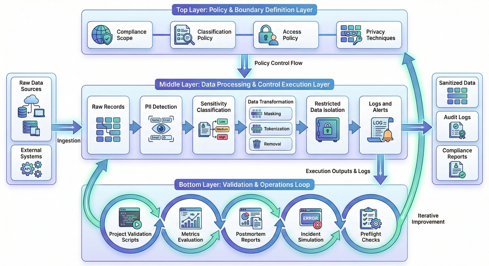

エンジニアリングの観点から見ると、P09 は 3 つの層に分類できます。

### 4.1 最初の層: 戦略および境界定義層

この層は、「システムは正確に何を保護したいのか、またどのようなルールで保護すべきなのか?」に答えます。主に以下が含まれます：

* 遵守範囲の定義（遵守範囲）
* 分類ポリシー
* アクセスポリシー
* プライバシー技術オプション

### 4.2 第 2 層: データ処理および制御実行層

この層は、「機密データが入ってきた後に正確に何が起こるか」に答えます。主に以下が含まれます：

* オリジナルレコードの構築
* PII の検出
* 感度レベルの決定
* 識別子の削除、マスキング、トークン化
* 制限されたレコードの分離
* アラームと監査ログの出力

### 4.3 第 3 層: 検証と運用保守の閉ループ層

この層は、「システムは本当に信頼できるのか?」という質問に答えます。主に以下が含まれます：

* プリフライトチェック
* 事故シミュレーション
* 事後報告書
* メトリクスの評価
* プロジェクトチェックスクリプト

この構造は、ルールとスコープの定義層、処理と制御の実行層、検証と配信の閉ループ層の 3 つの層に要約できます。 P09 の焦点は、コマンド データの作成ではなく、プライバシー仕様の生成、制御の実行からガバナンス証拠の提出までの完全なリンクにあります。

---

## 5. プレエンジニアリング: プライバシー パイプラインで最初に明確にする必要がある主要な側面は何ですか?

プライバシー パイプラインは、単一の非感作スクリプトの線形増幅ではなく、制御目標、処理ルール、操作メカニズム、および承認基準で構成されるガバナンス チェーンです。

### 5.1 コンプライアンスの目標とポリシーの定義

この層は、プロジェクトがローカルな処理技術ではなく制御目標から開始できるように、コンプライアンス目標、機密レベル、アクセス境界、および違反状況を明確にする責任があります。

### 5.2 データ処理と製品レイアウト

この層は、パイプライン オーケストレーション、JSON/JSONL 製品の生成、カタログの標準化、処理ロジックの配置、および処理チェーンを確実に再現してレビューできるようにするための評価スクリプトとのリンクを担当します。

### 5.3 セキュリティの運用と対応の閉ループ面

この層は、アラーム、監査、事前チェック、インシデント対応、およびレビューのリンクを担当し、処理ロジックだけでなく日常の運用プロセスにも制御手段が存在することを確認します。

### 5.4 評価、検証、受入の側面

この層は、コードがコンパイルされるかどうか、レポートとインジケーターが一貫しているかどうか、製品が完成しているかどうか、感度解除が完了しているかどうか、全体的なステータスが許容範囲内にあるかどうかをチェックする責任があります。

### 5.5 主要な側面の事前位置付け

プライバシー プロジェクトが失敗する最も一般的な原因は、多くの場合、ルール自体が間違って記述されていることではなく、主要なコントロール サーフェスが明示的に修正されていないことです。

* 戦略は十分に定義されていません。
* 権限モデルには監査がありません。
* 誰も例外プロセスを引き受けません。
* レポートと製品を連携させることはできません。
* 問題が発生した後、追跡可能な位置決めパスが不足します。

これは、プライバシー パイプラインは、いくつかの非感作アクションをつなぎ合わせたものではなく、何よりもまず完全に定義する必要がある制御チェーンであることを意味します。

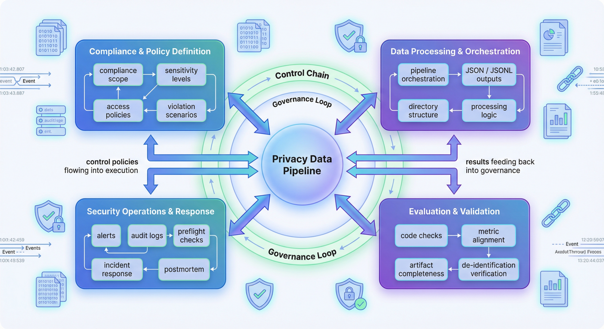

---

## 6. プライバシー仕様レイヤー: ルールファーストの処理チェーン

P09 の最初のスクリプトは `src/build_privacy_specs.py` です。この事実はそれ自体を物語っています。プロジェクトはデータを読み取る代わりに、まずプライバシーの仕様とポリシーを生成します。全体的なレポートには、推奨される実行順序も明確に示されています。最初のステップは、プライバシーの仕様とポリシーを作成することです。

### 6.1 コンプライアンス範囲に関する文書

多くのプロジェクトでは、「これらのフィールドを保護する必要がある理由」がコード コメントに暗黙的に示されます。しかし、P09 ではこれを `compliance_scope.json` として明示しています。これには 3 つの価値があります。

* プロジェクトの目標を最初からコンプライアンスとリスクの言語に合わせて調整します。
* 後続の評価では、口頭での理解に依存するのではなく、スコープを直接参照できるようにします。
* プロジェクトは、アドホックなスクリプトによるスプライシングではなく、最初からスコープの明確な定義を提示します。

対応するコードは次のとおりです。

```python
def build_scope() -> dict:
    return {
        "pipeline_goal": "Build a reproducible privacy-preserving data processing pipeline for highly sensitive records.",
        "example_domains": ["healthcare_support", "payroll_hr", "financial_kyc"],
        "compliance_targets": [
            "least_privilege",
            "auditability",
            "de-identification before analytics",
            "incident response readiness",
        ],
        "risk_goals": [
            "prevent direct PII leakage to analytics consumers",
            "separate raw storage from redacted processing zones",
            "log suspicious access and export attempts",
        ],
    }
```

この構造は、P09 の開始点が脱感作作用ではなく、制御目標であることを示しています。

### 6.2 分類戦略の極めて重要な役割

分類戦略が明確に定義されると、その後の多くの制御アクションに根拠が生まれます。例えば：

* デフォルトで制限されるソースの種類。
* どのフィールド パターンがトークン化を必要とするか。
* どのフィールドがマスキングまたは直接削除に適しているか。
* 明示的な PII が識別されない場合でもデフォルト レベルを使用できるかどうか。

`build_classification_policy()` は、これらのルールを構造化オブジェクトに編成します。

```python
def build_classification_policy() -> dict:
    return {
        "sensitivity_levels": [
            {"level": "restricted", "description": "direct PII, health identifiers, payroll details, bank data"},
            {"level": "confidential", "description": "internal case details and support notes"},
            {"level": "internal", "description": "aggregate metrics and sanitized analytics outputs"},
        ],
        "source_types": [
            {"source_type": "support_ticket", "default_level": "confidential"},
            {"source_type": "employee_payroll", "default_level": "restricted"},
            {"source_type": "kyc_form", "default_level": "restricted"},
            {"source_type": "analytics_export", "default_level": "internal"},
        ],
        "pii_rules": [
            {"pattern_name": "email", "action": "tokenize"},
            {"pattern_name": "phone", "action": "mask"},
            {"pattern_name": "ssn", "action": "remove"},
            {"pattern_name": "bank_account", "action": "tokenize"},
            {"pattern_name": "patient_id", "action": "tokenize"},
        ],
    }
```

### 6.3 アクセスポリシーの事前制約

多くのプロジェクトでは、まずデータを処理してから、一時的に「管理者のみが元のデータにアクセスできる」と書き込みます。ただし、P09 は仕様レイヤーでも `access_policy.json` を生成します。これは、アクセス許可が補足的な命令ではなく、事前の制約であることを意味します。

これは非常に重要です。なぜなら、プライバシー管理における最も高価な間違いは、多くの場合「マスクが完全に書き込まれていない」ことではなく、「元のデータを見るべきではない人が最初に見てしまう」ことだからです。

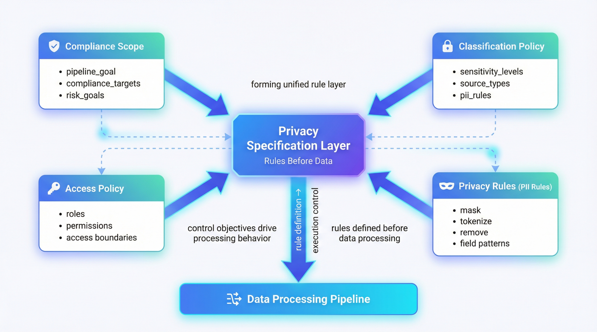

---

## 7. オリジナルの記録とシーンの構築: ガバナンス範囲の少数のサンプル

現在、このプロジェクトにはオリジナルのレコードが 8 件しかありません。その数はそれほど多くありませんが、ただ無計画に集められたわけではありません。レポート全体では、これら 8 つのレコードが 3 つのシーン ドメイン、4 種類のデータ ソースにまたがり、5 種類のロール モデルに対応していることがわかります。

### 7.1 小さなサンプルの構造被覆能力

なぜなら、このプロジェクトの目的は統計的な有意性を明らかにすることではなく、**方法の実証**を行うことだからです。サンプルがカバーする限り:

* 医療サポートの患者 ID、電子メール、電話番号。
* SSN、給与明細、HR/給与計算の給与期間。
* 電子メール、銀行口座、KYC でのレビューステータス。
* 分析エクスポートにおける比較的リスクの低い集約情報。

その場合、最小限に再現可能なプライバシー制御ケースをサポートするだけで十分です。

### 7.2 サンプル構築方法

`run_privacy_pipeline.py` の `build_raw_records()` は、代表的なデータを直接示します。

```python
def build_raw_records() -> list[dict]:
    return [
        {
            "record_id": "rec_001",
            "source_type": "support_ticket",
            "domain": "healthcare_support",
            "owner_team": "care_ops",
            "payload": "Patient John Lee, patient id PT-483920, email john.lee@example.com, phone 415-555-2198 asked about claim denial.",
        },
        {
            "record_id": "rec_002",
            "source_type": "employee_payroll",
            "domain": "payroll_hr",
            "owner_team": "hr_ops",
            "payload": "Employee Marta Chen SSN 342-19-8842 salary adjustment note for payroll cycle 2026-04.",
        },
        {
            "record_id": "rec_003",
            "source_type": "kyc_form",
            "domain": "financial_kyc",
            "owner_team": "fin_ops",
            "payload": "KYC form for beta@corp.test with bank account 998877665544 and risk review pending.",
        },
    ]
```

このタイプの記述の利点は、最初に外部データ セットをダウンロードしなくても、パイプライン ロジックを完全に理解できることです。より強力な再現性と引き換えに、実際の複雑さをある程度犠牲にします。

### 7.3 シーンサンプルの構築基礎

「いくつかのサンプルを用意しました」というだけでは、実際には情報量が非常に弱いです。さらに重要なことは、これらのサンプルがこれらのフィールドを選択した理由、どのフィールド パターンがカバーされているか、それらがその後どの制御アクションに役立つのかを明確に記述することです。

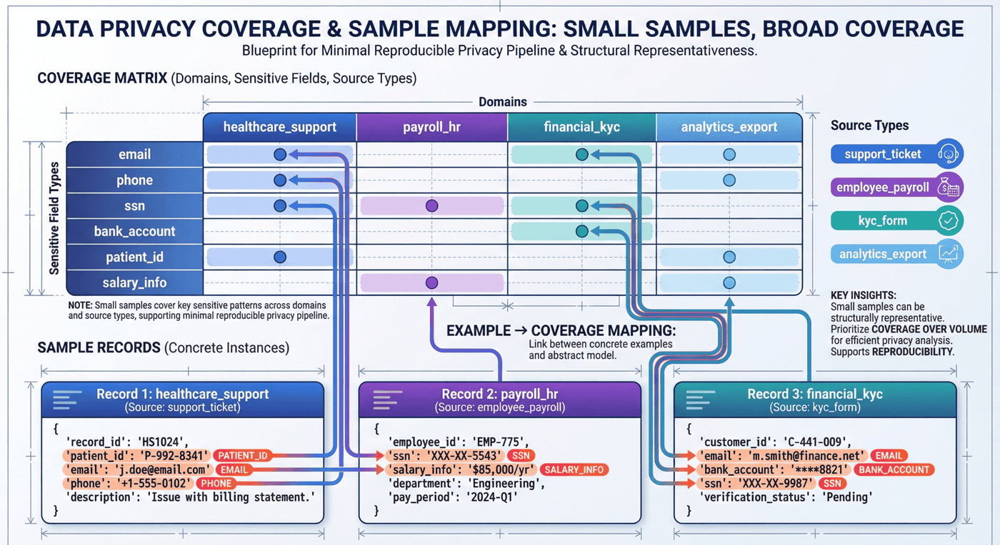

---

## 8. PII 検出: 処理エントリとしての識別ルール

プライバシーの扱いは実際には PII の検出から始まります。 P09 では、このステップはルール主導のアプローチを採用しています。電子メール、電話、SSN、銀行口座番号、および患者 ID は、独立した通常のルールを使用して照合されます。

### 8.1 出発点としてのルール

この場合、ルールによるアプローチには 3 つの明らかな利点があります。

* 解釈可能: 各一致は、どのルールでヒットしたかを知っています。
* 制御可能: 偶発的な怪我や検出ミスは特定のパターンで発生します。
* 再現可能: コードをコピーしても同じ結果が得られます。

コードは次のとおりです。

```python
EMAIL_RE = re.compile(r"\b[A-Za-z0-9._%+-]+@[A-Za-z0-9.-]+\.[A-Za-z]{2,}\b")
PHONE_RE = re.compile(r"\b\d{3}-\d{3}-\d{4}\b")
SSN_RE = re.compile(r"\b\d{3}-\d{2}-\d{4}\b")
BANK_RE = re.compile(r"\b\d{10,12}\b")
PATIENT_RE = re.compile(r"\bPT-\d{4,6}\b")


def detect_pii(text: str) -> list[dict]:
    detections = []
    for pattern_name, regex in [
        ("email", EMAIL_RE),
        ("phone", PHONE_RE),
        ("ssn", SSN_RE),
        ("bank_account", BANK_RE),
        ("patient_id", PATIENT_RE),
    ]:
        for match in regex.finditer(text):
            detections.append({"pattern_name": pattern_name, "match": match.group(0)})
    return detections
```

### 8.2 データ資産としての検出結果

多くのプロジェクトは、検出構造を保持せずに、検出後にコードを直接置き換えます。ただし、P09 は分類結果に `pii_detections` を追加するため、その後の評価でフィールドの分布をカウントでき、チェック スクリプトでルールが本当に有効かどうかを検証することもできます。

これにより、プロジェクトは「脱感作」から「検出のための証拠を残す」にアップグレードされました。

### 8.3 電流検出分布は何を示していますか?

全体的なレポートは、PII 検出が、email=5、phone=3、patient_id=2、bank_account=2 などのさまざまなフィールド パターンをカバーしていることを示しています。これは、小規模なデータセットであっても、プロジェクトが単一タイプの識別子のみを扱うのではなく、すでにクロスフィールドパターンを最小限にカバーしていることを示しています。

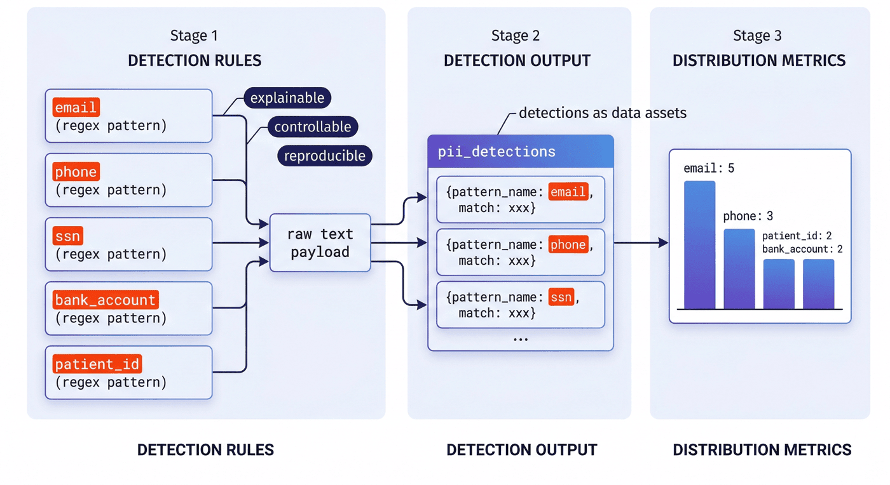

---

## 9. 分類ロジック: 情報源の種類と PII の共同決定

真に堅牢なプライバシー分類は、多くの場合、「フィールド コンテンツのみを確認する」ことや「データ ソースのみを確認する」ことに関するものではなく、この 2 つを組み合わせたものになります。 P09 の `classify_record()` はこれを反映しています。

```python
def classify_record(record: dict, classification_policy: dict) -> dict:
    source_type_map = {
        item["source_type"]: item["default_level"]
        for item in classification_policy["source_types"]
    }
    detections = detect_pii(record["payload"])
    sensitivity = source_type_map.get(record["source_type"], "internal")
    if detections:
        sensitivity = "restricted"
    return {
        **record,
        "sensitivity_level": sensitivity,
        "pii_detections": detections,
        "requires_quarantine": sensitivity == "restricted",
    }
```

### 9.1 このロジックはどのような問題を解決しますか?

これにより、2 つのよくある間違いが解決されます。

まず、ソースの種類だけで判断すると、異常な内容を見逃してしまいます。たとえば、リスクが低いと思われるソースにクリアな電子メールやアカウントが突然表示された場合、デフォルト レベルが使用されたままだと制御不能になります。

第 2 に、通常のヒットだけを調べると、ビジネス セマンティクスが無視されます。たとえば、現在のテキストに直接的なヒットがない場合でも、特定の給与データや KYC データを簡単に低感度として分類すべきではありません。

### 9.2 制御信号としての`requires_quarantine`

多くのプロジェクトは分類結果をラベルとして書き込むだけですが、P09 ではさらに制御動作信号 `requires_quarantine` を書き込みます。これは、分類がレポート目的ではなく、その後のシステム動作を促進することを意味します。

これはエンジニアリングにおいて非常に重要です。次の理由からです。

> 本当に使える分類は、「それが何であるか」を伝えるだけでなく、システムに「次にどのように対処するか」を伝えるものです。

### 9.3 現在の結果は何を示していますか?

全体的なレポートでは、元の記録 8 件のうち 7 件が制限されていると判断され、そのうち 7 件が隔離されたことが示されています。これは、プロジェクトのシナリオ選択と一致しています。サンプル セット内のほとんどのレコードは本質的に機密性が高く、意図的に低リスクのサンプルを多数作成するのではなく、ガバナンスのリンクを明確に表示することが目的です。

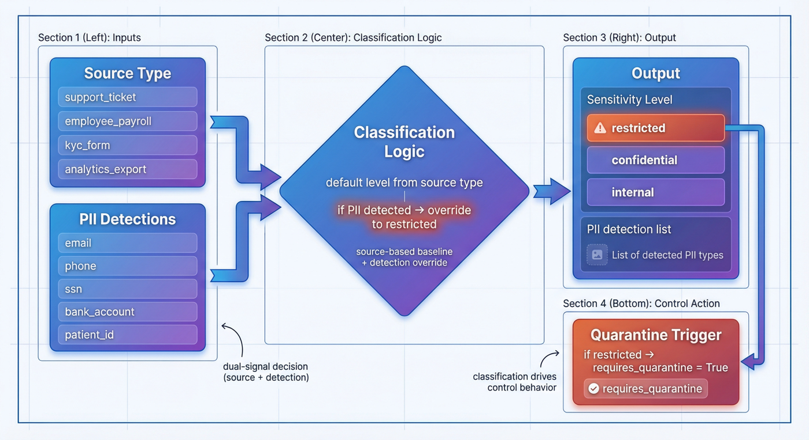

---

## 10. 脱感作と匿名化: 差別化された匿名化戦略

多くのチームが感度解除を行う場合、最も一般的な単純化は「すべてを *** に置き換える」ことです。このアプローチは安全そうに見えますが、次の 2 つの問題が発生します。

* 必要な分析構造が失われます。
* 異なるフィールドが持つべき異なる処理強度を反映することはできません。

P09 は、`redact_payload()` でトークン化、マスク、削除という 3 つの戦略を使用します。

```python
def redact_payload(text: str, detections: list[dict]) -> str:
    redacted = text
    for detection in detections:
        match = detection["match"]
        if detection["pattern_name"] in {"email", "bank_account", "patient_id"}:
            replacement = hash_token(match)
        elif detection["pattern_name"] == "phone":
            replacement = "***-***-" + match[-4:]
        else:
            replacement = "[REMOVED_SSN]"
        redacted = redacted.replace(match, replacement)
    return redacted
```

### 10.1 トークン化、マスク化、削除の役割分担

* **tokenize** は、電子メール、銀行口座、患者 ID など、「同じエンティティの一貫性」を維持する必要があるが、元の値を公開すべきではないフィールドに適しています。
* **マスク**は、最後のビットを保持することが運用とメンテナンスの検証には役立ちますが、完全な値を保持できない電話などの分野に適しています。
* **remove** は、SSN などの機密性が高く、バックポインティング構造を保持する必要がないフィールドに適しています。

### 10.2 `hash_token()` の意味は何ですか

安定したトークンを生成するには、補助スクリプトで `sha256` を使用します。

```python
def hash_token(value: str) -> str:
    digest = hashlib.sha256(value.encode("utf-8")).hexdigest()
    return f"tok_{digest[:12]}"
```

この利点は、同じ元の値が同じトークンにマッピングされるため、元の識別子の直接の公開を回避し、その後の弱い関連性の分析をサポートできることです。

### 10.3 戦略的な違いの必要性

なぜなら、プライバシー工学における最もタブーなことは、すべての質問を曖昧な「減感作療法」に書き込むことだからです。本当に工学的な意味を持つためには、異なる分野の制御意図を区別する必要があります。

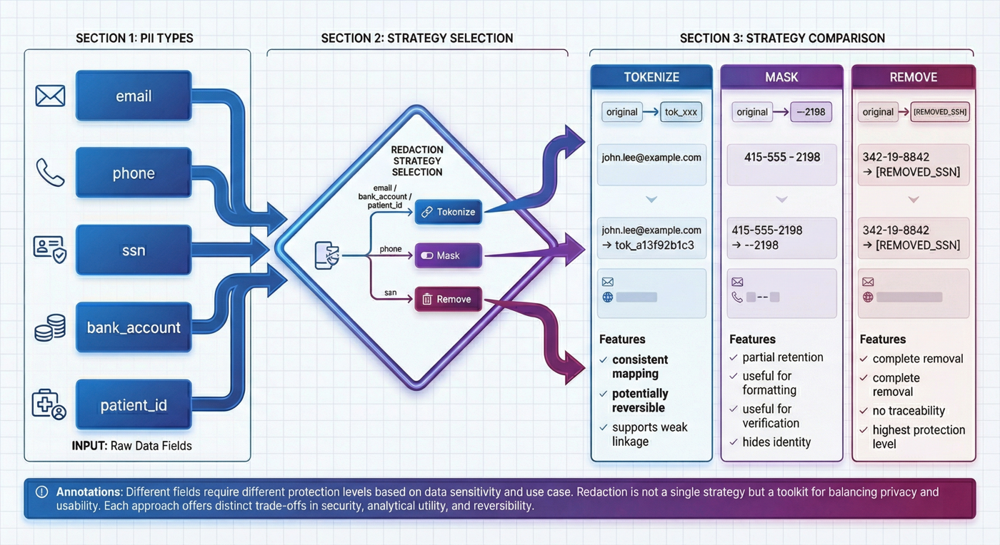

---

## 11. ストレージのパーティショニングと分離: 結果と元のデータのパーティション制御

プライバシー ガバナンスにおいて、非常に頻繁に発生しますが、過小評価されがちな問題は、匿名化を行ったとしても、元の記録と処理結果が同じ論理領域にまだ混在している場合、多くのリスクが依然として存在するということです。

P09 は、`build_isolation_plan()` を通じて、raw_zone、quartine_zone、redacted_zone、audit_zone の 4 種類のゾーンを明示的に提供します。

```python
def build_isolation_plan() -> dict:
    return {
        "zones": [
            {"zone_name": "raw_zone", "store": "encrypted object storage", "access": ["privacy_admin"]},
            {"zone_name": "quarantine_zone", "store": "isolated secure bucket", "access": ["privacy_admin", "incident_responder"]},
            {"zone_name": "redacted_zone", "store": "analytics warehouse", "access": ["data_processor", "analyst"]},
            {"zone_name": "audit_zone", "store": "security log store", "access": ["auditor", "privacy_admin"]},
        ],
        "deid_flow": [
            "ingest raw restricted records",
            "classify and detect PII",
            "write restricted originals to raw_zone",
            "redact identifiers and emit sanitized records to redacted_zone",
            "quarantine flagged export attempts and emit audit alerts",
        ],
    }
```

### 11.1 ゾーンモデルが重要な理由

それは「誰が何を閲覧できるか」と「データをどこに置くべきか」を拘束するからです。この方法でのみ、アクセス許可の境界は抽象的に宣言されず、ストレージ オブジェクト、ワークフロー アクション、ロール コレクションとともに実装されます。

### 11.2 quarantine_zone が重要な設計である理由

多くのプロジェクトには raw_zone と redacted_zone のみがあり、quarantine_zone はありません。問題は、異常なアクセスや不審なエクスポートが発見されたときに、システムには「処理を続行することも、直接破棄することもしない」中間状態が存在しないことです。

quarantine_zone の意味は次のとおりです。

* リスク分散を一時停止する。
* インシデント対応者による調査の余地を残しておきます。
* 一連の証拠を維持する。
* 例外プロセスに明確な着地点を持たせます。

### 11.3 分離結果は何を示していますか?

全体的なレポートは、現在 7 つの制限されたレコードと 7 つの隔離レコードがあることを示しています。これは、「分類は分類に属し、分離は別の問題」ではなく、分離の論理が分類の論理と一致していることを示しています。

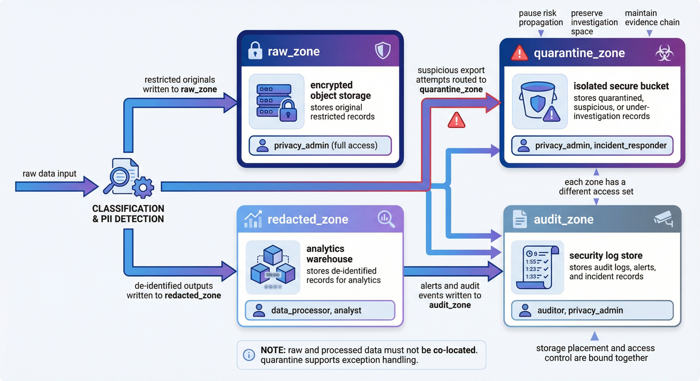

---

## 12. 監査と警告: 行動証拠チェーン

「データを処理する」だけのシステムは、管理可能なシステムを意味しません。なぜなら、本当にデリケートな瞬間は、日常的に対処されるのではなく、誰かがルールを回避しようとしたときに対処されることが多いからです。 P09 アラームと監査を別個の製品に組み込むのは、まさにシステムが追跡可能な証拠を残せるようにするためです。

### 12.1 アラームのモデル化方法

`build_alerts()` は 2 つの典型的なアラームを構築します。

```python
def build_alerts() -> list[dict]:
    return [
        {
            "alert_id": "alert_priv_001",
            "severity": "high",
            "actor": "analyst",
            "reason": "unauthorized raw zone access attempt",
            "status": "resolved",
        },
        {
            "alert_id": "alert_priv_002",
            "severity": "medium",
            "actor": "data_processor",
            "reason": "restricted export requested without approval",
            "status": "resolved",
        },
    ]
```

これら 2 つのアラームは非常に一般的です。1 つは元の領域への不正アクセスで、もう 1 つは制限されたデータのエクスポートへの不正な要求です。これらは、プライバシー ガバナンスにおいて最も危険な 2 つのタイプのアクションに対応します。

### 12.2 監査ログとアラームを一緒に表示する必要がある理由

アラームはシステムに「危険なアクションが発生した」ことを伝え、監査ログはシステムに「誰がいつ何をしたか」を伝えます。前者はリアルタイム制御に重点を置き、後者は事後追跡に重点を置いています。どれか一つでも欠けてしまうと、ガバナンスチェーンは不完全になってしまいます。

### 12.3 現在のインジケーターは何を反映していますか?

全体的なレポートは、現在のプロジェクトに 2 つのアラーム、100% のアラーム解決率、および 5 つの監査イベントがあることを示しています。これは、プロジェクトがもはや「いくつかの感度を下げたファイルを生成している」のではなく、セキュリティ操作セマンティクスを持ち始めていることを示しています。

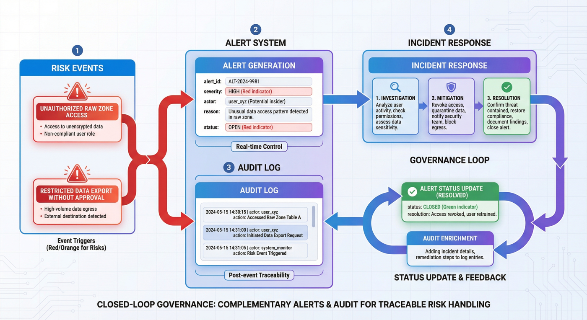

---

## 13. プリフライト: 実行前チェック

多くのデータ プロジェクトはメイン プロセスのみを扱い、実行前チェックはありません。ただし、プライバシー パイプラインにプリフライトがない場合、すべてのファイルが出力できるように見えても、実際には条件が満たされていないという錯覚が生じやすくなります。

P09 `simulate_privacy_ops.py` では、最初にプリフライトを実行してから、インシデント シミュレーションを実行します。このシーケンスは非常にエンジニアリング的です。

```python
preflight = {
    "checks": [
        {"name": "all records classified", "passed": len(classified) > 0 and all("sensitivity_level" in item for item in classified)},
        {"name": "restricted records isolated", "passed": all(item["requires_quarantine"] == (item["sensitivity_level"] == "restricted") for item in classified)},
        {"name": "alerts wired", "passed": len(alerts) >= 2},
        {"name": "role model present", "passed": len(access_policy["roles"]) >= 5},
        {"name": "privacy tech options documented", "passed": len(tech_options) >= 4},
    ]
}
```

### 13.1 プリフライトチェック項目の設計

なぜなら、それらは「組立ラインを確立するための最低限の前提条件」をカバーしているからです。

* カテゴリがあります。
* 制限されたものは実際には孤立しています。
* アラートは空のシェルではありません。
* ロールモデルが欠けているわけではありません。
* プライバシー技術のオプションは空白ではありません。

### 13.2 現在の結果から分かること

全体的なレポートは、プリフライトの合格率が 100% であることを示しています。これは、運用と保守のシミュレーションを開始する前に、プロジェクトが少なくとも最小限の前提条件を満たしていることを意味します。

### 13.3 プリフライトの独立した値

これは成熟したエンジニアリングの習慣を反映しているためです。

> 「実行してから様子を見る」のではなく、「最低限の条件が満たされていることを確認してから、よりリスクの高い処理や訓練の段階に入る」のです。

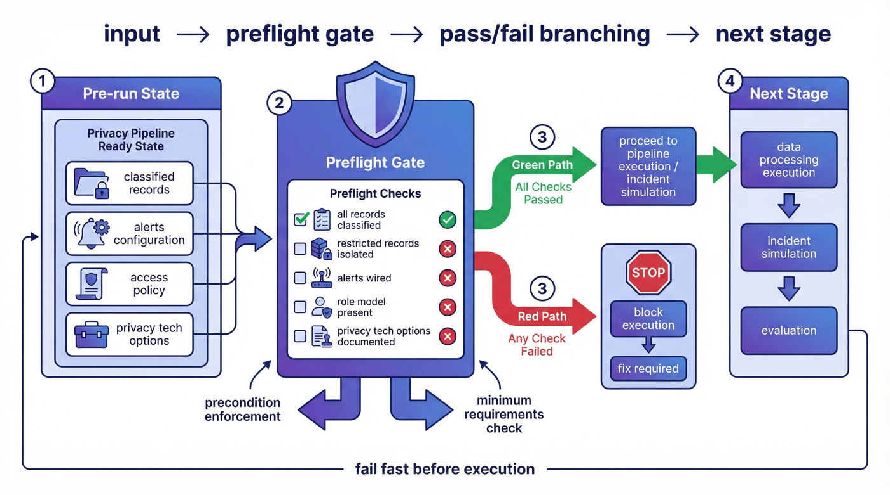

---

## 14. インシデントのシミュレーションと事後分析: 異常対応の閉ループ

多くのケースでは、成功への道だけが語られ、失敗への道は語られません。ただし、システムが信頼できるかどうかを実際に決定するのは、多くの場合「誰かが境界を越えたときにシステムがどのように反応するか」であるため、プライバシー ガバナンスでは失敗シナリオを避けることはできません。

P09 インシデント シナリオを構造化レコードとして書き込む: アナリストは、検出、封じ込め、結果、および応答時間のすべてが明示的に保持されている、制限された生のレコードを承認なしにエクスポートしようとしました。

```python
incident = {
    "incident_id": "privacy_inc_001",
    "scenario": "analyst attempted to export restricted raw records without approval",
    "detection": "access_alerts.jsonl high severity alert",
    "containment": [
        "quarantine the export request",
        "lock the analyst session",
        "require privacy_admin review",
    ],
    "outcome": "resolved with no confirmed external data leak",
    "response_minutes": 24,
}
```

対応する事後分析では、根本原因、何が機能したか、およびフォローアップが記録され続けます。

### 14.1 イベント設計の完全性

通常、「セキュリティ インシデントが発生した」とは書かれませんが、イベント チェーンが次のように分割されるからです。

* 発見される方法。
* どのように封じ込められるか。
* なぜ広がりがないのか。
* 今後どのような改善を行うべきでしょうか？

### 14.2 指標からわかること

全体的なレポートでは、インシデント対応に 24 分かかったことが示され、事後フォローアップの数は 3 でした。これは、プロジェクトが単に「将来の拡張性」という一文を残すのではなく、運用、保守、レビューを測定可能な結果に落とし込んだことを示しています。

### 14.3 事件と事後処理の独立した立場

インシデントと事後検証を含めることで、プライバシー パイプラインは静的 ETL ではなく、例外応答機能を含むガバナンス システムであることがより簡単にわかります。

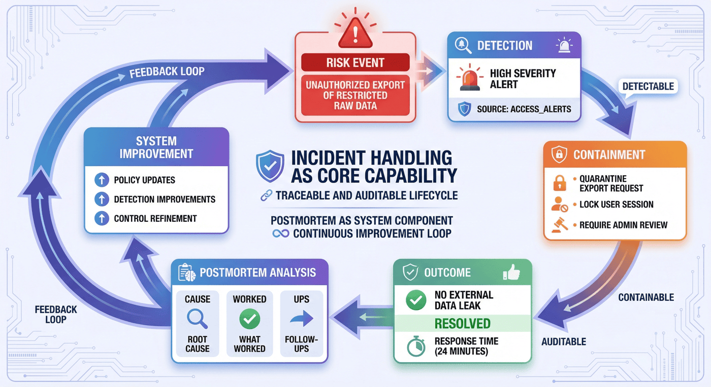

---

## 15. 評価スクリプト: 指標の構造化された生成

P09 の評価は `src/evaluate_privacy_pipeline.py` までに完了しました。サマリーを手動で記述する代わりに、処理されたディレクトリ内のさまざまな製品を直接読み取り、統一指標を計算し、`p9_metrics.json` と `p9_report.md` を生成します。

### 15.1 指標は製品からどのように計算されますか?

評価フェーズでは、まずスコープ、分類、アクセス、技術オプション、未加工/機密/編集/隔離、アラート、監査、プリフライト、インシデント、事後分析などのすべての製品を読み取り、次に主要な結果を計算します。

```python
metrics = {
    "domain_count": len(scope["example_domains"]),
    "compliance_target_count": len(scope["compliance_targets"]),
    "source_type_count": len(classification["source_types"]),
    "role_count": len(access["roles"]),
    "privacy_tech_count": len(tech_options),
    "raw_record_count": len(raw_records),
    "restricted_record_count": sum(item["sensitivity_level"] == "restricted" for item in classified),
    "quarantine_count": len(quarantined),
    "pii_detection_distribution": dict(Counter(
        detection["pattern_name"]
        for item in classified
        for detection in item["pii_detections"]
    )),
    "direct_pii_removed_rate": direct_pii_removed_rate,
    "alert_count": len(alerts),
    "resolved_alert_rate": round(sum(item["status"] == "resolved" for item in alerts) / max(1, len(alerts)), 4),
    "audit_event_count": len(audit_log),
    "preflight_pass_rate": round(preflight["passed_checks"] / max(1, preflight["total_checks"]), 4),
    "incident_response_minutes": incident["response_minutes"],
    "postmortem_follow_up_count": len(postmortem["follow_ups"]),
}
```

### 15.2 `has_direct_pii()` が重要な理由

評価スクリプトは単にファイル数をカウントするだけでなく、正規表現を使用して編集された結果に直接 PII が残っているかどうかをチェックします。これは、評価が「形式チェック」ではなく、むしろガバナンスの中核目標に対する結果の検証であることを意味します。

### 15.3 現在の主要指標

全体的なレポートによると、現在のプロジェクトの主な成果には、3 つのシナリオ ドメイン、4 つのコンプライアンス ターゲット、4 種類のデータ ソース、および 5 種類の役割が含まれます。 8 つの元のレコードのうち 7 つは制限されており、7 つは分離されています。直接的な PII 除去率は 100% です。プリフライトの通過率は 100% です。アラームが 2 つあり、解決率は 100%。および 5 つの監査イベント。

これらの指標は総合的に判断を示しています。P09 の焦点はデータ量ではなく、ガバナンス チェーンが閉じているかどうかにあります。全体的な報告書でもこのことは明らかにされています。

---

## 16. コードと製品のマッピング: スクリプトと成果物の間の対応

優れた章では、スクリプトの名前を列挙するだけでなく、「スクリプトが何を行うか、何を生成するか、誰がスクリプトを使用するか」を明確に記述する必要があります。 P09 の全体的なプロセスは大まかに次のとおりです。

1. `build_privacy_specs.py` 範囲、分類、アクセス、およびテクノロジーのオプションを生成します。
2. `run_privacy_pipeline.py` は元の記録を処理し、分類、非感作、隔離、監査、および警報の製品を生成します。
3. `simulate_privacy_ops.py` はプリフライト、インシデント、事後分析を生成します。
4. `evaluate_privacy_pipeline.py` 概要指標とメインレポート。
5. `run_p9_checks.py` はコマンド レベルとデータ レベルのチェックを実行します。

### 16.1 階層マッピングの構造的価値

これにより、システムを層ごとに構築された閉ループとして理解しやすくなるからです。最初に定義し、次に処理し、次に運用と保守を行い、次に評価し、次に受け入れます。すべてのロジックを 1 つのスクリプトに詰め込んでいないため、明確な構造になっています。

### 16.2 成果物リストの役割

全体的なレポートには、以下を含む完全な成果物がリストされます。

* `compliance_scope.json`
* `classification_policy.json`
* `access_policy.json`
* `privacy_tech_options.json`
* `raw_sensitive_records.jsonl`
* `classified_records.jsonl`
* `redacted_records.jsonl`
* `quarantine_records.jsonl`
* `audit_log.jsonl`
* `access_alerts.jsonl`
* `isolation_plan.json`
* `preflight_checklist.json`
* `incident_simulation.json`
* `postmortem_report.json`
* `p9_report.md`
* `p9_metrics.json`
* `p9_test_results.json`
* `p9_test_report.md`。

このリストの重要性は、P09 の完了基準がノートブックを実行することではなく、レビュー可能なファイル資産のセットを形成することであることを示していることです。

---

## 17. スクリプトのチェック: コード、製品、レポートの一貫性

多くのプロジェクトでは、作成の最後に「正常に実行されました」とだけ書かれています。しかし、これだけではプロジェクトが実際に完了したことを証明するには十分ではありません。 P09 の `run_p9_checks.py` はまさにこの問題を解決します。

### 17.1 スクリプトの動作を確認する

これは、次の 2 つのチェック カテゴリに分類されます。

* **コマンド レベル チェック**: `py_compile` など、`evaluate_privacy_pipeline.py` を再実行します。
* **データ/製品レベルのチェック**: 必要なファイルが存在するかどうか、ロール モデルとゾーン モデルが存在するかどうか、レコードが分類されているかどうか、制限付きが分離されているかどうか、編集済みから直接 PII が削除されているかどうか、PII ルールが存在するかどうかなど。

全体的なレポートから、合計検査項目は 13 個ですべて合格、全体的なステータスは PASS であることがわかります。 2つのコマンドレベルの検査項目と11のデータ/製品レベルの検査項目を含みます。

### 17.2 閉ループの構造上の位置を確認する

10-2 プロジェクトが真に成功する前に、「コード、製品、統計、レポートが相互に一貫していること」が特に重要視されます。 P09 タスクは異なりますが、同じエンジニアリングの習慣を継承しています。

> データ エンジニアリングのケースは説明だけでは自己認証できませんが、チェック スクリプトをアクセプタにする必要があります。

### 17.3 このセクションのテンプレートの価値

なぜなら、多くのチームに本当に欠けているのは、「検証を行う方法を知っている」のではなく、検証の書き方を知らないからです。 P09 は、テンプレートとして非常に適した最小限のアプローチを提供します。

* コンパイルできる;
* 評価を再度実行する機能。
* 文書があります。
* 内容はあります。
* 指標はあります。
* 一貫性がある。

---

## 18. インジケーターの解釈: コアシグナルとしての閉ループの意味

規模の点では、P09 は非常に制限されています。オリジナルのレコードは 8 つだけであり、運用レベルのデータ量には程遠いです。 「閉ループ」の感覚が強いため、それ自体を拡張する価値は依然としてあります。

### 18.1 閉ループとは何ですか?

このプロジェクトでは、閉ループの感覚が次の点に反映されています。

* 目標と境界線を持ちましょう。
* 分類と管理があります。
* 治療と隔離があります。
* アラートと監査があります。
* 事前検査と事故訓練があります。
* インジケーターとチェックスクリプトがあります。
* レポートとテスト結果があります。

### 18.2 閉ループセンスとスループットの違い

多くの場合、小さくて完全なプロジェクトは、大規模で漠然としたプロジェクトよりも学習にとって価値があります。再利用可能なのは、多くの場合、単一スループットではなく、構造、階層化、フィールド設計、制御ロジック、および検証モードであるためです。

### 18.3 現段階での判断

P09 は、単一の非感作スクリプトというよりは、プライバシー処理オペレーティング モデルに似ています。同時に、データ表現には限界があり、高度なプライバシー技術はまだ十分に実装されておらず、システム間のガバナンスはまだ拡張できる可能性があることも認めています。これは、プロジェクトが手法が完成し、規模が抑制され、限界が明確になった段階にあることを示しています。

---

## 19. 10-2との比較: 監督資産と制御資産

10-2 を参照して 10-9 を書くことは、単にそれを隠すことではなく、その最も貴重な物語の骨格を保持することです。

### 19.1 類似点: どちらも閉ループエンジニアリングを強調しています

10-2 では、シード知識、タスク設計、QA、プリファレンス ペアからトレーニング配信および検証の閉ループ層に至るまで、法律分野における SFT データ ファクトリーについて説明します。 P09 は SFT プロジェクトではありませんが、以下のとおりです。

* 最初に境界を定義します。
* 次に、メインの処理チェーンに入ります。
* 最後に評価と承認を行います。

### 19.2 相違点: 1 つのコアは資産を監視することであり、もう 1 つのコアは資産を制御することです

10-2 のコア製品は、トレーニング可能なデータ、プリファレンス ペア、および QA レコードです。
P09 の中核となる製品は、制御戦略、処理結果、監査証拠、運用保守文書、検査報告書です。

つまり、次のようになります。

* 10-2 「モデルは何を学習すべきか」を解決します。
* 10-9 「機密データをシステムに安全に入力する方法」を解決します。

### 19.3 比較分析の価値

それは、より完全な機能マップを示しているためです。業界の AI エンジニアリングには、トレーニングと推論だけでなく、データがシステムに入力される前のガバナンス機能も含まれています。

---

## 20. その後の拡張：より現実的なエンジニアリングシステムを目指して

現時点では、よりリスクの高いシナリオの拡大、計画から実装までの高度なプライバシー技術の進歩、自動化と異常アクセス検出の強化の 3 つの方向性が考えられます。これらの方向については、以下でさらに詳しく説明します。

### 20.1 ルール検出から多層認識への拡張

将来的には、正規表現レイヤーは次のように拡張される可能性があります。

* 辞書とルール層。
* コンテキスト分類層。
* NER/エンティティ正規化層。
* リスクポートフォリオ判断層。

### 20.2 静的なポリシーから動的なガバナンスへの拡張

現在のアクセス ポリシーはより静的な記述です。次のステップでは、次のことを導入できます。

* タスクベースの一時的な承認。
* 二重承認。
* 輸出速度の制限としきい値。
* 行動プロファイリングと異常検出。

### 20.3 ファイルレベルの配信からサービスレベルの制御への拡張

成果物は現在、JSON/JSONL および Markdown レポートに焦点を当てています。次の段階では、ポリシーをサービス指向にし、監査をリアルタイムにし、例外フローを変換し、P09 をノートブック/スクリプト プロジェクトからサービス指向システムに昇格させることができます。

### 20.4 訓練型インシデントから継続的訓練への拡大

インシデントのシミュレーションを定期的な机上演習、自動障害挿入、赤青の敵対的監査に発展させて、システムの真の回復力を高めることができます。

---

## 21. 再現可能な最小実行チェーン: 完全なケースの実行シーケンス

P09 の最小実行シーケンスは、次の 5 つのステップに要約できます。

```bash
python src/build_privacy_specs.py
python src/run_privacy_pipeline.py
python src/simulate_privacy_ops.py
python src/evaluate_privacy_pipeline.py
python src/run_p9_checks.py
```

これら 5 つのステップは次のことに対応します。

1. プライバシー仕様を確立する。
2. 機密記録の取り扱い。
3. 運用、保守、およびインシデントに関する文書を作成します。
4. 評価指標を集計します。
5. プロジェクトの承認を完了します。

この構造の価値は、ケースを理解しやすくするだけでなく、ケースを順番に再現しやすくなることです。

### 21.1 実行チェーンにおける単一列の役割

それは「ナレーション」から「アクション」までの章全体を再パッケージ化しているからです。章の中で最も印象に残るのは、多くの場合、この段階的な実行チェーンです。

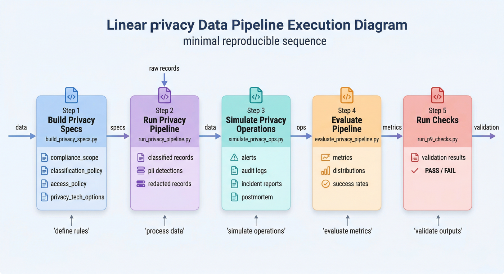

---

## 22. この章の概要: P09 で実証されたシステム機能

表面だけを見れば、P09 は小さなプライバシー保護プロジェクトのように見えます。しかし、エンジニアリング構造の観点から見ると、非常に完全な機能を示しています。

* テキストを直接扱うのではなく、まずガバナンスの境界を定義できます。
* 分類、匿名化、隔離、警報、監査を制御チェーンに接続できます。
* プリフライト、インシデント、事後分析を主要なプロジェクト プロセスに統合できます。
* 中間ファイルにとどまるのではなく、メトリクス、レポート、チェックを出力できます。
* 非常に小さなサンプルを使用して、プライバシー プロジェクトをどのように組織するかを明確にすることができます。

したがって、この章の価値は、特定の技術点がどれほど進んでいるかを証明することにあるのではなく、次のことを示すことにあります。

> トレーニング前のデータ ガバナンス プロジェクトを、解釈可能で再現可能で許容可能なエンジニアリング パイプラインに設計する方法。

このため、エンジニアリングのケースとして適しています。

---

## 特別トピック: プライバシー パイプラインの運用マニュアルの視点

プライバシー保護プロジェクトの作成の最後に、最も見落とされやすい部分は、多くの場合、技術的な構造ではなく、運用マニュアルの観点です。言い換えれば、システムが日常運用に入ったら、チームはどの順序でチェックする必要があるか、どのノードでブロックする必要があるか、そして誰が例外を処理する必要があるかということです。この部分がないと、プロジェクトは単なるスクリプトのセットのようになります。この部分により、持続可能な運営ガバナンス システムに似てきます。

### 1. 日々の業務において、まず何に気をつければよいでしょうか？

P09 などの組立ラインの場合、日常業務で最初に確認する必要があるのは、必ずしも最終的な指標ではなく、いくつかの「事前健全性シグナル」です。

* システムに新しく入力されたすべての記録が採点されているかどうか。
* 制限エリアと編集エリアが戦略に従って配置されているかどうか。
* 認識されない直接 PII が発生するかどうか。
* 最新の実行バッチでアラームの増加や事前チェックの失敗があるかどうか。
* 監査ログが完全に生成されたかどうか。

これらのシグナルの重要な点は、実際のデータ侵害やコンプライアンス問題が発生する前に、チームがプロセスのドリフトを早期に検出できるようにすることです。プライバシー システムの場合、多くのリスクは下流のトレーニングやアプリケーションに入ると低コストで修復することが難しいため、フロントエンドの健全性シグナルが特に重要です。

### 2. 例外処理には明確な入り口が必要です

プライバシー ガバナンスにおいて最も危険な状況の 1 つは、例外リクエストが常に口頭で解決される場合です。明示的なエントリがなくなると、チームが「合理的な例外」と「リスク回避」を区別することが困難になるためです。より成熟した操作マニュアルでは、少なくとも次の点を明確にする必要があります。

* どのような状況で一時的な例外の申請が認められるのか。
* 誰が例外リクエストを開始できるか。
* 誰が承認権限を持っているか。
* 例外に期間と使用範囲があるかどうか。
* 例外の終了後にアクセス許可を回復し、監査レコードを補足する必要があるかどうか。

これらのプロセスを業務マニュアルに明示する意義は、行動を標準化するだけでなく、チームを守ることにもつながります。なぜなら、プレッシャーの高いシナリオでは、制度化された入り口がなければ、多くの危険な行動は最終的にはシステムではなく個人が負担することになるからです。

### 3. 事故処理は証拠連鎖に重点を置くべきである

プライバシー関連の例外が発生した場合、チームが最も必要とするのは「誰が最初に説明できるか」ではなく、一連の証拠を迅速に復元することです。 P09は物体を飛行前、事件発生時、死後まで保管していた。強調する価値のある次のステップは、Runbook のアクション シーケンスにそれらを文字列で組み込む方法です。

* まず、関連するバージョンまたはアクセス パスを凍結します。
* 影響範囲とデータ範囲を再確認します。
* 次に、監査ログ、アラーム記録、処理記録を抽出します。
* 最後に、インシデントのレビューと是正措置が策定されます。

プライバシー プロジェクトでは、文言よりも配置の順序が重要です。順序が正しい限り、チームは通常、リスクを管理可能な範囲内に抑えることができます。順序が無秩序な場合、たとえ技術的要素が存在していても、二次的なリスクが発生しやすくなります。

---

## 特別トピック: プライバシー ガバナンスの指標と長期的な進化

現在の P09 の規模は小さいですが、プライバシー ガバナンスをどのように測定するかという長期的な問題を説明するのにすでに十分適しています。なぜなら、安定した指標がなければ、チームはプライバシーに関する取り組みを「インシデントをできる限り少なくすること」と簡単に理解してしまうからです。実際、成熟したプライバシー パイプラインは、継続的に定量化、比較、改善できる必要があります。

### 1. インジケーターは検出ヒット数だけを見る必要はありません

多くのチームがプライバシー指標について話すとき、最初に頭に浮かぶのは「今回どの程度の機密情報が特定されたか」ということです。これは確かに理にかなっていますが、十分とは言えません。ヒット数が多いということは、システムの認識能力が高いことを意味しているのかもしれませんし、単に入力リスクが高いだけかもしれません。より価値のある指標には、次のものが含まれることがよくあります。

* 記録的なグレードの範囲。
* データ分離の精度が制限されている。
* 編集されたデータの直接識別子の残存率。
* 失敗率と失敗理由の分布を事前チェックします。
* 事件発見から処分完了までの平均時間。

これらの指標を組み合わせることで、ガバナンス システムが機能しているかどうかをより正確に反映できます。

### 2. プライバシーシステムは「制御の効率化」に適している

ガバナンスの観点から見ると、P09 のより中心的な指標は、実際には検出量ではなく、制御が有効かどうかです。いわゆる制御効率は、システムによって定義された制御点の数が重要な瞬間に実際に役割を果たすかどうかとして理解できます。

例えば：

* 高リスクのレコードが実際に制限ゾーンにルーティングされるかどうか。
* 編集されたバージョンで直接 PII が実際に削除されるかどうか。
* 事前チェックが本当に不適格なタスクをブロックするかどうか。
* アラームが実際に人間の注意を引き起こしたかどうか。
* インシデントのレビューが実際にその後の是正につながったかどうか。

これらの管理ポイントが「運用結果に存在する」のではなく、「文書に存在する」だけである場合、ガバナンス システムは依然として脆弱です。

### 3. 長期的な進化はルールから組み合わせガバナンスへ移行する

P09 は現在、ルール、戦略、および運用プロセスに焦点を当てており、これらは再現可能な最小限の出発点として非常に適しています。システムの複雑さが増すにつれて、長期的な進化は通常、「ポートフォリオ ガバナンス」、つまり複数の機能を組み合わせてリスク管理を共同で担うことになります。

* ルール検出は、迅速で説明可能な最終的な保護を実現します。
* 状況に応じた分類は、ルールでカバーするのが難しい隠れたリスクを特定する責任があります。
* 認可と承認はリスクの高い行動を制限する責任があります。
* 監査とインシデントのレビューは、イベント後の追跡とシステムの改善を担当します。
* 運用のリズムは、ガバナンスを 1 回限りのプロジェクトではなく継続的なアクションにする責任があります。

これらの機能が連携し始めると、プライバシー パイプラインは単なる「データのコーディング」ではなく、トレーニング前のガバナンス、アプリケーション前のガバナンス、および組織の責任の割り当てのための完全なシステムに徐々に成長します。 P09 現時点で最も価値があるのは、この成長経路の骨格を明確に説明していることです。

---

## 特別トピック: データ主体のリクエストとシステム間のクリーンアップ リンク

実際の組織のプライバシー プロジェクトでは非常に一般的ですが、多くの技術的なケースで見落とされがちなもう 1 つのトピックは、データ主体の要求です。例には、削除、修正、処理または指示へのアクセスの制限のリクエストが含まれます。システムがトレーニングの前後に複数の段階に入ると、対象のリクエストは単一ポイントのアクションではなくなり、システム間のリンクをクリアするという問題になります。

### 1. サブジェクトリクエストの本当の難しさは伝播にあります

単一データベースの場合、レコードの削除は複雑ではない場合があります。しかし、データ エンジニアリング システムの場合は、同じ機密レコードが入力されている可能性があります。

* 元のアクセス領域。
* 制限された処理エリア;
* 匿名化されたコピー。
* 評価サンプル；
* 監査とイベントログ。

これは、対象者の要求の核心的な問題は「削除するかどうか」ではなく、「この記録はどこに拡散されたのか」であることを意味します。このため、P09 でのレコードの分割、監査、および処理を強調する必要があります。なぜなら、レコードはその後の削除、伝播、および検証の開始点を自然に残すからです。

### 2. システムを超えた浄化には、血のつながりと責任の共存が必要です。

サブジェクトのリクエストが発生すると、チームには少なくとも 2 種類の機能が同時に存在する必要があります。

* 血統の能力は、どの処理リンクが渡されたのか、どの派生物が生成されたのかを特定して記録するのに役立ちます。
* 責任と能力、凍結責任、洗浄責任、レビュー責任、外部確認責任を明確にする。

血のつながりだけがあって責任がない場合、システムは問題がどこにあるのかを知っていますが、実際にそれに対処する人は誰もいません。責任だけがあって血のつながりがない場合、チームはそれに対処しなければならないことはわかりますが、どこまで深く対処すべきかはわかりません。真に実行可能なクリーンアップ リンクは、この 2 つを結び付ける必要があります。

