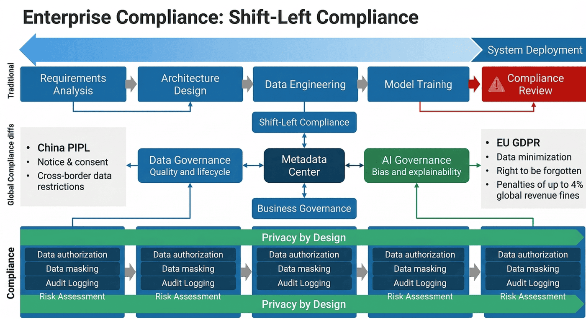
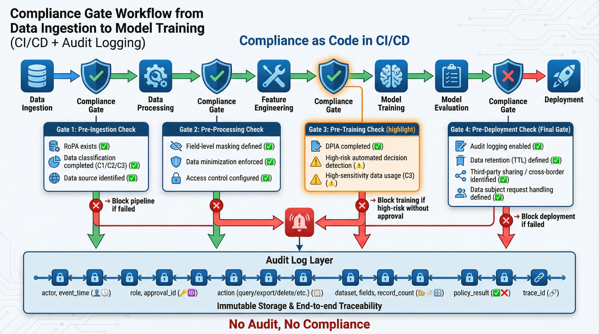
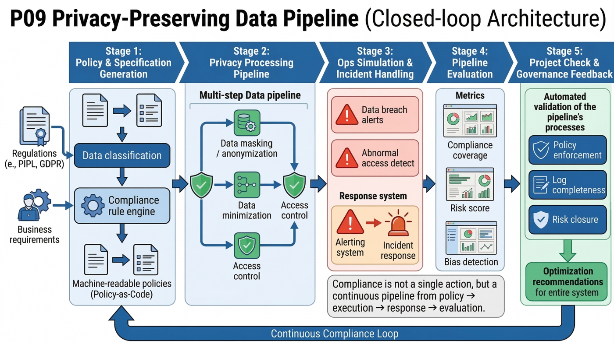
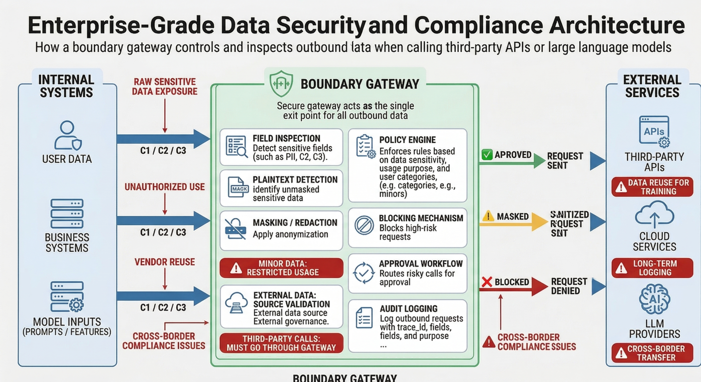

# タイトル 9: プライバシー コンプライアンスとデータ セキュリティ

**下読み**
* **中心的な目標**: 「データを使用できるかどうか、どのように使用するか、使用は制御可能かどうか」という 3 つの主要な質問に答えます。
* **設計コンセプト**: コンプライアンスとプライバシー保護の「左シフト」を遵守し、それをシステム アーキテクチャとプロセス設計に組み込みます (プライバシー バイ デザイン)。
* **実装サポート**: ガバナンス テンプレート、アクセス制御リスト、および最小限のガバナンス リンクによってサポートされ、システム仕様、プロセス制御、自動監査、およびエンジニアリング実装が接続されて、需要からオフラインまでのコンプライアンス ガバナンスの閉ループを形成します。

---

# 第 27 章: データ コンプライアンスのフレームワークとガバナンス

---

## この章の概要

データドリブンの時代において、コンプライアンスはもはやプロジェクト開始前に法務部門が押す判ではなく、システムが長期的に安定して稼働できるかどうかを決定するインフラストラクチャの制約となります。多くのシステムは、アルゴリズム効果、ビジネス変革、グレースケール パフォーマンスの点でオンライン標準に達していますが、不明確なデータ ソース、曖昧な認証境界、不完全なログ トレース、または機密情報の漏洩のため、最終レビュー中に緊急停止されました。問題は、チームが「コンプライアンスに注意を払っていない」ことではなく、コンプライアンス要件がシステム設計の最初に含める必要がある制約ではなく、研究開発完了後の承認の付録として長い間見なされてきたことです。

この章は、次の核となる命題を中心に展開します。**データ コンプライアンスの修復にかかるコストと難易度は、プロジェクトのライフサイクルが進むにつれて急速に増加します**。したがって、企業はコンプライアンスを 1 回限りの法的レビュー行為とみなすことはできず、要件定義、データ モデリング、機能開発、モデル トレーニング、オンライン承認、監査トレース、オフライン破棄のプロセス全体にコンプライアンスを組み込む必要があります。言い換えれば、真に効果的なコンプライアンスとは、「何か問題が発生した後に文書を提供する」ことではなく、「システムが慣性を形成する前にリスクのしきい値を前進させる」ことです。

この章では、4 つのレベルから完全なフレームワークを確立します。まず、コンプライアンスが承認添付ではなくシステム制約である理由を説明し、プライバシー バイ デザインのエンジニアリング上の影響について説明します。 2番目に、データの分類と格付け、リスク評価マトリックス、ビジネスシステムの責任連鎖を確立し、チームが「どのようなデータがあるのか​​」、「データの責任者は誰なのか」、「どのようなシナリオで使用できるのか、どのように使用できるのか、誰が承認しているのか」を明確にできるようにします。 3 番目に、RoPA、DPIA、監査トレース、CI/CD ステージを中心とした自動傍受メカニズムは、コンプライアンス要件が実際にエンジニアリング プロセスの一部となり得る方法を示しています。 4 番目に、最小限のガバナンス リンクを抽出して、ガバナンス構成、非感作戦略、許可制御、事前チェック メカニズム、イベント応答、レビューの閉ループが特定のシステム製品にどのように含まれるかを示します。

規制条項のレベルに留まる多くの内容とは異なり、この章では「設計されたガバナンス」により重点を置いています。規制の要件を説明するだけでなく、メタデータ センターでデータ レベルをマークする方法、ポリシー ファイルを使用して分析ドメインへのデータ入力を制限する方法、オンラインになる前にパイプラインを使用して高リスクの変更を自動的にブロックする方法、ログとリネージを使用した監査のバックトラッキングをサポートする方法、医療、金融、未成年者、第三者による処理、国境を越えた送信などの高リスクのシナリオに特化した制御手段を設計する方法についてもさらに説明します。これらのコンテンツを通じて、読者は実際の企業環境に近いデータ コンプライアンス ガバナンスの全体像を構築できます。

---

## 27.0 学習目標

この章を学習すると、読者は次のことができるようになります。

* データ コンプライアンスを、オンライン化前の受動的承認ではなく、システム制約として要件、アーキテクチャ、開発段階に進める必要がある理由を理解します。
* データの分類とグレーディングの設計原則をマスターし、低機密データ、中機密データ、高機密データを区別し、さまざまなレベルで差別化された処理戦略を設計できるようにします。
* 実際のビジネス向けのデータリスク評価マトリックスを構築し、データレベル、使用目的、処理アクション、影響範囲を実行可能なリスク判断ロジックに組み合わせます。
* 明確な責任の連鎖を設計し、ガバナンス プロセスにおける法務、ビジネス、プラットフォーム、アルゴリズム、データ開発、セキュリティ、監査の役割の責任の境界を明確にします。
* プロジェクトのライフサイクルにおける RoPA、DPIA、監査トレース、同意管理、アクセス承認、データ保持および破棄メカニズムの役割を理解します。
* 研究開発パイプラインにコンプライアンス要件を組み込んで、コードの提出、構成変更、データ アクセス、モデル トレーニング、オンライン承認の段階で自動検査とブロックを実現する方法を学びます。
* 医療、金融、未成年者、第三者による処理、国境を越えた感染などの高リスクのシナリオに対する特別なガバナンス戦略を提案できる。
* 構成ファイル、ポリシー ルール、ログ製品、検査スクリプトを通じてコン​​プライアンス ガバナンスがどのように実装されるかを理解します。

---

## シーン紹介

チームが 3 か月かけて開発したユーザー インサイトとレコメンデーション システムは、来週完全にリリースされる準備が整いました。ビジネス側は、このモデルによってもたらされるコンバージョン率の 20% 向上に大きな期待を寄せており、アルゴリズムチームもオフライン評価とグレースケール実験の結果に自信を持っています。しかし、金曜日の最終検討会議で、法務・コンプライアンスの責任者が一時停止ボタンを押した。

コンプライアンス責任者は 3 つ続けて質問しました。まず、システムはユーザーの正確な地理的位置と過去 3 か月間の閲覧履歴を使用して、これらのデータの使用目的がユーザーの許可と一致しているかどうかを判断します。次に、データ レイク内のテスト セットが感度を下げられているかどうか、また一部のデバッグ ログにクリア テキストの携帯電話番号が依然として表示されるのはなぜでしょうか。第三に、ユーザーがアカウントからログアウトして削除の権利を行使することを要求した場合、トレーニング セット内で既に形成されている特徴と派生ラベルを同時に削除できるか、またはメイン テーブル内の元のレコードのみを削除できるかです。

会議室には沈黙があった。事業者側は「レコメンド効果の向上」という要求だけを前面に押し出していると考えている。アルゴリズム チームは、データがプラットフォーム側によって提供されると信じています。プラットフォーム チームは、基本的な権限が与えられていると信じています。法務部門は、システム内に「誰がどのような目的でどのデータを使用したか」の完全な記録が存在しないと指摘した。結局、プロジェクトは延期する必要があり、チームはデータ ソース、クリーニング ロジック、非感作リンク、承認プロセスの再編成を開始しました。

この事例は、**コンプライアンスの背後にある**という、一般的だが非常にコストのかかる問題を明らかにしています。システムのテーブル構造、機能プロセス、トレーニング パイプライン、およびログ システムが形成された後、承認の補足、感度解除の再構築、監査トレースの追加は、多くの場合、基礎的な変換、履歴データの再実行、チーム間プロセスの再構築を意味します。この時点で発生するコストは、システム設計の開始時にガバナンス境界を修正するコストよりもはるかに高くなります。

問題をさらに詳しく説明するために、3 つの単純化された失敗ケースを見てみましょう。

### ケース 1: レコメンデーション システムにおける目的のドリフト

コンテンツ推奨システムは当初、クリック動作に基づいてランキングの最適化のみを実行していました。その後、広告コンバージョンを向上させるために、デバイスの識別、滞在時間、トランザクション記録、位置データが導入されました。プロジェクトの初期段階のプライバシーポリシーでは「サービスエクスペリエンスの向上」のみが取り上げられており、「精密マーケティング」や「自動価格設定」については触れられていなかった。結果として得られたシステムは、技術的には動作していましたが、目的の正当性の点で逸脱していました。問題は、単に「フィールドを追加する」ということではなく、使用目的が変更されたときに、認可と処理基盤が同時に更新されないことです。

### ケース 2: テスト環境での感度解除の失敗

チームは実稼働環境で携帯電話番号のハッシュと電子メールのマスキングを有効にしましたが、問題のトラブルシューティングを行うために実稼働スナップショットをテスト環境に直接インポートしました。開発者とテスターに​​は、ライブラリ テーブルを読み取るためのより広範な権限が与えられ、ログ システムはデフォルトで完全なリクエスト パラメーターも出力します。結局のところ、機密情報が実際に公開されるのは正式なリンクではなく、テスト環境と運用および保守のログです。このケースは、**技術的な強制がなければ、システム コンプライアンスはグレーゾーンで失敗する**ことを示しています。

### ケース 3: モデルの削除リクエストをクローズできません。

ユーザー削除リクエストを受信した後、リスク コントロール モデルはソース テーブル内のユーザー情報を削除するだけで、特徴ウェアハウス、トレーニング サンプル セット、オフライン スナップショット、モデル キャッシュ、およびダウンストリーム ポートレート タグを同期しませんでした。外部的には削除が完了したように見えますが、内部的にはまだ履歴コピーが残っています。このケースは、**データ削除が単なるテーブル レベルの削除ではなく、フルリンク削除機能のテストである**ことを示しています。

### 舞台裏でのコアエンジニアリングの問題点

上記のケースから、実際のプロジェクトにおける 4 種類の問題点を要約できます。

1. **コンプライアンス遅延による非常に高いコスト**: システムで問題が発見されると、多くの場合、やり直し、遅延、シャットダウン、および潜在的なペナルティが伴います。
2. **権限と責任の境界があいまい**: ビジネスラインはデータを必要とし、アルゴリズムは機能を必要とし、プラットフォーム側は機能を提供し、法的管理規定がありますが、明確な責任の閉ループはありません。
3. **テクノロジーとシステムが乖離している**: コンプライアンス文書は完成しているように見えますが、メタデータの注釈、感度解除エンジン、ポリシーの検証、アクセス監査などの技術的な把握がありません。
4. **ライフサイクルは閉じられていません**: 収集、処理、使用、共有、保持から削除まで、検証可能、追跡可能、監査可能な閉じたループはありません。

---

## 27.1 コンプライアンスが承認添付ファイルではなくシステム制約である理由

従来の研究開発プロセスでは、発売に近いプロセスの最後にコンプライアンスのレビューが行われます。デマンド プロジェクトを設定するときは、まず機能目標について話し合い、開発中に最初に効果を検証してから、オンラインにする前に法務チームまたはコンプライアンス チームに確認を依頼します。このモデルは、機能が単純でデータの機密性が低いシステムではまだ仕方なく機能するかもしれませんが、今日のデータ駆動型システムではますます危険になっています。

最新のデータ ガバナンスでは、**プライバシー バイ デザイン**を重視しています。その核心は、追加の承認を行うことではなく、プライバシーとコンプライアンス自体がシステム アーキテクチャの一部であることを認識することです。データベースを階層化する方法、ログを保存する場所、特徴が追跡可能かどうか、トレーニング セットをクリーンアップする方法、サードパーティ API が機密フィールドを引き出すかどうか。これらは「オンライン化する前に承認フォームに記入する」ことで解決できる問題ではなく、アーキテクチャ段階で考慮すべき基本的な制約です。

### 27.1.1 コンプライアンス後のコスト

コンプライアンス後のコストは主に 5 つの側面に反映されます。

**第一に、アーキテクチャのやり直しのコストが高くなります。 **
システムがコア機能として機密フィールドに広範囲に依存していて、そのフィールドが法的に認可されていないことが後で判明した場合、テーブル構造、特徴エンジニアリング、モデル トレーニング、およびダウンストリームの消費をすべて調整する必要があることを意味します。

**第二に、履歴データを復元するのは困難です。 **
機密データがトレーニング セット、プロファイリング システム、キャッシュ レイヤー、レポート リンクに入ると、削除、置換、または再トレーニングのコストが、最初の制限された使用範囲よりもはるかに高くなります。

**第三に、チーム間の調整コストが急激に増加します。 **
プロジェクトの立ち上げが近づくほど、参加者が増え、依存関係が複雑になります。現時点でコンプライアンス是正を導入するには、多くの場合、ビジネス、アルゴリズム、プラットフォーム、法務、セキュリティ、テスト、運用保守を同時に調整する必要があります。

**第四に、営業期間が失われます。 **
多くのプロジェクトは「変更できない」のではなく、「変更するには遅すぎる」のです。オンライン化する前にコンプライアンス問題が発生した場合、最も直接的な損失はビジネス リズムと市場機会を失うことです。

**第五に、監査と罰則のリスクが急激に増加しています。 **
システムがオンラインになり、ユーザーに実際の影響を与えると、発見された問題は内部の是正だけでなく、外部からの苦情、監査検査、規制上の罰則にまで拡大する可能性があります。

読者がエンジニアリングをより直観的に理解できるようにするために、コンプライアンス修正のコストは、ライフサイクルが進むにつれて急速に上昇する曲線として理解できます。要求段階で不合理なデータフィールドを修正することは、単に文書を変更するだけかもしれません。トレーニング段階で修正するには、データのクリーニングと機能開発をやり直す必要があります。オンラインになった後の修正には、ロールバック、説明、削除、補償、および外部通信が含まれる場合があります。

### 27.1.2 グローバルな視点: コンプライアンスのベースラインの違い

コンプライアンス要件は、どの地域の企業でも完全に一貫しているわけではありません。中国のPIPLは「インフォーム・コンセント」、機密個人情報に対する個別の同意、データ輸出の管理要件を強調している。ヨーロッパの GDPR は、データの最小化、削除の権利、移植性の権利、自動化された意思決定の透明性を強調しています。企業が異なる地域で同じビジネスを運営する場合、「1 つの収集ロジックが世界中で普及する」ことを想定することはできず、技術層での差別化された実装能力が必要です。

これは、システム設計が「機能がスムーズに実行できるかどうか」だけに焦点を当てるのではなく、「地域ルールの違いを製品、データ、モデルのリンクにどのようにマッピングするか」にも焦点を当てる必要があることを意味します。たとえば、同じユーザー プロファイルでも、法的根拠、保持期間、ユーザー権利対応メカニズム、管轄区域が異なると共有制限が異なる場合があります。真に成熟したガバナンス システムでは、開発者はすべての規制規定を暗記する必要はありませんが、これらの違いをテンプレート、ポリシー、承認ルール、デフォルトの動作に反映する必要があります。

### 27.1.3 ガバナンスの交差点: データ、モデル、ビジネスのコラボレーション

コンプライアンスは単独で存在するものではありません。これは、データ ガバナンス、モデル ガバナンス、ビジネス ガバナンスの交差点です。

* **データ ガバナンス**は、データ品質、メタデータ、系統、ライフサイクル、保持戦略に焦点を当てています。
* **モデル ガバナンス** は、特徴ソース、バイアスのリスク、解釈可能性、トレーニング セットの境界、モデルの使用目的に焦点を当てます。
* **ビジネス ガバナンス** は、ビジネス目標、ユーザーのコミットメント、認可の根拠、外部への開示、運用ルールに重点を置いています。

これら 3 つが分離されている場合、システム内で一般的な不整合が発生します。つまり、ビジネスでは新しい機能が必要であり、モデルは新しい機能を迅速に統合し、利用可能なインターフェイスはプラットフォーム側でオープンされますが、このデータ リンクが準拠しているかどうかを統一的に判断する人はいません。統合されたメタデータ管理センター、ポリシー センター、監査センターを通じてのみ、当初はさまざまなチームに分散していたこれらの要件を結び付けることができます。


*図 27-1: コンプライアンス シフト レフト戦略 - コンプライアンス レビューが発売前から要件分析およびアーキテクチャ設計段階にどのように移行するかを示しています*

### 27.1.4 従来のプロセスと左シフトプロセスの比較

次の表は、2 つのプロセスの違いをより工学的な方法で示しています。

|ステージ |従来モデル |シフトレフトのガバナンスモデル |
| :--- | :--- | :--- |
|要件分析 |ビジネス機能に焦点を当て、データ境界をほとんど定義しない |データ型、使用目的、認可根拠、出力境界を明確にする |
|建築設計 |可用性とパフォーマンスを優先する |分類、感度解除、監査、保持、および削除のメカニズムを同期的に定義します。
|データアクセス |最初にフィールドを整列させてから、説明を追加します。アクセスする前に、登録、分類、合法性の検証を完了してください |
|機能開発 |効果を優先する |機密性の高いフィールドがトレーニングと分析のリンクに直接入力できないように制限する |
|テストとグレースケール |多くの場合、実際のデータのスナップショットで検証されます。テスト環境はデフォルトで匿名化され、ログはデフォルトで最小限に公開されます。
|オンラインレビュー |一時的な法的審査 | RoPA、DPIA、事前検査報告書および監査追跡に基づく承認 |
|ランタイム |主に障害とパフォーマンスに焦点を当てます |アクセス例外、輸出リスク、削除要求、インシデント対応にも重点を置く |

### 27.1.5 エンジニアリングガバナンスの観点から見た「デフォルトのセキュリティ」

アーキテクチャの観点から見ると、成熟したコンプライアンス ガバナンスは全員の意識に依存するのではなく、「デフォルトで安全な」システム動作を確立します。

* 新しくアクセスされるデータ セットにはデフォルトでは権限がないため、明示的に適用する必要があります。
* 機密フィールドは、「最初にクリアテキストを表示し、必要に応じて非表示にする」のではなく、デフォルトでマスクされて表示されます。
*デフォルトでは、C2/C3 レベルのデータは外部 API または大規模なモデル プロンプトに直接入力できません。
* テスト環境では、デフォルトでは本番環境の平文スナップショットをインポートできません。
※利用登録されていないデータはデフォルトではモデルトレーニングリンクに入ることができません。
* RoPA、DPIA、または承認レコードが欠落している場合、CI/CD はデフォルトでオンラインになることがブロックされます。

このタイプのデフォルト動作の本質は、コンプライアンスを「人間によるリマインダー」から「システムのガードレール」にアップグレードすることです。

---

## 27.2 規制のマッピング、リスク分類、および責任の連鎖

「コンプライアンスの左派化」がコンプライアンスを前進させなければならない理由の答えであるなら、このセクションは次のように答えます: **前進した後、チームは正確に何を管理する必要があるか**?答えは次の 3 つの質問に要約できます。

1. どのようなデータがありますか?
2. これらのデータはどのようなシナリオで使用できますか?
3. 何か問題が起こった場合、誰が責任を負いますか?

### 27.2.1 データ分類と分類アーキテクチャ

すべてのデータが同じ強度のガバナンスに値するわけではありません。すべてのデータが最高レベルの保護として扱われると、システムが過度に厳格になり、パフォーマンスと反復効率が影響を受けます。しかし、すべてのデータが統一された緩やかな基準で処理されると、機密データが漏洩してしまいます。したがって、企業は差別化されたデータ分類および格付けシステムを確立する必要があります。

この章では、基本的なフレームワークとして 3 レベルの分類を使用します。

|セキュリティレベル |定義と例 |処理要件 |マスキングと暗号化戦略 |
| :--- | :--- | :--- | :--- |
| **L3 高感度 (C3)** |機密の個人情報 (生体認証、医療健康、正確な位置情報)、中核となる企業秘密 (未公開の財務報告書) |ユーザーの同意が別途必要です。感度を下げずに分析領域に入るのは厳しく禁止されています。法的拒否権 |ストレージレベルの強力な暗号化 (AES-256)。表示中は完全に感度を下げます。利用可能な場合は非表示 (プライベート コンピューティング) |
| **L2 中感度 (C2)** |一般的な個人情報 (名前、携帯電話番号、デバイス ID)、社内ビジネス データ |プライバシーポリシーに含まれます。許可された担当者およびプロジェクトに限定 |送信暗号化。ストレージの暗号化またはハッシュの匿名化。部分マスク表示 |
| **L1 低感度 (C1)** |公開データ、完全に匿名化されたデータ、集計された統計結果 |一般的なアクセス制御。広範な BI 分析とモデルのトレーニングに使用できます。特別な要件なし、オンデマンド ストレージ |

この評価システムの価値は、チームのラベル付けに役立つだけでなく、その後の権限ポリシー、感作解除ルール、承認プロセス、ログ要件、および保存期間の統一基盤を提供することにもあります。

### 27.2.2 フィールドレベル、テーブルレベルからシーンレベルまでの多次元分類

多くのチームは、「グレーディング」をテーブルに全体的なラベルを付けることとして理解していますが、実際のシステムはより複雑であることがよくあります。

※C1、C2、C3フィールドは同じテーブル内に同時に存在する場合があります。
※同じフィールドでもシナリオが異なればリスクも異なります。
* 同じデータでも、生、減感、集約された状態ではレベルが異なる場合があります。

したがって、成熟したグレーディングには少なくとも 3 つの側面が必要です。

**フィールドレベルの分類**: たとえば、携帯電話番号、電子メール アドレス、ID 番号、正確な場所、銀行カード番号、医療記録番号などのフィールドには明確なラベルが必要です。  
**テーブルレベルのグレーディング**: たとえば、ユーザープロファイル、トランザクションフロー、行動ログ、リスク管理ラベル、顧客サービスの記録などのデータセットには、全体的なグレードのベースラインが必要です。  
**シナリオ レベルの分類**: たとえば、「モデル トレーニング用」、「顧客サービス取得用」、「BI レポート用」、「外部インターフェイス用」などです。これらの使用シナリオ自体もリスク レベルに影響します。

これら 3 つの次元を同時に組み込むことによってのみ、システムは「同じテーブル、異なるフィールド、および同じフィールド、異なる用途」の混乱を避けることができます。

### 27.2.3 データの各レベルの一般的なガバナンス要件

#### 1. L1 低機密データ

L1 データは通常、公開データ、匿名化されたデータ、または集計された統計結果です。例えば、公開マクロ指標、匿名化後の地域レベルのコンバージョン率、個人を特定しない運用指標などです。  
通常、L1 データはより広範囲で循環し、BI 分析、モデル調整、ビジュアル ダッシュボード、キャパシティ プランニングなどのシナリオに使用できます。そのガバナンスは、基本的なアクセス制御、データ品質保証、および合理的な保持に重点を置いています。

#### 2. L2 の機密データ

通常、L2 データには、名前、携帯電話番号、電子メール、デバイス ID、従業員番号、内部業務記録などの一般的な個人情報または内部制限されたデータが含まれます。  
このタイプのデータは任意にエクスポートすることはできません。また、ログ、テスト環境、外部インターフェイスで明示的に公開することもできません。ガバナンスの優先順位には、暗号化、ハッシュの匿名化、部分的なマスク表示、最小限の特権アクセス、および制限された使用が含まれます。

#### 3. L3 の高機密データ

L3 データには、生体認証、医療健康、正確な位置、金融口座、未公開の企業秘密などが含まれます。  
この種のデータが漏洩すると、その影響は甚大になるため、通常は個別の同意、厳格な承認、独立した保管、強力な暗号化、より高い基準の監査が必要となります。デフォルトでは、L3 データは一般分析ドメインに直接入力されるべきではなく、ダウンストリームによって任意に消費されるべきではありません。

### 27.2.4 リスク評価マトリックス

「データがどのグレードであるか」を知るだけでは十分ではありません。フィールドのリスクは静的なものではなく、その使用目的と処理方法によっても異なります。

例えば：

* 自動化された意思決定に L3 データを使用することは高いリスクを伴います。
* L2 データを内部分析に使用し、個人に直接影響を与えない場合は、中程度のリスクがあります。
* システムの安定性の監視に L1 データを使用することは、通常、低リスクです。

したがって、リスク評価では次の側面を同時に考慮する必要があります。

1. **データ レベル**: C1/C2/C3
2. **利用目的**: サービスのパフォーマンス、リスク管理、推奨、マーケティング、監査、研究開発テストなど。
3. **処理アクション**: クエリ、エクスポート、トレーニング、共有、プッシュ、自動化された意思決定
4. **影響を受けるオブジェクト**: 内部チーム、パートナー、外部ユーザー、国境を越えた受信者
5. **結果への影響**: ユーザーの権利、価格設定、肖像画、推奨事項、信用またはアカウントのステータスにさらに影響しますか?

要約すると、上記の次元は、プロジェクトの実装にとってより便利な判断ロジックに圧縮できます。

```text
风险等级 = 数据敏感度 × 处理动作强度 × 业务影响范围
```

エンジニアリングの実践では、このロジックは最終的にポリシー エンジンにエンコードされることがよくあります。
データレベルが高くなると、処理アクションがより強力になり、影響範囲が広くなり、より多くの承認、より厳格な非感作、およびより高いレベルの監査が必要になります。

### 27.2.5 リスク マトリックスの例

|データクラス |利用目的 |アクションの処理 |リスクレベル |デフォルトのコントロール |
| :--- | :---- | :------ | :--- | :----------------- |
| C1 |安定性監視 |集計クエリ |低い |一般的なアクセス制御 |
| C2 |内部分析 |プロファイル分析 |中 |ロール認可、部分的非感作、アクセストレース |
| C2 |モデルトレーニング |バッチ抽出 |中～高 |機能のホワイトリスト、トレーニングの承認、結果のレビュー |
| C3 |自動化された意思決定 |トレーニング/スコアリング |高 | DPIA、法的承認、強力な監査、オンライン ブロック |
| C3 |サードパーティの共有 |エクスポート/インターフェイス呼び出し |非常に高い | DPA、非感作ゲートウェイ、最小フィールドセット、特別評価 |


*図 27-4: データの分類、使用法、および処理アクションで構成されるリスク マトリクス図*

### 27.2.6 責任連鎖の構築 (RACI マトリックス)

明確な責任の連鎖がなければ、どんなに優れたルールであっても、実行の際に歪んでしまいます。ガバナンスシステムでは、「誰が要求を行う責任があり、誰が合法性を判断する責任があり、誰が技術的管理を提供する責任があり、誰がプロセスコンプライアンスを使用する責任があり、誰が監査レビューの責任を負うのか」を明確にする必要があります。

次の表は、一般的な RACI 設計を示しています。

|役割 |主な責任 |ラシ |
| :------ | :------------------- | :------------------- |
|法務・コンプライアンス |規制を解釈し、レッドラインを設定し、高リスクのシナリオを承認する |責任ある |
|ビジネスパーティー |利用目的、業務上の必要性、ユーザーのコミットメントについて説明 |責任者 |
|プラットフォーム/インフラストラクチャ |分類、非感作、権限、監査、系統機能を提供します。責任者 |
|アルゴリズム/データ開発 |承認の範囲内で機能を開発し、モデルをトレーニングし、データを消費します |相談/通報 |
|セキュリティチーム |境界セキュリティ、監査ポリシー、異常アクセス、輸出リスクを調査 |相談した |
|監査/内部統制 |トレースの定期的なレビュー、プロセスの実行、および修正のクローズド ループ |通報・相談 |

### 27.2.7 責任連鎖の実装におけるよくある誤解

実際の実装中に、チームはよく次の 3 つの間違いを犯します。

**誤解1: コンプライアンスの責任をすべて法務に押し付ける。 **
法務は境界を説明することはできますが、ビジネスの目的を明確にすることや、管理を実現するためのプラットフォームに代わることはできません。

**誤解 2: すべての技術的制御をプラットフォームに押し付けます。 **
プラットフォームは機能を提供できますが、ビジネスとアルゴリズムがその真の用途を宣言しない場合、プラットフォームはどの使用行為が不合理であるかを認識できません。

**誤解3：「承認＝遵守」と考えている。 **
承認は単なるノードです。本当に重要なのは、承認前の情報が完全かどうか、承認後の動作が検証可能かどうか、実行中に逸脱を継続的に発見できるかどうかです。

### 27.2.8 機関文書からシステムラベルまで

成熟したチームは、責任の連鎖をシステム内の実際のオブジェクトにマッピングします。

※事業主→プロジェクトオーナー欄
* コンプライアンス承認者 → 承認ノードと作業指示フロー
* データ所有者 → データセットのメタデータ管理
※利用目的→RoPAフォームフィールド
* 使用権限 → RBAC/ABAC ポリシー
* リスクレベル → ルールパラメータの事前チェック
* アクセストレース → 監査ログイベント

このステップは非常に重要です。なぜなら、制度上の言語がシステムのメタデータに入力されて初めて、コンプライアンスが真に自動実行される可能性があるからです。

---

## 27.3 プロジェクトの確立、レビュー、および開始前検査

コンプライアンス・ガバナンスが真に研究開発の一部になりたいのであれば、原則レベルにとどまることはできず、明確なプロセス・ノードになる必要があります。プロジェクトの確立からオフラインまで、少なくとも 6 つの質問に答える必要があります。

1. この処理アクティビティは登録されていますか?
2. この処理には法的根拠はありますか?
3. どのレベルのデータが関係していますか?
4. リスク評価は実施されましたか?
5. 監査と削除は可能ですか?
6. オンラインのしきい値に達しましたか?

### 27.3.1 RoPA (処理アクティビティの記録) の確立

**RoPA (処理活動の記録)** は、処理活動の総勘定元帳です。これは監査目的で一時的に記入されるフォームではなく、データの使用を体系的に登録するものです。

各プロジェクトは、データ、トレーニング モデル、またはオープン インターフェイスへのアクセスを申請する前に、少なくとも次の情報を入力する必要があります。

1. データの種類とソース (ファーストパーティ、サードパーティ、公開データ)
2. 利用目的と法的根拠
3. 関連するシステム、テーブル、フィールド、出力オブジェクト
4. データ保持期間 (TTL) と破棄メカニズム
5. 機密データが含まれているかどうか、第三者が関与しているか、国境を越えた送信が含まれているかどうか
6. データ所有者、プロジェクト所有者、承認者および使用チーム

RoPA の価値は、RoPA がなければ、チームが「どのデータが誰によってどのような理由で使用されているか」を決して知ることができないことです。苦情、監査、または削除要求が発生すると、台帳がなければリンクを見つけることはできません。

#### RoPA 最小フォーム設計例

|フィールド |説明 |
| :---------------- | :---------- |
|プロジェクトID |プロジェクト固有の番号 |
|オーナー |プロジェクトリーダー |
|システム名 |システム名 |
|データソース |データ ソースとテーブル名 |
|目的 |利用目的 |
|法的根拠 |法的根拠または認可根拠 |
|データレベル |データレベル |
|保存日数 |保存期間 |
|サードパーティの共有 |第三者と共有するかどうか |
|国境を越える |国境を越えたかどうか |
|削除パス |削除パスの説明 |
|監査が必要 |監査を強制するかどうか |
|承認チェーン |承認リンク |

#### RoPA のエンジニアリング要件

成熟したプラットフォームでは、RoPA はオフライン Excel であってはなりませんが、次の特性を持つ必要があります。

* システムフォームとバージョン管理されたストレージを通じて送信
* プロジェクト コード ウェアハウス、データセット メタデータ、承認作業指示書に関連付けられています
* フィールドレベルおよびテーブルレベルの自動検証をサポート
* CI/CD パイプラインとリンクして、重要な情報が欠落している場合にオンライン プロセスをブロックします
* 監査要件を満たすための追跡可能な履歴変更

### 27.3.2 DPIA (データ保護影響評価) を実行する

プロジェクトに中程度から高機密のデータ、新しい処理方法、自動化された意思決定、または影響の大きいシナリオが含まれる場合、RoPA だけでは十分ではなく、さらに **DPIA (データ保護影響評価)** が必要になります。

DPIA の核心は、「長いレポートを書く」ことではなく、次の質問に体系的に答えることです。

* このデータを収集する必要は本当にありますか?
* これらのデータは本来の許可の範囲外ですか?
* 処理結果はユーザーに重大な影響を及ぼしますか?
* 差別、虐待、国境を越えたプロファイリング、または誤判のリスクはありますか?
※漏洩、悪用、不正アクセスが発生した場合、システムは対応し、損失を阻止する能力があるか？

#### DPIA の一般的な評価手順

**ステップ 1: 処理アクティビティを特定します。 **
データソース、処理目的、主な参加システム、出力結果を明確にします。

**ステップ 2: リスクポイントを特定します。 **
データの過剰利用、目的のドリフト、サードパーティによる漏洩、モデルのバイアス、ログの公開、閉ループを伴わない削除などが含まれます。

**ステップ 3: 必要性と比例性を評価します。 **
フィールドが最小限必要かどうか、処理方法が業務目的に適合しているかどうかを判断します。

**ステップ 4: 管理措置を設計する。 **
たとえば、フィールドの削除、デフォルトの感度解除、強力な監査、アクセス承認、モデルの解釈可能性の記述、削除されたリンクの拡張などです。

**ステップ 5: 承認の結論を作成します。 **
オンライン化できるか、修正後にオンライン化する必要があるか、オンライン化が禁止されているかについて明確な結論を出します。

#### DPIA リスク スコアの例

|寸法 |評価の説明 |
| :---- | :---------------------- |
|データの機密性 | C1=1、C2=2、C3=3 |
|使用強度 |クエリ = 1、分析 = 2、トレーニング/自動決定 = 3 |
|範囲を広げる |社内の単一チーム = 1、複数チームの共有 = 2、サードパーティ/国境を越えたチーム = 3 |
|株式への影響 |直接的な影響なし = 1、間接的な影響 = 2、直接的な影響 = 3 |

合計スコアが高いほど、制御要件は厳しくなります。たとえば、合計スコアが 8 以上の場合、法的な承認とオンライン ブロックがトリガーされる可能性があります。

### 27.3.3 必要最小限の原則とフィールドスリム化

ガバナンスの失敗の多くは、管理が不十分であることが原因ではなく、そもそも不必要なデータが収集されすぎていることが原因です。
「必要最小限の原則」では、チームが次のことを継続的に問い続けることが求められます。

* このフィールドは本当に必要ですか?
* 代わりに、より低い感度のフィールドを使用できますか?
* 詳細を直接使用するのではなく、最初に集計してから使用することは可能ですか?
* 長期ではなく、短期間のみ保持することは可能ですか?

エンジニアリングでは、最低限必要な原則の実装には次のものが含まれます。

* テーブル全体を開く代わりにフィールドのホワイトリストを表示
* トレーニング機能セットは元の詳細から分離されています
* タイムウィンドウクリッピング
* デフォルトでは元の識別子は保持されません
※ 詳細は公表せず、集計後に発行

### 27.3.4 同意管理、認可範囲および目的の拘束

データに関する紛争の多くは、「データ自体が違法である」ということではなく、「当初の届出を超えたデータの使用」が問題となっています。したがって、システムは承認と目的を真に結び付ける必要があります。

これはつまり：

* ユーザーが承認したバージョンは追跡可能である必要があります
* それぞれの目的を明確な処理アクティビティにマッピングする必要があります
※用途が変わった場合は再評価が必要
※「エクスペリエンスの向上」はすべてのビジネスシーンに一概に適用できるものではありません
* 機密データ、高リスクのプロファイリング、自動化された意思決定には、より高いレベルの承認と説明メカニズムが必要です

システムの観点から見ると、同意管理では少なくともユーザー ID、認証バージョン、認証時刻、使用範囲、撤回ステータス、該当する製品ライン、有効期間を保持する必要があります。

### 27.3.5 監査の準備とコンプライアンスのトレース

システムに痕跡が残らない場合、最終的にはそれを自己認証して実装することが困難になります。
したがって、承認レコード、承認作業指示書、アクセス ログ、エクスポート レコード、ポリシー ヒット、事前チェック結果、および削除実行結果はすべて、改ざん防止のストレージ機能とトレーサビリティ機能を備えている必要があります。

成熟した監査システムでは、少なくとも次のイベントを記録する必要があります。

* 誰がいつ、どのデータにアクセスしたか
* アクセスに使用される役割と承認の根拠
* アクセスに関与するフィールドとレコードの数
* エクスポート、ダウンロード、または共有が発生するかどうか
* 感度解除、ブロック、またはアラームのルールに該当するかどうか
※指定したユーザーに対する削除、修正、問い合わせの有無
* リクエストが完了するまでにかかった時間

#### 監査ログの設計例

|フィールド |説明 |
| :--------------------- | :--------------- |
|イベント時間 |イベント時間 |
|俳優 |操作対象 |
|役割 |使用される役割 |
|アクション |クエリ、エクスポート、更新、削除、共有 |
|データセット |データセット名 |
|フィールド |関与分野 |
|レコード数 |レコード数 |
|目的 |利用目的 |
|承認ID |対応する承認フォーム |
|ポリシーの結果 |許可、感度解除後に許可、ブロック |
|トレースID |リンク トレース ID |

### 27.3.6 起動前チェック: CI/CD へのコンプライアンスの組み込み

多くのチームにとって本当の分かれ目は、システムを作成したかどうかではなく、オンラインにする前にシステムを自動しきい値に変えたかどうかです。

一般的な CI/CD コンプライアンスの事前チェックには次のものが含まれます。

* 有効な RoPA があるかどうか
* 必要な DPIA が存在するかどうか
※データ分類が完了しているか
* フィールドレベルの感度解除ルールがあるかどうか
* アクセス権限とロール境界を設定するかどうか
※監査ログ出力の有無
* データの保存期間と破棄メカニズムを定義するかどうか
* 第三者による共有と国境を越えた送信を識別するかどうか
※削除要求の処理経路を設定するかどうか
※テスト環境の減感チェックに合格するかどうか

高リスクの項目が欠落している場合、パイプラインは構築をブロックするか、デプロイをブロックするか、トレーニング タスクの実行をブロックする必要があります。


*図 27-5: データ アクセスからモデル トレーニングまでのコンプライアンス アクセス制御フローチャート*

### 27.3.7 ガバナンスパイプライン: 文書要件からシステム実行まで

コンプライアンス要件がエンジニアリング段階に入ると、ガバナンス オブジェクトはシステム テキスト内に留まるだけではなく、実行可能なパイプラインに編成される必要があります。最小限のガバナンス リンクには通常、次の手順が含まれます。

1. プライバシーの仕様とポリシーを作成する
2. プライバシー処理パイプラインを実行する
3. 運用保守およびイベント処理の模擬
4. プライバシー パイプラインを評価する
5. プロジェクトチェックを実行する

このリンクは重要な事実を反映しています。**コンプライアンスは単一の行動点ではなく、ポリシーの生成、データ処理、アラームへの対応から評価および検証までの組み立てラインである**。


*図 27-3: プライバシー仕様とポリシー生成のフローチャート*

### 27.3.8 ガバナンス指標をエンジニアリング言語に翻訳する方法

ガバナンス指標の価値はサンプル サイズそのものにあるのではなく、識別、処理、アクセス制御、警報、検査のリンクが閉ループを形成していることを示すことができるかどうかにあります。例えば：

* 8 つの元のレコードと 7 つの制限されたレコードがあり、システムが実際に制限されたデータのほとんどを識別して分離したことを示しています。
* 直接 PII 除去率は 100% であり、減感作ロジックがサンプル内の直接識別を少なくともカバーしていることを示しています。
* プリフライトの通過率は 100% で、オンラインになる前に検査リンクに対して明確なしきい値が設定されていることを示します。
* アラーム解決率は 100% です。これは、アラームが「見えても誰も気にしていない」のではなく、閉ループ プロセスに入っていることを示します。
※検査項目は全部で13項目あり、すべて合格しており、サンプルの範囲内で現行のルール、製品、検査ロジックが一貫していることを示しています。

このような指標の重要性は、絶対値にあるのではなく、コンプライアンス ガバナンスを抽象的な概念から、検査、レビュー、持続的に運用できるシステムの動作に変換することにあります。


*図 27-2: データ コンプライアンスのライフ サイクル - ビジネス プロジェクトの確立からオフラインまでの自動化された傍受および監査プロセス*

### 27.3.9 コンプライアンスオンラインアクセス制御リスト（例）

以下は、プロジェクトのレビューに直接使用できる、起動前のアクセス制御チェックリストです。レビューと責任分担を容易にするために、次の 4 つのカテゴリに分けて項目ごとに確認することをお勧めします。

**1.ガバナンスと承認**

- ☐ RoPA 登録が完了し、承認されました
- ☐ 必要な DPIA が完了している
- ☐ オンライン承認が完了し、痕跡が残る

**2.データと環境の分離**

- ☐ データの分類とフィールド ラベルのバインドが完了しました
- ☐ トレーニング/分析セットは元の機密データから分離されています
- ☐ テスト環境には平文の機密データのスナップショットがありません。

**3.アクセス制御と監査トレース**

- ☐ 直接の識別情報はログに出力されません。
- ☐ 設定されたロール権限と最小アクセス境界
- ☐ 監査ログと異常アクセスアラームが接続されている

**4.ライフサイクルとリリースの制御**

- ☐ 設定されたデータ保持期間と破棄メカニズム
- ☐ 削除リクエストの完全なリンク処理パスが設定されている
- ☐ サードパーティによる共有と国境を越えた転送のリスクを特定
- ☐ CI/CD コンプライアンスの事前チェックに合格

### 27.3.10 ランタイム ガバナンスは起動後のアドオンではありません

多くのチームは、リリース前の管理では適切に機能しますが、本番稼働後はすぐに緩んでしまいます。実際、実際のリスクは実行時に発生することがよくあります。

* 新しいメンバーがチームに参加した後、その権限は統合されません。
※新しい要件が追加された場合、古い承認は再利用されますが、その目的は変更されます。
※サードパーティインターフェースの呼び出し範囲は徐々に拡大中
* データのエクスポート、レポートの共有、ログのトラブルシューティングが漏洩への新たな入り口となっている
※削除依頼、修正依頼、監査照会は実施期間中に集中的に行われます。

したがって、実行時のガバナンスには以下を含める必要があります。

* 定期的な許可審査
* 輸出行為監査
* 新たな用途変更の評価
※異常アクセス検知
* リクエストの SLA 追跡を削除します
* インシデント対応と事後メカニズム


*図 27-6: 監査ログ、アラーム、イベント応答、およびレビューの閉ループ図*

---

## 27.4 高リスクシナリオのガバナンス

すべてのシナリオで同じ強度のガバナンスが必要なわけではありません。特定の領域は本質的に機密性が高く、責任の境界がより複雑であるため、特殊な制御を設計する必要があります。

### 27.4.1 ヘルスケアと金融: 厳しく規制された業界の基本的な管理

医療および金融のシナリオに共通する特徴は、機密性の高いデータ、悪用による極めて高額なコスト、厳格な規制要件、および脆弱なユーザーの信頼です。

#### 医療現場

医療データには通常、医療記録、検査結果、健康指標、生理的特徴、薬歴、医療相談記録などが含まれます。このデータは機密性の高い個人情報であるだけでなく、多くの場合、身元、家族、保険、財務情報と相互リンクされています。

したがって、医療シナリオでは以下の制御に重点を置く必要があります。

* オリジナルの健康データと行動ログのパーティションストレージ
* 強力な暗号化と機密フィールドに対するきめ細かいアクセス制御
*デフォルトでは、医療詳細は一般分析領域に入りません。
* 外部に共有する前に匿名化して最小化する必要があります
* 監査ログには、アクセス、エクスポート、共有動作が含まれている必要があります
※削除・修正依頼は複数のシステムと連携して行う必要があります

#### 金融シーン

財務シナリオにおける一般的な機密データには、銀行カード番号、取引フロー、信用記録、返済行動、機器のリスク ラベル、リスク管理スコアが含まれます。
このタイプのシステムでは、自動化された決定がユーザーのクレジット、支払い、価格設定、またはアカウントのステータスに直接影響を与えることがよくあります。したがって、データ保護に加えて、モデルの解釈可能性、公平性、誤った判断の修正メカニズムにも注意を払う必要があります。

財務シナリオのための特別な制御には、通常、次のものが含まれます。

* 機密性の高いアカウント情報は通常の行動ログから隔離されます
* モデル入力特徴量の追跡、説明、削除が可能
* 手動レビューメカニズムは影響の大きい決定をカバーします
* リスクラベルと元の伝票を関連付けて追跡することができます
* 異常アクセス、エクスポート、バッチクエリに対するキーアラーム

### 27.4.2 未成年者のデータガバナンス

未成年者のデータ ガバナンスの焦点は、単に「もう 1 つのチェック ボックス」ではなく、保護原則に基づいてデータ処理方法全体を再構築することです。

考慮すべき重要な点:

* 独立した後見人の同意および撤回メカニズム
* より厳格なデータ最小化原則
*商業的な推奨や詳細なプロファイリングは禁止または厳しく制限されています
※保存期間が短くなります
* デフォルトのプライバシー保護が強化されました
※より分かりやすい通知・説明方法

工学設計の観点から言えば、これは「年齢階層化 + 特別なラベル + 特別な使用制限」によって実現できます。たとえば、アカウントが未成年であると識別されたら、特定の推奨事項、マーケティング、ポートレート、サードパーティの共有リンクをデフォルトでオフにするか、より高いレベルの承認を入力する必要があります。

### 27.4.3 外部ソースのデータとサプライチェーンのリスク

企業が使用するすべてのデータが社内で作成されているわけではありません。多くのプロジェクトでは、外部ベンダー、パートナー データセット、またはパブリック データ ソースを導入します。
この場合、最大のリスクは多くの場合、分野そのものではなく、不透明なソースの合法性、不透明な認可チェーン、一貫性のない使用コミットメントです。

ガバナンス要件には次のものが含まれます。

* データソースと収集根拠を確認する
* サプライヤーに法的認可および再認可機能があるかどうかを確認します。
* DPA (データ処理契約) とセキュリティ条項に署名します。
※責任分担、漏洩通知、削除調整義務の明確化
* 外部データに対して独立したラベルと使用制限を設定します

### 27.4.4 委任処理とサードパーティ API のリスク

処理能力の一部を外部クラウド サービス、外部モデル、またはサードパーティ API にオフロードする企業が増えています。リスクは、チームが「サービスの呼び出し」を単に技術的な統合であると簡単に誤解し、それが本質的にはデータの送信または委任された処理であることを無視してしまうことです。

典型的なリスクには次のようなものがあります。

* プレーンテキストの C2/C3 データをプロンプトまたはリクエストボディに直接取り込む
※ご依頼いただいたコンテンツはサプライヤーが研修や二次加工に利用します
* リクエストログはサードパーティプラットフォームに長期間保存されます
※応答結果には返信してはいけない機密情報が含まれます
* サードパーティ サービスの展開場所がデータ ローカリゼーション要件と競合している

したがって、ドメイン外への移動を要求する前に、次のアクションを自動的に実行するために境界ゲートウェイを確立する必要があります。

*フィールド検出
* 平文認識
* 減感作置換
*ルールヒットブロック
* 痕跡を残すためのリクエスト
* 高リスク通話の承認


*図 27-7: サードパーティ API/大規模モデルのコール ボーダー ゲートウェイの図*

### 27.4.5 国境を越えた伝送ガバナンス

国境を越えた転送における主な問題点は、データが元の管轄区域を離れると、その後の処理、保存、共有、監査がより複雑になる可能性があることです。
したがって、国境を越えたガバナンスは契約レベルで解決されるだけでなく、システム レベルでも実行される必要があります。

* 国境を越える流路をマークします
* 最小フィールドセットを制御します
* 匿名化または匿名化された結果の使用を優先する
※受信者の役割、目的、保存期間を明確にする
* 国境を越えたインシデントについては特別な監査記録を保管します
* 機密性の高いデータのより厳格な輸出承認プロセスを確立する

### 27.4.6 大型モデル時代の新たなリスク: 迅速なコンプライアンス

生成 AI アプリケーションでは、プロンプト、コンテキストのスプライシング、外部知識の呼び出しによって新たなリスク境界が生じます。
多くのチームがインテリジェントな顧客サービス、強化された検索生成、要約、洞察を実装する場合、プレーンテキストの携帯電話番号、ID 番号、医療記録の詳細、社内請求書、または完全な取引情報を誤ってモデル コンテキストに取り込んでしまいます。

ガバナンスの優先事項には次のものが含まれます。

* プロンプト入力フィールドのホワイトリスト
* 高感度フィールドの自動減感作
* 外部の大規模モデル呼び出しのコンテキスト フィルタリング
* モデルログとセッションレコードの保持制御
* 再現可能な出力の監査とスポットチェック
* 個人情報を含むナレッジベースに対するより高度なアクセス制御を確立する

### 27.4.7 高リスクシナリオのガバナンスの概要リスト

|シナリオ |主なリスク |中核的管理措置 |
| :---------- | :--------------- | :------------------- |
|医療 |医療データの漏洩、目的のずれ |独立した暗号化ゾーン、きめ細かいアクセス許可、強力な監査 |
|金融 |自動化された意思決定の誤った判断、アカウント情報の漏洩 |機能のトレーサビリティ、手動レビュー、輸出監査 |
|未成年者 |不十分な同意、過剰な商業化 |ガーディアンメカニズム、使用制限、短い保存期間 |
|外部ソースのデータ |違法な情報源、責任不明 |出典検証、DPA、目的拘束 |
|サードパーティ API |ドメイン外のクリアテキスト、ログ残渣 |ボーダーゲートウェイ、非感作、コールトレース |
|国境を越えた発信 |出国後の管理が弱い |最小限のフィールド セット、特別承認、特別監査 |
|大型モデルのプロンプト |機密情報がコンテキストに入る |プロンプトフィルタリング、フィールドホワイトリスト、セッショントレース |

---

## 27.5 ケースとガバナンステンプレート

前の章では原則、方法、プロセスについて説明しましたが、このセクションではさらに、プロジェクトに直接実装できるガバナンス テンプレートを提供します。テンプレートの価値は、抽象システムを保守可能、監査可能、および自動的に検証可能な構成オブジェクトに変えることです。

### 27.5.1 ガバナンス ツールボックス: RoPA ステートメントの構成 (YAML の例)

プラットフォーム側では、各データ アプリケーションは、オンラインになる前にコード ウェアハウスに次のようなコンプライアンス構成ファイルを送信する必要があります。このファイルは、CI/CD パイプラインによって自動的に取得されて検証されます。

```yaml
# P09-User-Insight-Model RoPA Declaration
project_id: "P09-001"
project_name: "P09-User-Insight-Model"
owner: "algo_team_a"
biz_owner: "growth_recommendation_team"
legal_owner: "compliance_office"
data_usage_purpose: "User behavioral insight and recommendation"
legal_basis: "User Consent (v2.1 Terms of Service)"
processing_activity_type: "model_training_and_internal_analysis"
regions: ["CN"]
contains_sensitive_personal_info: true
requires_dpia: true
third_party_processing: false
cross_border_transfer: false
retention_days: 180
deletion_sla_days: 15

data_categories:
  - table: "dwd_user_behavior_log"
    level: "C1"
    fields:
      - "click_event"
      - "item_id"
      - "timestamp"
    purpose: "recommendation_feature_generation"
    retention_days: 180
    export_allowed: false

  - table: "dim_user_profile"
    level: "C2"
    fields:
      - "hashed_phone"
      - "age_band"
      - "province"
    purpose: "feature_enrichment"
    retention_days: 365
    anonymization_strategy: "K-Anonymity"
    export_allowed: false

  - table: "user_precise_location"
    level: "C3"
    fields:
      - "lng"
      - "lat"
      - "geo_hash_12"
    purpose: "high_risk_feature_candidate"
    retention_days: 30
    export_allowed: false
    legal_manual_approval_required: true

access_roles:
  - role: "algo_reader"
    datasets: ["dwd_user_behavior_log", "dim_user_profile"]
    action_scope: ["read_masked", "feature_compute"]
  - role: "platform_admin"
    datasets: ["*"]
    action_scope: ["policy_admin", "audit_read"]
  - role: "security_auditor"
    datasets: ["audit_log"]
    action_scope: ["read"]

controls:
  audit_log_required: true
  lineage_tracking_required: true
  pii_scan_required: true
  test_env_plaintext_forbidden: true
  prompt_plaintext_c2_c3_forbidden: true

pipeline_gate:
  block_if_missing_dpia: true
  block_if_unapproved_c3_usage: true
  block_if_retention_undefined: true
  block_if_deletion_path_missing: true
```


*図 27-8: フルリンクの伝播とユーザー削除リクエストのクリーンアップの概略図*

### 27.5.2 データ分類戦略 (JSON の例)

```json
{
  "policy_name": "p09_classification_policy",
  "version": "1.0.0",
  "levels": {
    "C1": {
      "description": "公开数据或完全匿名化数据",
      "default_controls": ["rbac_basic", "standard_logging"]
    },
    "C2": {
      "description": "一般个人信息和内部业务数据",
      "default_controls": ["rbac_strict", "masked_display", "encrypted_storage", "audit_required"]
    },
    "C3": {
      "description": "敏感个人信息和核心商业机密",
      "default_controls": ["legal_approval", "strong_encryption", "isolation_zone", "full_audit", "export_block"]
    }
  },
  "field_rules": [
    {
      "match": ["phone", "mobile", "email", "device_id"],
      "level": "C2",
      "masking": "partial_mask"
    },
    {
      "match": ["bank_account", "patient_id", "biometric", "precise_location"],
      "level": "C3",
      "masking": "full_mask"
    }
  ],
  "usage_constraints": [
    {
      "level": "C3",
      "forbid": ["external_prompt_plaintext", "test_env_plaintext", "open_export"]
    }
  ]
}
```

### 27.5.3 アクセス制御ポリシー (YAML の例)

```yaml
policy_id: "p09_access_policy"
version: "1.2.0"

roles:
  - name: "algo_reader"
    allowed_levels: ["C1", "C2"]
    restrictions:
      - "cannot_export_raw"
      - "cannot_access_c3"
      - "must_use_masked_view"

  - name: "risk_reviewer"
    allowed_levels: ["C1", "C2", "C3"]
    restrictions:
      - "approval_ticket_required"
      - "session_recording_required"

  - name: "security_auditor"
    allowed_levels: ["audit_only"]
    restrictions:
      - "read_only"

approval_rules:
  - if:
      action: "export"
      level: "C2"
    then:
      approvals_required: 2
      approvers: ["data_owner", "security_owner"]

  - if:
      action: "read"
      level: "C3"
    then:
      approvals_required: 2
      approvers: ["legal_owner", "platform_owner"]

  - if:
      action: "external_api_call"
      level_includes: ["C2", "C3"]
    then:
      gateway_scan_required: true
      plaintext_forbidden: true
```

### 27.5.4 DPIA テンプレート (Markdown フォームの例)

```md
# DPIA Assessment Form

## 1. 基本信息
- 项目名称：
- 项目编号：
- 业务负责人：
- 技术负责人：
- 合规负责人：
- 评估日期：

## 2. 处理活动说明
- 涉及数据来源：
- 涉及数据字段：
- 数据等级：
- 处理目的：
- 输出对象：
- 是否涉及自动化决策：

## 3. 必要性与比例性
- 当前字段是否最小必要：
- 是否存在低敏感替代字段：
- 是否存在过度收集风险：
- 是否存在用途漂移风险：

## 4. 风险识别
- 泄露风险：
- 越权访问风险：
- 第三方共享风险：
- 模型偏见风险：
- 删除不闭环风险：
- 日志暴露风险：

## 5. 控制措施
- 字段裁剪：
- 默认脱敏：
- 审批机制：
- 审计留痕：
- 测试环境隔离：
- 外部调用网关：

## 6. 评估结论
- [ ] 可上线
- [ ] 整改后可上线
- [ ] 禁止上线

## 7. 整改项与责任人
| 整改项 | 责任人 | 截止日期 | 状态 |
| :--- | :--- | :--- | :--- |
|  |  |  |  |
```

### 27.5.5 監査ログの構造(JSONLの例)

```json
{"event_time":"2026-03-10T10:15:01Z","actor":"algo_user_a","role":"algo_reader","action":"query","dataset":"dim_user_profile_masked","fields":["hashed_phone","age_band"],"record_count":200,"purpose":"feature_validation","approval_id":"APR-1029","policy_result":"allow_masked","trace_id":"trace-001"}
{"event_time":"2026-03-10T10:22:48Z","actor":"platform_job_17","role":"pipeline_runner","action":"preflight_check","dataset":"p09_release_bundle","fields":[],"record_count":0,"purpose":"deployment_gate","approval_id":"N/A","policy_result":"pass","trace_id":"trace-002"}
{"event_time":"2026-03-10T10:29:11Z","actor":"external_gateway","role":"api_gateway","action":"external_api_call","dataset":"prompt_payload","fields":["masked_phone","case_summary"],"record_count":1,"purpose":"assisted_summary","approval_id":"APR-1081","policy_result":"allow_after_redaction","trace_id":"trace-003"}
{"event_time":"2026-03-10T10:33:56Z","actor":"ops_user_b","role":"ops_admin","action":"export","dataset":"user_precise_location","fields":["geo_hash_12"],"record_count":50,"purpose":"troubleshooting","approval_id":"APR-1099","policy_result":"blocked","trace_id":"trace-004"}
```

### 27.5.6 プリフライトチェックリスト (JSON の例)

```json
{
  "project_id": "P09-001",
  "preflight_version": "1.0.0",
  "checks": [
    {"name": "ropa_exists", "status": "PASS"},
    {"name": "classification_policy_exists", "status": "PASS"},
    {"name": "access_policy_exists", "status": "PASS"},
    {"name": "pii_rules_loaded", "status": "PASS"},
    {"name": "restricted_records_quarantined", "status": "PASS"},
    {"name": "redacted_records_remove_direct_pii", "status": "PASS"},
    {"name": "audit_log_enabled", "status": "PASS"},
    {"name": "incident_simulation_exists", "status": "PASS"},
    {"name": "postmortem_template_exists", "status": "PASS"},
    {"name": "deletion_path_declared", "status": "PASS"},
    {"name": "external_prompt_plaintext_block", "status": "PASS"},
    {"name": "cross_border_flag_reviewed", "status": "PASS"},
    {"name": "release_gate", "status": "PASS"}
  ],
  "overall_status": "PASS"
}
```

### 27.5.7 インシデント対応およびレビューのテンプレート

```md
# Privacy Incident Postmortem

## 1. ????
- ????:
- ????:
- ????:
- ????:
- ?????:

## 2. ????
- ????:
- ????:
- ?????????:
- ?????????:

## 3. ????
- ????????:
- ???????:
- ???????:
- ???????:
- ????????????:

## 4. ??????
- ???????:
- ???????:
- ?????:
- ????:

## 5. ?????
| ?? | ????? | ??? | ???? |
| :--- | :--- | :--- | :--- |
|  |  |  |  |

## 6. ??????
- [ ] ????????
- [ ] ??????
- [ ] ?????????
- [ ] ??????????
- [ ] ??????????????
```

### 27.5.8 ガバナンス成果物のマッピング (サンプル)

ガバナンス テンプレートが紙上の設計ではないことを説明するために、次の表はプライバシー ガバナンス パイプラインの一般的な製品を例として取り上げ、成果物が対応するガバナンス機能にどのようにマッピングされるかを示しています。

|成果物 |ガバナンスへの影響 |
| :---------------------------- | :---------- |
| `compliance_scope.json` |コンプライアンスの範囲を定義する |
| `classification_policy.json` |採点戦略を定義する |
| `access_policy.json` |アクセスと権限の境界を定義する |
| `privacy_tech_options.json` |プライバシー技術オプションの定義 |
| `raw_sensitive_records.jsonl` |オリジナルの敏感なサンプル |
| `classified_records.jsonl` |分類結果 |
| `redacted_records.jsonl` |減感作の結果 |
| `quarantine_records.jsonl` |隔離結果 |
| `audit_log.jsonl` |監査トレース |
| `access_alerts.jsonl` |異常アクセスアラーム |
| `isolation_plan.json` |隔離ポリシー |
| `preflight_checklist.json` |オンラインにする前のアクセス制御チェック |
| `incident_simulation.json` |イベントシミュレーション |
| `postmortem_report.json` |事故レビュー |
| `p9_metrics.json` |インジケーターの概要 |
| `p9_test_results.json` |結果の確認 |
| `p9_test_report.md` |テストレポート |

### 27.5.9 テンプレートからプラットフォームへ: ガバナンス システムの進化の道筋

多くの組織は、最初から完全なプラットフォームを一度に構築することはできないため、次のようなペースで進化します。

**フェーズ 1: テンプレート ガバナンス**
まず、RoPA テンプレート、DPIA テンプレート、評価基準、および運用開始チェックリストを統一します。

**フェーズ 2: 構成ガバナンス**
テンプレートを YAML/JSON 戦略に変換し、コード リポジトリとバージョン管理に組み込みます。

**フェーズ 3: 自動化されたガバナンス**
CI/CD、データゲートウェイ、ログシステム、監査プラットフォームを通じて自動検査、自動ブロック、自動アラームを実現します。

**フェーズ 4: プラットフォーム ガバナンス**
メタデータ、権限、ポリシー、承認、追跡、インシデント対応をガバナンス プラットフォームに統合して、グローバルな可視性とプロジェクト間の再利用を実現します。

---

## 27.6 ガバナンス実装のための最小限のリンク

ガバナンス フレームワーク、アクセス コントロール テンプレート、および成果物のマッピングは上に示されています。このセクションでは、プロジェクトの完全な詳細については詳しく説明しませんが、再利用可能な最小限のガバナンス リンクを抽出して、コンプライアンス要件がシステム内でどのように直列に接続されているかを説明します。

### 27.6.1 仕様と範囲の定義

ガバナンス リンクの開始点は処理スクリプトではなく、スコープ、分類、アクセス境界、および技術的オプションの構造化された定義です。目的、データレベル、役割の境界、利用可能なテクノロジーを明確にすることによってのみ、その後の処理は実行可能な基盤を持つことができます。

このステップでは、**トレーニングまたは分析システムに入る前に、機密データがどのように識別、制限、書き換え、監査、検証されるか**に焦点を当てます。これにより、後続のパイプラインがルールを強制しているのか、それとも事後にルールを修正しているだけなのかが決まります。

### 27.6.2 分類、脱感作および隔離

元の機密レコードがシステムに入ったら、最初に分類し、次にポリシーに従って機密性を解除、隔離、またはブロックする必要があります。ここで最も重要なことは、「いくつかのフィールドを書き換える」ことではなく、データを元の表示状態から制御されて使用可能な状態に変換し、その後の監査に必要な判断基準を保持することです。

この段階では、少なくとも 4 つの質問に答える必要があります。

* システムはどのように直接 PII を識別するのでしょうか?
* どのレコードが制限されると判断されますか?
* 分析のために保持できるフィールドと削除する必要があるフィールドはどれですか?
* 隔離領域にのみ入力でき、一般処理領域には入力できないデータはどれですか?

### 27.6.3 監査、アラーム、およびアクセス制御

オフライン処理のためにガバナンス リンクを停止することはできません。また、システムはアクセスを記録し、アラームを出力し、事前チェックを実行し、インシデント対応とレビュープロセスに例外を組み込む必要もあります。

この段階で完了するのは、「システムが自身の動作をどのように解釈するか」です。

※監査ログ出力
※異常アクセス警報
* プリフライト結果の検証
* イベントシミュレーション
※事故の振り返り

これらの機能がなければ、ガバナンス システムがオンライン承認、例外追跡、事後監査をサポートすることが困難になります。

### 27.6.4 指標と承認

ガバナンス指標の役割は、大量のサンプルを追求することではなく、閉ループが確立されているかどうかを確認することです。次のインジケータは、識別、処理、リリース、監査の 4 種類の機能に対応しています。

※全13検査項目
※全員合格しました
* コマンドレベルの検査とデータ/製品レベルの検査をカバーします

これらの指標が安定して生成され、継続的に通過できれば、ガバナンス システムが文書要件から運用検査ロジックに移行したことを意味します。

### 27.6.5 プロジェクト型支部による分業

ガバナンスの章はフレームワーク、テンプレート、アクセス制御、および受け入れロジックに焦点を当てていますが、プロジェクトの章は特定のスクリプト構成、データ ディレクトリ、実行インターフェイス、および拡張パスに適しています。この分業には次の 2 つの利点があります。

* ガバナンスの章は、異なるビジネス システムへの移行を容易にするために汎用的なままです。
* プロジェクトの章では、データ製品の独立した開発とプロジェクトの進化を促進するために実装の詳細が保持されます。

P09 のようなプロジェクトベースのパイプラインは、独立したプロジェクトの章で完全に開発するのに適しています。この章では、ガバナンス テンプレートの実装後の軽量テンプレートとしてより適しています。

---

## 27.7 コンプライアンスの枠組みから組織の能力まで: 実装に関する提案

ガバナンス システムの本当の難しさは、美しいフレームワークを書くことではなく、チーム間で協力して継続的にフレームワークを実行することです。以下は、組織的な実装のための一連の提案です。

### 27.7.1 すべての能力を一度に実行しようとしないでください

ほとんどのチームにとって、最も現実的な方法は、「すべてを 1 つのステップでプラットフォーム化する」ことではなく、最初にいくつかの重要な制御ポイントを把握することです。

1. まずは採点基準を統一する
2. RoPA テンプレートと DPIA テンプレートを再統合する
3. 次に、戦略ファイルをコード リポジトリに追加します。
4. 次に、キーチェックを CI/CD に接続します。
5. 最後に、統合された監査およびメタデータ プラットフォームを段階的に構築します。

### 27.7.2 「価値の高いデフォルト項目」を最初に作成する

リソースが限られている場合、最初にオンラインにする必要があるのは、欠落している場合に問題が発生しやすい次のようなデフォルトのルールです。

* ログに PII を直接出力することは禁止されています
* テスト環境では、本番環境のクリア テキスト スナップショットのインポートが禁止されています
*C3 データはデフォルトでは直接エクスポートできません
※リスクの高い用途は使用前に登録が必要です
* 外部モデルを呼び出す前に、感度解除ゲートウェイを通過する必要があります

これらのデフォルト ルールにより、低レベルのリスクを大幅に軽減するガードレールが即座に作成されます。

### 27.7.3 コンプライアンス言語を研究開発言語に翻訳する

ビジネス、法務、プラットフォーム、アルゴリズムのチーム間では、言語が異なるため、コミュニケーションの断絶がよく発生します。

※法務は「法的根拠、同意、比例」と言う。
* ビジネスでは「目標、コンバージョン、効率」という言葉が使われます。
* プラットフォームには「権限、テーブル、インターフェイス、ログ」と表示されます。
※アルゴリズムとは「特徴、訓練、推論、効果」を指します。

ガバナンス システムが行う必要があるのは、翻訳レイヤーを確立することです。
たとえば、「法的根拠」を RoPA フィールドに、「最小限の必要性」をホワイトリスト フィールドに、「削除権限」を削除リンクに、「監査要件」をログ スキーマに、「高リスク処理」を事前チェック ブロック ルールに入力します。

### 27.7.4 監査と研究開発が同じ信頼できる情報源を共有するようにする

多くの組織では、1 つのアカウント セットが監査に使用され、別のシステムが研究開発に使用されます。結局、両者は一致することができません。
監査、コンプライアンス、および研究開発が同じ構造化された信頼できる情報源、つまり同じメタデータ、同じポリシー バージョンのセット、同じ承認レコードのセット、および同じログ リンクを共有することはより合理的です。この方法でのみ、「あることを外部に報告することと、別のことを社内で行うこと」の間のギャップを減らすことができます。

### 27.7.5 スローガンベースのガバナンスではなく指標ベースのガバナンス

ガバナンスが有効かどうかは最終的には指標に依存します。次のガバナンス指標システムの確立を検討してください。

* 効果的な RoPA 適用範囲
* DPIA完了率
* 機密フィールドの注釈の範囲
* テスト環境の感度低下の範囲
* 監査ログ完了率
* 削除リクエストの期限内完了率
* 輸出警報終了率異常
* ブロックヒット率を事前チェック
*実行時権限の収束率

指標が確立されると、ガバナンスは「取り組み」から「管理対象」に変わります。

---

## 27.8 この章の概要

この章は、実際の典型的なエンジニアリングのジレンマから始まり、データ コンプライアンスをオンライン化する前の承認添付ファイルとして使用することはできず、システム アーキテクチャの制約として進める必要がある理由を説明します。認知、システム、エンジニアリングまでの完全なフレームワークを確立しています。

まず、コンプライアンス事後処理のコストが高いことについて議論し、プライバシー バイ デザインの実際の意味は、承認、分類、感作解除、監査、削除、承認の要件を要件とアーキテクチャのフェーズに組み込むことであると主張しました。第二に、システムが異なるデータ、異なるシナリオ、異なる役割の間のガバナンスの境界を明確にできるように、データの分類と分類、リスクマトリックス、責任チェーンを確立しました。ここでも、RoPA、DPIA、監査トレース、CI/CD 事前チェックなどの研究開発パイプラインにコンプライアンス要件がどのように組み込まれているかを説明します。最後に、これらの要件を最小限のガバナンス リンクにまとめ、ポリシーの生成、データ処理、隔離監査、警報対応、飛行前検査、事故レビューを完全な閉ループに結び付けました。

この章で伝えたい中心的な考え方は次のとおりです。 **コンプライアンスとは、イノベーションにブレーキをかけることではなく、システムにガードレールを設置することです。 **
ガードレールのないシステムは、短期的には高速に動作する可能性がありますが、実際の規制、ユーザーの権利、監査要件に直面すると、そのコストは初期のガバナンス投資よりもはるかに大きくなります。それどころか、コンプライアンスを一連のシステム機能に変えることで、チームは効率を失わないだけでなく、より明確なデータ境界、より安定したコラボレーション プロセス、より持続可能なビジネス拡大能力を獲得できるようになります。

---

## 27.9 拡張された思考

1. 生成 AI アプリケーションにおける迅速なコンプライアンスと従来のデータの非感作化の最大の違いは何ですか?
2. 「削除する権利」は単一のテーブルの能力をテストするのではなく、フルリンクの血液およびライフサイクル管理の能力をテストすると言われるのはなぜですか?
3. 組織が短期的に完全なガバナンス プラットフォームを構築できない場合、最初にどのようなデフォルトのガードレールを導入する必要がありますか?
4. ビジネス目標とコンプライアンス要件が矛盾する場合、「必要最小限」と「代替分野」という考え方を通じて、どのように妥協点を見つけるか?
5. 国境を越え、複数の地域、および複数の製品ラインにまたがるビジネスの場合、ルールの差別化された実装を可能にしながら、ガバナンス システムの統一性をどのように維持できるでしょうか?

